# Migración

## Introducción

En el presente documento se van a detallar los pasos a seguir para realizar la actualización de una aplicación UDA a la versión v4.0.0.
> 
**Antes de aplicar los pasos del documento se debe de actualizar la aplicación a la última de la rama v3.7.x.**

1. #### Componentes RUP
    Se debe sustituir la carpeta ```xxxStatics\WebContent\rup``` por la carpeta incluida en el fichero [rup-v4.0.0.zip](https://github.com/UDA-EJIE/udaRUP/releases/download/v4.0.0/rup-v4.0.0.zip).

2. #### Templates
    Para generar código correspondiente a la versión v4.0.0 de UDA mediante el plugin de generación de código de UDA se deberán actualizar las [templates](https://github.com/UDA-EJIE/udaTemplates/releases/download/v4.0.0/templates-v4.0.0.zip).
    
3. #### Aplicar estilos material
	La construcción de formularios será realizada de la siguiente manera:
	
	1. En primer lugar se ha de usar un contenedor (un div por ejemplo) que contenga la clase “form-row” o “row”. También se le pueden añadir ciertas clases de Bootstrap cómo la de maquetación por columnas “col-sm-12”.
	2. Dentro del anterior contenedor insertaremos otro contenedor con la clase “form-groupMaterial” que a su vez puede contener clases de maquetación por columnas. Esta clase no ha de introducirse cuando los elementos hijos vayan a ser del tipo “checkbox” o “radio”.
	3. Ahora es cuando debemos insertar el “input” y “label” deseado (de momento en este mismo orden) sin necesidad de darles ninguna clase.
	
	El siguiente fragmento de código muestra un ejemplo de la estructura:
	```jsp
    <form:form id="formColumnsRequired" modelAttribute="alumno" method="get">
		<div class="form-row">
			<div class="form-groupMaterial col-sm">
			  	<form:input path="nombre" id="nombre" required="required" />
		     	<label for="nombre"><spring:message code="nombre" /></label>
			</div>
			<div class="form-groupMaterial col-sm">
			  	<form:input path="apellido1" id="apellido1" required="required" />
		     	<label for="apellido1"><spring:message code="apellido1" /></label>
			</div>
			<div class="form-groupMaterial col-sm">
			  	<form:input path="apellido2" id="apellido2" required="required" />
		     	<label for="apellido2"><spring:message code="apellido2" /></label>
			</div>
		</div>
		<div class="row justify-content-center">
			<button type="submit" class="btn-material btn-material-secondary-high-emphasis">Validar</button>
		</div>
	</form:form>
   ```
   
   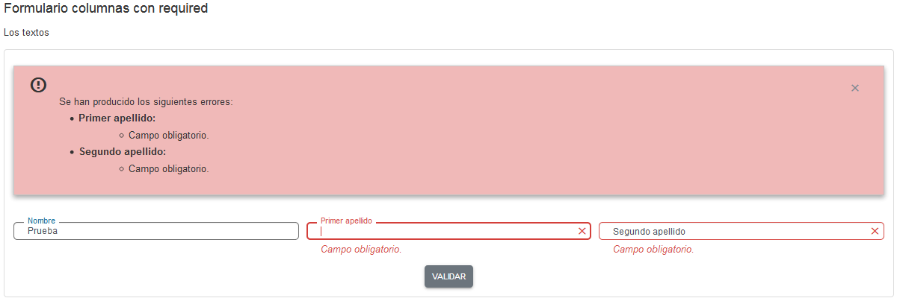
   
   Otro ejemplo, esta vez de un formulario de edición dentro de un diálogo:
   ```jsp
   <div class="dialog-content-material">
		<!-- Formulario -->
		<form:form modelAttribute="usuario" id="example_detail_form">
			<!-- Feedback del formulario de detalle -->
			<div id ="example_detail_feedback"></div>	
			<div class="form-row">
				<!-- Campos del formulario de detalle -->
				<div class="form-groupMaterial col-sm">
			    	<form:input path="id" id="id_detailForm_table" />
					<label for="id_detailForm_table"><spring:message code="id" /></label>
			    </div>
			    
			    <div class="form-groupMaterial col-sm">
			    	<form:input path="nombre" id="nombre_detail_table" />
			    	<label for="nombre_detail_table"><spring:message code="nombre" /></label>
			    </div>
			</div>
			<div class="form-row">       
			    <div class="form-groupMaterial col-sm">
			    	<form:input path="apellido1" id="apellido1_detail_table" />
			    	<label for="apellido1_detail_table"><spring:message code="apellido1" /></label>
			    </div>  
			    
			    <div class="form-groupMaterial col-sm">
			    	<form:input path="apellido2" id="apellido2_detail_table" />
			    	<label for="apellido2_detail_table"><spring:message code="apellido2" /></label>
			    </div>
			</div>
			<div class="form-row">       
			    <div class="form-groupMaterial col-sm">
			    	<form:input path="fechaBaja" id="fechaBaja_detail_table" />
			    	<label for="fechaBaja_detail_table"><spring:message code="fechaBaja" /></label>
			    </div>
			    
			    <div class="form-groupMaterial col-sm">
			    	<form:input path="fechaAlta" id="fechaAlta_detail_table" />
			    	<label for="fechaAlta_detail_table"><spring:message code="fechaAlta" /></label>
			    </div>
			</div>
			<div class="form-row">
			    <div class="col-sm checkbox-material">
			    	<form:checkbox path="ejie" id="ejie_detail_table" value="1" />
			    	<label for="ejie_detail_table"><spring:message code="ejie" /></label>
			    </div> 
			    
			    <div class="form-groupMaterial col-sm">
			    	<form:input path="rol" id="rol_detail_table" />
			    	<label for="rol_detail_table"><spring:message code="rol" /></label>
			    </div>
			</div>	
			<div class="form-row d-none">	
				<div class="form-groupMaterial col-sm" id="divImagenAlumno">
					<input type="file" name="imagenAlumno" id="imagenAlumno" disabled/>
					<label for="imagenAlumno"><spring:message code="subidaImg" /></label>
				</div>	
			</div>	
		</form:form>
	</div>
	```
	
	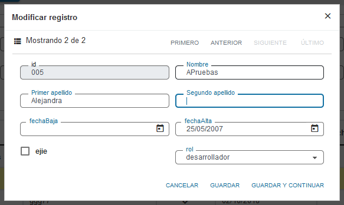
	
	En cuanto a los cambios necesarios para el componente rup_combo, es tan sencillo como usar la propiedad “customClasses” y asignarle un array que contenga la clase “select-material”. Por ejemplo:
	
	```js
	options_role_combo = {
        source : [
           {label: "---", value:""},
           {label: $.rup.i18n.app["GRID_simple##rol"]["administrador"], value:"administrador"},
           {label: $.rup.i18n.app["GRID_simple##rol"]["desarrollador"], value:"desarrollador"},
           {label: $.rup.i18n.app["GRID_simple##rol"]["espectador"], value:"espectador"},
           {label: $.rup.i18n.app["GRID_simple##rol"]["informador"], value:"informador"},
           {label: $.rup.i18n.app["GRID_simple##rol"]["manager"], value:"manager"}
        ],
        width: "100%",
        customClasses: ["select-material"]
    };
	```
4. #### Sustituir iconos Font-Awesome por los de Material Design Icons
    Se ha migrado a esta nueva librería de iconos por dos motivos:
    * Font-Awesome ofrece a día de hoy (11/05/2020) en su versión gratuita alrededor de 1.500 iconos cuando Material Design Icons ofrece más de 5.000 (y en aumento).
    * Los iconos de la librería Material Design Icons encajan mejor con los nuevos estilos adaptados por UDA.

    Para realizar la migración hay que sustituir las clases ```.fa``` por ```.mdi```. Tras este cambio es posible que muchos iconos se vean, pero otros muchos no, esto es debido a que un mismo icono puede tener un nombre diferente en cada librería. Para llevar a cabo esta labor puede usarse el [buscador de iconos](https://materialdesignicons.com/) de Material Design Icons.

    El siguiente ejemplo muestra cómo se declaraba antes con Font-Awesome un icono de filtro y como se declara ahora con la nueva librería:
    ```html
	<i class="fa fa-filter"></i> <!-- Font-Awesome -->
    <i class="mdi mdi-filter"></i> <!-- Material Design Icons -->
	```

5. #### Actualizar la versión de x38 y nuevas librerías:
    Para actualizar la librería habrá que descargar la [nueva versión de x38](https://github.com/UDA-EJIE/udaLib/releases/download/v4.0.0/x38ShLibClasses-4.0.0-RELEASE.jar) y seguir los siguientes pasos:

    1. Actualizar fichero ```pom.xml```
        * En la parte superior del archivo cambiar las siguientes versiones de librerías
            ```xml
            <properties>
                <org.springframework.version>4.3.22.RELEASE</org.springframework.version>
                <org.springframework.security.version>4.2.11.RELEASE</org.springframework.security.version>
                <org.logback.version>1.2.3</org.logback.version>
                <org.slf4j.version>1.7.25</org.slf4j.version>
                <com.ejie.x38.version>4.0.0-RELEASE</com.ejie.x38.version>
                <org.apache.tiles.version>3.0.8</org.apache.tiles.version>
                <org.jackson.version>2.7.9.5</org.jackson.version>
            </properties>
            ```
        * Actualizar la librería del Apache tiles:
            ```xml
            <!-- TILES -->
            <dependency>
                <groupId>org.apache.tiles</groupId>
                <artifactId>tiles-api</artifactId>
                <version>${org.apache.tiles.version}</version>
            </dependency>
            <dependency>
                <groupId>org.apache.tiles</groupId>
                <artifactId>tiles-core</artifactId>
                <version>${org.apache.tiles.version}</version>
            </dependency>
            <dependency>
                <groupId>org.apache.tiles</groupId>
                <artifactId>tiles-jsp</artifactId>
                <version>${org.apache.tiles.version}</version>
            </dependency>
            <dependency>
                <groupId>org.apache.tiles</groupId>
                <artifactId>tiles-servlet</artifactId>
                <version>${org.apache.tiles.version}</version>
            </dependency>
            <dependency>
                <groupId>org.apache.tiles</groupId>
                <artifactId>tiles-template</artifactId>
                <version>${org.apache.tiles.version}</version>
            </dependency>
            ```
        * Añadir el siguiente extracto de dependencias a la parte de logging:
            ```xml
            <!-- Logging -->
            <dependency>
                <groupId>org.jboss.logging</groupId>
                <artifactId>jboss-logging</artifactId>
                <version>3.3.0.Final</version>
            </dependency>
            ```
        * Actualizar la versión de Hibernate Validator:
            ```xml
            <!-- Hibernate Validator -->
            <dependency>
                <groupId>org.hibernate</groupId>
                <artifactId>hibernate-validator</artifactId>
                <version>5.4.3.Final</version>
                <exclusions>
                    <exclusion>
                        <groupId>org.jboss.logging</groupId>
                        <artifactId>jboss-logging</artifactId>
                    </exclusion>
                </exclusions>
            </dependency>
            ```
        * Actualizar Jackson JSON Mapper y AspectJ:
            ```xml
            <!-- Jackson JSON Mapper -->
            <dependency>
                <groupId>com.fasterxml.jackson.core</groupId>
                <artifactId>jackson-databind</artifactId>
                <version>${org.jackson.version}</version>
            </dependency>

            <!-- AspectJ -->
            <dependency>
                <groupId>org.aspectj</groupId>
                <artifactId>aspectjweaver</artifactId>
                <version>1.8.13</version>
            </dependency>
            ```

    2. Abre el build.xml del proyecto xxxEAR con el editor ant (botón derecho sobre el fichero, Open With>Ant Editor)

    3. Ejecuta la tarea mavenRunDependencies (botón derecho sobre la tarea, Run As>Ant Build) actualizando las nuevas librerías xxxEAR\APP_INF\lib

    4. Sobre el proyecto xxxEAR pulsa F5 (Refresh)

    5. Borra versión o versiones anteriores, en caso de que permanezca alguna.

6. #### Modificar el descriptor del aplicativo weblogic "weblogic-application.xml":
    ```xml
    <wls:prefer-application-packages>
        <wls:package-name>javax.persistence.*</wls:package-name>
        <wls:package-name>org.apache.log4j.*</wls:package-name>
    </wls:prefer-application-packages>
    ```
7. #### Eliminar JsonViewSupportFactoryBean en "jackson-config.xml".
    La siguiente línea ha de ser eliminada:
    ```xml
    <bean id="jsonViewSupportFactoryBean" class="com.ejie.x38.control.view.JsonViewSupportFactoryBean" />
    ```

8. #### Actualizar los archivos de configuración de Spring a las nuevas versiones:
      * xxxWar/WebContent/WEB-INF/spring/__app-config.xml__

           

      * xxxWar/WebContent/WEB-INF/spring/__jackson-config.xml__

           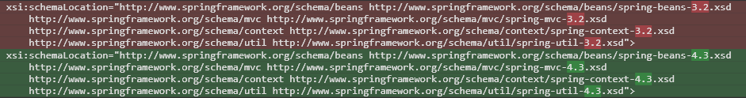

      * xxxWar/WebContent/WEB-INF/spring/__log-config.xml__

           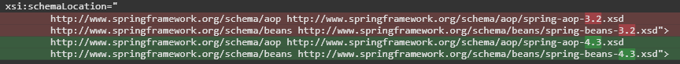

      * xxxWar/WebContent/WEB-INF/spring/__mvc-config.xml__

           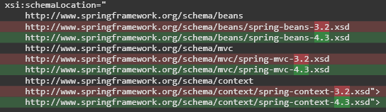

           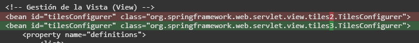

      * xxxWar/WebContent/WEB-INF/spring/__reports-config.xml__

           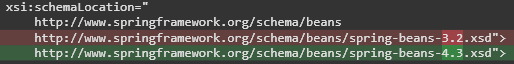

      * xxxWar/WebContent/WEB-INF/spring/__security-config.xml__

           

      * xxxWar/WebContent/WEB-INF/spring/__security-core-config.xml__

           

           Construcción del bean *springSecurityFilterChain*

           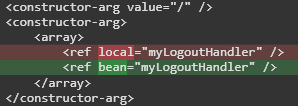

           Construcción del bean *exceptionTraslationFilter*

           

           Constructor del bean *affirmativeBased*

           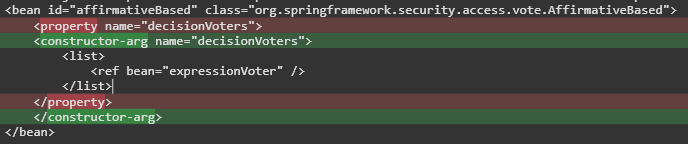

      * xxxWar/WebContent/WEB-INF/spring/__validation-config.xml__

           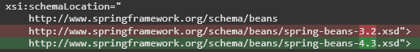

      * xxxEARClasses/src/spring/__cache-config.xml__

           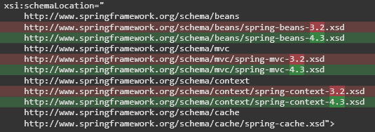

      * xxxEARClasses/src/spring/__dao-config.xml__

           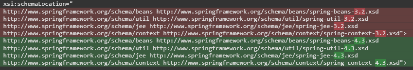

      * xxxEARClasses/src/spring/__log-config.xml__

           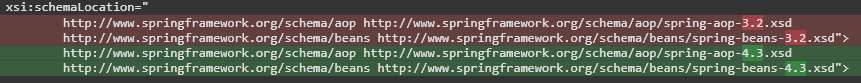

      * xxxEARClasses/src/spring/__security-config.xml__

           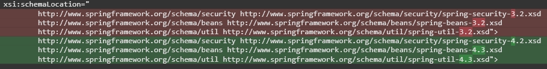

      * xxxEARClasses/src/spring/__service-config.xml__

           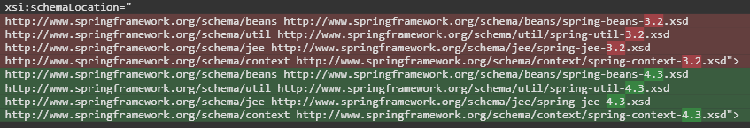

      * xxxEARClasses/src/spring/__tx-config.xml__

           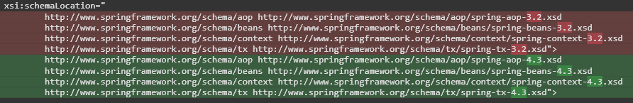

      * xxxEARClasses/src/__beanRefContext.xml__

           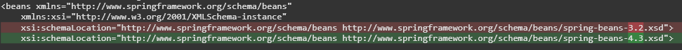

9. #### Cambiar el archivo de configuración del tiles en ```xxxWar/WebContent/WEB-INF/views/tiles.xml```

    

10. #### Cambiar las versiones de los archivos .tld por las nuevas incluidas en el fichero [tld-v4.0.0.zip](https://github.com/UDA-EJIE/uda-ejie.github.io/raw/master/resources/migrateUDA4/tld-v4.0.0.zip) en la carpeta ```xxxWar/WebContent/WEB-INF/tld/```

11. #### Cambios en los DAOs.

    ```jdbcTemplate.queryForXXX(query)``` -> ```jdbcTemplate.queryForObject(query, Object.class)```

    Por ejemplo el siguiente extracto de código:
    ```Java
    final long nextId = 
        jdbcTemplate.queryForLong("SELECT MI_SECUENCIA.NEXTVAL FROM DUAL");
    ```
    Se actualizaría de la siguiente forma:
    ```Java
    final long nextId = 
        jdbcTemplate.queryForObject("SELECT MI_SECUENCIA.NEXTVAL FROM DUAL", Long.class);
    ```

12. #### Renombrar llamadas de las tablas

    A partir de ahora, la que hasta la versión 3.7.3 se conocía como __rup_table__, pasa a ser __rup_jqtable__. En cambio, la que se conocía como __rup_datatable__, es ahora __rup_table__ y por lo tanto, __rup_jqtable__ queda deprecada y será eliminada en la versión 5.0.0 de UDA.

    En caso de no querer migrar las tablas antiguas a las nuevas, bastará con renombrar las llamadas de __rup_table__ a __rup_jqtable__. Si por el contrario se desea comenzar a usar las nuevas tablas, puede encontrarse más información en [la guía de uso de la tabla](https://github.com/UDA-EJIE/udaRUP/blob/master/doc/guides/rup.table.md) o en la propia documentación del plugin subyacente, [datatable](https://www.datatables.net/manual/).

    También hay que tener en cuenta que con el cambio a la nueva tabla, se han de sustituir en las clases Java todas las referencias a JQGrid. A continuación, la lista de clases a renombrar:
    * JQGridDto -> TableDto
    * JQGridManager -> TableManager
    * JQGridManagerJerarquia -> TableManagerJerarquia
    * JQGridManagerJerarquiaGrid -> TableManagerJerarquiaGrid
    * JQGridRequestDto -> TableRequestDto
    * JQGridResponseDto -> TableResponseDto