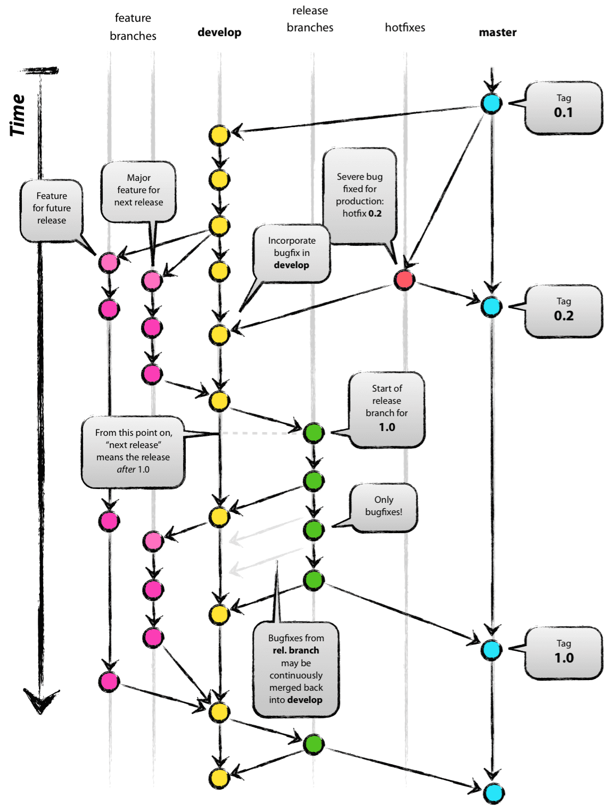

## Semantic Versioning

Para la numeración de las versiones de UDA se ha adoptado [Semantic versioning](https://semver.org/).

Un resumen de la estrategia a seguir sería:

El número de versión de un proyecto de UDA se compone de MAJOR.MINOR.PATCH (x.y.z). Y se incrementan de acuerdo a lo siguiente:

* **MAJOR** version, cuando se realizan cambios imcompatibles de la API respecto a versiones anteriores.
* **MINOR** version, cuando se añaden funcionalidades compatibles con versiones anteriores.
* **PATCH** version, cuando se corrigen errores compatibles con versiones anteriores.

## GitFlow


A la hora de desarrollar con UDA se establece una normativa en el uso del repositorio Git.

Por defecto se definen los siguientes tipos de ramas de trabajo en git.

* master
  * Contiene la versión estable en produción de la aplicación.
  * Nomenclatura: **master**

* develop
  * Es la rama de integración de las features para la liberación de la nueva versión.
  * Contiene la última versión del código antes de la liberación de la siguiente release.
    * Branch desde: **master**
    * Merge hacia: **master** (release-x.y.z en caso de existir)
    * Nomenclatura: **develop**

* feature
  * Rama donde se codifica una de las características de la siguiente versión del producto.
  * Se crearán tantas ramas *feat* como características se quieran dotar a la versión en desarrollo.
    * Branch desde: **develop**
    * Merge hacia: **develop**
    * Nomenclatura: **feat-*descripcionFeature***

* hotfix
  * Rama de corrección de errores críticos en la versión productiva.
  * Permite corregir errores sobre la rama estable (master o support).
  * Se trata de correcciones previas a la publicación de una nueva versión.
  * En caso de mergear de rama hotfix a master, deberíamos incrementar el PATCH de la rama master con el cambio.
    * Branch desde: **master | support**
    * Merge hacia: **master | support, develop**
    * Nomenclatura: **hotfix-*descripcionError***

* fix
  * Rama de corrección de errores.
  * Permite corregir errores sobre la rama de desarrollo develop.
  * Se trata de correcciones incorporadas en la siguiente versión programada.
    * Branch desde: **develop**
    * Merge hacia: **develop**
    * Nomenclatura: **fix-*descripcionError***

* release

**Solo para cuando haya que entregar el código justo antes de liberar una versión (por favores a terceros, por peticiones, por revisión de QA...)**

  * Rama que contiene una versión que está apunto de publicarse en la master.
  * Se permite correcciones de errores (hotfix) pero no nuevas funcionalidades (features).
  * Al estar trabajando en una nueva versión de UDA, se debe “congelar” el código existente en develop y pasarlo a release. De este modo, en develop empezariamos a trabajar en la siguiente versión de UDA y en la rama release depuramos el código candidato a ser publicado.
  * Una rama release al mergear con la rama master hay que tagearla con la versión del producto.
    * Branch desde: **develop**
    * Merge hacia: **master**
    * Nomenclatura: **release-x.y.z**

* support
  * Es la rama de mantenimiento de una versión.
  * Solo se podrán hacer hotfix-es que incrementarán el patch.
  * Bajo demanda y con bula papal, podrían hacerse nuevas funcionalidades que incrementarían el MINOR.
    * Branch desde: **master**
    * Nomenclatura: **support-*major*.y.z**

## Ramas existentes en la actualidad

Estas son las ramas que existen actualmente en los diferentes proyectos de UDA.

* *master* : Contiene la última versión estable de la aplicación. Sobre esta versión se realizan los tags.
* *develop* : Rama de desarrollo principal.
* *develop-4.x* : Rama de desarrollo para implementar los correctivos de la rama 4.x.x de UDA.
* *develop-3.x* : Rama de desarrollo para implementar los correctivos de la rama 3.x.x de UDA.
* *develop-2.x* : Rama de desarrollo para implementar los correctivos de la rama 2.x.x de UDA.
* *support-4.x* : Contiene la última versión estable de la rama 4.x.x de UDA. Se mantiene para realizar correcciones de errores.
* *support-3.x* : Contiene la última versión estable de la rama 3.x.x de UDA. Se mantiene para realizar correcciones de errores.
* *support-2.x* : Contiene la última versión estable de la rama 2.x.x de UDA. Se mantiene para realizar correcciones de errores.

Las ramas **hotfix**, **feat** y **fix** se crean dependiendo de las necesidades que surjen en el proyecto.


## Resolución de incidencias

Este es el procedimiento que se debe seguir a la hora de corregir incidencias en el proyecto de udaRUP.

En primer lugar se debe de determinar el tipo de modificación que va a resultar de la corrección de la incidencia. Dependiendo del tipo de modificación se tratará de:

* **Hotfix - *Error grave en versión productiva***: Es cuando se determina que se está produciendo un error que por su severidad debe de corregirse inmediatamente y tiene como consecuencia una nueva versión correctva del proyecto.

* **Fix - *Error que se liberará en la siguiente versión***: Se determina que el error no es tan grave como para liberar una nueva versión correctiva, sino que se incluye entre el resto de correcciones y mejoras para la siguiente versión en la fecha planificada.

* **Feat - *Nueva funcionalidad***: La incidencia indicada no es un error sino una nueva funcionalidad que se incluye en la liberación de una versión posterior.

El flujo de trabajo en cada una de los tipos de resolución será el siguiente:

### Hotfix - Error grave en versión productiva

En este caso el prodecimiento será el siguiente.

1. Crear una rama hotfix que identifique a la incidencia a partir de la rama *master*.

```bash
$ git checkout master
$ gti checkout -b hotfix-issue56
```

2. Realizar los correctivos necesarios en el proyecto

3. Comitar los cambios a la rama hotfix

```bash
$ git add .
$ git commit -m "Resolución de la issue 54" -m "Se han realizado las siguientes modificaciones para...
>
> Fix #54"
$ git push origin hotfix-issue56
```

4. Incorporar la corrección a la rama *master*

```bash
$ git checkout master
$ git merge --no-ff hotfix-issue56
$ git push origin master
```

5. En caso de que sea necesario incorporar la corrección también a la rama *develop*.

```bash
$ git checkout develop
$ git merge --no-ff hotfix-issue56
$ git push origin develop
```

6. Publicar la nueva versión.


### Fix - Error que se liberará en la siguiente versión

Para este tipo de incidencia la idea es realizar una modificación que se liberará en la siguiente versión junto con otros correctivos o nuevas funcionalidades. Por ello, las modificaciones se realizarán sobre la rama *develop*.

En este caso el prodecimiento será el siguiente.

1. Crear una rama fix que identifique a la incidencia a partir de la rama *develop*.

```bash
$ git checkout develop
$ gti checkout -b fix-issue56
```

2. Realizar los correctivos necesarios en el proyecto

3. Comitar los cambios a la rama fix

```bash
$ git add .
$ git commit -m "Resolución de la issue 54" -m "Se han realizado las siguientes modificaciones para...
>
> Fix #54"
$ git push origin fix-issue56
```

4. Incorporar la corrección a la rama *develop*

```bash
$ git checkout develop
$ git merge --no-ff fix-issue56
$ git push origin develop
```

### Feat - Nueva funcionalidad

En este caso la indicencia reportada no se traduce en una corrección sino que se incorpora a la nueva versión como una nueva funcionalidad.

El proceso es similar al anterior salvo que se deberá de crear una rama *feat* en vez de *fix* a partir de la rama *develop*.

1. Crear una rama feat que identifique a la incidencia a partir de la rama *develop*.

```bash
$ git checkout develop
$ gti checkout -b feat-multicombo
```

2. Realizar los correctivos necesarios en el proyecto

3. Comitar los cambios a la rama feat

```bash
$ git add .
$ git commit -m "Nueva funcionalidad en el componente RUP combo" -m "Se han realizado las siguientes modificaciones para...
>
>"
$ git push origin feat-multicombo
```

4. Incorporar la corrección a la rama *develop*

```bash
$ git checkout develop
$ git merge --no-ff feat-multicombo
$ git push origin develop
```


