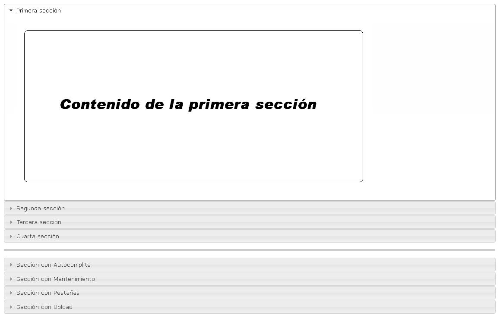

#	Componentes RUP – Accordion

<!-- MDTOC maxdepth:6 firsth1:1 numbering:0 flatten:0 bullets:1 updateOnSave:1 -->

   - [1. Introducción](#1.-introducción)   
   - [2. Ejemplo](#2.-ejemplo)   
   - [3. Casos de uso](#3.-casos-de-uso)   
   - [4. Infraestructura](#4.-infraestructura)   
      - [4.1 Ficheros](#4.1-ficheros)   
      - [4.2 Dependencias](#4.2-dependencias)   
      - [4.3 Versión minimizada](#4.3-versión-minimizada)   
   - [5. Invocación](#5.-invocación)   
   - [6. API](#6.-api)   
   - [7. Sobreescritura del theme](#7.-sobreescritura-del-theme)   

<!-- /MDTOC -->


## 1. Introducción
La descripción del Componente Accordion, visto desde el punto de vista de RUP, es la siguiente:

*El objetivo principal del componente Accordion es la presentación de un contenido donde conceptos relacionados pueden agruparse (ej. secciones) de manera que el usuario puede mostrar u ocultar información sin perder el contexto del contenido principal.
*

## 2. Ejemplo
Se presentan a continuación un ejemplo de este componente:



## 3. Casos de uso
Se aconseja la utilización de este componente:

* Cuando se desea permitir la interacción del usuario con un contenido extenso en el que se pueden agrupar conceptos relacionados permitiendo mostrar y ocultar información para minimizar el desplazamiento dentro de la página que lo presenta.

**Nota**: *El uso adecuado de este componente permite ordenar y aumentar, la cantidad de  información presentada en las páginas. El uso inadecuado puede hacer que el tamaño, manejo y desarrollo de las páginas se dificulte o entorpezca, por lo que se recomienda no abusar ni exagerar su uso en las aplicaciones.*

**Nota2**: *El componente Accordion muestra la información de una única sección mientras las otras están ocultas. ++No se debe utilizar el componente Accordion si se desea visualizar varias secciones abiertas a la vez.++*

## 4. Infraestructura
A continuación se comenta la infraestructura necesaria para el correcto funcionamiento del componente.

* Únicamente se requiere la inclusión de los ficheros que implementan el componente (js y css) comentados en los apartados Ficheros y Dependencias.

### 4.1 Ficheros

- Ruta Javascript: rup/scripts/
- Fichero de plugin: rup.accordion-x.y.z.js
- Ruta theme: rup/basic-theme/
- Fichero CSS del theme: theme.rup.accordion-x.y.z.css

### 4.2 Dependencias

Por la naturaleza de desarrollo de los componentes (patrones) como plugins basados en la librería JavaScript jQuery, es necesaria la inclusión de esta como capa base. La versión elegida para el desarrollo ha sido la 1.12.4.
* **jQuery 1.12.4**: http://jquery.com/

La gestión de ciertas partes visuales de los componentes, se han realizado mediante el plugin jQuery-UI que se basa en jQuery y se utiliza para construir aplicaciones web altamente interactivas. Este plugin, entre otras cosas, proporciona abstracciones de bajo nivel de interacción y animación, efectos avanzados de alto nivel y componentes personalizables (estilos). La versión utilizada en el desarrollo ha sido la 1.12.0.

* **jQuery-UI 1.12.0**: http://jqueryui.com/

Los ficheros necesarios para el correcto funcionamiento del componente son:

    jquery-1.12.4.js
    jquery-ui-1.12.0.custom.js
    jquery-ui-1.12.0.custom.css
    rup.base-x.y.z.js
    rup.accordion-x.y.z.js
    theme.rup.accordion-x.y.z.css

### 4.3 Versión minimizada

++A partir de la versión v2.4.0 se distribuye la versión minimizada de los componentes RUP. Estos ficheros contienen la versión compactada y minimizada de los ficheros javascript y de estilos necesarios para el uso de todos los compontente RUP.++

++Los ficheros minimizados de RUP son los siguientes:++
* **rup/scripts/min/rup.min-x.y.z.js**
* **rup/basic-theme/rup.min-x.y.z.css**

++Estos ficheros son los que deben utilizarse por las aplicaciones. Las versiones individuales de cada uno de los componentes solo deberán de emplearse en tareas de desarrollo o depuración.++

## 5. Invocación

La primera noción que se ha de tener en cuenta para el correcto manejo e inclusión del componente Accordion dentro de un pagina jsp es la asociación del componente a un elemento estructural ```<div>``` de html. La determinación del elemento ```<div>``` es determinará la ubicación y el contenido del componente dentro de la página.

Para poder relacionar el componente Accordion con el ```<div>``` sobre el que se aplica, debe ir, como marcan las especificaciones de html, identificado por un id (identificador) único. Dicho id (identificador) representa al elemento dentro de la infraestructura de la página y facilita la localización y manejo del mismo. Un ejemplo de ```<div>``` identificado tiene el siguiente aspecto:

```xml
<div id="accordionExample" class="rup_accordion">
...
</div>
```

El elemento ```<div>```, además de ser la entidad seleccionada sobre la que reside el componente, debe albergar la estructura que determine el contenido de cada una de las secciones del Accordion. La estructura para el buen funcionamiento del componente debe cumplir unas reglas muy concretas:

1. El elemento ```<div>``` base debe albergar pares de elementos que representen, según su orden de ubicación, la cabeza y cuerpo de cada una de las secciones. Dichos pares, tanto la cabecera como el cuerpo, podrán ser elementos de distintos tipos pero se recomienda que la cabeza sea de algún tipo título (```<h1>, <h2> o <h3>```) y que el cuerpo sea de tipo bloque (```<div>```).
2. Por cuestiones de estructura y estilos es estrictamente obligatorio incluir un elemento ```<a>``` dentro de la cabecera. Dicho elemento contiene el título de la sección y permite gestionar la apertura y cierre de las distintas secciones correctamente.

```xml
<div id="accordionExample" class="rup_accordion">
	<h1><a> Título de la primera cabecera </a></h1>
	<div> Primer contenido </div>
	<h1><a> Título de la segunda cabecera </a></h1>
	<div> Segundo contenido </div>
...
</div>
```

Además de poder visualizar el aspecto que tiene la estructura *html* necesaria para crear un componente *Accordion*, en el ejemplo se puede apreciar que al ```<div>``` base se le ha aplicado el estilo *“rup_accordion”*. El uso de este estilo no es casual y responde a una necesidad funcional típica en este tipo de componentes.

Normalmente, en el renderizado de los componentes, se visualiza el código *html* sin formatear ni ubicar antes de que adquiera su aspecto final. Esta circunstancia, que no perjudica al funcionamiento del componente, es extraña para los usuarios por la sensación de desorden e imperfección en la carga de la página. Para evitar este efecto, se ha desarrollado el estilo *rup_accordion* asociado a los estilos del componente, que evita este efecto ya que mantiene oculto el componente hasta su creación. Incluir el estilo *rup_accordion* no es obligatorio pero si recomendable para eliminar el efecto visual pernicioso.

Otra recomendación asociada al diseño de la aplicación, es especificar el *height* (tamaño vertical) del cuerpo mediante un *class* (clase) en lugar de especificarlo mediante un *style* (estilo) en el propio elemento. Esto se debe a que los navegadores, cuando operan con el componente *Accordion*, pierden el valor del *height* en el *style* de los cuerpos y, a su vez, estos pierden su tamaño original (este efecto solo se produce si la opción *autoHeight* está a *false*).

Además, con respecto a los navegadores, es aconsejable saber que *Chrome*, cuando maneja el componente *Accordion*, no renderiza bien el componente si los cuerpos del mismo no tienen un *height* (tamaño vertical) especificado. Esto se debe a que *Chrome* no coge bien el tamaño proporcional del elemento padre y se pintan las secciones con tamaños variables entre carga y carga. Si es especifican los *height* de los distintos cuerpos este comportamiento anómalo no se produce.

## 6. API

Para ver en detalle la API del componente vaya al siguiente [documento](../api/rup.accordion.md).


## 7. Sobreescritura del theme
El componente *Accordion* se presenta con una apariencia visual definida en el fichero de estilos **theme.rup.accordion-x.y.z.css**.

Si se quiere modificar la apariencia del componente, se recomienda redefinir el/los estilos necesarios en un fichero de estilos propio de la aplicación situado dentro del proyecto de estáticos (*codAppStatics/WebContent/codApp/styles*).

Los estilos del componente se basan en los estilos básicos de los widgets de *jQuery UI*, con lo que los cambios que se realicen sobre su fichero de estilos manualmente o mediante el uso de la herramienta Theme Roller podrán tener repercusión sobre todos los componentes que compartan esos mismos estilos (pudiendo ser el nivel de repercusión general o ajustado a un subconjunto de componentes).

A continuación se muestran unas capturas del componente con los estilos asociados dependiendo del uso de imágenes. Los estilos que contengan la palabra *“ui-“* son los propios de *jQuery UI* que en caso de ser necesario serán sobrescritos y no se comentarán en este documento por no ser su ámbito.
