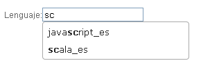

#	Componentes RUP – Autocomplete

<!-- MDTOC maxdepth:6 firsth1:1 numbering:0 flatten:0 bullets:1 updateOnSave:1 -->

-   [1. Introducción](#1.-introducción)   
-   [2. Ejemplo](#2.-ejemplo)   
-   [3. Casos de uso](#3.-casos-de-uso)   
-   [4. Infraestructura](#4.-infraestructura)   
    -   [4.1 Ficheros](#4.1-ficheros)   
    -   [4.2 Dependencias](#4.2-dependencias)   
    -   [4.3 Versión minimizada](#4.3-versión-minimizada)   
-   [5. Invocación](#5.-invocación)   
-   [6. API](#6.-api)   
-   [7. Sobreescritura del theme](#7.-sobreescritura-del-theme)   
-   [8.  Internacionalización (i18n)](#8.-internacionalización-i18n)   
-   [9. Integración con UDA](#9.-integración-con-uda)   
-   [10. Autocompletes enlazados](#10.-autocompletes-enlazados)

<!-- /MDTOC -->

## 1. Introducción

La descripción del Componente Autocomplete, visto desde el punto de vista de RUP, es la siguiente:

*En cuanto el usuario comienza a escribir una búsqueda se le sugieren búsquedas relacionadas con lo que ha escrito que pueden ser de su interés.*


## 2. Ejemplo

Se presentan a continuación un ejemplo de este componente:



## 3. Casos de uso

Se recomienda el uso del componente:

*   Cuando se desea mejorar la búsqueda ofreciendo sugerencias a los usuarios.

## 4. Infraestructura
A continuación se comenta la infraestructura necesaria para el correcto funcionamiento del componente.

*   Únicamente se requiere la inclusión de los ficheros que implementan el componente (js y css) comentados en los apartados Ficheros y Dependencias.

### 4.1 Ficheros

-   Ruta Javascript: rup/scripts/
-   Fichero de plugin: rup.autocomplete-x.y.z.js
-   Ruta theme: rup/css/
-   Fichero CSS del theme: theme.rup.autocomplete-x.y.z.css

### 4.2 Dependencias

Por la naturaleza de desarrollo de los componentes (patrones) como plugins basados en la librería JavaScript jQuery, es necesaria la inclusión de esta como capa base. La versión elegida para el desarrollo ha sido la 1.8.0.
*   jQuery 1.8.0: <http://jquery.com/>

La gestión de ciertas partes visuales de los componentes, se han realizado mediante el plugin jQuery-UI que se basa en jQuery y se utiliza para construir aplicaciones web altamente interactivas. Este plugin, entre otras cosas, proporciona abstracciones de bajo nivel de interacción y animación, efectos avanzados de alto nivel y componentes personalizables (estilos). La versión utilizada en el desarrollo ha sido la 1.8.23.

*   jQuery-UI 1.8.23: <http://jqueryui.com/>

Los ficheros necesarios para el correcto funcionamiento del componente son:

*   jquery-3.4.1.js
*   rup.base-x.y.z.js
*   rup.autocomplete-x.y.z.js
*   theme.rup.autocomplete-x.y.z.css

### 4.3 Versión minimizada

A partir de la versión v2.4.0 se distribuye la versión minimizada de los componentes RUP. Estos ficheros contienen la versión compactada y minimizada de los ficheros javascript y de estilos necesarios para el uso de todos los compontente RUP.

Los ficheros minimizados de RUP son los siguientes:
*   rup/scripts/min/rup.min-x.y.z.js
*   rup/css/rup.min-x.y.z.css

Estos ficheros son los que deben utilizarse por las aplicaciones. Las versiones individuales de cada uno de los componentes solo deberán de emplearse en tareas de desarrollo o depuración.

## 5. Invocación

Este componente se invocará mediante un selector que indicará todos los elementos sobre los que se va a aplicar el componente Autocomplete. Por ejemplo:

```javascript
  $("#id_input").rup_autocomplete(properties);
```

Donde el parámetro “properties” es un objeto ( var properties = {}; ) o bien directamente la declaración de lo valores directamente. Sus posibles valores se detallan en el siguiente apartado.

Para facilitar la gestión de los datos del formulario, el *input* sobre el que se aplica el componente pasará a tener como nombre su nombre original seguido de *“_label”* y contendrá la descripción del valor seleccionado. El valor interno se guardará en un campo oculto cuyo nombre será el nombre original del *input* sobre el que se aplica el componente. Veámoslo con un ejemplo:


1.  Se define el input sobre el que se aplica el componente:
```js
<input id=lenguaje name=lenguaje />
```
2.  Se invoca el componente sobre el input:
```js
$("#lenguaje").rup_autocomplete({...});
```
3.  Se modifica el código HTML y se convierte en:
```xml
<input id=”lenguaje_label” name=”lenguaje_label” ruptype=”autocomplete”... />
<hidden id=”lenguaje” name=”lenguaje” ” ruptype=”autocomplete”... />
```

## 6. API

Para ver en detalle la API del componente vaya al siguiente [documento](../api/rup.autocomplete.md).

## 7. Sobreescritura del theme

El componente autocomplete se presenta con una apariencia visual definida en el fichero de estilos **theme.rup.autocomplete-x.y.z.css**.

Si se quiere modificar la apariencia del componente, se recomienda redefinir el/los estilos necesarios en un fichero de estilos propio de la aplicación situado dentro del proyecto de estáticos (*codAppStatics/WebContent/codApp/styles*).

Los estilos del componente se basan en los estilos básicos de los widgets de *jQuery UI*, con lo que los cambios que se realicen sobre su fichero de estilos manualmente o mediante el uso de la herramienta Theme Roller podrán tener repercusión sobre todos los componentes que compartan esos mismos estilos (pudiendo ser el nivel de repercusión general o ajustado a un subconjunto de componentes).

Ejemplo base de la estructura generada por el componente:

```xml
<input class="ui-autocomplete-input"/>
<ul class="ui-autocomplete ui-menu ui-widget ui-widget-content ui-corner-all">
  <li class="ui-menu-item">
    <a class="ui-corner-all">item 1</a>
  </li>
  <li class="ui-menu-item">
    <a class="ui-corner-all">item 2</a>
  </li>
  <li class="ui-menu-item">
    <a class="ui-corner-all">item 3</a>
  </li>
</ul>
```

### 8.	Internacionalización i18n
La internacionalización se realiza mediante el fichero de recursos definido para la aplicación que se encontrará en la parte estática bajo *codAplic/resources/codAplic.i18n.json* (con sus variantes según idioma ej: *codAplic/resources/codAplic.i18n_es.json*). En dicho fichero se deberá declarar un objeto JSON cuyo nombre sea el mismo que el id del elemento *html* sobre el que se aplica el componente.

Ejemplo:

```js
"lenguaje" : {
		"asp":"asp_es",
		"c":"c_es",
		"c++":"c++_es",
		"coldfusion":"coldfusion_es",
		"groovy":"groovy_es",
		"haskell":"haskell_es",
		"java":"java_es",
		"javascript":"javascript_es",
		"perl":"perl_es",
		"php":"php_es",
		"python":"python_es",
		"ruby":"ruby_es",
		"scala":"scala_es"
}
```

## 9. Integración con UDA
El componente Autocomplete permite recuperar los datos almacenados en base de datos. Para ello se requiere cierta configuración en el *Controller* al que se invoca.

Se deben declarar dos parámetros (que el componente envía automáticamente):
*   **q**: termino introducido en el *input*. El termino introducido podría contener comodines (wildcards) que podrían obtener datos no deseados como son el carácter “_” que equivale a cualquier carácter o el carácter “%” que equivale a cualquier literal. Por ello en la petición al servidor se envía escapados automáticamente. Ejemplo de una petición con los caracteres escapados:
```xml
http://localhost:7001/x21aDemoWAR/fase3/autocomplete/remote?q=\%\%\%\%&c=false
```
*   **c**: booleano que determina si la búsqueda es del tipo “contiene” (true) o del tipo “empieza por” (false).

El *Service* que invoca el *Controller* tendrá el método **findAllLike (entidad, paginación, c)** (si se ha generado con el plugin UDA)  que se empleará para realizar la búsqueda. Sus parámetros son los siguientes:

*   **entidad**: objeto creado por el desarrollador que contendrá en el campo por el que se desea buscar el termino introducido:
```java
MiEntidad miEntidad = new Entidad();
miEntidad.setCampoBusqueda(q);
```
*   **paginación**: objeto empleado para hacer filtrados/paginaciones. En el ejemplo actual se manda *null* ya que no se requiere esta funcionalidad.
*   **c**: parámetro enviado por el componente que determina el tipo de búsqueda.

A continuación se muestra un ejemplo (se destacan con fondo gris los elementos a configurar):

```java
@RequestMapping(value = "autocomplete/remote", method=RequestMethod.GET)
	public @ResponseBody List<Patrones> getRemoteAutocomplete(
			@RequestParam(value = "q", required = true) String q,
			@RequestParam(value = "c", required = true) Boolean c){

		//Idioma
		Locale locale = LocaleContextHolder.getLocale();

		//Filtro según idioma
		Patrones patrones = new Patrones();
		if (com.ejie.x38.util.Constants.EUSKARA.equals(locale.getLanguage())){
			patrones.setDescEu(q);
		}else{
			patrones.setDescEs(q);
		}

		return patronesService.findAllLike(patrones, null, c);
	}
```

El método devuelve una lista de entidades en este caso *List<Patrones>* donde cada entidad tendrá todos y cada uno de los atributos cargados con los valores de la Base de Datos. Al devolver la lista con la anotación ```@ResponseBody```, entrará en funcionamiento *Jackson* (parseador de JSON de Spring) para convertir la lista JAVA en una lista JSON:

*   **JAVA**:

```
patronesList :
	patronesList [0]
                        code = Autocomplete
                        descEs = Autocomplete_es
                        descEu = Autocomplete_eu
                        css = filter
	patronesList [1]
                        code = Combo
                        descEs = Combo_es
                        descEu = Combo_eu
                        css = print
…
```
*   **JSON**:

```js
[
	{
    	code="Autocomplete",
    	descEs="Autocomplete_es",
		descEu="Autcomplete_eu",
        css="filter"
    },
	{
    	code="Combo",
        descEs="Combo_es",
		descEu="Combo_eu",  
        css="print"
   }
   ...
]
```

Como se ha explicado en anteriormente en el atributo **source** en el apartado 8 (propiedades) el componente requiere de una estructura de terminada para cargar el combo:
```js
[
	{label: "Autocomplete_es", value:"Autocomplete", style:"aaa"},
	{label: "Combo_es", value:"Combo ", style:"bbb"},
	{label: "Dialog_es", value:"Dialog", style:"ccc"},
	...
]
```

La traducción entre la estructura devuelta por el *controller* y la que espera el componente se realiza mediante un serializador propio de **UDA**.

Para que la serialización se realice correctamente, el componente envía en la petición una cabecera de **RUP** con la información necesaria para realizar la serialización.

```js
{"label":"descEs","value":"code","style":"css"}
```

**NOTA**: Al generar el código con el *plugin* de **UDA**, se añade este serializador para todos los objetos del modelo creados.

## 10. Autocompletes enlazados
Estos autocompletes enlazados, pueden ser tanto locales como remotos. Para indicar que un autocomplete depende directamente de otro se utilizará el atributo ***parent***, que será un *array* con los identificador(es) del padre(s). Veamos un ejemplo:
```javascript
parent: ["departamento", "provincia"],
```
Las dependencias entre los autocompletes pueden encadenarse de tal manera que se tenga un autocomplete que depende de otro autocomplete que a su vez depende de otro autocomplete y así sucesivamente (incluso se pueden combinar autocompletes locales con remotos indistintamente). Además, es posible que un autocomplete dependa a su vez de dos autocompletes o más y no se cargarán ni se activarán hasta que todos sus padres hayan tomado un valor.

Al ser autocompletes enlazados, si un autocomplete elimina su selección todos sus autocompletes hijos se vaciarán y se deshabilitarán. Además, si un autocomplete se deshabilita (o se inicializa deshabilitado), todos sus hijos se cargarán, pero se mostrarán deshabilitados.
