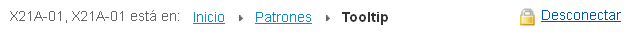
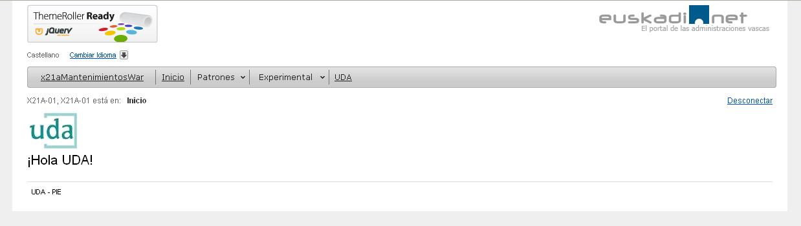
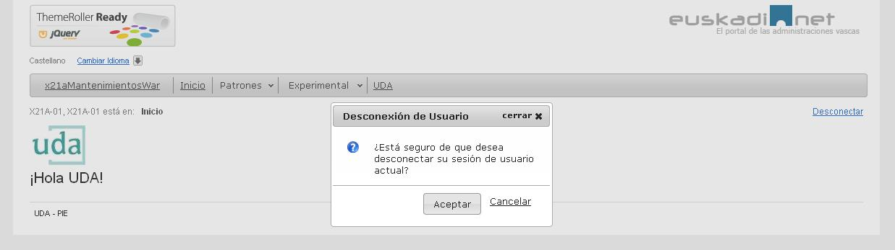

#	Componentes RUP – Migas

<!-- MDTOC maxdepth:6 firsth1:1 numbering:0 flatten:0 bullets:1 updateOnSave:1 -->

-   [1   Introducción](#intro)   
-   [2   Ejemplo](#ejemplo)   
-   [3   Casos de uso](#casos-de-uso)   
-   [4   Infraestructura](#infraestructura)   
    -   [4.1 Ficheros](#ficheros)   
    -   [4.2 Dependencias](#dependencias)   
    -   [4.3 Versión minimizada](#v-minimizada)   
-   [5   Invocación](#5-invoc)   
-   [6   API](#api)   
-   [7   Sobreescritura del theme](#theme)   
-   [8   Internacionalización (i18n)](#internacionalizac)   
-   [9   Integración con UDA](#integrac)   

<!-- /MDTOC -->

<a id="intro"></a>
##	1	Introducción
La descripción del ***Componente Migas***, visto desde el punto de vista de **RUP**, es la siguiente:
*El componente de migas muestra a los usuarios la ruta de navegación que ha seguido por la aplicación permitiéndoles volver hacia niveles superiores hasta la página de inicio.*

<a id="ejemplo"></a>
##	2	Ejemplo
Se muestra a continuación una maquetación típica del patrón:



<a id="casos-de-uso"></a>
##	3	Casos de uso
Se aconseja la utilización de este componente:
+   Cuando queramos mostrar al usuario la ruta de navegación que ha seguido, en qué página está y permitirle volver fácilmente a niveles superiores.

+   Se recomienda usarlas en aplicaciones web con tres o más niveles de jerarquía ya que es en este tipo de aplicaciones donde son realmente útiles.

Las razones para el uso del componente son las siguientes:
+   Es una solución conocida por los usuarios y fácil de comprender.

+   Aporta flexibilidad a la navegación al permitir volver a niveles superiores.

+   Ocupa poco espacio en la interfaz.

+   Refuerza el contexto y la navegación ya que muestra a los usuarios dónde están y cómo está estructurada la información.

+   Ayuda a los usuarios a comprender la estructura de la aplicación.

<a id="infraestructura"></a>
##	4	Infraestructura
A continuación se comenta la infraestructura necesaria para el correcto funcionamiento del patrón.
+   Únicamente se requiere la inclusión de los ficheros que implementan el patrón (*js y css*) comentados en los apartados *Ficheros y Dependencias*.

<a id="ficheros"></a>
###	4.1 Ficheros
Ruta JavaScript: rup/scripts/
Fichero de plugin: **rup.breadCrumb-x.y.z.js**
Ruta fichero de recursos: rup/resources/rup.i18n_idioma.json
Ruta theme: rup/basic-theme/
Fichero CSS del theme: **theme.rup.breadCrumb-x.y.z.css**

<a id="dependencias"></a>
###	4.2	Dependencias
Por la naturaleza de desarrollo de los componentes (patrones) como *plugins* basados en la librería JavaScript ***jQuery***, es necesaria la inclusión del esta. La versión elegida para el desarrollo ha sido la versión **1.12.4**.
+   **jQuery 1.12.4**: <http://jquery.com/>

La gestión de la ciertas partes visuales de los componentes, se han realizado mediante el plugin ***jQuery UI*** que se basa en *jQuery* y se utiliza para construir aplicaciones web altamente interactivas. Este *plugin*, proporciona abstracciones de bajo nivel de interacción y animación, efectos avanzados de alto nivel, componentes personalizables (estilos) ente otros. La versión utilizada en el desarrollo ha sido la **1.12.0**.
+   **jQuery UI 1.12.0**: <http://jqueryui.com/>

Los ficheros necesarios para el correcto funcionamiento del componente son:

	jquery-1.12.4.js
  jquery-ui-1.12.0.custom.js
	jquery-ui-1.12.0.custom.css
	xbreadcrumbs.js
	rup.base-x.y.z.js
	rup.breadCrumb-x.y.z.js
	theme.rup.breadCrumb-x.y.z.css

<a id="v-minimizada"></a>
###	4.3	Versión minimizada
A partir de la versión v2.4.0 se distribuye la versión minimizada de los componentes RUP. Estos ficheros contienen la versión compactada y minimizada de los ficheros javascript y de estilos necesarios para el uso de todos los compontente RUP.

Los ficheros minimizados de RUP son los siguientes:
+   **rup/scripts/min/rup.min-x.y.z.js**
+   **rup/basic-theme/rup.min-x.y.z.css**

Estos ficheros son los que deben utilizarse por las aplicaciones. Las versiones individuales de cada uno de los componentes solo deberán de emplearse en tareas de desarrollo o depuración.

<a id="invoc"></a>
##	5	Invocación
El componente de migas se crea y configura según la disposición seleccionada en el asistente de generación de aplicación del *plugin* **UDA**.
El componente se posiciona justo después del menú en una capa cuyo identificador se corresponde con el nombre del War *(xxxYyyWar)* seguido de *“_migas”* y cuya clase asociada para los estilos es *“rup-breadCrumb_root”*:
```xml
<div id="x21aDemoWAR_migas" class="rup-breadCrumb_root"></div>
```
La creación del componente se realiza en la plantilla de inclusión de js con la siguiente instrucción:
```javascript
$("#idMenu").rup_menu(properties);
```
donde el parámetro *“properties”* es un objeto *(var properties = {};)* o bien directamente la declaración de lo valores directamente. Sus posibles valores se detallan en el siguiente apartado.

Para generar la miga de una ventana se usa la **URL** a la que se está invocando desde el *contextPath*. Por ejemplo, si la *url* es *“http://desarrollo.jakina.ejiedes.net:7001/x21aPilotoPatronesWar/patrones/tooltip”*, se separa el *substring* de después del *contextPath*, en este caso *“patrones/tooltip”*. La configuración de las migas contendrá un elemento “patrones” dentro del cual existirá un subelemento *“tooltip”*.

En el siguiente apartado se explican las propiedades y se adjunta un ejemplo más detallado.

<a id="api"></a>
##	6	API
Para ver en detalle la API del componente vaya al siguiente [documento](../api/rup.breadCrumb.md).

<a id="theme"></a>
##	7	Sobreescritura del theme
El componente migas se presenta con una apariencia visual definida en el fichero de estilos ***theme.rup.breadCrumb-x.y.z.css***.
Si se quiere modificar la apariencia del componente, se recomienda redefinir el/los estilos necesarios en un fichero de estilos propio de la aplicación situado dentro del proyecto de estáticos *(codAppStatics/WebContent/codApp/styles)*.

Los estilos más relevantes son los siguientes:
•	**rup-breadCrumbs_span**: estilo asociado al literal “Usted está en:”
•	**.rup-breadCrumb_main LI A**: estilo asociado a cada elemento miga (no final)
•	**rup-breadCrumb_current**: estilo asociado a la última miga (elemento final)

<a id="internacionalizac"></a>
##	8	Internacionalización i18n
Como se ha comentado anteriormente para la internacionalización del patrón se usa el fichero de recursos de la aplicación con una estructura como la siguiente:
```javascript
  "x21aPilotoPatronesWar_migas" :{
  		"patrones" : "Patrones",
  		"all" : "[Todos los patrones]",
  		"autocomplete" : "Autocomplete",
  		"toolbar" : "Botonera",
  		"comboSimple" : "Combo Simple",
  		"comboEnlazadoSimple" : "Combo Enlazado (simple)",
  		"comboEnlazadoMulti" : "Combo Enlazado (múltiple)",
  		"dialog" : "Diálogos",
  		"date" : "Fecha",
  		"feedback" : "Feedback",
  		"time" : "Hora",
  		"message" : "Mensajes",
  		"menu" : "Menú Horizontal",
  		"menuVertical":"Menú Vertical",
  		"menuMixto":"Menú Mixto",
  		"tabs" : "Pestañas",
  		"grid" : "Tabla",
  		"tooltip" :  "Tooltip",
  		"experimental": "Experimental",
  		"generic_object": "Objeto genérico",
  		"maestro_detalle": "Maestro-Detalle",
  		"z-index": "z-index"
  }
```

<a id="integrac"></a>
##	9	Integración con UDA
Entre los distintos aspectos que pueden intervenir en el desarrollo de una aplicación, uno de los temas más críticos e importantes es la gestión de la seguridad. Dentro de los distintos elementos de interacción con el modulo de seguridad, destacan la necesidad de trasmitir, en todo momento, el estado del usuario (autenticado o no) y la disposición de un sistema para la desconexión del sistema.

Para facilitar, tanto, la gestión de la desconexión de los usuarios, como, la especificación del usuario autenticado, el componente de migas incluye la capacidad de presentar el nombre completo del usuario autenticado y un enlace para permitir la desconexión, bajo demanda, del sistema de seguridad.



El procedimiento de desconexión, automáticamente, presenta un mensaje de confirmación para completar el proceso.



La gestión y procesado de estos dos servicios, por parte de las migas, se hace de manera automática y requiere de la presencia de una variable JavaScript “*LOGGED_USER*” y del parámetro *“logOutUrl”*.

La variable JavaScript “*LOGGED_USER*” determina el nombre visualizado en la identificación del usuario. El parámetro “*logOutUrl*”, especificado en la definición de las propias migas, determina la *url* de la página que se cargara una vez efectuado el procedimiento de *logOut*

La variable *“LOGGED_USER”* puede integrarse de múltiples formas pero **UDA**, por defecto, la incluye en la *jsp “base-includes.jsp”* mediante el siguiente código:
``` java
  //breadCrumbs
  LOGGED_USER = "${!empty sessionScope.SPRING_SECURITY_CONTEXT.authentication.principal ? sessionScope.SPRING_SECURITY_CONTEXT.authentication.credentials.fullName : sessionScope.userData.fullName}";
```

En caso de no especificarse la variable “*LOGGED_USER*”, el componente no presentara el nombre del usuario ni el botón de desconexión. En caso de no tener especificado el parámetro “*logOutUrl*”, únicamente, no se presentara el botón de desconexión.
Además de permitir a los usuarios interaccionar con su información de seguridad, el componente de migas también exterioriza el concepto de desconexión o salida manejado por el sistema de seguridad. Según la especificación de parámetros realizada, el sistema de seguridad permite a los usuarios que salgan, únicamente, de la aplicación o que, además, se desconecten de **XLNets** (terminando con ellos su sesión de usuario).
Para que el componente sea consciente del tipo de modelo de desconexión se esta aplicando, es necesario especificárselo mediante la variable *JavaScript “DESTROY_XLNETS_SESSION”*. La variable puede integrarse de múltiples formas pero **UDA**, por defecto, la incluye en la jsp *“base-includes.jsp”* mediante el siguiente código:
``` java
  //breadCrumbs
  DESTROY_XLNETS_SESSION = "${!empty sessionScope.SPRING_SECURITY_CONTEXT.authentication.principal ? sessionScope.SPRING_SECURITY_CONTEXT.authentication.credentials.destroySessionSecuritySystem : sessionScope.destroySessionSecuritySystem}";
```

En caso de no incluir la variable *JavaScript “DESTROY_XLNETS_SESSION”*, por defecto, el componente considerar que la sesión de **XLNets** deberá ser respetada (manteniendo intacto el concepto de single sign-on asociado a **XLNets**).
Según el modelo empleado, el componente de migas podrá tener cualquiera de los siguientes aspectos:


Con desconexión de **XLNets**:


Sin desconexión de XLNets:
