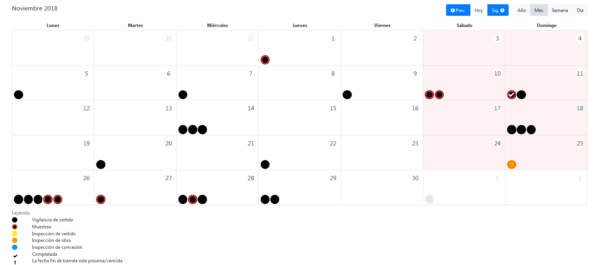
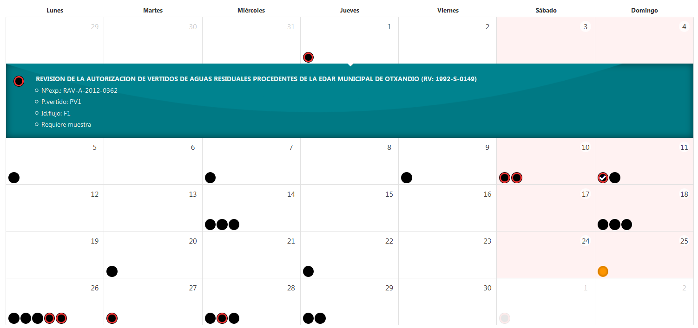
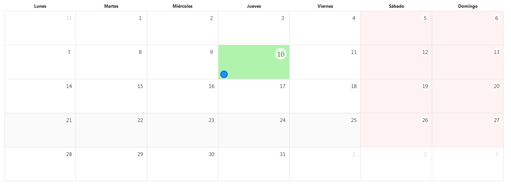

---
#	Componentes RUP – Calendario

<!-- MDTOC maxdepth:6 firsth1:1 numbering:0 flatten:0 bullets:1 updateOnSave:1 -->

   - [1 Introducción](#1-introducción)   
   - [2 Ejemplo](#2-ejemplo)   
   - [3 Casos de uso](#3-casos-de-uso)
   - [4 Infraestructura](#4-infraestructura)   
      - [4.1 Ficheros](#4.1-ficheros)   
      - [4.2 Dependencias](#4.2-dependencias)   
      - [4.3 Versión minimizada](#4.3-versión-minimizada) 
   - [5    Invocación](#5-invocación)
   - [6    API](#6-api)
<!-- /MDTOC -->

## 1 Introducción
La descripción del componente Calendario desde el punto de vista de RUP, es la siguiente:

* El objetivo principal del componente calendario es mostrar una serie de eventos ubicandolos en el tiempo
que permita una vista general de los mismos.


## 2 Ejemplo





## 3 Casos de uso
Se aconseja la utilización de este componente:

* Cuando se quieren mostrar eventos a lo largo del tiempo.
## 4 Infraestructura
A continuación se comenta la infraestructura necesaria para el correcto funcionamiento del componente:

* Únicamente se requiere de la inclusión de los ficheros que implementan el componente *(js ,css y html)* 
comentados en los apartados *Ficheros y Dependencias*.
### 4.1 Ficheros

- Ruta JavaScript: rup/scripts/
- Fichero de plugin: **rup.calendar.x.y.z.js**

### 4.2 Dependencias
Por la naturaleza del desarrollo de los componentes (patrones) como plugins basados en la librería JavaScript 
JQuery, es necesaria la inclusión de esta como capa base. La versión elegida para el desarrollo ha sido la 
1.12.4

* **jQuery 1.12.4**: <http://jquery.com/>

Para la gestión del plantillado del que hace uso el componente para la creación del HTML, se requiere de la
librería underscore.js. La versión usada de la librería es ^1.9.1

* **underscore 1.9.1**: <https://underscorejs.org/>

Para la funcionalidad y representacion se utiliza una versión modificada (fork) de [bootstrap-calendar](https://github.com/Serhioromano/bootstrap-calendar)
que permite la gestión de los eventos y configuraciones generales de la parte gráfica del componente.

Los ficheros necesarios para el correcto funcionamiento del componente son:

   jquery-1.12.4.js
   external/bootstrap-calendar/js/calendar.js
   rup.base-x.y.z.js
   rup.calendar-x.y.z.js


### 4.3 Versión minimizada
A partir de la versión v2.4.0 se distribuye la versión minimizada de los componentes RUP. Estos ficheros
contienen la versión compactada y minimizada de los ficheros javascript y estilos necesarios para el uso de
todos los componentes RUP.

* **rup/scripts/min/rup.min-x.y.z.js**
* **rup/css/rup.min-x.y.z.css**

## 5	Invocación
Para crear un calendario es necesario instanciar la clase rup.calendar. Para hacer esto necesitamos 
pasar el selector CSS del elemento en el que queramos crearlo.

```xml
   <div id="calendar" class="calendar">
```
El siguiente ejemplo crea un calendario simple con un único evento situado en el día actual.
```javascript
$('#calendar').rup_calendar({
   tmpl_path: '/ubicacion/de/las/templates/rup_calendar',
   events_source: [
      {
         "id": "00001",
         "title": "<span><strong>Html</strong><ul class='pl-3'><li>Punto 1</li><li>Punto 2</li><li>Punto 3</li><li>Punto 4</li></ul></span>",
         "start": new Date().getTime().toString(),
         "class": " event-info",
         "end": (new Date().getTime() + 1).toString(),
         "url": "javascript:console.log('00001')"
      }
   ];
});
```
Resultado:


## 6  API

Para consultar los detalles de la API de este componente vea este [documento](../api/rup.calendar.md)