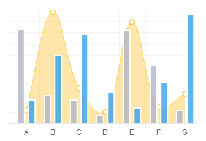
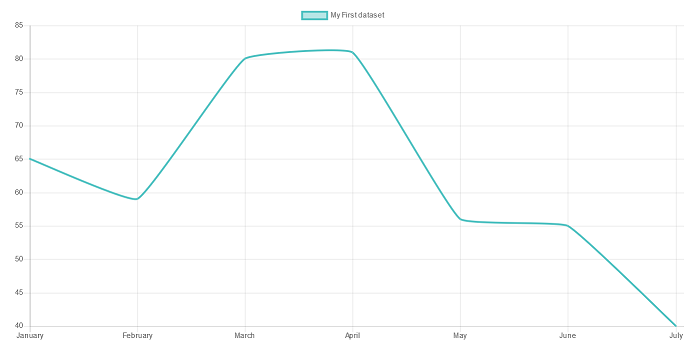
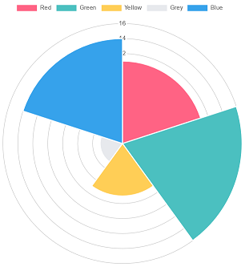
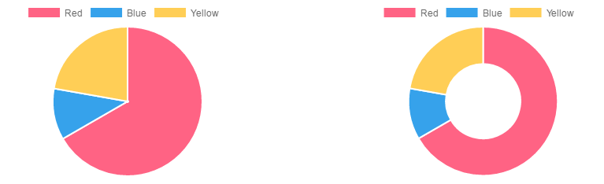

#	Componentes RUP – Gráficos

<!-- MDTOC maxdepth:6 firsth1:1 numbering:0 flatten:0 bullets:1 updateOnSave:1 -->


-   [1 Introducción](#intro)
-   [2 Ejemplo](#ejemplo)   
-   [3 Casos de uso](#casos-de-uso)   
-   [4 Infraestructura](#infraestructura)   
     -    [4.1 Ficheros](#ficheros)   
     -    [4.2 Dependencias](#dependencias)   
     -    [4.3 Versión minimizada](#minimizada)   
-   [5 Invocación](#invocac)   
-   [6 Tipos de gráficos](#tipos-de-graf)   
    -   [6.1 Barras](#barras)  
         -  [6.1.1   Datos](#datos)   
         -   [6.1.2   Instanciación](#instancia)   
    - [6.2 Líneas](#lines)   
       - [6.2.1 Datos](#datos2)   
       - [6.2.2 Instanciación](#instancia2)   
    - [6.3 Radar](#radar)   
       - [6.3.1 Datos](#datos3)   
       -  [6.3.2 Instanciación](#instancia3)   
    - [6.4 Área Polar](#polar)     
       - [6.4.1 Datos](#datos4)   
       - [6.4.2 Instanciación](#instancia4)   
    - [6.5 Tarta y Donuts](#tarta-donuts)   
       - [6.5.1 Datos](#datos5)   
       - [6.5.2 Instanciación](#instancia5)   
    - [6.6 Burbuja](#burbuja)   
       - [6.6.1 Datos](#datos6)   
       - [6.6.2 Instanciación](#instancia6)   
- [7 API](#api)   
- [8 i18n](#i18n)

<!-- /MDTOC -->

<a id="intro"></a>
## 1 Introducción
La descripción del Componente Gráficos, visto desde el punto de vista de RUP, es la siguiente:

*El objetivo principal del componente Gráficos es la presentación de datos númericos mediante una o mas líneas o puntos que permiten hacer visible la relación entre los datos.
*

<a id="ejemplo"></a>
## 2 Ejemplo
Se presentan a continuación un ejemplo de este componente:



<a id="casos-de-uso"></a>
## 3 Casos de uso
Se aconseja la utilización de este componente:

*   Cuando se desea comparar de un simple vistazo la relación entre un o varios conjuntos de datos.

<a id="infraestructura"></a>
## 4 Infraestructura
A continuación se comenta la infraestructura necesaria para el correcto funcionamiento del componente.

*   Únicamente se requiere la inclusión de los ficheros que implementan el componente *(js y css)* comentados en los apartados *Ficheros y Dependencias*.

<a id="ficheros"></a>
### 4.1 Ficheros

*   Ruta Javascript: rup/scripts/
*   Fichero de plugin: **rup.chart-x.y.z.js**

<a id="dependencias"></a>
### 4.2 Dependencias

Por la naturaleza de desarrollo de los componentes (patrones) como plugins basados en la librería JavaScript jQuery, es necesaria la inclusión de esta como capa base. La versión elegida para el desarrollo ha sido la 1.12.4.
*   **jQuery 1.12.4**: <http://jquery.com/>

La gestión de ciertas partes visuales de los componentes, se han realizado mediante el plugin jQuery-UI que se basa en jQuery y se utiliza para construir aplicaciones web altamente interactivas. Este plugin, entre otras cosas, proporciona abstracciones de bajo nivel de interacción y animación, efectos avanzados de alto nivel y componentes personalizables (estilos). La versión utilizada en el desarrollo ha sido la 1.12.0.

*   **jQuery-UI 1.12.0**: <http://jqueryui.com/>

Para la representación de gráficos se ha usado la librería *Chart.js* que permite la visualización de gráficos interactivos de una manera sencilla y con cientos de opciones usando etiquetas *HTML5* y con capacidades responsivas.
* **Chart.js 2.5.0**: <http://www.chartjs.org/>

Los ficheros necesarios para el correcto funcionamiento del componente son:

    jquery-1.12.4.js
    jquery-ui-1.12.0.custom.js
    jquery-ui-1.12.0.custom.css
    Chart.js
    rup.base-x.y.z.js
    rup.chart-x.y.z.js

<a id="minimizada"></a>
### 4.3 Versión minimizada

A partir de la versión v2.4.0 se distribuye la versión minimizada de los componentes RUP. Estos ficheros contienen la versión compactada y minimizada de los ficheros javascript y de estilos necesarios para el uso de todos los compontente RUP.

Los ficheros minimizados de RUP son los siguientes:
*   **rup/scripts/min/rup.min-x.y.z.js**
*   **rup/basic-theme/rup.min-x.y.z.css**


<a id="invocac"></a>
## 5	Invocación
Para crear un gráfico necesitamos instanciar la clase rup.chart. Para hacer esto, necesitamos pasar el selector CSS de un elemento canvas donde queramos dibujar el gráfico. Por ejemplo

```xml
  <canvas id="miGrafico" width="400" height="400"></canvas>
```

El siguiente ejemplo instancia un gráfico de barras mostrando el número de votos para cada diferente color.


```javascript
     $("miGrafico").rup_chart({
        type: 'bar',
        data: {
            labels: $.rup.i18n.app.charts.colorLabels,
            datasets: [{
                label:  $.rup.i18n.app.charts.votos,
                data: [12, 19, 3, 5, 2, 3],
                backgroundColor: [
                    'rgba(255, 99, 132, 0.2)',
                    'rgba(54, 162, 235, 0.2)',
                    'rgba(255, 206, 86, 0.2)',
                    'rgba(75, 192, 192, 0.2)',
                    'rgba(153, 102, 255, 0.2)',
                    'rgba(255, 159, 64, 0.2)'
                ],
                borderColor: [
                    'rgba(255,99,132,1)',
                    'rgba(54, 162, 235, 1)',
                    'rgba(255, 206, 86, 1)',
                    'rgba(75, 192, 192, 1)',
                    'rgba(153, 102, 255, 1)',
                    'rgba(255, 159, 64, 1)'
                ],
                borderWidth: 1
            }]
        },
        options: {
            scales: {
                yAxes: [{
                    ticks: {
                        beginAtZero:true
                    }
                }]
            }
        }
    });
```

<a id="tipos-de-graf"></a>
## 6	Tipos de gráficos
Rup.Chart está basado en [Chart.js](http://www.chartjs.org/), una librería responsive js para mostrar gráficos. Esta herramienta ofrece los siguientes tipos de gráficos:

*   [Barras](#barras)
*   [Líneas](#lines)
*   [Radar](#radar)
*   [Polar](#polar)
*   [Tarta y Donuts](#tarta-donuts)
*   [Burbuja](#burbuja)

Toda la documentación sobre la configuración y parametrización de los gráficos viene explicada en la documentación oficial de la librería subyacente
+   **[Documentación chart.js](http://www.chartjs.org/docs/)**

<a id="barras"></a>
### 6.1	Barras

Un gráfico de barras muestra los datos como barras. Es usado para comparar mulitiples datos


<a id="datos"></a>
####	6.1.1	Datos

```javascript
  var data = {
              labels: $.rup.i18n.app.charts.mesesLabels,
              datasets: [{
                  label: $.rup.i18n.app.charts.dataset1,
                  data: [65, 59, 80, 81, 56, 55, 40]
              }, {
                  label: $.rup.i18n.app.charts.dataset2,
                  data: [28, 48, 40, 19, 86, 27, 90]
              }]
          };

 ```

<a id="instancia"></a>
####	6.1.2	Instanciación
```javascript
          $('#miGrafico').rup_chart({
              type: "bar",
              data: data,
  			options:options
          });
```


-   **Volver a [Tipo de Gráficos](#tipos-de-graf)**
__
<a id="lines"></a>
## 6.2 Líneas

Un gráfico de líneas es una manera de trazar los puntos de datos en una línea . A menudo , se utiliza para mostrar los datos de tendencias , y la comparación de dos conjuntos de datos.


<a id="datos2"></a>
#### 6.2.1	Datos

```javascript
  var data = {
      labels: $.rup.i18n.app.charts.mesesLabels,
      datasets: [
          {
              label: $.rup.i18n.app.charts.dataset1,
              fill: false,
              lineTension: 0.1,
              backgroundColor: "rgba(75,192,192,0.4)",
              borderColor: "rgba(75,192,192,1)",
              borderCapStyle: 'butt',
              borderDash: [],
              borderDashOffset: 0.0,
              borderJoinStyle: 'miter',
              pointBorderColor: "rgba(75,192,192,1)",
              pointBackgroundColor: "#fff",
              pointBorderWidth: 1,
              pointHoverRadius: 5,
              pointHoverBackgroundColor: "rgba(75,192,192,1)",
              pointHoverBorderColor: "rgba(220,220,220,1)",
              pointHoverBorderWidth: 2,
              pointRadius: 1,
              pointHitRadius: 10,
              data: [65, 59, 80, 81, 56, 55, 40],
              spanGaps: false,
          }
      ]
  };
 ```
 <a id="instancia2"></a>
####	6.2.2	 Instanciación
```javascript
      $('#miGrafico').rup_chart({
          type: "line",
          data: data,
  			  options:options
      });
```


-   **Volver a [Tipo de Gráficos](#tipos-de-graf)**
___
 <a id="radar"></a>
###	6.3 Radar

Un gráfico de radar es una forma de mostrar múltiples puntos de datos y la variación entre ellos. A menudo son útiles para comparar los puntos de dos o más conjuntos de datos diferentes .neas es una manera de trazar los puntos de datos en una línea . A menudo , se utiliza para mostrar los datos de tendencias , y la comparación de dos conjuntos de datos.


<a id="datos3"></a>
#### 6.3.1	Datos

```javascript
var data = {
      labels: $.rup.i18n.app.charts.radarLabels,
      datasets: [
          {
              label: $.rup.i18n.app.charts.dataset1,
              backgroundColor: "rgba(179,181,198,0.2)",
              borderColor: "rgba(179,181,198,1)",
              pointBackgroundColor: "rgba(179,181,198,1)",
              pointBorderColor: "#fff",
              pointHoverBackgroundColor: "#fff",
              pointHoverBorderColor: "rgba(179,181,198,1)",
              data: [65, 59, 90, 81, 56, 55, 40]
          },
          {
              label: $.rup.i18n.app.charts.dataset2,
              backgroundColor: "rgba(255,99,132,0.2)",
              borderColor: "rgba(255,99,132,1)",
              pointBackgroundColor: "rgba(255,99,132,1)",
              pointBorderColor: "#fff",
              pointHoverBackgroundColor: "#fff",
              pointHoverBorderColor: "rgba(255,99,132,1)",
              data: [28, 48, 40, 19, 96, 27, 100]
          }
      ]
  };
 ```
 <a id="instancia3"></a>
#### 6.3.2	Instanciación
```javascript
          $('#miGrafico').rup_chart({
              type: "radar",
              data: data,
  			options:options
          });
```
-   **Volver a [Tipo de Gráficos](#tipos-de-graf)**
___
<a id="polar"></a>
### 6.4	Área Polar

Los gráficos de áreas polares son similares a gráficos de tartas , pero cada segmento tiene el mismo ángulo - el radio del segmento varía en función del valor .

Este tipo de gráfico suele ser útil cuando queremos mostrar una comparación de datos similares a un gráfico de tarta , pero también muestran una escala de valores de contexto.


<a id="datos4"></a>
#### 6.4.1	Datos

```javascript
  var data = {
      datasets: [{
          data: [ 11,16,7,3,14],
          backgroundColor: ["#FF6384","#4BC0C0","#FFCE56","#E7E9ED","#36A2EB"
          ],
          label: $.rup.i18n.app.charts.dataset1
      }],
      labels: $.rup.i18n.app.charts.colorLabels
  };
 ```
 <a id="instancia4"></a>
#### 6.4.2	Instanciación
```javascript
          $('#miGrafico').rup_chart({
              type: "polarArea",
              data: data,
  			options:options
          });
```

Los gráficos de áreas polares son similares a gráficos de tartas , pero cada segmento tiene el mismo ángulo - el radio del segmento varía en función del valor.

-   **Volver a [Tipo de Gráficos](#tipos-de-graf)**
___
<a id="tarta-donuts"></a>
### 6.5	Tarta y Donuts

Los gráficos de tarta y donuts son probablemente los gráficos más utilizados que existen . Se dividen en segmentos , el arco de cada segmento se muestra el valor proporcional de cada fracción de datos .



<a id="datos5"></a>
#### 6.5.1	Datos

```javascript
  var data = {
      labels: $.rup.i18n.app.charts.colorLabels,
      datasets: [
          {
              data: [300, 50, 100],
              backgroundColor: [
                  "#FF6384",
                  "#36A2EB",
                  "#FFCE56"
              ],
              hoverBackgroundColor: [
                  "#FF6384",
                  "#36A2EB",
                  "#FFCE56"
              ]
          }]
  };
 ```
 <a id="instancia5"></a>
#### 6.5.2	Instanciación
```javascript
  	$('#miGrafico').rup_chart({
              type: "pie",
              data: data,
  			options:options
          });
      $('#miGrafico').rup_chart({
              type: "doughnut",
              data: data,
  			options:options
          });
```


*   **Volver a [Tipo de Gráficos](#tipos-de-graf)**
___
<a id="burbuja"></a>
### 6.6	Burbuja

Un gráfico de burbujas se utiliza para mostrar tres dimensiones de datos al mismo tiempo. La ubicación de la burbuja se determina por las dos primeras dimensiones y los ejes horizontales y verticales correspondientes . La tercera dimensión está representada por el tamaño de las burbujas individuales.


<a id="datos6"></a>
#### 6.6.1	Datos

```javascript
var data = {
    datasets: [
        {
            label: $.rup.i18n.app.charts.dataset1,
            data: [
                {
                    x: 20,
                    y: 30,
                    r: 15
                },
                {
                    x: 40,
                    y: 10,
                    r: 10
                }
            ],
            backgroundColor:"#FF6384",
            hoverBackgroundColor: "#FF6384",
        }]
};
 ```
 <a id="instancia6"></a>
#### 6.6.2	Instanciación
```javascript
	$('#miGrafico').rup_chart({
            type: "bubble",
            data: data,
			options:options
        });
```


-   **Volver a [Tipo de Gráficos](#tipos-de-gráficos)**

<a id="api"></a>
## 7	API

Para ver en detalle la API del componente vaya al siguiente [documento](../api/rup.chart.md).

<a id="i18n"></a>
##	8	i18n
Para configurar los literales de los datasets, se especifican en el archivo idiomático json de la aplicación como un array en el caso de labels, y como un valor único en el caso de los label.

```json
"charts": {
        "dataset1": "dataset 1",
        "dataset2": "dataset 2",
        "colorLabels": ["rojo", "azul", "amarillo"],
        "radarLabels": ["Comida", "Bebida", "Dormir", "Diseño", "Programacion", "Bicicleta", "Correr"],
        "mesesLabels": ["Enero", "Febrero", "Marzo", "Abril", "Mayo", "Junio", "Julio"]
}
```
