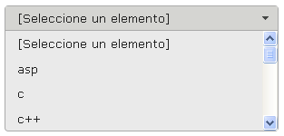
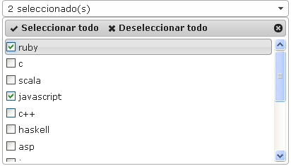

# Componentes RUP – Combo


<!-- MDTOC maxdepth:6 firsth1:1 numbering:0 flatten:0 bullets:1 updateOnSave:1 -->
-   [1 Introducción](#intro)   
-   [2 Ejemplo](#ejemplo)   
-   [3 Casos de uso](#casos-de-uso)   
-   [4 Infraestructura](#infraestructura)   
  - [4.1 Ficheros](#ficheros)   
  - [4.2 Dependencias](#dependencias)   
  - [4.3 Versión minimizada](#v-minimizada)   
-   [5 Invocación](#invocac)   
-   [6 API](#api)   
-   [7 Comunicación remota](#remota)   
  - [7.1 Option Groups Remotos](#option-groups)   
-   [8 Combos enlazados](#combos-enlazados)   
  - [8.1 Local](#local)   
  - [8.2 Remoto](#remoto)   
-   [9   Precarga de datos](#precarga)   
  - [9.1.    Carga a partir del elemento HTML select](#carga-html)   
  - [9.2 Carga a partir de un objeto JSON](#carga-json)   
-   [10  Sobreescritura del theme](#theme)   
-   [11  Integración con UDA](#integrac-uda)   

<!-- /MDTOC -->


<a id="intro"></a>
## 1 Introducción
La descripción del **Componente Combo**, visto desde el punto de vista de RUP, es la siguiente:
*Permite al usuario recuperar un elemento de una gran lista de elementos o de varias listas dependientes de forma sencilla y ocupando poco espacio en la interfaz.*

<a id="ejemplo"></a>
## 2 Ejemplo
Se presentan a continuación un ejemplo de este componente:

Selección Simple


Selección Múltiple

<a id="casos-de-uso"></a>
## 3 Casos de uso
Se aconseja la utilización de este componente:
+   Cuando la entrada de datos dependa de una selección de información previa. El ejemplo más común es la selección de provincia y municipio.

<a id="infraestructura"></a>
## 4 Infraestructura
A continuación se comenta la infraestructura necesaria para el correcto funcionamiento del componente.
+   Únicamente se requiere la inclusión de los ficheros que implementan el componente (js y css) comentados en los apartados *Ficheros y Dependencias*.

<a id="ficheros"></a>
### 4.1	Ficheros
Ruta Javascript: rup/scripts/
Fichero de plugin: **rup.combo-x.y.z.js**
Ruta theme: rup/basic-theme/
Fichero CSS del theme: **theme.rup.combo-x.y.z.css**

<a id="dependencias"></a>
### 4.2 Dependencias
Por la naturaleza de desarrollo de los componentes (patrones) como plugins basados en la librería JavaScript **jQuery**, es necesaria la inclusión del esta. La versión elegida para el desarrollo ha sido la versión **1.12.4**.
+   **jQuery 1.12.4**: http://jquery.com/

La gestión de la ciertas partes visuales de los componentes, se han realizado mediante el plugin jQuery UI que se basa en *jQuery* y se utiliza para construir aplicaciones web altamente interactivas. Este plugin, proporciona abstracciones de bajo nivel de interacción y animación, efectos avanzados de alto nivel, componentes personalizables (estilos) ente otros. La versión utilizada en el desarrollo ha sido la **1.12.0**.

+   **jQuery UI 1.12.0:** http://jqueryui.com/


Los ficheros necesarios para el correcto funcionamiento del componente son:
```
        jquery-1.12.4.js
        jquery-ui-1.12.0.custom.js
        jquery-ui-1.12.0.custom.css
        jquery.ui.selectmenu.js
        rup.base-x.y.z.js
        rup.combo-x.y.z.js
        theme.rup.combo-x.y.z.css
```

<a id="v-minimizada"></a>
### 4.3 Versión minimizada
A partir de la versión v2.4.0 se distribuye la versión minimizada de los componentes RUP. Estos ficheros contienen la versión compactada y minimizada de los ficheros javascript y de estilos necesarios para el uso de todos los compontente RUP.
Los ficheros minimizados de RUP son los siguientes:
+   **rup/scripts/min/rup.min-x.y.z.js**
+   **rup/basic-theme/rup.min-x.y.z.css**

Estos ficheros son los que deben utilizarse por las aplicaciones. Las versiones individuales de cada uno de los componentes solo deberán de emplearse en tareas de desarrollo o depuración.

<a id="invocac"></a>
## 5 Invocación
Este componente se invocará mediante un selector que indicará todos los elementos sobre los que se va a aplicar el componente Combo. Por ejemplo:
```javascript
$("#id_input").rup_combo (properties);
```
Donde el parámetro *“properties”* es un objeto *( var properties = {}; )* o bien directamente la declaración de lo valores directamente. Sus posibles valores se detallan en el siguiente apartado.

<a id="api"></a>
## 6 API
Para ver en detalle la API del componente vaya al siguiente [documento](../api/rup.combo.md).

<a id="remota"></a>
## 7 Comunicación remota
El componente Combo permite recuperar los datos almacenados en base de datos. En el método del *controller* que recibe la petición se invocará  al servicio encargado de recuperar los datos. Como no se va a realizar ningún filtrado por algún campo de la entidad ni se requiere de paginación, los parámetros serán **null, null:**
```java
@RequestMapping(value = "combo/remote", method=RequestMethod.GET)
	public @ResponseBody List<Patrones> getRemoteCombo(){
			return patronesService.findAll(null, null);
}
```
El método devuelve una lista de entidades en este caso *List<Patrones>* donde cada entidad tendrá todos y cada uno de los atributos cargados con los valores de la Base de Datos. Al devolver la lista con la anotación *@ResponseBody*, entrará en funcionamiento Jackson (parseador de JSON de Spring) para convertir la lista JAVA en una lista JSON:
+   JAVA:

 +  patronesList :
 	+ patronesList [0]
 			+ code = Autocomplete
     	+ descEs = Autocomplete_es
     	+ descEu = Autocomplete_eu
     	+  css = filter

 		+ patronesList [1]

			+ code = Combo
			+ descEs = Combo_es
			+ descEu = Combo_eu
    	+ css = print


+   JSON:
```javascript
[
{code="Autocomplete", descEs="Autocomplete_es",
descdescEu="Autcomplete_eu", css="filter" },
{code="Combo",  descEs="Combo_es",
descEu="Combo_eu",  css="print" },
...
      ]
      ```
Como se ha explicado en anteriormente en el atributo ***source*** en el apartado 8 (propiedades) el componente requiere de una estructura de terminada para cargar el combo:
```javascript
[
	{label: "Autocomplete_es", value:"Autocomplete", style:"aaa"},
	{label: "Combo_es", value:"Combo ", style:"bbb"},
	{label: "Dialog_es", value:"Dialog", style:"ccc"},
	...
]
```
La traducción entre la estructura devuelta por el *controller* y la que espera el componente se realiza mediante un serializador propio de UDA. Para que este entre en funcionamiento simplemente se deberá configurar el fichero **mvc-config** del WAR *(/xxxWAR/WebContent/WEB-INF/spring/mvc-config.xml)* indicando que el modelo utilizado utilice el serializador de **UDA**:
```xml
<bean id="jacksonJsonCustomSerializerFactory" class="com.ejie.x38.serialization.CustomSerializerFactoryRegistry">
   <property name="serializers">
     <map>
       <entry key="com.ejie.x21a.model.Patrones" value-ref="customSerializer" />
        ...
     </map>
   </property>
</bean>
```
NOTA: Al generar el código con el *plugin* de **UDA**, se añade este serializador para todos los objetos del modelo creados.

<a id="option-groups"></a>
### 7.1	Option Groups Remotos
El uso de *“option groups remotos”* requiere de un pequeño esfuerzo por parte del desarrollador ya que se deben recuperar los diferentes grupos a incluir en el combo invocando a sus respectivos servicios y agruparlos en la estructura que espera el componente Combo. Ejemplo:
```javascript
[
		{"Futbol" : [
			{label: "Alaves", value:"alaves", style:"aaa"},
			{label: "Athletic", value:"ath", style:"bbb"},
			{label: "Real Sociedad", value:"real", style:"ccc"}
		]},
		{"Baloncesto" : [
			{label: "Caja Laboral", value:"laboral", style:"ddd"},
			{label: "BBB", value:"bilbao", style:"eee"},
			{label: "Lagun aro", value:"lagun aro", style:"fff"}
		]},
		{"Formula 1" : [
			{label: "Fernando Alonso", value:"falonso"},
			{label: "Lewis Hamilton", value:"hamilton"},
			{label: "Sebastián Vettel", value:"vettel"}
		]}
]
```
El método encargado de recuperar los datos devolverá una lista que contiene un mapa por cada uno de los grupos. Dicho mapa, tendrá como clave el literal a mostrar en la cabecera del grupo y como valor una lista de entidades. La lista de entidades se traducirá a la estructura que espera el componente mediante el serializador de UDA explicado en el apartado anterior.
A continuación se muestra un ejemplo de cómo debería ser el *controller* encargado de devolver un *“option group remoto”* en el que se cargarán las entidades de Provincia, Comarca, Localidad y Patrones:

```java
@RequestMapping(value = "combo/remoteGroup", method=RequestMethod.GET)
public @ResponseBody List<HashMap<String, List<?>>> getRemoteComboGrupos(){

	//Idioma
	Locale locale = LocaleContextHolder.getLocale();

	//Retorno del método
	List<HashMap<String, List<?>>> retorno = new
ArrayList<HashMap<String, List<?>>>();

	//Nombres de los grupos según idioma
   	String provincia = null, comarca = null,
localidad = null, patrones = null;

if (com.ejie.x38.util.Constants.EUSKARA.equals(
locale.getLanguage()))
{
		provincia = "Provincia_eu";
		comarca = "Comarca_eu";
		localidad = "Localidad_eu";
		patrones = "Patrones_eu";
	} else {
		provincia = "Provincia";
		comarca = "Comarca";
		localidad = "Localidad";
		patrones = "Patrones";
	}


	//Provincia
	HashMap<String, List<?>> group = new HashMap<String, List<?>>();
	group.put(provincia, provinciaService.findAll(null, null));
	retorno.add(group);

	//Comarca
	group = new HashMap<String, List<?>>();
	group.put(comarca, comarcaService.findAll(null, null));
	retorno.add(group);

	//Localidad
	group = new HashMap<String, List<?>>();
	group.put(localidad, localidadService.findAll(null, null));
	retorno.add(group);

	//Patrones
	group = new HashMap<String, List<?>>();
	group.put(patrones, patronesService.findAll(null, null));
	retorno.add(group);

	return retorno;
}
```
Un ejemplo de la respuesta devuelta por este método del controlador sería la siguiente:
```javascript
[
	{"Provincia_eu":[
		{"style":"","value":"1","label":"Araba"},
		{"style":"","value":"2","label":"Bizkaia"},
		{"style":"","value":"3","label":"Gipuzkoa"}
	]},
	{"Comarca_eu":[
		{"style":"","value":"3","label":"A-Zona3"},
{"style":"","value":"2","label":"A-Zona2"},
{"style":"","value":"1","label":"A-Zona1"},
{"style":"","value":"9","label":"Ezkerraldea"},
{"style":"","value":"8","label":"Eskumaldea"},
{"style":"","value":"7","label":"Bilbo Haundia"},
{"style":"","value":"6","label":"G-Zona3"},
{"style":"","value":"5","label":"G-Zona2"},
{"style":"","value":"4","label":"G-Zona1"}
	]},
	{"Localidad_eu":[
{"style":"","value":"3","label":"Galdakao"},
{"style":"","value":"2","label":"Basauri"},
{"style":"","value":"1","label":"Bilbo"},
{"style":"","value":"6","label":"Getxo"},
{"style":"","value":"5","label":"Areeta"},
{"style":"","value":"4","label":"Leioa"},
{"style":"","value":"9","label":"Barakaldo"},
{"style":"","value":"8","label":"Portugalete"},
{"style":"","value":"7","label":"Sestao"}]},
	{"Patrones_eu":[
{"style":"filter","value":"Autocomplete","label":"Autocomplete_eu"},
{"style":"print","value":"Combo","label":"Combo_eu"},
{"style":"delete","value":"Dialog","label":"Dialog_eu"},
{"style":"filter","value":"Feedback","label":"Feedback_eu"},
{"style":"print","value":"Grid","label":"Grid_eu"},
{"style":"delete","value":"Maint","label":"Maint_eu"},
{"style":"filter","value":"Menu","label":"Menu_eu"},
{"style":"print","value":"Message","label":"Message_eu"},
{"style":"delete","value":"Tabs","label":"Tabs_eu"},
{"style":"filter","value":"Toolbar","label":"Toolbar_eu"},
{"style":"print","value":"Tooltip","label":"Tooltip_eu"}
	]}
]
```
<a id="combos-enlazados"></a>
## 8 Combos enlazados
Mediante el uso del componente Combo, se pueden encadenar dos o más combos de tal manera que los valores que se cargarán en uno dependan directamente del valor seleccionado en el otro. Es decir, crear combos enlazados (también conocidos como combos dependientes).

Estos combos enlazados, pueden ser tanto locales o remotos. Para indicar que un combo depende directamente del valor de otro se utilizará el atributo ***parent***, que será un *array* con los identificador(es) del padre(s). Veamos un ejemplo:
```javascript
parent: [ "departamento", "provincia" ],
```
Las dependencias entre los combos pueden encadenarse de tal manera que se tenga un combo que depende de otro combo que a su vez depende de otro combo y así sucesivamente (incluso se pueden combinar combos locales con remotos indistintamente). Además es posible que un combo dependa a su vez de dos combos o más y no se cargará ni se activará hasta que todos sus padres hayan tomado un valor determinado.

Al ser combos enlazados, si un combo elimina su selección (elige la opción por defecto “Seleccione un elemento” o elige una opción de cuyo valor no dependa ningún dato) todos sus combos hijos se vaciarán y se deshabilitarán. Además si un combo se deshabilita (o se inicializa deshabilitado), todos sus hijos se cargarán pero se mostrarán deshabilitados.

A continuación veremos como se configuran/utilizan los combos enlazados locales y los remotos:

<a id="local"></a>
### 8.1 Local
Cuando se desea utilizar el componente Combo enlazando datos locales se deben realizar una serie de configuraciones que se detallan a continuación:
1. La propiedad ***source*** del combo hijo, debe tener la siguiente estructura:
 ```javascript
 source: {"v1":[xxx], "v2":[yyy], "v3":[zzz] }
```
	+ v1, v2, v3 : posible valor seleccionable en el combo padre
	+ [xxx], [yyy], [zzz] : estructura que posee un combo no dependiente (ver atributo o).

 2. El combo hijo debe indicar en su configuración que depende del combo padre mediante la propiedad parent:
```javascript
parent: [ "comboPadre" ]
```

<a id="remoto"></a>
### 8.2	Remoto
Cuando se desea utilizar el componente Combo enlazando datos remotos, se deben realizar una serie de configuraciones que se detallan a continuación:
1. 	El combo padre debe incluir en su código *HTML* el atributo ***name*** que define el nombre del parámetro que se va a enviar en la petición de carga del combo dependiente.
2.	El combo hijo debe indicar en su configuración que depende del combo padre mediante la propiedad ***parent***.
3.	El método del *controller* que recibe la petición de carga del hijo, contendrá en su signatura el atributo con el valor seleccionado en el combo padre y se utilizará como filtro en la búsqueda de datos.
4.	Configurar el serializador de **UDA**.


  + Código HTML:
	   +	El **combo padre** debe definir el nombre del parámetro en la petición de carga del combo hijo:
```xml
<select id="comboPadreRemoto" name="provincia" class="rup-combo"></select>
```
	   +	El **combo hijo**:
```xml
<select id="comboHijoRemoto" class="rup-combo"></select>
```
  +	Configuración js:
	   +	El **combo padre**:
```javascript
$('#comboPadreRemoto').rup_combo({
source : "comboEnlazado/remoteEnlazadoProvincia",
			...
		});
```

	   +	El **combo hijo** debe indicar cual/cuales son sus padre/s:
```javascript
$('#comboHijoRemoto').rup_combo({
parent: [ "comboPadreRemoto" ],
source : "comboEnlazado/remoteEnlazadoComarca",
...
})
```

  +	Controller:
	   +	El método para la petición del **combo padre**:
```java
@RequestMapping(value = "comboEnlazado/remoteEnlazadoProvincia",
method=RequestMethod.GET)
	public @ResponseBody List<Provincia> getEnlazadoProvincia() {
		return provinciaService.findAll(null, null);
	}
```

	   +	El método para la petición del **combo hijo** debe declarar el parámetro donde se recibe el elemento seleccionado en el padre:

```java
@RequestMapping(value = "comboEnlazado/remoteEnlazadoComarca", method=RequestMethod.GET)
public @ResponseBody List<Comarca> getEnlazadoComarca(
@RequestParam(value = "provincia", required = false) BigDecimal provincia_code) {

	//Convertir parámetros en entidad para búsqueda
	Provincia provincia = new Provincia();
	provincia.setCode(provincia_code);
	Comarca comarca = new Comarca();
	comarca.setProvincia(provincia);

	return comarcaService.findAll(comarca, null);
}
```
  +  Serializador:

Se indica que las entidades utilizadas se serialicen en el retorno del controller a la ***JSP***:
```xml
<bean id="jacksonJsonCustomSerializerFactory" class="com.ejie.x38.serialization.CustomSerializerFactoryRegistry">
   <property name="serializers">
     <map>
      <entry key="com.ejie.x21a.model.Provincia" value-ref="customSerializer" />
<entry key="com.ejie.x21a.model.Comarca" value-ref="customSerializer" />

        ...
     </map>
   </property>
</bean>
```
<a id="precarga"></a>
## 9	Precarga de datos
La recuperación los datos proporcionados por el servidor de aplicaciones, se realiza mediante una petición AJAX. Con el objeto de minimizar el número de peticiones realizadas por el componente combo, se posibilita el realizar una precarga de los datos que va a presentar el combo sin necesidad de realizar la primera petición AJAX.
Se proporcionan dos mecanismos para permitir realizar la carga inicial de los datos del combo:

<a id="carga-html"></a>
### 9.1	Carga a partir del elemento HTML select
En este caso el componente combo toma los valores existentes en los tag option del elemento select como valores a precargar. En el caso de que el componente deba de actualizar los datos en base a una acción del usuario, se realizará mediante una petición AJAX.

A continuación se muestra un ejemplo de la implementación que se debería de realizar para que una invocación al componente combo utilice los datos existentes en un combo HTML para inicializarse.

Suponemos que se desea cargar en un componente RUP combo, los datos de provincias. En el controller que realizará la navegación a la entrada del tiles correspondiente se realiza lo siguiente:

```java
@RequestMapping(value = "maint", method = RequestMethod.GET)
public String getMaint(Model model) {

	List<Provincia> listaProvincias = provinciaService.findAll(null, null);
	model.addAttribute("provincias",listaProvincias);

	return "maint";
}
```

La ejecución de este método del controller añadirá al atributo provincia del model la lista de provincias obtenidas a partir de la consulta a base de datos. Esto nos permitirá realizar la carga de datos del combo en la jsp.
El siguiente paso es implementar en la jsp el combo HTML en el que se van a cargar los datos. Estos datos serán los utilizados para inicializar el componente RUP combo.

<form:select path="provincia.id" class="formulario_linea_input" id="provincia" >
	<form:options items="${provincias}" itemLabel="dsO" itemValue="id"/>
</form:select>

Por último se deberá de realizar la invocación del componente RUP combo en el fichero js correspondiente a la página.
```javascript
jQuery("#provincia").rup_combo({
	source : "../provincia",
	sourceParam : {label:"dsO", value:"id"},
	width : 400,
	blank : "",
	loadFromSelect:true
});
```
La invocación del componente se realizará de modo normal, indicando mediante el parámetro source una URL mediante la cual se podrá realizar una recarga de los datos. Entre los parámetros de configuración se debe de indicar mediante loadFromSelect:true que se utilice el contenido del combo HTML para la inicialización del componente.

<a id="carga-json"></a>
### 9.2	Carga a partir de un objeto JSON
De manera alternativa se puede proporcionar al componente de los datos con los que debe de inicializarse mediante un objeto JSON. Este objeto puede ser inicializado directamente o generado dinámicamente tanto en cliente como en el servidor de aplicaciones. El objeto json debe consistir en un *array*

<a id="theme"></a>
## 10	Sobreescritura del theme
El componente combo se presenta con una apariencia visual definida en el fichero de estilos theme.rup.combo-x.y.z.css.

Si se quiere modificar la apariencia del componente, se recomienda redefinir el/los estilos necesarios en un fichero de estilos propio de la aplicación situado dentro del proyecto de estáticos *(codAppStatics/WebContent/codApp/styles)*.

Los estilos del componente se basan en los estilos básicos de los widgets de jQuery UI, con lo que los cambios que se realicen sobre su fichero de estilos manualmente o mediante el uso de la herramienta Theme Roller podrán tener repercusión sobre todos los componentes que compartan esos mismos estilos (pudiendo ser el nivel de repercusión general o ajustado a un subconjunto de componentes).

Ejemplo base de la estructura generada por el componente para selección simple:

```xml
<a aria-owns=" id-menu" aria-haspopup="true" tabindex="0" href="#" role="button" id=" id-button" class="ui-selectmenu ui-widget ui-state-default ui-selectmenu-dropdown ui-corner-all" style="width: 300px;"
aria-disabled="false">
<span class="ui-selectmenu-status">item1</span>
<span class="ui-selectmenu-icon ui-icon ui-icon-triangle-1-s"></span>
</a>

<!-- at end of body-->
<ul id="speedA_menu_318" role="menu" aria-labelledby="speedA_button_318" class="ui-selectmenu-menu ui-widget ui-widget-content ui-corner-all ui-selectmenu-menu-popup ui-selectmenu-open" style="width: 147px; left: 184.017px; top: 136.95px;">
    <li class="whoo ui-corner-top ui-selectmenu-item-selected ui-state-active">
<a aria-selected="true" role="option" tabindex="-1" href="#">item1</a>
    </li>
    <li>
<a aria-selected="false" role="option" tabindex="-1" href="#">item2</a>
    </li>
    <li>
<a aria-selected="false" role="option" tabindex="-1" href="#">item3</a>
    </li>
</ul>
```

Ejemplo base de la estructura generada por el componente para selección simple:
```xml
<button type="button"
		class="ui-multiselect ui-widget ui-state-default ui-corner-all ui-state-active"
		aria-haspopup="true" style="width: 406px;"
		aria-disabled="false">
	<span class="ui-icon ui-icon-triangle-1-s"></span>
	<span>2 seleccionado(s)</span>
    </button>
<!-- at end of body-->
<div id="rup-multiCombo_multicombo"
class="ui-multiselect-menu ui-widget ui-widget-content ui-corner-all" style="width: 398px; top: 291.9px; left: 63.15px; display: block;">

<div class="ui-widget-header ui-corner-all ui-multiselect-header
ui-helper-clearfix">

<ul class="ui-helper-reset">
			<li>
				<a href="#" class="ui-multiselect-all"
oldtitle="Seleccionar todos los elementos" aria-
describedby="ui-tooltip-4">
					<span class="ui-icon ui-icon-check"></span>
					<span>Seleccionar todo</span>
				</a>
			</li>
			<li>
<a href="#" class="ui-multiselect-none"
oldtitle="Deseleccionar todos los elementos" aria-
describedby="ui-tooltip-5">
					<span class="ui-icon ui-icon-closethick"></span>
					<span>Deseleccionar todo</span>
				</a>
			</li>
			<li class="ui-multiselect-close">
				<a class="ui-multiselect-close" href="#">
					<span class="ui-icon ui-icon-circle-close"></span>
				</a>
			</li>
		</ul>
	</div>
	<ul class="ui-multiselect-checkboxes ui-helper-reset"
style="height: 175px;">
		<li class=" ">
			<label class="ui-corner-all" title=""
for="ui-multiselect-multicombo-option-0">
			<input type="checkbox" checked="checked" title="ruby"
value="ruby_value" name="multiselect_multicombo"
id="ui-multiselect-multicombo-option-0">
				<span>ruby</span>
			</label>
		</li>
		...
	</ul>
</div>
```
Estilos para colorear elementos pares e impares:

+	**.rup-combo_odd**  → Elementos impares
+	**.rup-combo_even** → Elementos pares
+	**.rup-combo_groupOdd** → Cabecera de grupo impar
+	**.rup-combo_groupEven** → Cabecera de grupo par

<a id="integrac-uda"></a>
## 11	Integración con UDA
En el caso de que el componente combo utilice datos obtenidos de una fuente remota, la comunicación con el servidor de aplicaciones se realizaría del siguiente modo:

El componente Combo necesita que los datos remotos que le son servidos sigan la siguiente estructura:
```javascript
[
{"style":"print","value":"1","label":"Alava"},
{"style":"print","value":"2","label":"Vizcaya"},
{"style":"print","value":"3","label":"Gipuzcoa"}]
	...
]
```
Para este fin, el componente envía en la petición una cabecera de **RUP** con la información necesaria para realizar la serialización.
```javascript
{"label":"descEs","value":"code","style":"css"}
```
Para realizar la serialización de los datos enviados como respuesta desde el servidor, se deberá de configurar el serializador de **UDA** para que genere la estructura JSON correcta para que el componente presente los datos.
```xml
<bean id="jacksonJsonCustomSerializerFactory" class="com.ejie.x38.serialization.CustomSerializerFactoryRegistry">
   <property name="serializers">
     <map>
      <entry key="com.ejie.x21a.model.Provincia" value-ref="customSerializer" />
     </map>
   </property>
</bean>
```
En el serializador deberá de declararse el model correspondiente a los datos que se envían desde el servidor.
