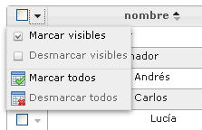

#	Componentes RUP – Menú contextual

<!-- MDTOC maxdepth:6 firsth1:1 numbering:0 flatten:0 bullets:1 updateOnSave:1 -->

   - [1   Introducción](#1-introducción)   
   - [2   Ejemplo](#2-ejemplo)   
   - [3   Casos de uso](#3-casos-de-uso)   
   - [4   Infraestructura](#4-infraestructura)   
      - [4.1 Ficheros](#4.1-ficheros)   
      - [4.2 Dependencias](#4.2-dependencias)   
      - [4.3 Versión minimizada](#4.3-versión-minimizada)   
   - [5   Invocación](#5-invocación)   
   - [6    API](#6-api)   
   - [7.  Sobreescritura del theme](#7-sobreescritura-del-theme)   

<!-- /MDTOC -->


##	1	Introducción
La descripción del componente ***menú contextual***, visto desde el punto de vista de RUP, es la siguiente:

*Un menú contextual consta de un menú dentro de una interfaz gráfica que se muestra a partir de una interacción del usuario. El menú contextual muestra una serie de opciones disponibles en el contexto o estado actual de la aplicación.*


##	2	Ejemplo
Se presenta a continuación un ejemplo de este componente:



##	3	Casos de uso
Se recomienda el uso del componente:
+	Cuando se desee facilitar al usuario el acceso a opciones asociadas a un determinado contexto.


##	4	Infraestructura
A continuación se comenta la infraestructura necesaria para el correcto funcionamiento del componente.
+	Únicamente se requiere la inclusión de los ficheros que implementan el componente (*js y css*) comentados en los apartados *Ficheros y Dependencias*.

###	4.1	Ficheros
Ruta Javascript: rup/scripts/
Fichero de plugin: **rup.contextMenu-x.y.z.js**
Ruta theme: rup/css/
Fichero CSS del theme: **theme.rup.contextMenu-x.y.z.css**

###	4.2	Dependencias
Por la naturaleza de desarrollo de los componentes (patrones) como plugins basados en la librería JavaScript **jQuery**, es necesaria la inclusión del esta. La versión elegida para el desarrollo ha sido la versión **1.12.4**.
+	**jQuery 1.12.4**: http://jquery.com/

La gestión de la ciertas partes visuales de los componentes, se han realizado medieante el plugin **jQuery UI** que se basa en *jQuery* y se utiliza para construir aplicaciones web altamente interactivas. Este plugin, proporciona abstracciones de bajo nivel de interacción y animación, efectos avanzados de alto nivel, componentes personalizables (estilos) ente otros. La versión utilizada en el desarrollo ha sido la **1.12.0**.
+	**jQuery UI 1.12.0**: http://jqueryui.com/

Las distintas funcionalidades que aporta el componente y las prestaciones generales del mismo, se apoyan en el plugin **jQuery contextMenu**. Para el correcto funcionamiento del componente *Menú contextual*, se precisa de la inclusión de dicho plugin.
+	**jQuery contextMenu**: http://medialize.github.io/jQuery-contextMenu/

Los ficheros necesarios para el correcto funcionamiento del componente son:

    jquery-1.12.4.js
    jquery-ui-1.12.0.custom.js
	jquery-ui-1.12.0.custom.css
	jquery.contextMenu.js
	rup.base-x.y.z.js
	rup.contextMenu-x.y.z.js
	theme.rup.contextMenu-x.y.z.css

###	4.3	Versión minimizada
A partir de la versión v2.4.0 se distribuye la versión minimizada de los componentes RUP. Estos ficheros contienen la versión compactada y minimizada de los ficheros javascript y de estilos necesarios para el uso de todos los compontente RUP.

Los ficheros minimizados de RUP son los siguientes:
+	**rup/scripts/min/rup.min-x.y.z.js**
+	**rup/css/rup.min-x.y.z.css**

Estos ficheros son los que deben utilizarse por las aplicaciones. Las versiones individuales de cada uno de los componentes solo deberán de emplearse en tareas de desarrollo o depuración.


##	5	Invocación
Este componente se invocará mediante un selector que indicará todos los elementos sobre los que se va a aplicar el componente menú contextual. Un ejemplo de invocación sería el siguiente:
```javascript
$(selector).rup_contextMenu(properties);
```
Donde el parámetro *“properties”* es un objeto *(var properties = {};)* o bien directamente la declaración de los valores, detallados en el siguiente apartado.

##	6	API
Para ver en detalle la API del componente vaya al siguiente [documento](../api/rup.contextMenu.md).

##	7	Sobreescritura del theme
El componente *tooltip* se presenta con una apariencia visual definida en el fichero de estilos **theme.rup.contextMenu-x.y.z.css**.

Si se quiere modificar la apariencia del componente, se recomienda redefinir el/los estilos necesarios en un fichero de estilos propio de la aplicación situado dentro del proyecto de estáticos (*codAppStatics/WebContent/codApp/styles*).
