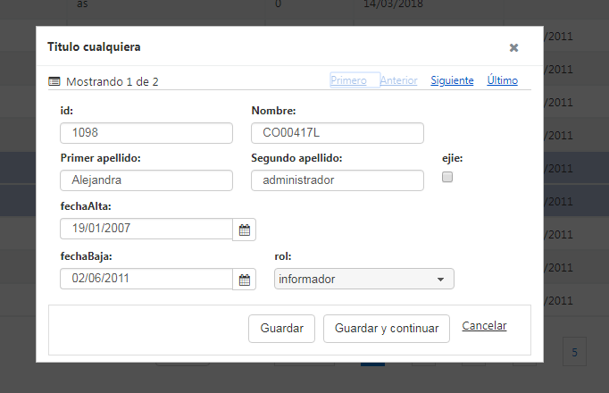

# RUP dataTable - Edici�n en formulario

Permite la edici�n de los registros de la tabla utilizando un formulario de detalle. El formulario se muestra
dentro de un di�logo y ofrece las siguientes funcionalidades:

* A�adir un nuevo registro o modificar uno ya existente.
* Cancelar la inserci�n o edici�n de un registro.
* Navegar entre los registros mostrados en la tabla para permitir operar de manera mas �gil sobre los diferentes elementos.



# 1. Declaraci�n y configuraci�n

El uso del plugin en el componente se realiza incluyendo en el array de la propiedad usePlugins el valor formEdit. La configuraci�n del plugin se especifica en la propiedad formEdit.

```js
$("#idComponente").rup_datatable({
  formEdit:{
  // Propiedades de configuraci�n del plugin formEdit
  }
});
```
