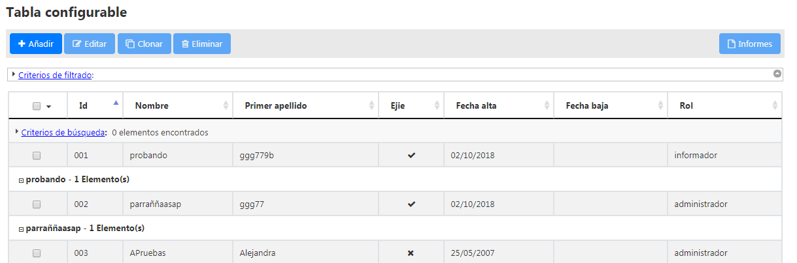

# RUP dataTable - Agrupar filas

Permite establecer grupos en las filas de la tabla y colocar una cabecera tanto arriba de los grupos como abajo de los mismos.




# 1. Declaración y configuración

El uso del plugin en el componente se realiza incluyendo en el array de la propiedad usePlugins el valor rowGroup. La configuración del plugin se especifica en la propiedad rowGroup.

```js
$("#idComponente").rup_datatable({
  rowGroup:{
  // Propiedades de configuración del plugin colReorder
  }
});
