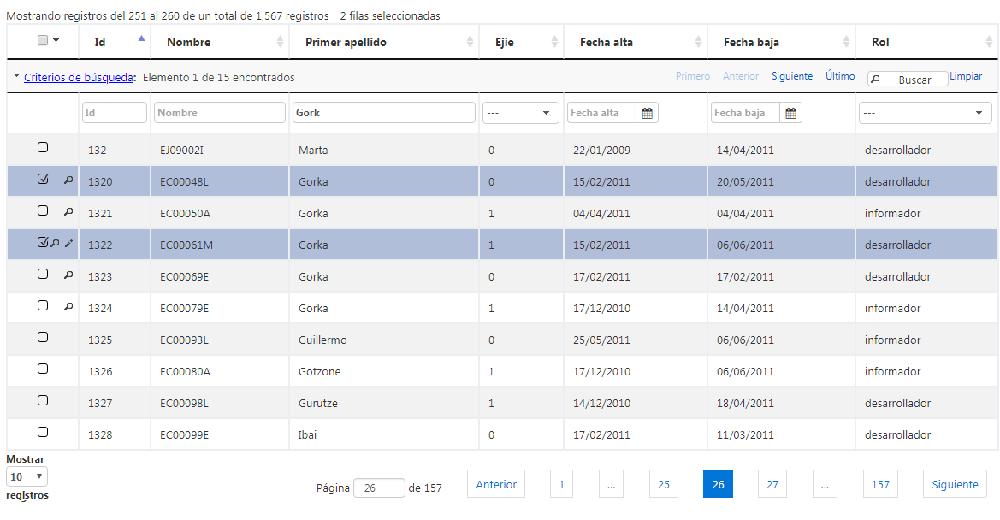

# RUP dataTable - B�squeda

Permite al usuario realizar una b�queda entre el conjunto de resultados que se le muestran. Mediante una serie de criterios de b�squeda permite al usuario posicionarse entre los diferentes registros que se ajustan a dichos criterios.



## 1. Declaraci�n y configuraci�n

El uso del plugin en el componente se realiza incluyendo en el array de la propiedad usePlugins el valor seeker. La configuraci�n del plugin se especifica en la propiedad seeker.

```js
$("#idComponente").rup_datatable({
  seeker:{
    // Propiedades de configuraci�n del plugin seeker
  }
});
```
