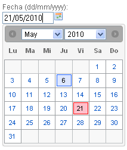
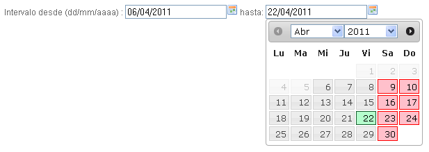
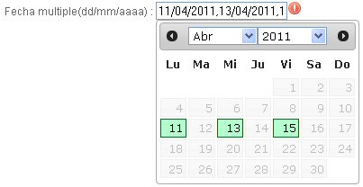
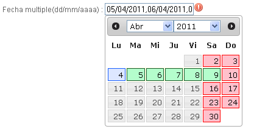
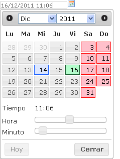

# Componentes RUP – Fecha


<!-- MDTOC maxdepth:6 firsth1:1 numbering:0 flatten:0 bullets:1 updateOnSave:1 -->

   - [1 Introducción](#intro)   
   - [2    Ejemplo](#ejemplo)   
   - [3    Casos de uso](#casos-de-uso)   
   - [4    Infraestructura](#infraestructura)   
      - [4.1 Ficheros](#ficheros)   
      - [4.2 Dependencias](#dependencias)   
      - [4.3 Versión minimizada](#v-minimizada)   
   - [5    Invocación](#invocac)   
   - [6 API](#api)   
   - [7    Intervalos de fechas](#intervalos-fechas)   
   - [8    Fechas múltiples](#fechas)   
   - [10   Interacción con teclado](#teclado)   
   - [11   Sobreescritura del theme](#theme)   
   - [12   Integración con UDA](#integr-uda)   

<!-- /MDTOC -->

<a id="intro"></a>
## 1 Introducción
La descripción del Componente Fecha, visto desde el punto de vista de **RUP** es la siguiente:
*Permite al usuario introducir y seleccionar una fecha, tanto de forma manual como visual, moviéndose fácilmente por días, meses y años. Además, para minimizar las posibilidades de introducir una fecha incorrecta, ofrece al usuario ayudas y sugerencias de formato.*
*Además, este sistema permite la introducción de fechas independiente de dispositivo y flexible, ya que tanto los usuarios avanzados como los novatos podrán utilizarlo sin problemas.*

<a id="ejemplo"></a>
## 2	Ejemplo
Se muestra a continuación una captura de un ejemplo típico del componente:


<a id="casos-de-uso"></a>
## 3	Casos de uso
Se recomienda el uso del componente:
+	Cuando el usuario tenga que introducir una fecha y se quiera ofrecer flexibilidad para escribirla manualmente o seleccionándola de un calendario.
+	Cuando el usuario tenga que introducir un intervalo y se quiera ofrecer flexibilidad para escribirla manualmente o seleccionándola de un calendario.

<a id="infraestructura"></a>
## 4	Infraestructura
A continuación se comenta la infraestructura necesaria para el correcto funcionamiento del componente.
•	Únicamente se requiere la inclusión de los ficheros que implementan el componente *(js y css)* comentados en los apartados *Ficheros y Dependencias*.

<a id="ficheros"></a>
### 4.1	Ficheros
Ruta Javascript: rup/scripts/
Fichero de plugin: **rup.date-x.y.z.js**
Ruta theme: rup/basic-theme/
Fichero css del theme: **theme.rup.date-x.y.z.css**

<a id="dependencias"></a>
### 4.2	Dependencias
Por la naturaleza de desarrollo de los componentes (patrones) como *plugins* basados en la librería JavaScript *jQuery*, es necesaria la inclusión del esta. La versión elegida para el desarrollo ha sido la versión **1.12.4**.
+	**jQuery 1.12.4**: http://jquery.com/

La gestión de la ciertas partes visuales de los componentes, se han realizado mediante el plugin ***jQuery UI*** que se basa en jQuery y se utiliza para construir aplicaciones web altamente interactivas. Este plugin, proporciona abstracciones de bajo nivel de interacción y animación, efectos avanzados de alto nivel, componentes personalizables (estilos) ente otros. La versión utilizada en el desarrollo ha sido la **1.12.0**.

+	**jQuery UI 1.12.0**: http://jqueryui.com/

Los ficheros necesarios para el correcto funcionamiento del componente son:

    jquery-1.12.4.js
    jquery-ui-1.12.0.custom.js
    jquery-ui-1.12.0.custom.css
    jquery-ui.timepicker.js
    jquery-ui.multidatespicker.js (fechas múltiples)
    rup.base-x.y.z.js
    rup.date-x.y.z.js
    theme.rup.date-x.y.z.css

<a id="v-minimizada"></a>
### 4.3	Versión minimizada
A partir de la versión v2.4.0 se distribuye la versión minimizada de los componentes RUP. Estos ficheros contienen la versión compactada y minimizada de los ficheros javascript y de estilos necesarios para el uso de todos los compontente RUP.

Los ficheros minimizados de RUP son los siguientes:
+	rup/scripts/min/rup.min-x.y.z.js
+ rup/basic-theme/rup.min-x.y.z.css

Estos ficheros son los que deben utilizarse por las aplicaciones. Las versiones individuales de cada uno de los componentes solo deberán de emplearse en tareas de desarrollo o depuración.

<a id="invocac"></a>
## 5	Invocación
Este componente se invocará mediante un selector que indicará todos los elementos sobre los que se va a aplicar el componente calendario. Por ejemplo:
```javascript
$("#id_input").rup_date (properties);
```
Donde el parámetro “properties” es un objeto (var properties = {};) o bien directamente la declaración de lo valores directamente. Sus posibles valores se detallan en el siguiente apartado.

<a id="api"></a>
## 6 API
Para ver en detalle la API del componente vaya al siguiente [documento](../api/rup.date.md).

<a id="intervalos-fechas"></a>
## 7	Intervalos de fechas
El componente fecha permite la combinación de varios campos para poder permitir la selección de intervalos. Una vez seleccionada por ejemplo la fecha de inicio *(from)* la fecha de fin *(to)* no podría ser anterior a esta y viceversa. Esta gestión la realiza el componente internamente. A continuación se detalla un ejemplo de cómo realizar la configuración para mostrar un intervalo de fechas:
1.	Se deben declarar dos campos (input) que serán la fecha desde y la fecha hasta:
		```xml
        <input type="text" id="desde" />
<input type="text" id="hasta"/>
```
2.	El componente se lanza sin ningún selector ya que requiere de los dos campos para establecer el intervalo. Estos campos se indicarán mediante los atributos from y to:
```javascript
$.rup_date({		
			from: "desde",
			to: "hasta",
			//Resto igual que en date
			...
		});
```
El resultado sería el que se muestra en la siguiente captura:


<a id="fecha_multi"></a>
## 8	Fechas múltiples
El componente fecha permite la *multiselección* de fechas en el caso de que el usuario deba seleccionar más de una fecha sobre el mismo componente. Una vez seleccionadas, las fechas del componente aparecerán separadas por comas en el campo asociado. Existen dos maneras de implementar la *multiselección*:
+	**número**: mediante un valor numérico se indica la cantidad de fechas (máximas) que se pueden elegir. Una vez seleccionadas todas las fechas permitidas, el calendario presentará los días deshabilitados y no podrán seleccionarse más fechas hasta que se deseleccione alguna.
	+	Configuración:
```javascript
	$("#fecha_multi").rup_date({
	multiSelect: 3,
	...
});
```
	+	Ejemplo:


+	**array**: mediante un *array* se indica un intervalo de días contiguos que se van a seleccionar. La primera posición del *array* (número) indica el día en el que va a comenzar la selección, siendo cero el día actual y permitiendo valores negativos. La segunda posición del *array* (número) indica la posición del último día seleccionado. En este caso no se deshabilitan los días ya que permite cambiar el intervalo de días seleccionados.
	+	Configuración:
	```javascript
$("#fecha_multi").rup_date({
	multiSelect: [0,5],
	...
});
```
	+	Ejemplo:


No está soportada la combinación de los intervalos de fechas y la multiselección de fechas ya que son funcionalidades completamente diferentes.
Dado que el componente encargado de la *multiselección* es un envoltorio (*wrapper*) del componente de fechas estándar, puede que alguna de las propiedades descritas en las fechas no funcionen correctamente.

<a id="fechas"></a>
## 9	Fecha y hora
El componente permite la gestión de un campo fecha en el que sea necesario incluir la hora. Para ello, se combina el calendario, para la selección de fecha, con el selector de hora utilizado por el componente hora. El aspecto del componente con esta configuración es el siguiente:


Este sería un ejemplo de la configuración que se debe indicar en la creación del componente:
```javascript
var properties = {
		datetimepicker:true,
		showSecond: false,
		timeFormat: 'hh:mm'
	};
	$("#id_input").rup_date (properties);
```
Como ya se ha comentado anteriormente, los parámetros de configuración correspondientes a la gestión de la hora, son los indicados en la guía de uso del componente hora.

<a id="teclado"></a>
## 10	Interacción con teclado
La interacción natural con el componente es mediante el ratón, pero se han añadido la posibilidad de manipular los valores mediante el teclado para agilizar su uso lo que ahorra mucho tiempo a los usuarios avanzados.

Cuando el campo asociado al componente recibe el foco se muestra el desplegable. En este momento si se introduce una fecha (siguiendo el formato especificado) utilizando los números del teclado, el componente actualiza el calendario con el valor introducido manualmente. Mediante flechas de dirección (←, ↑, →, ↓) se puede desplazar el cursor a través del campo de fecha para modificarla, además de borrar ciertos valores mediante las teclas suprimir y tecla de retroceso (*backspace*). Con la tecla escape se cerrará el desplegable.

Existen unos atajos de teclado para poder interactuar con el calendario directamente:
+	CTRL + Flecha de dirección : Desplazar el selector de día (enter realiza la selección)
+	Re Pág : Mes anterior
+	Av Pág : Mes siguiente
+	CTRL + SHIFT + Re Pág : Año anterior
+	CTRL + SHIFT + Av Pág : Año siguiente

<a id="theme"></a>
## 11	Sobreescritura del theme
El componente date se presenta con una apariencia visual definida en el fichero de estilos ***theme.rup.date-x.y.z.css***.

Si se quiere modificar la apariencia del componente, se recomienda redefinir el/los estilos necesarios en un fichero de estilos propio de la aplicación situado dentro del proyecto de estáticos *(codAppStatics/WebContent/codApp/styles)*.

Los estilos del componente se basan en los estilos básicos de los widgets de jQuery UI, con lo que los cambios que se realicen sobre su fichero de estilos manualmente o mediante el uso de la herramienta [Theme Roller](http://jqueryui.com/themeroller/) podrán tener repercusión sobre todos los componentes que compartan esos mismos estilos (pudiendo ser el nivel de repercusión general o ajustado a un subconjunto de componentes).

Los estilos básicos configurables en la fecha son los siguientes:
+	**.ui-datepicker-week-end a** → Fin de semana (Sábado y Domingo)

+	**.ui-datepicker-today a** → Día actual

+	**.ui-datepicker-calendar .ui-state-highlight a,
	.ui-datepicker-current-day a**  → Día seleccionado

Ejemplo base de la estructura generada por el componente (estructura interna que forma el calendario, no se incluye el input sobre el que se aplica el componente):
```xml
<div id="ui-datepicker-div" class="ui-datepicker ui-widget ui-widget-content ui-helper-clearfix ui-corner-all ui-helper-hidden-accessible">

<div class="ui-datepicker-header ui-widget-header ui-helper-clearfix ui-corner-all">

<a class="ui-datepicker-prev ui-corner-all" title="Prev"><span
class="ui-icon ui-icon-circle-triangle-w">Anterior</span></a>
<a class="ui-datepicker-next ui-corner-all" title="Next"><span
class="ui-icon ui-icon-circle-triangle-e">Siguiente</span></a>

      <div class="ui-datepicker-title">
      <span class="ui-datepicker-month">Mayo</span>
<span class="ui-datepicker-year">2011</span>
      </div>
</div>

<table class="ui-datepicker-calendar">
<thead>
        <tr>
   <th class="ui-datepicker-week-end">
<span title="Lunes">Vi</span>
   </th>
         ...
         </tr>
      </thead>
      <tbody>
        <tr>
         <td class="ui-datepicker-week-end ui-datepicker-other-month "> 1        
         </td>
         ...
      </tr>
      </tbody>
   </table>

<div class="ui-datepicker-buttonpane ui-widget-content">
<button type="button" class="ui-datepicker-current ui-state-default ui-priority-secondary ui-corner-all">Hoy</button>
<button type="button" class="ui-datepicker-close ui-state-default ui-priority-primary ui-corner-all">Cerrar</button>
</div>

</div>
```
NOTA: Esta estructura podría variar algo en función de los atributos indicados en la configuración.

<a id="integr-uda"></a>
## 12	Integración con UDA
Para facilitar la serialización/deserialización de los datos entre los objetos java y los componentes fecha, desde **UDA** se proporcionan unas clases que definen tanto serializadores como deserializadores para el componente Jackson utilizado en **UDA**.

Estas clases son utilizadas por las anotaciones *@JsonSerialize* y *@JsonDeserialize* de Jackson. Al incluir estas anotaciones en los métodos setter y setter de los model se determina el modo en que Jackson va a realizar la serialización y deserialización de estos tipos de datos.

+	**com.ejie.x38.control.JsonDateSerializer**: Realiza la serialización de un tipo de dato Date en su representación json correspondiente.
El valor *json* resultante solo contiene la información de la fecha, no así el de la hora. (dd/MM/yyyy).
En el proceso de serialización se tiene en cuenta el idioma utilizado por el usuario en la aplicación para utilizar el formato correcto de la fecha. Un ejemplo de uso sería el siguiente:
```java
@JsonSerialize(using = JsonDateSerializer.class)
	public Date getFechaBaja() {
		return this.fechaBaja;
	}
```

+	**com.ejie.x38.control.JsonDateDeserializer**: Realiza la deserialización de un objeto *json* que contiene la representación de una fecha válida en un tipo de dato Date.
El objeto *json* debe contener una fecha válida de acuerdo al formato definido por la locale correspondiente al idioma utilizado en la aplicación por el usuario. Este formado solo comprenderá la parte de la fecha ignorando la hora. (dd/MM/yyyy).
Un ejemplo de uso sería el siguiente:
```java
@JsonDeserialize(using = JsonDateDeserializer.class)
	public void setFechaBaja(Date fechaBaja) {
		this.fechaBaja = fechaBaja;
}
```

+	**com.ejie.x38.control.JsonDateTimeSerializer**: Realiza la serialización de un tipo de dato Date en su representación *json* correspondiente.
El valor *json* resultante contiene tanto la información de la fecha como la de la hora. *(dd/MM/yyyy HH:mm:ss)*.
En el proceso de serialización se tiene en cuenta el idioma utilizado por el usuario en la aplicación para utilizar el formato correcto de la fecha. Un ejemplo de uso sería el siguiente:
```java
@JsonSerialize(using = JsonDateTimeSerializer.class)
	public Date getFechaBaja() {
		return this.fechaBaja;
	}
```

+ **com.ejie.x38.control.JsonDateDeserializer**: Realiza la deserialización de un objeto *json* que contiene la representación de una fecha válida en un tipo de dato Date.
El objeto *json* debe contener una fecha válida de acuerdo al formato definido por la *locale* correspondiente al idioma utilizado en la aplicación por el usuario. Este formado deberá comprender tanto la fecha como la hora. *(dd/MM/yyyy HH:mm:ss)*.
Un ejemplo de uso sería el siguiente:
```java
@JsonDeserialize(using = JsonDateDeserializer.class)
	public void setFechaBaja(Date fechaBaja) {
		this.fechaBaja = fechaBaja;
}
```
