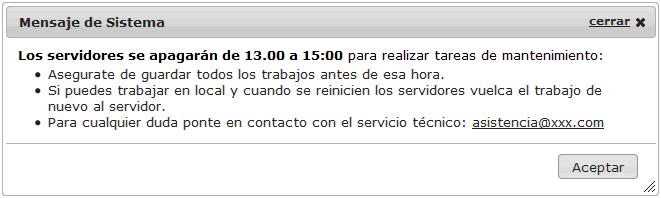

#	Componentes RUP – Diálogo

<!-- MDTOC maxdepth:6 firsth1:1 numbering:0 flatten:0 bullets:1 updateOnSave:1 -->

   - [1   Introducción](#1-introducción)   
   - [2 Ejemplo](#2-ejemplo)   
   - [3 Casos de uso](#3-casos-de-uso)   
   - [4 Infraestructura](#4-infraestructura)   
      - [4.1 Ficheros](#4.1-ficheros)   
      - [4.2 Dependencias](#4.2-dependencias)   
      - [4.3 Versión minimizada](#4.3-versión-minimizada)   
   - [5 Invocación](#5-invocación)   
   - [6 API](#6-api)   
   - [7   Sobreescritura del theme](#7-sobreescritura-del-theme)   
   - [8   Internacionalización (i18n)](#8-internacionalización-i18n)   
   - [9 Aspectos a tener en cuenta](#9-aspectos-a-tener-en-cuenta) 
   - [10 Propiedades adicionales](#10-propiedades-adicionales)  

<!-- /MDTOC -->

##	1	Introducción
La descripción del ***Componente Dialogo***, visto desde el punto de vista de **RUP**, es la siguiente:
	*Permite lanzar un subproceso o un mensaje de confirmación dentro de un proceso principal sin salirse de este. Es una evolución del patrón mensaje.*

##	2 Ejemplo
Se muestra a continuación una maquetación típica del componente:


## 3 Casos de uso
El uso de las ventanas modales debe ser únicamente en ocasiones muy concretas; tales como:
+	Subprocesos dentro de un proceso principal

##	4 Infraestructura
A continuación se comenta la infraestructura necesaria para el correcto funcionamiento del componente.
+	Únicamente se requiere la inclusión de los ficheros que implementan el componente (js y css) comentados en los apartados *Ficheros y Dependencias*.

###	4.1 Ficheros
Ruta Javascript: rup/scripts/
Fichero de plugin: **rup.dialog-x.y.z.js**
Ruta theme: rup/css/
Fichero CSS del theme: **theme.rup.message-x.y.z.css**

**NOTA: Como se observa, los estilos se basan en el fichero de estilos del componente message.**

###	4.2	Dependencias
Por la naturaleza de desarrollo de los componentes (patrones) como plugins basados en la librería JavaScript ***jQuery***, es necesaria la inclusión del esta. La versión elegida para el desarrollo ha sido la versión **3.4.1**.

+	**jQuery 3.4.1**: http://jquery.com/

La gestión de la ciertas partes visuales de los componentes, se han realizado mediante el plugin ***jQuery UI*** que se basa en *jQuery* y se utiliza para construir aplicaciones web altamente interactivas. Este plugin, proporciona abstracciones de bajo nivel de interacción y animación, efectos avanzados de alto nivel, componentes personalizables (estilos) ente otros. La versión utilizada en el desarrollo ha sido la **1.12.0**.

+	**jQuery UI 1.12.0**: http://jqueryui.com/

Los ficheros necesarios para el correcto funcionamiento del componente son:


    jquery-3.4.1.js
    rup.base-x.y.z.js
    rup.dialog-x.y.z.js
    theme.rup.message-x.y.z.css


###	4.3	Versión minimizada
A partir de la versión v2.4.0 se distribuye la versión minimizada de los componentes RUP. Estos ficheros contienen la versión compactada y minimizada de los ficheros javascript y de estilos necesarios para el uso de todos los compontente RUP.
Los ficheros minimizados de RUP son los siguientes:
+	**rup/scripts/min/rup.min-x.y.z.js**
+	**rup/css/rup.min-x.y.z.css**

Estos ficheros son los que deben utilizarse por las aplicaciones. Las versiones individuales de cada uno de los componentes solo deberán de emplearse en tareas de desarrollo o depuración.


##	5 Invocación
Este componente se invocará mediante un selector que indicará el elemento capa (div) que envuelve el contenido  a mostrar o bien directamente sobre jQuery invocando la función del componente. Por ejemplo:
+	Usando una capa
      ```javascript
      $("#selector").rup_dialog(properties);
      ```
+	Obteniendo el contenido directamente (texto) o vía AJAX:
      ```javascript
      $(document).rup_dialog(properties);
      ```
Donde el parámetro “properties” es un objeto *(var properties = {};)* o bien directamente la declaración de lo valores directamente. Sus posibles valores se detallan en el siguiente apartado.

La estructura de una ventana modal debe consistir en una capa semitransparente que deje ver ligeramente el proceso principal que se está llevando a cabo para dejar claro al  usuario que sigue trabajando en ese proceso. Sobre la capa semitransparente se debe añadir la capa con el contenido del subproceso. Debe constar, además del contenido en si mismo, un aspa de cierre, un enlace para cancelar la acción y un botón destacado para la ejecución de la acción.

La funcionalidad implementada en los diálogos permite que el desarrollador decida si el diálogo a mostrar debe ser realmente modal o no. Del mismo modo se permite configurar el tamaño de las ventanas, si se pueden redimensionar, arrastrar…

##	6 API

Para ver en detalle la API del componente vaya al siguiente [documento](../api/rup.dialog.md).

##	7	Sobreescritura del theme
El componente dialog se presenta con una apariencia visual definida en el fichero de estilos **theme.rup.message-x.y.z.css**.

Si se quiere modificar la apariencia del componente, se recomienda redefinir el/los estilos necesarios en un fichero de estilos propio de la aplicación situado dentro del proyecto de estáticos *(codAppStatics/WebContent/codApp/styles)*.

Los estilos del componente se basan en los estilos básicos de los widgets de *jQuery UI*, con lo que los cambios que se realicen sobre su fichero de estilos manualmente o mediante el uso de la herramienta [Theme Roller](http://jqueryui.com/themeroller/) podrán tener repercusión sobre todos los componentes que compartan esos mismos estilos (pudiendo ser el nivel de repercusión general o ajustado a un subconjunto de componentes).

Los estilos principales a tener en cuenta son los siguientes:
+	**.ui-dialog-title**: Estilo aplicado a la cabecera de la ventana de diálogo.
+	**.ui-dialog-content**: Estilo aplicado al cuerpo de la ventana de diálogo.
+	**.ui-dialog-button-pane**: Estilo aplicado a la botonera de la ventana de diálogo.

Adicionalmente se aplican una serie de estilos para mejorar la experiencia del usuario como puede ser el redondeo de las esquinas (sólo aplicable en FireFox) o la inclusión de estilos que modifiquen el cursor en caso de que la ventana sea redimensionable.

Cabe decir, que el color de la barra del título puede ser cambiada fácilmente sobrescribiendo la propiedad **background-color** dentro de la clase **.app-primary-color**.

##	8	Internacionalización i18n
La gestion de los literales de lo diálogos se realiza a través de ficheros json lo que flexibiliza el desarrollo. Para acceder a los literales se hara uso del objeto base rup, por el cual se accedera al objeto json correspondiente según el idioma para obtener tanto los literales como los propios mensajes.

Los literales definidos para el contenido del diálogo pueden ser simple texto o código en html. Para este componente lo literales utilizados son escasos y están en la parte global de la internacionalización dentro de los resources de rup. A continuación se muestran los literales necesarios para el componente:
```javascript
{
	"rup_message":{
		"aceptar":"Aceptar",
		"tituloError":"Se ha producido un error",
      ...
	},
	"rup_global":{
		"cerrar":"cerrar",
		"rupCheckStyleError":"NO SE CUMPLEN LAS NOMRAS DE LA GUIA DE ESTILOS DE RUP. DEBE EXISTIR UNA ACCIÓN SECUNDARIA."
	},
	"rup_blockUI":{
      "cargando":"Procesando, espere por favor"
	},
	"rup_dialog":{
      "errorLoadingData":"<b>Error recuperando los datos peticionados para crear el diálogo.</b>"
   }
}
```
El acceso a cualquier tipo de literal se debe realizar de la siguiente forma (teniendo en cuenta que es un objeto JSON):
```javascript
$.rup.i18n.base.rup_global.cerrar
```

## 9 Aspectos a tener en cuenta
Es importante destacar que siempre es necesario definir un botón con la siguiente propiedad:
```javascript
btnType: $.rup.dialog.LINK
```

Un ejemplo completo sería el siguiente:
```javascript
$('#idDialogAjaxWar').rup_dialog({
    type: $.rup.dialog.AJAX,
    url: '../patrones/dialogAjax' ,
    autoOpen: true,
    modal: true,
    width: '650',
    resizable: true,
    title: 'Diálogo Ajax (War)',
    buttons: [{
        text: 'Aceptar',
        click: function () { 
            $('#idDialogAjaxWar').rup_dialog('close');
        }					
    },
    {
        text: 'Enviar',
        click: function () { 
            $('#idDialogAjaxWar').rup_dialog('close'); 
        }
    },
    {
        text: 'Abandonar',
        click: function () { 
            $('#idDialogAjaxWar').rup_dialog('close');
        },
        btnType: $.rup.dialog.LINK
    }]
});
```

## 10 Propiedades adicionales
```javascript
url: '../patrones/dialogAjax'
```
URL de la que se obtendrá el contenido del diálogo.
```javascript
rupCheckStyle: true
```
Propiedad definida por el componente base, si se define a `true` se mostrarán los mensajes específicos del componente base marcados por la guía de estilos, es decir, si el desarrollador no cumple con la guía de estilos o desarrollo, el objeto base mostrará los mensajes advirtiendo de su incumplimiento, si se define a `false`, no se mostrarán. Esta acción queda bajo la responsabilidad de la aplicación, ya que esta propiedad no debería modificarse.
```javascript
type: $.rup.dialog.DIV
```
Propiedad que establece el tipo de diálogo a mostrar. Existen cuatro tipos diferentes: `$.rup.dialog.DIV`, `$.rup.dialog.TEXT`, `$.rup.dialog.AJAX` y `$.rup.dialog.LINK`.
```javascript
ajaxOptions: {
    prueba: 'Prueba'
}
```
Establece todas las propiedades para configurar la petición AJAX.
```javascript
showLoading: true
```
Esta propiedad mostrará una capa de carga de datos en los diálogos de tipo AJAX durante la carga del mismo.
```javascript
disabled: false
```
Propiedad que permite deshabilitar el diálogo.
```javascript
autoOpen: true
```
Si esta propiedad esta definida a `true`, el diálogo se abrirá automáticamente cuando se cree, en el caso de que su valor sea `false`, el diálogo se mantendrá oculto hasta que se invoque a la función `open` **(.rup_dialog('open'))**.
```javascript
buttons: [
    {
        text: 'Aceptar',
        click: function () { 
            $('#idDialogAjaxWar').rup_dialog('close');
        }					
    },
    {
        text: 'Enviar',
        click: function () { 
            $('#idDialogAjaxWar').rup_dialog('close'); 
        }
    },
    {
        text: 'Abandonar',
        click: function () { 
            $('#idDialogAjaxWar').rup_dialog('close');
        },
        btnType: $.rup.dialog.LINK
    }
]
```
Define los botones (literales y funciones a las que invocan) que contendrá el diálogo. La propiedad sería de tipo `array`. Donde cada elemento del `array` debe ser un objeto que define las propiedades de cada botón y el tipo del mismo.
```javascript
closeOnEscape: true
```
Especifica si se debe cerrar el diálogo cuando tenga el foco y el usuario pulse la tecla ESC.
```javascript
dialogClass: 'clasePersonalizada'
```
Propiedad que establece el/los estilos que se añadirán al dialogo para dotarlo de estilos diferentes.
```javascript
draggable: true
```
Si su valor es `true` el diálogo podrá moverse mientras se pinche sobre la cabecera, replicando así el comportamiento usado en la mayoría de interfaces gráficas.
```javascript
height: 'auto'
```
Establece la altura del diálogo en pixeles. Permite definir su valor tanto con un `string` como con un `number`.
```javascript
hide: null
```
Efecto utilizado cuando se cierra el diálogo.
```javascript
maxHeight: false
```
Altura máxima en pixeles a la que se puede llegar a redimensionar el diálogo. Permite definir su valor tanto con un `boolean` como con un `number`.
```javascript
maxWidth: false
```
Anchura máxima en pixeles o en porcentaje a la que se puede llegar a redimensionar el diálogo. Permite definir su valor tanto con un `boolean`, `number` o `string` (para porcentajes).
```javascript
minHeight: 100
```
Altura mínima en pixeles a la que se puede llegar a redimensionar el diálogo. Permite definir su valor tanto con un `boolean` como con un `number`.
```javascript
minWidth: 150
```
Anchura mínima en pixeles a la que se puede llegar a redimensionar el diálogo. Permite definir su valor tanto con un `boolean` como con un `number`.
```javascript
modal: false
```
Si se establece esta propiedad a `true` el diálogo se abrirá de forma modal, por encima del resto de elementos.
```javascript
position: 'center' 
```
Esta propiedad especifica dónde debe mostrarse el diálogo. Sus posibles valores son: 
- Un simple `string` representando cualquiera de las siguientes posiciones: 'center', 'left', 'right', 'top', 'bottom'. 
- Un `array` con las coordenadas x, y en píxeles (ej. [350,100]). 
- Un `array` con `string` que representan la posición (ej. ['right','top']).
```javascript
resizable: true
```
Si se establece esta propiedad a `true`, el diálogo será redimensionable.
```javascript
show: ''
```
Efecto a realizar cuando se abre el diálogo.
```javascript
title: 'Título personalizado'
```
Establece el título de la ventana. Puede ser cualquier código HTML válido.
```javascript
width: 300
```
Establece la anchura del diálogo en píxeles.
```javascript
open: function(event, ui) {}
```
Evento que se lanza cuando se abre el diálogo.
```javascript
close: function(event, ui) {}
```
Evento que se lanza a la hora de cerrar el diálogo.
```javascript
beforeClose: function(event, ui) {}
```
Evento que se lanza justo antes de que se cierre el dialogo, si este evento devuelve `false`, se anulará la acción de cierre y el dialogo seguirá abierto.
```javascript
adapter: 'dialog_material'
```
Permite cambiar el aspecto visual del componente. Existen dos tipos diferentes: `dialog_material` y `dialog_bootstrap`.
