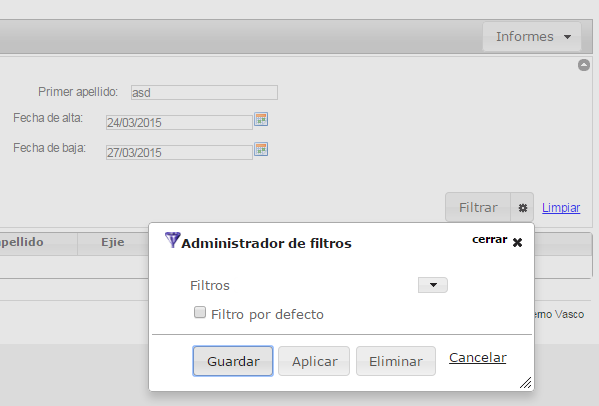

# RUP jqTable - Multifiltrado

Permite la gestión de múltiples filtros para el componente rup_jqtable.



# 1. Declaración y configuración

El uso del plugin en el componente se realiza incluyendo en el array de la propiedad usePlugins el valor “multtifilter”. La configuración del plugin se especifica en la propiedad multifilter.

> Es condición indispensable para trabajar con el multifilter, haber habilitado el plugin “filter”.

```js
$("#idComponente").rup_jqtable({
  url: "../jqGridUsuario",
  usePlugins:["multifilter"],
  multifilter:{
  // Propiedades de configuración del plugin multifilter
  }
});
```

Para trabajar con el multifilter hay que habilitar en la base de datos una tabla con los siguientes campos.

TABLE_FILTER:

| PK | FILTER_ID | NUMBER |
| -- | --------- | ------ |
| U1 | FILTER_SELECTOR | VARCHAR2(40) |
| U1 | FILTER_USER | VARCHAR2(180) |
| U1 | FILTER_NAME | VARCHAR2(180) |
|    | FILTER_VALUE | CLOB |
|    | FILTER_DEFAULT | SMALLINT |

Para el campo FILTER_ID hay que crear una secuencia autonumérica. Los nombres que se den tanto a la tabla como a las columnas no tienen por qué corresponder con las propuestas ya que se puede configurar en el archivo de configuración rup-config.xml

El tamaño de los campos es orientativo, se puede asignar el tamaño deseado dependiendo del proyecto.

# 2. Archivos de configuración

En el archivo de configuración rup-config.xml hay que configurar el nombre de las columnas de la tabla de Filtro implementada, como también el nombre de la misma. Se especifica así mismo el nombre de la secuencia creada.

[spring/rup-config.xml]
```xml
<!-- Gestión de los filtros mediante base de datos -->
<bean id="x21aFilterDao" class="com.ejie.x38.rup.jqgrid.filter.dao.FilterDaoImpl">
  <property name="filterDataSource" ref="dataSource" />
  <property name="db_filterTableName" value="FILTER_TABLE" />
  <property name="col_filterId" value="FILTER_ID" />
  <property name="col_filterSelector" value="FILTER_SELECTOR" />
  <property name="col_filterName" value="FILTER_NAME" />
  <property name="col_filterUser" value="FILTER_USER" />
  <property name="col_filterValue" value="FILTER_VALUE" />
  <property name="col_filterDefault" value="FILTER_DEFAULT" />
  <property name="filterSeq" value="FILTER_SEQ" />
</bean>
<!—Inyección de dependencias del FilterService -->
<bean id="x21aFilterService" class="com.ejie.x38.rup.jqgrid.filter.service.FilterServiceImpl">
  <property name="filterDao" ref="x21aFilterDao" />
</bean>
```

Para que Jackson pueda serializar y deserializar el objeto Filter se debe añadir la siguiente línea al archivo de configuración de Jackson.

[spring/jackson-config.xml]
```js
<entry key="#{T(com.ejie.x38.rup.jqgrid.filter.model.Filter)}" value-ref="customSerializer" />
```

# 3. Configuración del Controller

Para poder acceder al service encargado de gestionar el multifiltro, en el controller que gestiona la pantalla hay que añadir los siguientes métodos configurando el mapping de la url si fuera necesario.

Se ha de declarar una variable de tipo ```com.ejie.x38.rup.jqgrid.filter.service.FilterService``` con la anotación ```@Autowired``` para que spring pueda gestionar la inyección de dependencias.

```java
//añade o actualiza un filtro
@RequestMapping(value = "/multiFilter/add", method = RequestMethod.POST)
public @ResponseBody Filter filterAdd(@RequestJsonBody(param="filtro") Filter filtro){
    JQGridUsuarioController.logger.info("[POST - jqGrid] : add filter");
    return filterService.insert(filtro);
}

//borra un filtro
@RequestMapping(value = "/multiFilter/delete", method = RequestMethod.POST)
public @ResponseBody Filter filterDelete(@RequestJsonBody(param="filtro") Filter filtro) {
    JQGridUsuarioController.logger.info("[POST - jqGrid] : delete filter");
    return filterService.delete(filtro);
}

//Obtien todos los filtros
@RequestMapping(value = "/multiFilter/getAll", method = RequestMethod.GET)
public @ResponseBody List<Filter> filterGetAll(
    @RequestParam(value = "filterSelector", required = true) String filterSelector,
    @RequestParam(value = "user", required = true) String filterUser) {

    JQGridUsuarioController.logger.info("[get - jqGrid] : GetAll filter");
    return filterService.getAllFilters(filterSelector,filterUser);
}

// Obtención del filtro por defecto
@RequestMapping(value = "/multiFilter/getDefault", method = RequestMethod.GET)
public @ResponseBody Filter filterGetDefault(
    @RequestParam(value = "filterSelector", required = true) String filterSelector,
    @RequestParam(value = "user", required = true) String filterUser) {

    JQGridUsuarioJerarquiaController.logger.info("[get - jqGrid] : getDefault filter");
    return filterService.getDefault(filterSelector, filterUser);
}
```

El objeto filtro que se envía en los métodos delete y add tiene la siguiente estructura:

```js
{
    filtro: {
        filterSelector: settings.id, //identificativo del filtro
        filterName: multifilterSettings.$comboLabel.val(), //nombre del filtro
        filterValue: dataFormJson, //Json con los valores del filtro
        filterDefault: multifilterSettings.$defaultCheck.is(':checked'), //checkbox por defecto
        filterUser: usuario //usuario del filtro
    }
}
```

El atributo filterValue contiene los valores de un Filtro serializados en un json con el siguiente formato:

```js
{”name del objteto HTML del formulario”: “valor del objeto”}
```

Ejemplo:
```js
{
   "procedimientos":{
      "pkProcedimientoT49":"453"
   },
   "codigoExpedienteT01":"asdasd",
   "tituloExpedienteT01":"78970644",
   "titular":{
      "nombreParticipacionT71_label":"Nerea",
      "nombreParticipacionT71":"Nerea",
      "cifParticipacionT71_label":"78927442K",
      "cifParticipacionT71":"78977442K"
   },
   "notasT01":"sdasd",
   "tablonT10":"N",
   "fases":{
      "idFaseT08":"300"
   },
   "estados":{
      "estadoIdT09":"3000100"
   },
   "expiredWaits":"on",
   "estudiodocumentacionT01":"on",
   "certificadosConErrorT100":"on",
   "expCerrados":"on",
   "familias":{
      "grupoFamiliaIdT48":"7"
   }
}
```
