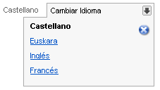

#	Componentes RUP – Idioma

<!-- MDTOC maxdepth:6 firsth1:1 numbering:0 flatten:0 bullets:1 updateOnSave:1 -->

   - [1   Introducción](#intro)   
   - [2   Ejemplo](#ejemplo)   
   - [3   Casos de uso](#casos-de-uso)   
   - [4   Infraestructura](#infraestructura)   
      - [4.1 Ficheros](#ficheros)   
      - [4.2 Dependencias](#dependencias)   
      - [4.3 Versión minimizada](#v-minimizada)   
   - [5   Invocación](#invocac)   
   - [6   API](#api)   
   - [7   Sobreescritura del theme](#theme)   
   - [8   Internacionalización (i18n)](#i18n)   

<!-- /MDTOC -->

<a id="intro"></a>
##	1	Introducción
La descripción del ***Componente Idioma***, visto desde el punto de vista de **RUP**, es la siguiente:
*El componente de idioma esta diseñado para permitir al usuario elegir, de forma intuitiva, el idioma en el que se presenta la aplicación.*

<a id="ejemplo"></a>
##	2	Ejemplo
Se muestra a continuación los dos posibles formatos de maquetación dispone en el componente:


***Modo por defecto***


***Modo portal***

<a id="casos-de-uso"></a>
##	3	Casos de uso
Se aconseja la utilización de este componente:
+	Situaciones en las que se disponga de varias versiones idiomáticas del sitio web y se desee que el usuario pueda cambiar el idioma durante su interacción con la aplicación.

Las razones para el uso del componente son las siguientes:
+	Ocupa poco espacio en la interfaz.
+	Es fácil de comprender y utilizar.
+	Es escalable: podemos incluir varios idiomas en el combo desplegable sin afectar al resto de la interfaz.

<a id="infraestructura"></a>
##	4	Infraestructura
A continuación se comenta la infraestructura necesaria para el correcto funcionamiento del componente.

Únicamente se requiere la inclusión de los ficheros que implementan el componente (*js y css*) comentados en los apartados *Ficheros y Dependencias*.

<a id="ficheros"></a>
###	4.1	Ficheros
Ruta Javascript: rup/scripts/
Fichero de plugin: **rup.lang-x.y.z.js**
Ruta theme: rup/basic-theme/
Fichero css del theme: **theme.rup.lang-x.y.z.css**

<a id="dependencias"></a>
###	4.2	Dependencias
Por la naturaleza de desarrollo de los componentes (patrones) como plugins basados en la librería JavaScript ***jQuery***, es necesaria la inclusión del esta. La versión elegida para el desarrollo ha sido la versión **1.12.4**.
+	**jQuery 1.12.4**: http://jquery.com/

La gestión de la ciertas partes visuales de los componentes, se han realizado mediante el plugin ***jQuery UI*** que se basa en *jQuery* y se utiliza para construir aplicaciones web altamente interactivas. Este plugin, proporciona abstracciones de bajo nivel de interacción y animación, efectos avanzados de alto nivel, componentes personalizables (estilos) ente otros. La versión utilizada en el desarrollo ha sido la **1.12.0**.
•	jQuery UI 1.12.0: http://jqueryui.com/

Los ficheros necesarios para el correcto funcionamiento del componente son:

    jquery-1.12.4.js
    jquery-ui-1.12.0.custom.js
    jquery-ui-1.12.0.custom.css
    rup.base-x.y.z.js
    rup.lang-x.y.z.js
    theme.rup.lang-x.y.z.css

<a id="v-minimizada"></a>
###	4.3	Versión minimizada

A partir de la versión v2.4.0 se distribuye la versión minimizada de los componentes RUP. Estos ficheros contienen la versión compactada y minimizada de los ficheros javascript y de estilos necesarios para el uso de todos los compontente RUP.
Los ficheros minimizados de RUP son los siguientes:
+	**rup/scripts/min/rup.min-x.y.z.js**
+	**rup/basic-theme/rup.min-x.y.z.css**

Estos ficheros son los que deben utilizarse por las aplicaciones. Las versiones individuales de cada uno de los componentes solo deberán de emplearse en tareas de desarrollo o depuración.

<a id="invocac"></a>
##	5	Invocación
La creación del componente idioma se realiza de forma automática gracias al wizard de creación de proyectos, ya que este crea el layout correspondiente para la aplicación y esta integrado en el mismo, pero siempre haciendo uso del código de aplicación para crear el id de la capa donde si insertara el componente:
```javascript
		$("#idlanguage").rup_language();
```

Los posibles idiomas de la aplicación se cargan a través de la variable ***AVAILABLE_LANGS*** que se carga en el fichero *“base-includes.jsp”*. Esta variable se genera automáticamente con los idiomas seleccionados en la creación de la aplicación.

<a id="api"></a>
##	6	API
Para ver en detalle la API del componente vaya al siguiente [documento](../api/rup.language.md).

<a id="theme"></a>
##	7	Sobreescritura del theme
El componente idioma se presenta con una apariencia visual definida en el fichero de estilos ***theme.rup.lang-x.y.z.css***.

Si se quiere modificar la apariencia del componente, se recomienda redefinir el/los estilos necesarios en un fichero de estilos propio de la aplicación situado dentro del proyecto de estáticos *(codAppStatics/WebContent/codApp/styles)*.

<a id="i18n"></a>
##	8	Internacionalización i18n
La gestión de los literales del componente idioma se realiza a través de ficheros *json* lo que flexibiliza el desarrollo. Para acceder a los literales se hará uso del objeto base **RUP**, por el cual se accederá al objeto *json* correspondiente según el idioma para obtener tanto los literales a través de esta sentencia.
```javascript
$.rup.i18n.rup_language
```
Los literales marcados para este componente son los siguientes:
```javascript
"rup_language" : {
"es": "Castellano",
    	"eu":"Euskara",
    	"en":"Ingles",
    	"changeLanguage": "Cambiar Idioma"
 }
```
