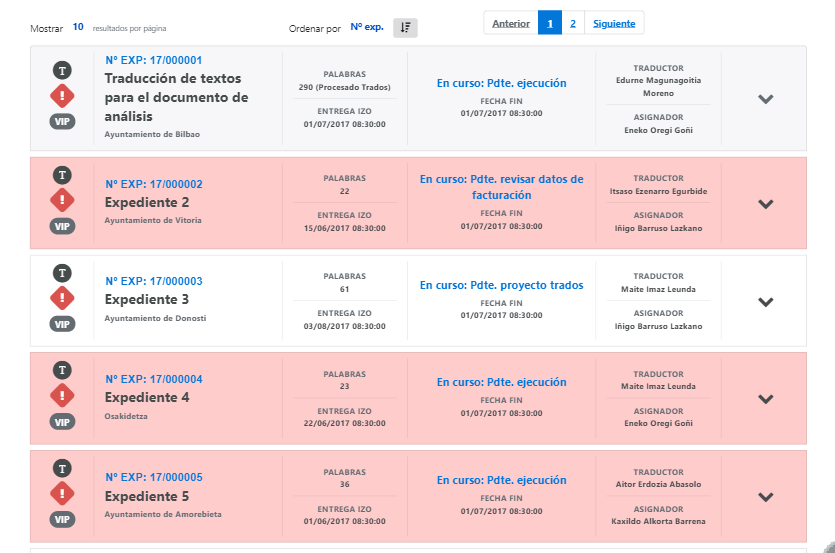
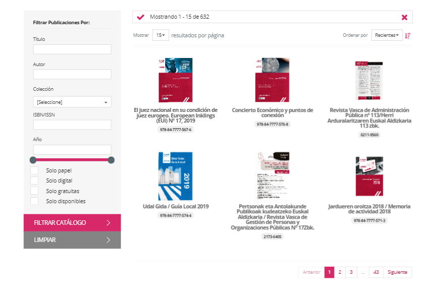
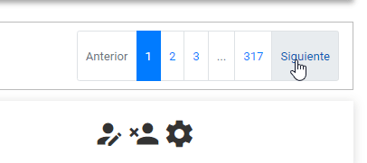

#	Componentes RUP – Hora

<!-- MDTOC maxdepth:6 firsth1:1 numbering:0 flatten:0 bullets:1 updateOnSave:1 -->

   - [1   Introducción](#1-introducción)   
   - [2   Ejemplo](#2-ejemplo)   
   - [3   Casos de uso](#3-casos-de-uso)   
   - [4   Infraestructura](#4-infraestructura)   
      - [4.1 Dependencias](#4.1-dependencias)   
      - [4.2 Versión minimizada](#4.2-versión-minimizada)   
   - [5   Invocación](#5-invocación)
      - [5.1 Código HTML](###5.1-Código-HTML)
         - [5.1.1 El feedback](###5.1.1-El-feedback)
         - [5.1.2 El contenedor](###5.1.2-El-contenedor)
         - [5.1.3 La cabecera de controles](###5.1.3-La-cabecera-de-controles)
         - [5.1.4 Controles de cabecera para multiselección](###5.1.4-Controles-de-cabecera-para-multiselección)
         - [5.1.5 Control de cabecera para nº de elementos por página](###5.1.5-Control-de-cabecera-para-nº-de-elementos-por-página)
         - [5.1.6 Controles de cabecera para ordenación](###5.1.6-Controles-de-cabecera-para-ordenación)
         - [5.1.7 Controles de cabecera para paginación](###5.1.7-Controles-de-cabecera-para-paginación)
      - [5.2 Código JavaScript](###5.2-Código-JavaScript)
   - [6   API](#6-api)   
   - [7   Interacción con teclado](#7-interacción-con-teclado)   
   - [8   Sobreescritura del theme](#8-sobreescritura-del-theme)   
   - [9   Integración con UDA](#9-integración-con-uda)   

<!-- /MDTOC -->


##	1	Introducción
Normalmente, desde el punto de vista de un diseñador, las pantallas de búsqueda y resultados se plantean como un formulario de búsqueda y una tabla como presentación de los registros encontrados en el sistema.

Sin embargo, esta forma de entender las pantallas actualmente está obsoleta. Aunque en ciertas ocasiones puede ser la forma más correcta de visualización, normalmente se encuentra en desuso en la mayoría de aplicaciones web modernas.

Desde UDA se propone el componente de listados, llamados a sustituir la visualización de los registros de búsqueda en en aquellas pantallas donde los requisitos de información a presentar no deben quedar condicionados ni por la resolución de los dispositivos en las que se presenta ni por la cantidad de la misma.

Además de ser una solución que actualmente estamos acostumbrados a ver en cualquier página web o aplicación nativa, estos listados nos permiten tener una mayor personalización de cómo se muestra la información en pantalla.

##	2	Ejemplo
Se muestra a continuación unos ejemplos en los que es más aconsejable el uso de un listado que el de una tabla:

- [ Ej1 ] Cuando la cantidad de información que se quiere presentar es demasiado grande como para repartirla en múltiples columnas.

	En este caso un listado nos permite aprovechar tanto el ancho como el alto de la pantalla para mostrar todos los datos y si se desea plantear elementos expandibles.



- [ Ej2 ] Cuando se desea presentar los resultados de una forma alternativa.

	En este ejemplo se desea presentar los resultados como una lista de tarjetas de imágenes que ocupen el ancho de pantalla de forma dinámica en cantidad y tamaño.



##	3	Casos de uso
Podemos considerar correcto el uso de tablas para la presentación de resultados cuando los datos a mostrar por cada registro son pocos y de un tamaño conocido que se sabe no ocuparan en conjunto más de una sola línea de caracteres en pantalla.

Además su uso está orientado a visualización en dispositivos con un ancho de pantalla conocido, dado que la forma de adaptación de las tablas a RWD es muy mala, tanto que la forma más habitual de adecuación de las mismas a estos diseños suelen pasar por la ocultación de columnas en resoluciones bajas.

##	4	Infraestructura
Únicamente se requiere la inclusión de RUP en el proyecto en que se hará uso.

###	4.1	Dependencias
Todas las dependencias del componente se encuentran satisfechas dentro del propio empaquetado de RUP en su distribución actual.

###	4.2	Versión minimizada
La versión minimizada del componente se encuentra empaquetada dentro de los distribuibles minimizados de RUP (archivos \*.min.\*).

##	5	Invocación
Este componente se invocará mediante un selector que indicará todos los elementos sobre los que se va a aplicar el patrón Listado. Por ejemplo:

```javascript
$('#idList').rup_list(properties);
```
Donde el parámetro *“properties”* es un objeto *(var properties = {};)* o bien directamente su declaración. Sus posibles valores se detallan en el siguiente apartado.

El componente list necesita de una invocación de una llamada javascript sobre una estructura HTML existente.

Cada módulo del componente asocia funcionalidades y eventos a los diferentes objetos de la estructura HTML. De este modo los componentes feedback, formulario de filtrado o los combos, deberán de construirse sobre objetos HTML.

El componente de listados se ha creado con la base de ofrecer a los desarrolladores un mayor control lobre la presentación tanto de los resultados como del controlador de los mismos.

En principio únicamente se debe suministrar los identificadores inequívocos del filtro y el feedback como elementos externos.
Como partes internas el esqueleto necesario se compone del header de control del componente, el contenedor del listado y una template de ficha que servirá para presentar los resultados.

Para facilitar la labor de los desarrolladores el componente provee de un validador de esqueleto en tiempo de inicialización que compruebe que el componente tiene la base suficiente para crearse sin errores y en caso contrario dar pistas al desarrollador de lo que falta para una correcta inicialización.

Para simplificar el código necesario a la hora de invocar y configurar el componente, se ha definido una nomenclatura estándar a la hora de indicar los identificadores. La composición entre el identificador del listado y esta nomenclatura es sobre lo que se basará el validador de esqueleto HTML para verificar que el componente puede ser inicializado.

### 5.1 Código HTML
Para simplificar la nomenclatura nodos los identificadores de los objetos HTML se derivan a partir del identificador base del componente table.

Para lograr una configuración mínima del componente js se deberá de implementar algo similar al siguiente código HTML en la jsp de la pantalla, cuidando los identificadores de cada elemento.

Para el ejemplo supongamos que el componente RUP table se invoca sobre el elemento base con identificador table.

Partiendo de esto, el resto de identificadores se derivarán a partir de la norma:

    listID-<componente>

Este sería un ejemplo completo del código que se debería de incluir en la jsp, posteriormente lo analizaremos por partes:

```html
<div id="listID-feedback"></div>
<div id="listID-content">
    <div id="listID-header" class="row">
        <div id="listID-header-selectables" class="col-md-3">
            Opciones de selección:
        </div>
        <div class="col-md-2">
            <label for="listID-header-rowNum">Elementos por página:</label>
            <select id="listID-header-rowNum"></select>
        </div>
        <!-- Ordenar por -->
        <div class="col-md-3">
            <div class="row">
                <div class="col-md-7">
                    <label for="listID-header-sidx">Ordenar por:</label>
                    <select id="listID-header-sidx"></select>
                </div>
                <div class="col-md-2">
                    <button id="listID-header-sord">
                        <em class="mdi mdi-sort"></em>
                    </button>
                </div>
            </div>
        </div>
        <!-- Navegación -->
        <div class="col-md-4">
            <nav id="listID-header-nav">
                <ul class="pagination">
                    <li id="listID-header-page-prev" class="page-item disabled">
                        <div class="page-link d-none d-lg-flex" tabindex="-1">Anterior</div>
                        <div class="page-link d-lg-none" tabindex="-1">
                            <span class="mdi mdi-arrow-right-bold-circle-outline mdi-rotate-180"/>
                        </div>
                    </li>
                    <li class="page-item page-separator disabled">
                        <div class="page-link" tabindex="-1">...</div>
                    </li>
                    <li class="page-item page-separator disabled">
                        <div class="page-link" tabindex="-1">...</div>
                    </li>
                    <li id="listID-header-page-next" class="page-item disabled">
                        <div class="page-link d-none d-lg-flex">Siguiente</div>
                        <div class="page-link d-lg-none" tabindex="-1">
                            <span class="mdi mdi-arrow-right-bold-circle-outline"/>
                        </div>
                    </li>
                </ul>
            </nav>
        </div>
    </div>
    <div id="listID"></div>
    <div id="listID-itemTemplate" class="list-item">
        <span id="modelAttr1_label"></span>: <span id="modelAttr1_value"></span>
        <span id="modelAttr2_label"></span>: <span id="modelAttr2_value"></span>
    </div>
</div>
```

### 5.1.1 El feedback
Identificador único del objeto del DOM sobre el cual se inicializará un rup_feedback sobre el cual el componente mostrará toda la información contextual de su uso.

**[listID]+'-feedback'**

```html
<div id="listID-feedback"></div>
```

### 5.1.2 El contenedor
Identificador único del objeto del DOM que hará de contenedor del listado, necesario para calcular tamaños, mostrar el overlay de carga, etc.

**[listID]+'-content'**

```html
<div id="listID-content">
   <!-- Contenido del contenedor que se analiza en los siguientes puntos -->

   <!-- Cabecera de controles -->
   <div id="listID-header"></div>
   <!-- Listado de resultados a renderizar -->
   <div id="listID"></div>
   <!-- Plantilla de resultado (ficha) -->
   <div id="listID-itemTemplate"></div>
</div>
```

### 5.1.3 La cabecera de controles
Identificador único del objeto del DOM que albergará los controles del listado como pueden ser los necesarios para el número de resultados por página, ordenación, paginación, multiselección, etc.

**[listID]+'-header'**

En caso de configurarse el uso de un footer el componente replica la cabecera al final del listado reemplazando en los identificadores del componente y subcomponentes por **[.\*]-footer[-.\*]**

```html
<div id="listID-header" class="row">
   <!-- Contenido de la cabecera que se analiza en los siguientes puntos -->

   <!-- Multiselección -->
   <div id="listID-header-selectables"></div>
   <!-- Nº de elementos por página -->
   <select id="listID-header-rowNum"></select>
   <!-- Combo de ordenación simple -->
   <select id="listID-header-sidx"></select>
   <!-- Botón o enlace de ordenación ascendente/descendente -->
   <button id="listID-header-sord"></button>
   <!-- Paginación -->
   <nav id="listID-header-nav"></nav>
</div>
```

### 5.1.4 Controles de cabecera para multiselección
Identificador único del objeto del DOM que albergará los controles de selección simple/múltiple del listado.

**[listID]+'-header-selectables'**

```html
<div id="listID-header-selectables"></div>
```

### 5.1.5 Control de cabecera para nº de elementos por página
Identificador único del objeto del objeto select o input del DOM sobre el que el componente inicicializará un rup_combo para cargar el número de elementos a visualizar por página del componente.

**[listID]+'-header-rowNum'**

```html
<select id="listID-header-rowNum"></select>
```

### 5.1.6 Controles de cabecera para ordenación
Los controles para la ordenación simple se diferencian en el combo de selección del campo por el que se desea ordenar y el elemento clickable para alternar entre ordenación ascendente y descendente.

**Combo de campo de ordenación**

Tiene un identificador único del objeto select o input del DOM sobre el que el componente inicializará un rup_combo para cargar los campos configurados en la parte JavaScript por los que el usuario podrá ordenar el listado.

**[listID]+'-header-sidx'**

```html
<select id="listID-header-sidx"></select>
```

***
**Elemento clicable para alternar tipo de ordenación**

Tiene un identificador único del objeto del DOM sobre el que el componente registrará un evento de acción para alternar entre ordenación ascendente/descendente mediante la asignación de clases.

**[listID]+'-header-sord'**

```html
<button id="listID-header-sord"></button>
```

### 5.1.7 Controles de cabecera para paginación
Identificador único del objeto del DOM que contiene la lista de páginas que componen el listado. Actualmente la paginación popula un elemento html de ítem de lista con objetos del tipo `<li><a/></li>`.

**[listID]+'-header-nav'**

```html
<nav id="listID-header-nav">
      <ul class="pagination">
         <li id="listID-header-page-prev" class="page-item disabled">
            <div class="page-link d-none d-lg-flex" tabindex="-1">Anterior</div>
            <div class="page-link d-lg-none" tabindex="-1">
                  <span class="mdi mdi-arrow-right-bold-circle-outline mdi-rotate-180"/>
            </div>
         </li>
         <li class="page-item page-separator disabled">
            <div class="page-link" tabindex="-1">...</div>
         </li>
         <li class="page-item page-separator disabled">
            <div class="page-link" tabindex="-1">...</div>
         </li>
         <li id="listID-header-page-next" class="page-item disabled">
            <div class="page-link d-none d-lg-flex">Siguiente</div>
            <div class="page-link d-lg-none" tabindex="-1">
                  <span class="mdi mdi-arrow-right-bold-circle-outline"/>
            </div>
         </li>
      </ul>
</nav>
```

Entre los ítems de botones de paginación el componente requiere los siguientes elementos:
- **[listID]+'-header-page-prev'**
- **[listID]+'-header-page-next'**

Como elementos para navegar a la página anterior y siguiente respectivamente además de dos separadores que aparecerán cuando el número de páginas del listado sea demasiado elevado par renderizar tantos elementos juntos en el navegador de la paginación.

Los separadores tendrán la clase `page-separator` asignada, el componente los identificará por ella en orden declarativo.



### 5.2 Código JavaScript
La invocación del componente propiamente dicha se realizará desde el fichero js correspondiente a la página. Si se ha seguido la nomenclatura del apartado anterior se requerirá únicamente de una configuración mínima:

```js
$('#listID').rup_list({
    action: '/xxxAppWar/model/filter',
    filterForm: 'listFilterForm',
    feedback: 'listID-feedback',
    visiblePages: 3,
    key: 'modelAttr1',
    selectable: {
        multi: true,
        selector: '.list-item'
    },
    sidx: {
        source: [{
            value: 'modelAttr1',
            i18nCaption: 'Label attribute 1'
        }, {
            value: 'modelAttr2',
            i18nCaption: 'Label attribute 2'
        }],
        value: 'id'
    },
    rowNum: {
        source: [{
            value: '5',
            i18nCaption: 'Cinco'
        }, {
            value: '10',
            i18nCaption: 'Diez'
        }],
        value: '5'
    },
    modElement: function (ev, item, json) {
      // Callback que se ejecuta una vez cargados el ítem
    },
    load: function () {
      // Callback que se ejecuta una vez cargados los datos del listado
    }
});
```

##	6	API

Para ver en detalle la API del componente vaya al siguiente [documento](../api/rup.list.md).

## 8. Internacionalización (i18n)

La gestión de los literales del list se realiza a través de ficheros json, lo que flexibiliza el desarrollo. Para acceder a los literales se hará uso del objeto base RUP, mediante éste se accederá al objeto json correspondiente según el idioma obteniendo tanto los literales como los propios mensajes.

Los literales definidos para el contenido del table son texto simple. Para este componente los literales utilizados están en la parte global de la internacionalización dentro de los resources de rup.

El objeto de internacionalización del table se encuentra accesible del siguiente modo:

    $.rup.i18n.base

De cualquier forma se hace necesario recalcar que el componente de listados de RUP está enfocado a dar a los desarrolladoradores la máxima capacidad de personalización en la presentación de los resultados, por lo que los literales empleados por el propio componente en sí son mínimos.

## 9. Integración con UDA

La interacción entre la capa de presentación y el servidor de aplicaciones que requiere el componente, hace uso de una serie de clases y configuraciones para facilitar su gestión.

El componente ha sido implementado de manera que sea fácilmente extensible mediante plugins. Debido a esto es posible dotar al componente de funcionalidades extra que se ajusten a las necesidades de nuestra aplicación.

Dependiendo del tipo de nueva funcionalidad que se necesite es muy posible que la información que se transfiera se incremente.

Para facilitar este proceso y flexibilizar el proceso de extensibilidad del componente se ha implementado una serie de componentes que se presupondrá que son utilizadas a la hora de explicar su funcionamiento.

```
Con la finalidad de simplificar el desarrollo y dado que los requerimientos de backend de ambos componentes son idénticos el componente de listados se integra a la perfección con la parte de backend que el componente de tablas de RUP.
```

### 9.1. Comunicación con la capa servidor

La comunicación entre el componente y la capa servidor se realiza principalmente mediante en envío y recepción de objetos JSON.

Para facilitar los procesos de serialización y deserialización entre los objetos JSON y Java se proporcionan las siguientes clases Java:

* **com.ejie.x38.dto.TableRequestDto**: Clase encargada de almacenar la información del JSON enviado por el componente. Después del proceso de deserialización este será el objeto resultante que se obtendrá a partir del objeto JSON enviado.

* **com.ejie.x38.dto.TableResponseDto**: Clase encargada de almacenar las propiedades que después del proceso de serialización, se convertirán en propiedades del objeto JSON que deberá de ser enviado al componente.

### 9.2. Configuración de Spring

Es necesario incluir la siguiente configuración en los ficheros de configuración de Spring:

En el fichero *mvc-config.xml* se deberá de especificar el uso de un Argument Resolver para gestiónar el uso de las anotaciones ```@RequestJsonBody```.

[mvc-config.xml]

```xml
<bean id="requestMappingHandlerAdapter"
class="org.springframework.web.servlet.mvc.method.annotation.RequestMappingHandlerAdapter">
  <!-- Resto de configuración... -->
  <property name="customArgumentResolvers">
    <list>
      <bean class="com.ejie.x38.control.view.RequestFormEntityMethodArgumentResolver"/>
    </list>
  </property>
</bean>
```

### 9.3. Métodos controller

Estos son los métodos generados en el Controller para gestionar las peticiones de las diferentes operaciones del componente table:

* Filtrado:
```java
@RequestMapping(value = "/filter", method = RequestMethod.POST)
public @ResponseBody TableResponseDto<Usuario> filter(
@RequestJsonBody(param="filter") Usuario filterUsuario,
@RequestJsonBody TableRequestDto tableRequestDto) {
  TableUsuarioController.logger.info("[POST - table] : Obtener Usuarios");
  return tableUsuarioService.filter(filterUsuario, tableRequestDto, false);
}
```

