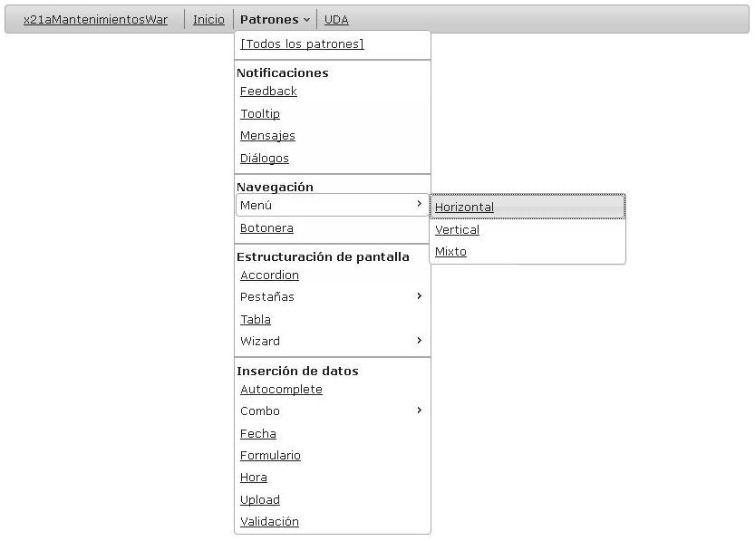
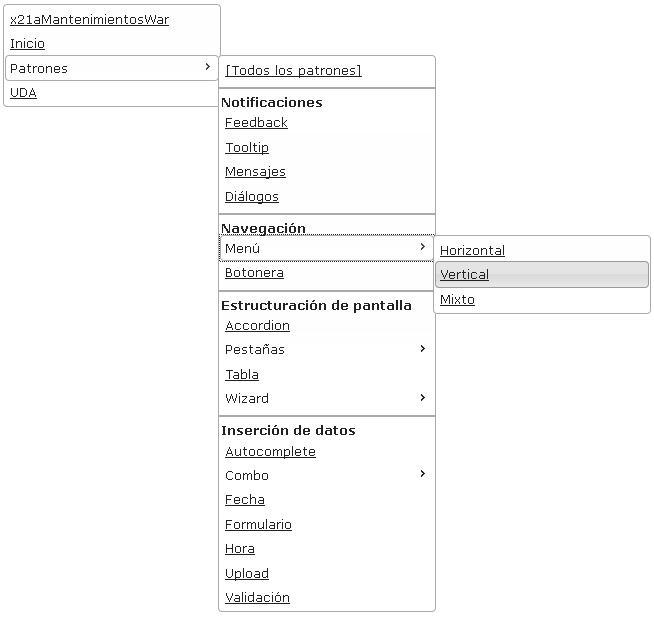
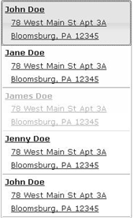
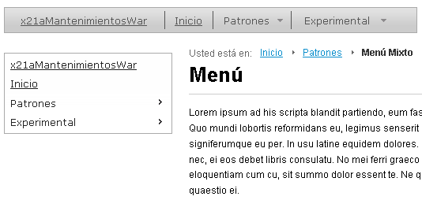
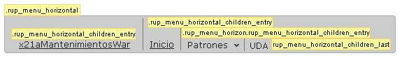

#	Componentes RUP – Menú

<!-- MDTOC maxdepth:6 firsth1:1 numbering:0 flatten:0 bullets:1 updateOnSave:1 -->

   - [1   Introducción](#intro)   
   - [2   Ejemplo](#ejemplo)   
   - [3   Casos de uso](#casos-de-uso)   
   - [4   Infraestructura](#infraestructura)   
   	- [4.1 Ficheros](#ficheros)
   	- [4.2 Dependencias](#dependencias)      	  
   	- [4.3 Versión minimizada](#v-minimizada)   
   - [5   Invocación](#invocac)   
      - [5.1 Modo de definición por html](#html)
   - [6 API](#api)   
   - [7    Menú mixto](#mixto)   
   - [8   Sobreescritura del theme](#theme)
   - [9  Internacionalización (i18n)](#i18n)    
   - [10   Integración con UDA](#uda)   
   - [11 Formato de las urls](#url)   

<!-- /MDTOC -->

<a id="intro"></a>
##	1	Introducción
La descripción del ***Componente Menú*** visto desde el punto de vista de **RUP** es la siguiente:
*Menú de la aplicación mantenido a lo largo de todas las páginas de forma consistente que muestra entradas directas a secciones clave de la aplicación
*

<a id="ejemplo"></a>
##	2	Ejemplo
Se presentan a continuación un ejemplo del componente:

+	**Menú horizontal**:


+	**Menú vertical**:


<a id="casos-de-uso"></a>
##	3	Casos de uso
Se recomienda el uso del componente:
+	Cuando exista un sitio web estructurado jerárquicamente y relativamente amplio.

+	Cuando se desee facilitar y agilizar la navegación y dar contexto al usuario.

<a id="infraestructura"></a>
##	4	Infraestructura
A continuación se comenta la infraestructura necesaria para el correcto funcionamiento del componente.
+	Se requiere la inclusión de los ficheros que implementan el componente *(js y css)* comentados en los apartados *Ficheros y Dependencias*.

+	Se requiere un fichero que defina la estructura del menú. Dicha definición podrá ser implementada como parámetro en la declaración del menú o como estructura *html* en la pagina que lo alberge.

<a id="ficheros"></a>
###	4.1	Ficheros
Ruta Javascript: rup/scripts/
Fichero de plugin: **rup.menu-x.y.z.js**
Ruta theme: rup/basic-theme/
Fichero CSS del theme: **theme.rup.menu-x.y.z.css**


<a id="dependencias"></a>
###	4.2	Dependencias
Por la naturaleza de desarrollo de los componentes (patrones) como *plugins* basados en la librería *JavaScript* ***jQuery***, es necesaria la inclusión del esta. La versión elegida para el desarrollo ha sido la versión **1.12.4**.
+	**jQuery 1.12.4**: http://jquery.com/

La gestión de la ciertas partes visuales de los componentes, se han realizado mediante el *plugin* ***jQuery UI*** que se basa en *jQuery* y se utiliza para construir aplicaciones web altamente interactivas. Este *plugin*, proporciona abstracciones de bajo nivel de interacción y animación, efectos avanzados de alto nivel, componentes personalizables (estilos) ente otros. La versión utilizada en el desarrollo ha sido la **1.12.0**.
+	**jQuery UI 1.12.0**: http://jqueryui.com/

Los ficheros necesarios para el correcto funcionamiento del componente son:

    jquery-1.12.4.js
	jquery-ui-1.12.0.custom.js
	jquery-ui-1.12.0.custom.css
	jquery.ui.menu.js
	jquery.ui.core.menu.js
	jquery.ui.position.menu.js
	jquery.ui.widget.menu.js
	rup.utils-x.y.z.js
	rup.base-x.y.z.js
	rup.compatibility-x.y.z.js
	rup.menu-x.y.z.js
    theme.rup.menu-x.y.z.js

<a id="v-minimizada"></a>
###	4.3	Versión minimizada

A partir de la versión v2.4.0 se distribuye la versión minimizada de los componentes **RUP**. Estos ficheros contienen la versión compactada y minimizada de los ficheros *javascript* y de estilos necesarios para el uso de todos los compontente **RUP**.
Los ficheros minimizados de **RUP** son los siguientes:
+	**rup/scripts/min/rup.min-x.y.z.js**
+	**rup/basic-theme/rup.min-x.y.z.css**

Estos ficheros son los que deben utilizarse por las aplicaciones. Las versiones individuales de cada uno de los componentes solo deberán de emplearse en tareas de desarrollo o depuración.

<a id="invocac"></a>
##	5	Invocación
Por cuestiones de optimización y seguridad, asociadas a la protección de los menús, el patrón a sido rediseñado para trabajar a partir de una estructura *html* que determine sus diferentes entradas y funcionalidades. Para mantener la retro-compatibilidad, el patrón sigue disponiendo del modelo antiguo de definición.

La configuración del componente menú se compone de dos partes fundamentales, por un lado, se tiene la definición *html* y, por el otro lado, la especificación de parámetros mediante *JavaScrpt*. Según el tipo de modo de definición que se use, el peso de una u otra parte variará sustancialmente.

El componente, en si mismo, es creado por el *wizard* de generación de proyectos. Dicho *plugin* introduce el patrón en el *layout* correspondiente con la siguiente nomenclatura *(War\WebContent\WEB-INF\layouts\menu.jsp)*.
```xml
<div id="x21aPilotoPatronesWar_menu" class="menu"></div>
```
Se crea una capa *(div)* cuyo identificador será el nombre del *War* (xxxYyyWar) seguido de “_menu” cuya clase asociada es “menu” para los estilos.
En el caso de necesitarse la definición de un menú mixto en la aplicación, se creará una *jsp* adicional *“menuMixto.jsp”* con el siguiente código:
```xml
<div id="x21aPilotoPatronesWar_menu_mixto" class="menu"></div>
```
Una vez definida la parte *html*, se especifica en el fichero *“_layoutLoader.js”* la parte *javaScript*:
```javascript
$("#idMenu").rup_menu(properties);
```
El parámetro *“properties”* representa el conjunto de parámetros usados para definir el comportamiento del menú. Según el modo empleado, los datos empleados para definir el comportamiento diferirán cuantiosamente. El parámetro en si, puede declararse mediante un objeto *(var properties = {};)* o bien directamente especificando los valores.

<a id="html"></a>
###	5.1	Modo de definición por html
Este modo de definición, se basa en la idea de maximizar la interpretación del html, en detrimento del javaScript, para especificar las características aplicadas al componente.
La idea es sencilla, la estructura del menú será definida, lo más posible, mediante tags html que portaran estilos y características precisas para componer el menú. La parte html será completada mediante una serie de parámetros *JavaScript*:

+	**verticalWidth**: Valor asociado a cada menú que determinara la anchura vertical del mismo. Este parámetro tiene cabida, tanto, en menús verticales, como, en menús horizontales (al fin y al cabo los dos tienen partes verticales). En caso de no especificar ningún valor, cada uno de los submenús verticales se ajustara al ancho máximo de sus literales.
+	**display**: Orientación del menú: horizontal o vertical. Por defecto horizontal.
+	**i18nId**: Indica el identificador del objeto JSON para la resolución de los literales del componente. En caso de no definirse se tomará el ID del objeto sobre el que se crea el componente.
+	**menus**: Parámetro que determina el tag de html que hará de padre para determinar las entradas del menú (tanto para las entradas normales como para las de los submenús). Su valor por defecto es *‘ul’*

Para componer la estructura *html* de un menú, se han de tener muy presentes las estructuras que se pueden usar y la forma en que se aplican. Lo primero es determinar cual va ser el *tag*, por defecto, que hará las veces de entrada del menú (tanto simple como con submenú). El valor por defecto de esta es *“ul”* (parámetro **menús**) y, ante lo apropiada que es para dicha tarea, se va a utilizar como base en los ejemplos y descripciones de los elementos (esto no quita el que se pudiera usar un tag diferente como un *“div”* o cualquier otro).


```xml
<div class="rup_invisible_menu" id="x21aPilotoPatronesWar_menu_mixto">
   <div class="address-item">
      <a href="#">
         <span class="address-header">John Doe</span>
         <span class="address-content">78 West Main St Apt 3A</span>
         <span class="address-content">Bloomsburg, PA 12345</span>
      </a>
   </div>
   <div class="address-item">
      <a href="#">
         <span class="address-header">Jane Doe</span>
         <span class="address-content">78 West Main St Apt 3A</span>
         <span class="address-content">Bloomsburg, PA 12345</span>
      </a>
   </div>
   <div class="address-item ui-state-disabled">
      <a href="#">
         <span class="address-header">James Doe</span>
         <span class="address-content">78 West Main St Apt 3A</span>
         <span class="address-content">Bloomsburg, PA 12345</span>
      </a>
   </div>
   <div class="address-item">
      <a href="#">
         <span class="address-header">Jenny Doe</span>
         <span class="address-content">78 West Main St Apt 3A</span>
         <span class="address-content">Bloomsburg, PA 12345</span>
      </a>
   </div>
   <div class="address-item">
      <a href="#">
         <span class="address-header">John Doe</span>
         <span class="address-content">78 West Main St Apt 3A</span>
         <span class="address-content">Bloomsburg, PA 12345</span>
      </a>
   </div>
</div>
```

El padre, o *tag* padre, que albergara el menú, será el primer elemento que se ha de crear. Dicho *tag* contendrá todo el y será el que se deba invocara a la hora de ejecutar el *javaScript*. Para la mejor visualización del menú, ya que quita efectos perniciosos de composición, es recomendable asignarle al padre la clase *“rup_invisible_menu”*. Esta clase, mejorara la composición de la página ya que minimizara la visibilidad del menú sin terminar.
```xml
<ul id="x21aPilotoPatronesWar_menu"	class="rup_invisible_menu">
</ul>
```
```javascript
jQuery("#x21aPilotoPatronesWar_menu").rup_menu({
      display: (vertical ? 'vertical' : 'horizontal'),
      verticalWidth: "16.5em"
});
```

Con el esqueleto creado, el siguiente paso es ir colocando las distintas entradas del menú. Para ello se pueden utilizar diferentes tipos de entradas:
+	**Entradas básicas**: Cosiste en el elemento básico de un menú. Cada una de estas entradas deberá incluir un tag ‘a’, que albergara la redirección del menú, y un tag de mensajes que mantenga la internacionalización (``` ‘<spring:message>’```). La especificación de las rutas (*urls*), se puede hacer de forma relativa o de forma absoluta (véase el capítulo 9. Formato de las *urls*). Si se precisara de la apertura de una nueva ventana, al tag *‘a’* se le debería añadir *target="_blank"*. Todas las entradas de este tipo, serán indicadas mediante el icono *“external link”*.
```xml
<li>
   <a href="/x21aPilotoPatronesWar/../x21aMantenimientosWar/" >
      <spring:message code="mantenimientos" />
   </a>
</li>
```


+	**Entradas múltiples (submenús)**: Tipo de entrada capaz de albergar múltiples entradas de menú. Se representa mediante un desplegable que alberga dichas entradas. Dicho desplegable requiere de un literal, representado por un tag ‘a’ que contiene un tag de mensajes que mantenga la internacionalización (```‘<spring:message>’```). A continuación se incluirá un elemento padre, o tag padre, que albergara al submenú como si este fuera uno totalmente independiente. Las posibles entradas utilizables son las mismas que en el caso inicial.
```xml
<li>
   <a>
      <spring:message code="administracion" />
   </a>
   <ul>
      <li>
         <a href="/x21aMantenimientosWar/administracion/alumno/maint">
            <spring:message code="Alumno" />
         </a>
         .
         .
         .
      </li>
   </ul>
</li>
```

•	**Separador**: El tipo de entrada separadora es aquella que ha sido diseñada para separar y ordenar varias entradas de menú. Se pueden utilizar dos tipos de separadores. Por un lado se tendrían los separadores lineales y por otro los separadores de cabecera. El separador lineal es únicamente una línea divisora que permite ordenar la distribución de las entradas y el divisor de cabecera es un literal que permite ilustrar el grupo de entradas. Una entrada cualquiera será separador lineal, si esta alberga las clases *‘ui-widget-content’* y *‘ui-menu-divider’*. El separador de cabecera debe albergar un *tag ‘strong’* que a su vez contenga un tag de mensajes que mantenga la internacionalización (```‘<spring:message>’```).
```xml
<li class="ui-widget-content ui-menu-divider"></li>
<li><strong><spring:message code="titulo-notifi" /></strong></li>
```

+	**Entradas con iconos**: Cualquier entrada, a excepción de los separadores, pueden albergar un icono. Para ello solo será necesario que la entrada disponga de la clase *‘ui-icon’* y otra clase con el icono asociado a la entrada del menú. El componente puede albergar cualquier icono pero se ha de tener en cuenta que el tamaño de los mismo no puede ser superior a 256 x 240 (tamaño asociado a los iconos de los *sprites* de *JQuery-UI*). Un tamaño superior supondría que se descuadraran las entradas del menú (no quedarían bien los estilos).
```xml
<li>
   <a href="#"><span class="ui-icon ui-icon-wrench"></span>Delphi</a>
   <ul>
      <li><a href="#">Ada</a></li>
      <li><a href="#">Saarland</a></li>
      <li><a href="#">Salzburg</a></li>
   </ul>
</li>
```
+	**Entradas deshabilitadas**: Cualquier entrada, a excepción de los separadores, pueden comenzar configuradas como entradas deshabilitadas. Para ello cada entrada deshabilitada, únicamente, debe contener la clase *‘ui-state-disabled’*. El estado deshabilitado puede ser variado mediante las funciones enable y disable del componente.
```xml
<li class="ui-state-disabled">
   <a href="/x21aPilotoPatronesWar/patrones/tabsAjax">
      <spring:message code="tabsAjax" />
   </a>
</li>
```
+	**Entradas con seguridad**: Una de las principales novedades que presenta el menú en su versión 2.0.0 es, facilitar la aplicación de seguridad a las distintas entradas del menú. La idea aplicada es bien sencilla, partiendo del modulo de seguridad aportado por spring-security, se pueden aplicar los *tags* que este dispone a las entradas de menú para que aparezcan o no según el usuario. Este formato de seguridad en los menús, permite darle una lógica de presentación a los menús cuando la *jsp* que los alberga es servida. El modo de funcionamiento de *Spring-security* en la capa de presentación es bien sencillo. Mediante los *tag* específicos que el distribuye, permite acotar áreas de *html* que van a ser visualizadas en función de unos criterios de seguridad. Dichos criterios, pueden pasan por la disposición de un role especifico de seguridad o por la simple capacidad de logarte en el sistema. Las alternativas son variadas, por lo que se recomienda la visualización de la documentación de *Spring-Security* para tal efecto (19. [JSP Tag Libraries](http://docs.spring.io/spring-security/site/docs/3.0.x/reference/taglibs.html)).
```xml
<sec:authorize access="hasRole('ROLE_X21A-IN-0003')">
   <li>
      <a>
         <spring:message code="experimental" />
      </a>
      <ul>
         <li>
            <a href="/x21aPilotoPatronesWar/experimental/maestro_detalle">
               <spring:message code="maestro_detalle" />
            </a>
         </li>
         .
         .
         .
         <li>
            <a href="/x21aPilotoPatronesWar/experimental/z-index">
               <spring:message code="z-index" />
            </a>
         </li>
      </ul>
   </li>
</sec:authorize>
```
Según el código presentado, un poco mas arriba, la entrada múltiple (submenú) ‘experimental’ no será visualizada a no ser que el usuario que este accediendo este logado en la aplicación y disponga del *‘ROLE_X21A-IN-0003’*.

Como nota final, es interesante comentar que, el *tag* *‘accesscontrollist’* de *Spring-Security* no puede ser utilizado, ya que esa diseñado para el modulo de seguridad *ACL* y este no esta siendo utilizado, actualmente, en **UDA**.

<a id="api"></a>
## 6	 API
Para ver en detalle la API del componente vaya al siguiente [documento](../api/rup.menu.md).

<a id="mixto"></a>
## 7	Menú mixto

De acuerdo a los tipos de menú considerados en el Libro de Estilo de Gobierno Vasco se da la posibilidad de la utilización de una disposición mixta del mismo.

El menú mixto consiste en la combinación de un menú con disposición horizontal y otro con disposición vertical. De este modo es posible, por ejemplo, organizar mediante el menú vertical acciones funcionales sobre el contenido de las pantallas a las que se accede a través del menú horizontal.

Un ejemplo de la visualización de un menú mixto sería el siguiente.




Para la creación de un menú de estas características es necesario definir:
1.	Un *layout* que estructure la pantalla de forma adecuada para albergar ambos menús. El *layout* se definirá mediante una template y la inclusión de las definiciones correspondientes en el fichero *tiles.xml* (p.e. templateMixto.jsp).
2.	Dos capas, una por cada disposición del menú, sobre las que se generarán las estructuras correspondientes.
•	menu.jsp:
```xml
<div id="x21aDemoWAR_menu" class="menu"></div>
.
.
.
</div>
```
•	menuMixto.jsp
```xml
<div id="x21aDemoWAR_menu_mixto" class="menu">
.
.
.
</div>
```
3.	Por último se crearán ambos menús.

```javascript
var vertical = false, mixto = false;
if ($.rup.LAYOUT === "vertical") {
vertical = true;
} else if ($.rup.LAYOUT === "mixto") {
mixto = true;
}

$("#x21aPilotoPatronesWar_menu").rup_menu({
display: (vertical ? 'vertical' : 'horizontal'),
});

if (mixto) {
$("# x21aPilotoPatronesWar_menu_mixto").rup_menu({
display: (vertical ? 'vertical':'horizontal'),
});
```

<a id="theme"></a>
##	8	Sobreescritura del theme
El componente menu se presenta con una apariencia visual definida en el fichero de estilos **theme.rup.menu-x.y.z.css**.

Si se quiere modificar la apariencia del componente, se recomienda redefinir el/los estilos necesarios en un fichero de estilos propio de la aplicación situado dentro del proyecto de estáticos *(codAppStatics/WebContent/codApp/styles)*.

Los estilos del componente se basan en los estilos básicos de los widgets de *jQuery UI*, con lo que los cambios que se realicen sobre su fichero de estilos manualmente o mediante el uso de la herramienta [Theme Roller](http://jqueryui.com/themeroller/) podrán tener repercusión sobre todos los componentes que compartan esos mismos estilos (pudiendo ser el nivel de repercusión general o ajustado a un subconjunto de componentes).
A continuación se muestran unas capturas del componente con los estilos asociados dependiendo del uso de imágenes. Los estilos que contengan la palabra *“ui-“* son los propios de *jQuery UI* que en caso de ser necesario serán sobrescritos y no se comentarán en este documento por no ser su ámbito.


+	**Menú horizontal**:

	+	**.rup_menu_horizontal**: Estilo asociado al menú en posición horizontal.
	+	**.rup_menu_horizontal_children_entry**: Estilo aplicado a todas las entradas, menos la ultima,  del menú horizontal.
	+	**.rup_menu_horizontal_children_entry_last**: Estilo aplicado a la ultima entrada del menú horizontal. Esta diferencia de estilos se debe a la excepción visual que representa ser la ultima entrada.
	+	**.rup_menu_horizontal_childrenMenuIcon**: Estilo asociado a la imagen que indica que la entrada de menú es múltiple (submenú).
	+	**.ui state disabled**: Estilo de *JQuery-UI* que indica entrada deshabilitada.


+	**Menú vertical**:

	+	**.rup_menu_vertical**: Estilo asociado al menú en posición vertical.
	+	**.rup_menu_vertical_children**: Estilo aplicado a todas las entradas del menú vertical.
	+	**.ui state disabled**: Estilo de *JQuery-UI* que indica entrada deshabilitada.

<a id="i18n"></a>
## 9	Internacionalización (i18n)
Según el modo que se este utilizando para configurar y ejecutar el componente, la responsabilidad de mantener y respetar los literales, según se este en un lenguaje u otro, recae en diferentes elementos de la aplicación.

En caso de usarse el modo de definición por *html*, la internacionalización deberá llevarse a cabo en las *jsp’s* y, por tanto, deberá ser gestionado por los *tag’s* (```‘<spring:message>’```) asociados al gestor de mensajes de *Spring*. Los ficheros de recursos, a nivel de aplicación (*EAR*) o a nivel de modulo web (*WAR*), deberán albergar los diferentes literales, en los diferentes idiomas, del menú como si de cualquier otro elemento de una *jsp* se tratara.

En caso de usarse el modo de definición por parámetros, la internacionalización se realiza mediante el fichero de recursos que se encontrará en la parte estática bajo *codAplic/resources/codAplic.i18n.json* (con sus variantes según idioma ej: *codAplic/resources/codAplic.i18n_es.json*). En dicho fichero se deberá declarar el objeto *JSON* con una estructura como la siguiente:

```javascript
"x21aPilotoPatronesWar_menu" : {
		"inicio" : "Inicio",
		"mantenimientos" : "x21aMantenimientosWar",
		"patrones" : "Patrones",
			"all" : "[Todos los patrones]",
			"autocomplete" : "Autocomplete",
			"toolbar" : "Botonera",
			"combo" : "Combo",
				"comboSimple" : "Combo Simple",
				"comboEnlazadoSimple" : "Combo Enlazado (simple)",
				"comboEnlazadoMulti" : "Combo Enlazado (múltiple)",
			"dialog" : "Diálogos",
			"date" : "Fecha",
			"feedback" : "Feedback",
			"time" : "Hora",
			"message" : "Mensajes",
			"menu" : "Menú",
				"menuHorizontal":"Horizontal",
				"menuVertical":"Vertical",
				"menuMixto":"Mixto",
			"tabs" : "Pestañas",
			"grid" : "Tabla",
			"tooltip" :  "Tooltip",
		"experimental": "Experimental",
			"generic_object": "Objeto genérico",
			"maestro_detalle": "Maestro-Detalle",
			"z-index": "z-index"
	}

```

Es importante tener en cuenta que, la ubicación de los recursos lingüísticos (literales), según el modo de configurar del menú, varía y puede provocar que los literales puedan estar duplicados. Ante esta circunstancia, es razonable utilizar un solo modo de definición para todos los menús de una aplicación. Considerando que el modo por *html* va a prevalecer frente al otro (deprecado), es razonable pensar que si es necesario migrar o crear algún menú en el modo *html*, se migren o creen todos los menús en dicho modo.

<a id="uda"></a>
##	10	Integración con UDA
Por cuestiones funcionales, en la evolución RUP, ha sido necesario cambiar el nombre y el comportamiento asociado al atributo (*url*) que determina la ruta a la que se redirige la aplicación.

Inicialmente, el nombre de dicho atributo era *url* y su comportamiento no se ajustaba al estándar de manejo de rutas. Con la aparición del nuevo parámetro (*pathUrl*) y de las nuevas funcionalidades asociadas al mismo (*newWindow, forceAbs*), el parámetro *url* y su comportamiento quedan deprecados (a partir de la versión 1.2.1).

Por cuestiones de compatibilidad con versiones anteriores, se seguirá respetando el comportamiento del atributo *url* en la actualización de la versión de **RUP**. Pero en el desarrollo de nuevos menús se debe tener en cuenta que se trata de un atributo deprecado, por lo que no soportará nuevas funcionalidades que se puedan desarrollar sobre el menú (debiendo usarse el atributo *pathUrl*).

<a id="url"></a>
##	11	Formato de las urls
El componente menú, al igual que muchos otros mecanismos asociados al ámbito *web*, al tratar *urls* debe respetar las recomendaciones marcadas por el estándar (*http://www.w3.org/Addressing/*) definidas para el manejo de dichos mecanismos.

Las *urls*, generalmente, se pueden dividir en dos tipos básicos: absolutas y relativas. En general, cualquiera de los dos tipos se puede usar, indistintamente, en links de cualquier sitio web.

El componente menú respeta y mantiene los estándares asociados al entorno *web*; por lo que, para especificar las rutas a las que hace la redirección cada entrada del menú, se puede usar, indistintamente, el tipo de rutas relativas y absolutas.

Para aclarar la forma de uso de cada tipo de ruta (*url*), a continuación, se presenta un ejemplo con los distintos formatos y las rutas (*urls*) resultantes a partir de ellos:

Partiendo de la url:  http://desarrollo.jakina.ejiedes.net:7001/x21aMantenimientosWar/usuario/multi

**Relativas**:

about.html 	=> http://desarrollo.jakina.ejiedes.net:7001/x21aMantenimientosWar/usuario/about.html
tuto1/ => http://desarrollo.jakina.ejiedes.net:7001/x21aMantenimientosWar/usuario/tuto1/
tuto2.html => http://desarrollo.jakina.ejiedes.net:7001/x21aMantenimientosWar/usuario/tuto2.html
/ => http://desarrollo.jakina.ejiedes.net:7001/
/experts/ => http://desarrollo.jakina.ejiedes.net:7001/experts/
//www.internet.com/ => http://www.internet.com/
// => http://
../ => http://desarrollo.jakina.ejiedes.net:7001/x21aMantenimientosWar/
../experts/ => http://desarrollo.jakina.ejiedes.net:7001/x21aMantenimientosWar/experts/
..experts/ => http://desarrollo.jakina.ejiedes.net:7001/x21aMantenimientosWar/experts/
../../../ => http://desarrollo.jakina.ejiedes.net:7001/
../../ => http://desarrollo.jakina.ejiedes.net:7001/
../../../../ => http://desarrollo.jakina.ejiedes.net:7001/
../../../../great.html => http://desarrollo.jakina.ejiedes.net:7001/great.html
./ => http://desarrollo.jakina.ejiedes.net:7001/x21aMantenimientosWar/usuario/
./about.html => http://desarrollo.jakina.ejiedes.net:7001/x21aMantenimientosWar/usuario/about.html


**Absolutas**:

http://www.jakina.net /x21aPilotoPatronesWar/ => http://www.jakina.net/x21aPilotoPatronesWar/
