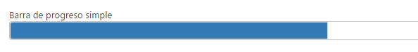

#	Componentes RUP – Barra de progreso


<!-- MDTOC maxdepth:6 firsth1:1 numbering:0 flatten:0 bullets:1 updateOnSave:1 -->

   - [1 Introducción](#1-introducción)   
   - [2 Ejemplo](#2-ejemplo)   
   - [3 Casos de uso](#3-casos-de-uso)   
   - [4 Infraestructura](#4-infraestructura)   
      - [4.1 Ficheros](#4.1-ficheros)   
      - [4.2 Dependencias](#4.2-dependencias)   
      - [4.3 Versión minimizada](#4.3-versión-minimizada)   
   - [5 Invocación](#5-invocación)   
   - [6 API](#6-api)   

<!-- /MDTOC -->

## 1 Introducción
La descripción del Componente Barra de progreso, visto desde el punto de vista de **RUP**, es la siguiente:

*Este componente es un control gráfico para mostrar visualmente la progresión de una operación.
*


## 2 Ejemplo
Se presentan a continuación un ejemplo de este componente:



## 3 Casos de uso
Se aconseja la utilización de este componente:

+	Cuando se quiere mostrar al usuario que una operación está siendo realizada.

+	Para mostrar visualmente la situación y el tiempo restante de una operación realizada por el usuario.

## 4 Infraestructura
A continuación se comenta la infraestructura necesaria para el correcto funcionamiento del componente.

* Únicamente se requiere la inclusión de los ficheros que implementan el componente *(js y css)* comentados en los apartados *Ficheros y Dependencias*.

### 4.1 Ficheros

- Ruta Javascript: rup/scripts/
- Fichero de plugin: **rup.progressbar-x.y.z.js**


### 4.2 Dependencias

Por la naturaleza de desarrollo de los componentes (patrones) como *plugins* basados en la librería *JavaScript* **jQuery**, es necesaria la inclusión de esta como capa base. La versión elegida para el desarrollo ha sido la **1.12.4**.
* **jQuery 1.12.4**: http://jquery.com/

La gestión de ciertas partes visuales de los componentes, se han realizado mediante el *plugin* **jQuery-UI** que se basa en *jQuery* y se utiliza para construir aplicaciones web altamente interactivas. Este *plugin*, entre otras cosas, proporciona abstracciones de bajo nivel de interacción y animación, efectos avanzados de alto nivel y componentes personalizables (estilos). La versión utilizada en el desarrollo ha sido la **1.12.0**.

* **jQuery-UI 1.12.0**: http://jqueryui.com/

Los ficheros necesarios para el correcto funcionamiento del componente son:

    jquery-1.12.4.js
    jquery-ui-1.12.0.custom.js
    jquery-ui-1.12.0.custom.css
    rup.base-x.y.z.js
    rup.progressbar-x.y.z.js

### 4.3 Versión minimizada

A partir de la versión v2.4.0 se distribuye la versión minimizada de los componentes **RUP**. Estos ficheros contienen la versión compactada y minimizada de los ficheros javascript y de estilos necesarios para el uso de todos los compontente **RUP**.

Los ficheros minimizados de RUP son los siguientes:
* **rup/scripts/min/rup.min-x.y.z.js**
* **rup/css/rup.min-x.y.z.css**

Estos ficheros son los que deben utilizarse por las aplicaciones. Las versiones individuales de cada uno de los componentes solo deberán de emplearse en tareas de desarrollo o depuración.


##	5 Invocación

Este componente se invocará mediante un selector de un *tag* `div` del *html* que indicará sobre que capa se va a aplicar el componente *barra de progreso*. Lo más fácil sería utilizar el selector siguiente:
```javascript
$(selector).rup_progressbar(properties);
```

Donde el parámetro *“properties”* es un objeto *(var properties = {};)* o bien directamente la declaración de los valores, detallados en el siguiente apartado.

## 6 API

Para ver en detalle la API del componente vaya al siguiente [documento](../api/rup.progressbar.md).
