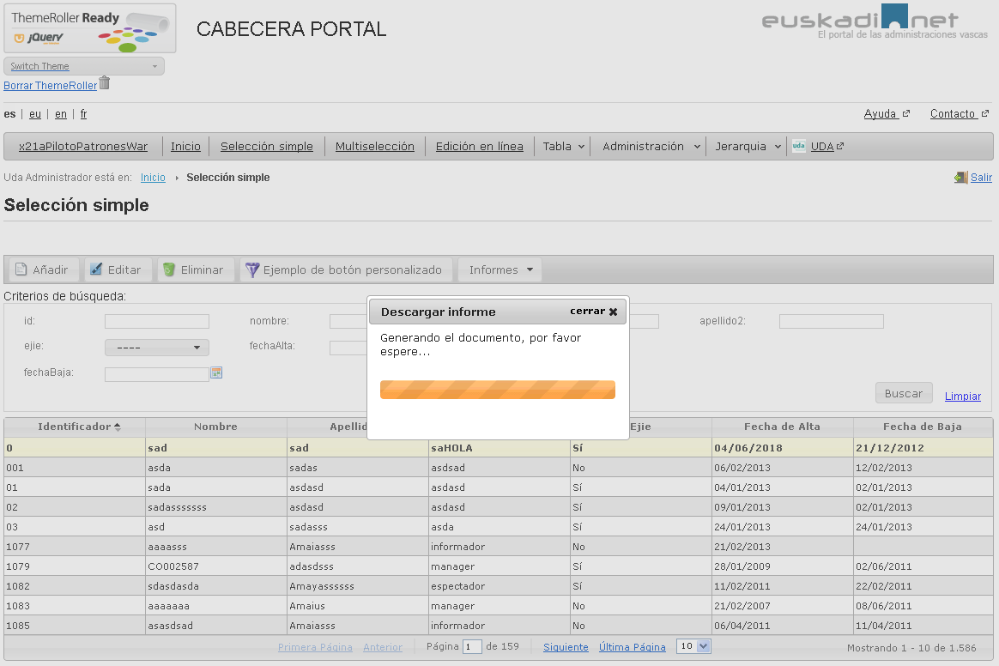

#	Componentes RUP – Report

<!-- MDTOC maxdepth:6 firsth1:1 numbering:0 flatten:0 bullets:1 updateOnSave:1 -->

   - [1   Introducción](#1-introducción)   
   - [2   Ejemplo](#2-ejemplo)   
   - [3   Casos de uso](#3-casos-de-uso)   
   - [4   Infraestructura](#4-infraestructura)   
      - [4.1 Ficheros](#4.1-ficheros)   
      - [4.2 Dependencias](#4.2-dependencias)   
      - [4.3 Versión minimizada](#4.3-versión-minimizada)   
   - [5   Invocación](#5-invocación)   
   - [6 API](#6-api)   
   - [7   Sobreescritura del theme](#7-sobreescritura-del-theme)   
   - [8   jQuery File Download](#8-jquery-file-download)   

<!-- /MDTOC -->


##	1	Introducción
La descripción del ***Componente Report***, visto desde el punto de vista de *RUP*, es la siguiente:
*El objetivo principal del componente es mejorar la experiencia del usuario a la hora de generar informes mediante la presentación de diálogos de espera.*

##	2	Ejemplo
Se presentan a continuación un ejemplo de este componente:




##	3	Casos de uso
Se recomienda el uso del componente:
+	Cuando se desea generar un informe y descargarlo.

+	Cuando se desea añadir un botón a una capa, botonera o mbutton para descargar informe.

##	4	Infraestructura
A continuación se comenta la infraestructura necesaria para el correcto funcionamiento del componente.
+	Únicamente se requiere la inclusión de los ficheros que implementan el componente (*js y css*) comentados en los apartados *Ficheros y Dependencias*.

###	4.1	Ficheros
Ruta Javascript: rup/scripts/
Fichero de plugin: **rup.report -x.y.z.js**
Ruta theme: rup/css/
Fichero CSS del theme: **theme.rup.report - x.y.z.css**

###	4.2	Dependencias
Por la naturaleza de desarrollo de los componentes (patrones) como *plugins* basados en la librería *JavaScript* ***jQuery***, es necesaria la inclusión del esta. La versión elegida para el desarrollo ha sido la versión **3.4.1**.
•	**jQuery 3.4.1**: http://jquery.com/

La gestión de los diálogos se realiza mediante el ***jQuery File Download Plugin v1.3.3***,
•	**jquery.fileDownload.js**

Adicionalmente se utiliza el componente **rup.toolbar** para la gestión de botones.

Los ficheros necesarios para el correcto funcionamiento del componente son:

    jquery-3.4.1.js
	jqGrid-4.4.1.js
	rup.base-x.y.z.js
	rup.toolbar-x.y.z.js
	rup.report-x.y.z.js
	theme.rup.toolbar-z.y.z.css
	theme.rup.report-z.y.z.css

###	4.3	Versión minimizada

A partir de la versión v2.4.0 se distribuye la versión minimizada de los componentes RUP. Estos ficheros contienen la versión compactada y minimizada de los ficheros javascript y de estilos necesarios para el uso de todos los compontente RUP.

Los ficheros minimizados de RUP son los siguientes:
+	**rup/scripts/min/rup.min-x.y.z.js**
+	**rup/css/rup.min-x.y.z.css**

Estos ficheros son los que deben utilizarse por las aplicaciones. Las versiones individuales de cada uno de los componentes solo deberán de emplearse en tareas de desarrollo o depuración.

##	5	Invocación

Este componente se invocará sin asociarlo directamente a un elemento, ya que el elemento al que asociar los botones será un objeto *HTML* ya existente. Por ejemplo:
```javascript
$.rup_report(properties);
```
Donde el parámetro *“properties”* es un objeto *( var properties = {}; )* o bien directamente la declaración de lo valores directamente. Sus posibles valores se detallan en el siguiente apartado.

##	6 API

Para ver en detalle la API del componente vaya al siguiente [documento](../api/rup.report.md).

##	7	Sobreescritura del theme
El componente report se presenta con una apariencia visual definida en el fichero de estilos ***theme.rup.report-x.y.z.css***.

En este fichero simplemente se definen los estilos para la barra de progreso en el diálogo de espera por defecto:
```css
.rup_report .ui-progressbar {
	height: 22px;
    margin-top: 2em;
    margin-bottom: 3em;
    width: 100%;
}

.rup_report .ui-progressbar-value {
	background: url(images/pbar-ani.gif);
}
```

##	8	jQuery File Download
El componente rup-report utiliza como plugin subyacente jQuery File Download que es el encargado de gestionar los diálogos correspondientes. Su funcionamiento se basa en detectar una cookie generada por el servidor que determina el final de la generación del informe. Los valores de la cookie por defecto son:
``javascript
            cookieName: "fileDownload",
            cookieValue: "true",
            cookiePath: "/",
 ```

Para más información acerca del funcionamiento del *plugin*:
http://johnculviner.com/post/2012/03/22/Ajax-like-feature-rich-file-downloads-with-jQuery-File-Download.aspx

Demos del funcionamiento del plugin: http://jqueryfiledownload.apphb.com/
