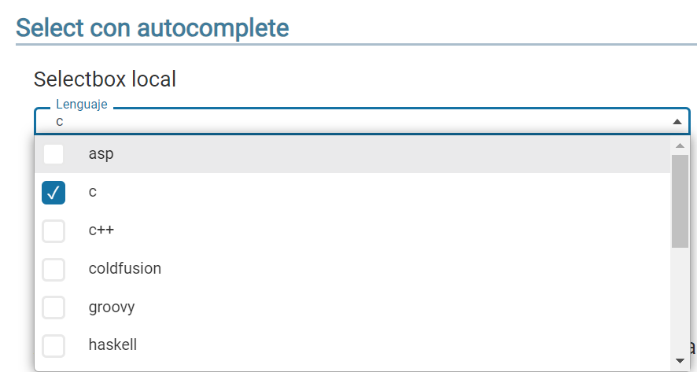

#	Componentes RUP – Select

<!-- MDTOC maxdepth:6 firsth1:1 numbering:0 flatten:0 bullets:1 updateOnSave:1 -->

-   [1 Introducción](#1-introducción)   
-   [2 Ejemplo](#2-ejemplo)   
-   [3 Casos de uso](#3-casos-de-uso)   
-   [4 Infraestructura](#4-infraestructura)   
    -   [4.1 Ficheros](#41-ficheros)   
    -   [4.2 Dependencias](#42-dependencias)   
    -   [4.3 Versión minimizada](#43-versión-minimizada)   
-   [5 Invocación](#5-invocación)   
-   [6 API](#6-api)   
-   [7 Sobreescritura del theme](#7-sobreescritura-del-theme)   
-   [8  Internacionalización (i18n)](#8-internacionalización-i18n)   
-   [9 Integración con UDA](#9-integración-con-uda)   
-   [10 Select Seelcts enlazados](#10-select selects-enlazados)
-   [11 Aspectos a tener en cuenta](#11-aspectos-a-tener-en-cuenta)

<!-- /MDTOC -->

## 1 Introducción

La descripción del Componente Select, visto desde el punto de vista de RUP, es la siguiente:

*En cuanto el usuario comienza a escribir una búsqueda se le sugieren búsquedas relacionadas con lo que ha escrito que pueden ser de su interés.*


## 2 Ejemplo

Se presentan a continuación un ejemplo de este componente:



## 3 Casos de uso

Se recomienda el uso del componente:

*   Cuando se desea mejorar la búsqueda ofreciendo sugerencias a los usuarios.

## 4 Infraestructura
A continuación se comenta la infraestructura necesaria para el correcto funcionamiento del componente.

*   Únicamente se requiere la inclusión de los ficheros que implementan el componente (js y css) comentados en los apartados Ficheros y Dependencias.

### 4.1 Ficheros

-   Ruta Javascript: rup/scripts/
-   Fichero de plugin: rup.select-x.y.z.js
-   Ruta theme: rup/css/
-   Fichero CSS del theme: theme.rup.select-x.y.z.css

### 4.2 Dependencias

Por la naturaleza de desarrollo de los componentes (patrones) como plugins basados en la librería JavaScript jQuery, es necesaria la inclusión de esta como capa base.
*   jQuery: <http://jquery.com/>

Los ficheros necesarios para el correcto funcionamiento del componente son:

*   jquery-3.y.z.js
*   rup.base-x.y.z.js
*   rup.select-x.y.z.js
*   theme.rup.select-x.y.z.css

### 4.3 Versión minimizada

A partir de la versión v2.4.0 se distribuye la versión minimizada de los componentes RUP. Estos ficheros contienen la versión compactada y minimizada de los ficheros javascript y de estilos necesarios para el uso de todos los compontente RUP.

Los ficheros minimizados de RUP son los siguientes:
*   rup/scripts/min/rup.min-x.y.z.js
*   rup/css/rup.min-x.y.z.css

Estos ficheros son los que deben utilizarse por las aplicaciones. Las versiones individuales de cada uno de los componentes solo deberán de emplearse en tareas de desarrollo o depuración.

## 5 Invocación

Este componente se invocará mediante un selector que indicará todos los elementos sobre los que se va a aplicar el componente select. Por ejemplo:

```js
$("#id_select").rup_select(properties);
```

Donde el parámetro “properties” es un objeto ( var properties = {}; ) o bien directamente la declaración de lo valores directamente. Sus posibles valores se detallan en el siguiente apartado.


1.  Se define el select sobre el que se aplica el componente:
```html
<select id=lenguaje name=lenguaje />
```
2.  Se invoca el componente sobre el select:
```js
$("#lenguaje").rup_select({...});
```
3.  Se modifica el código HTML y se convierte en:
```html
<select id=”lenguaje_label” name=”lenguaje_label” ruptype=”select”... />
```

## 6 API

Para ver en detalle la API del componente vaya al siguiente [documento](../api/rup.select.md).

## 7 Sobreescritura del theme

El componente select se presenta con una apariencia visual definida en el fichero de estilos **theme.rup.select-x.y.z.css**.

Si se quiere modificar la apariencia del componente, se recomienda redefinir el/los estilos necesarios en un fichero de estilos propio de la aplicación situado dentro del proyecto de estáticos (*codAppStatics/WebContent/codApp/styles*).

Ejemplo base de la estructura generada por el componente:

```html
<select id="selectRemoto" name="code" ruptype="select" data-select2-id="selectRemoto" tabindex="-1" class="select2-hidden-accessible" aria-hidden="true">
	<option value="" data-select2-id="18"></option>
	<option value="3" style="print" imgstyle="undefined" data-select2-id="63">Gipuzcoa</option>
</select>
<span class="select2 select2-container select2-container--default select2-container--below" dir="ltr" data-select2-id="17" style="width: 100%;">
	<span class="selection">
		<span class="select2-selection select2-selection--single" role="combobox" aria-haspopup="true" aria-expanded="false" tabindex="0" aria-disabled="false" aria-labelledby="select2-selectRemoto-container">
			<span class="select2-selection__rendered" id="select2-selectRemoto-container" role="textbox" aria-readonly="true" title="Gipuzcoa">
				<span class="select2-selection__clear" title="Remove all items" data-select2-id="65">×</span>
				<span>
					<i class="mdi mdi-print">Gipuzcoa</i>
				</span>
			</span>
			<span class="select2-selection__arrow" role="presentation"><b role="presentation"></b></span>
		</span>
	</span>
	<span class="dropdown-wrapper" aria-hidden="true"></span>
</span>
<label for="selectRemoto" class="select-material">Select remoto</label>
```

### 8 Internacionalización i18n
La internacionalización se realiza mediante el fichero de recursos definido para la aplicación que se encontrará en la parte estática bajo *codAplic/resources/codAplic.i18n.json* (con sus variantes según idioma ej: *codAplic/resources/codAplic.i18n_es.json*). En dicho fichero se deberá declarar un objeto JSON cuyo nombre sea el mismo que el id del elemento *html* sobre el que se aplica el componente.

Ejemplo:

```js
"lenguaje" : {
		"asp":"asp_es",
		"c":"c_es",
		"c++":"c++_es",
		"coldfusion":"coldfusion_es",
		"groovy":"groovy_es",
		"haskell":"haskell_es",
		"java":"java_es",
		"javascript":"javascript_es",
		"perl":"perl_es",
		"php":"php_es",
		"python":"python_es",
		"ruby":"ruby_es",
		"scala":"scala_es"
}
```

## 9 Integración con UDA
El componente Select permite recuperar los datos almacenados en base de datos. Para ello se requiere cierta configuración en el *Controller* al que se invoca.

Se deben declarar dos parámetros (que el componente envía automáticamente):
*   **q**: termino introducido en el buscador. El termino introducido podría contener comodines (wildcards) que podrían obtener datos no deseados como son el carácter “_” que equivale a cualquier carácter o el carácter “%” que equivale a cualquier literal. Por ello en la petición al servidor se envía escapados automáticamente. Ejemplo de una petición con los caracteres escapados:
```
http://localhost:7001/x21aDemoWAR/fase3/select/remote?q=\%\%\%\%&c=false
```
*   **autocomplete**: booleano para indicar que la busqueda será autocomplete en lugar de un select normal.
*   **combo**: booleano para indicar que el autocomplete contendrá también la funcionalidad del combo y solo aplica cuando la propiedad autocomplete está activa. En el *rup_autocomplete* esta propiedad se llamaba *combobox*.
*   **c**: booleano que determina si la búsqueda es del tipo “contiene” (true) o del tipo “empieza por” (false).

El *Service* que invoca el *Controller* tendrá el método **findAllLike (entidad, paginación, c)** (si se ha generado con el plugin UDA)  que se empleará para realizar la búsqueda. Sus parámetros son los siguientes:

*   **entidad**: objeto creado por el desarrollador que contendrá en el campo por el que se desea buscar el termino introducido:
```java
MiEntidad miEntidad = new Entidad();
miEntidad.setCampoBusqueda(q);
```
*   **paginación**: objeto empleado para hacer filtrados/paginaciones. En el ejemplo actual se manda *null* ya que no se requiere esta funcionalidad.
*   **c**: parámetro enviado por el componente que determina el tipo de búsqueda.

A continuación se muestra un ejemplo con select(se destacan con fondo gris los elementos a configurar):

```java
@RequestMapping(value = "select/remote", method=RequestMethod.GET)
	public @ResponseBody List<Patrones> getRemoteAutocomplete(
			@RequestParam(value = "q", required = true) String q,
			@RequestParam(value = "c", required = true) Boolean c){

		//Idioma
		Locale locale = LocaleContextHolder.getLocale();

		//Filtro según idioma
		Patrones patrones = new Patrones();
		if (com.ejie.x38.util.Constants.EUSKARA.equals(locale.getLanguage())){
			patrones.setDescEu(q);
		}else{
			patrones.setDescEs(q);
		}

		return patronesService.findAllLike(patrones, null, c);
	}
```

A continuación se muestra un ejemplo solo select(se destacan con fondo gris los elementos a configurar):

```java
    @Json(mixins = {@JsonMixin(target = Provincia.class, mixin = ProvinciaMixIn.class)})
    @RequestMapping(value = "comboSimple/remote", method = RequestMethod.GET)
    public @ResponseBody
    List<Provincia> getComboRemote() {
        try {
            Thread.sleep(1000);
        } catch (InterruptedException e) {
            e.printStackTrace();
        }
        return provinciaService.findAll(null, null);
    }
```

El método devuelve una lista de entidades en este caso *List<Patrones>* donde cada entidad tendrá todos y cada uno de los atributos cargados con los valores de la Base de Datos. Al devolver la lista con la anotación ```@ResponseBody```, entrará en funcionamiento *Jackson* (parseador de JSON de Spring) para convertir la lista JAVA en una lista JSON:

*   **JAVA**:

```
patronesList :
	patronesList [0]
                        code = Autocomplete
                        descEs = Autocomplete_es
                        descEu = Autocomplete_eu
                        css = filter
	patronesList [1]
                        code = Combo
                        descEs = Combo_es
                        descEu = Combo_eu
                        css = print
…
```
*   **JSON**:

```js
[
	{
    	code="Autocomplete",
    	descEs="Autocomplete_es",
		descEu="Autcomplete_eu",
        css="filter"
    },
	{
    	code="Combo",
        descEs="Combo_es",
		descEu="Combo_eu",  
        css="print"
   }
   ...
]
```

Como se ha explicado en anteriormente en el atributo **source** en el apartado 8 (propiedades) el componente requiere de una estructura de terminada para cargar el combo:
```js
[
	{text: "Autocomplete_es", id:"Autocomplete", style:"aaa"},
	{text: "Combo_es", id:"Combo ", style:"bbb"},
	{text: "Dialog_es", id:"Dialog", style:"ccc"},
	...
]
```

La traducción entre la estructura devuelta por el *controller* y la que espera el componente se realiza mediante un serializador propio de **UDA**.

Para que la serialización se realice correctamente, el componente envía en la petición una cabecera de **RUP** con la información necesaria para realizar la serialización.

```js
{"text":"descEs","id":"code","style":"css"}
```

**NOTA**: Al generar el código con el *plugin* de **UDA**, se añade este serializador para todos los objetos del modelo creados.

## 10 selects enlazados
Estos selects enlazados, pueden ser tanto locales como remotos. Para indicar que un select depende directamente de otro se utilizará el atributo ***parent***, que será un *array* con los identificador(es) del padre(s). Veamos un ejemplo:
```js
parent: ["departamento", "provincia"]
```
Las dependencias entre los selects pueden encadenarse de tal manera que se tenga un select que depende de otro select que a su vez depende de otro select y así sucesivamente (incluso se pueden combinar select locales con remotos indistintamente). Además, es posible que un select dependa a su vez de dos selects o más y no se cargarán ni se activarán hasta que todos sus padres hayan tomado un valor.

Al ser selects enlazados, si un select elimina su selección todos sus selects hijos se vaciarán y se deshabilitarán. Además, si un select se deshabilita (o se inicializa deshabilitado), todos sus hijos se cargarán, pero se mostrarán deshabilitados.

Cabe decir que en el atributo name de los campos definidos como parents de un select remoto, ha de definirse el nombre de la entidad, por ejemplo:
```html
<select id="padre" name="provincia" />
```

## 11 Aspectos a tener en cuenta
Cuando no se usen los formularios dinámicos de la tabla (propiedad `enableDynamicForms`), es necesario establecer el valor de la propiedad `menuAppendTo` del componente a **body** u otro elemento que no sea el por defecto (a continuación del componente). Esto evitará la creación de un scroll vertical interno en el formulario.