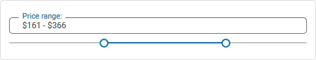

#	Componentes RUP – Deslizador


<!-- MDTOC maxdepth:6 firsth1:1 numbering:0 flatten:0 bullets:1 updateOnSave:1 -->

   - [1 Introducción](#1-introducción)   
   - [2 Ejemplo](#2-ejemplo)   
   - [3 Casos de uso](#3-casos-de-uso)   
   - [4 Infraestructura](#4-infraestructura)   
      - [4.1 Ficheros](#4.1-ficheros)   
      - [4.2 Dependencias](#4.2-dependencias)   
      - [4.3 Versión minimizada](#4.3-versión-minimizada)   
   - [5 Invocación](#5-invocación)   
   - [6 API](#6-api)   

<!-- /MDTOC -->

## 1 Introducción
La descripción del **Componente Deslizador**, visto desde el punto de vista de *RUP*, es la siguiente:

*El deslizador es una barra horizontal con un contol que puede ser movido, bien con el ratón o con el teclado.
*


## 2 Ejemplo
Se presentan a continuación un ejemplo de este componente:




## 3  Casos de uso
Se aconseja la utilización de este componente:

+	Cuando se desea que el usuario elija entre varios valores.


## 4	Infraestructura
A continuación se comenta la infraestructura necesaria para el correcto funcionamiento del componente.

* Únicamente se requiere la inclusión de los ficheros que implementan el componente (js y css) comentados en los apartados Ficheros y Dependencias.


### 4.1 Ficheros

- Ruta Javascript: rup/scripts/
- Fichero de plugin: **rup.slider-x.y.z.js**


### 4.2 Dependencias

Por la naturaleza de desarrollo de los componentes (patrones) como *plugins* basados en la librería *JavaScript* **jQuery**, es necesaria la inclusión de esta como capa base. La versión elegida para el desarrollo ha sido la **1.12.4**.
* **jQuery 1.12.4**: http://jquery.com/

La gestión de ciertas partes visuales de los componentes, se han realizado mediante el *plugin* **jQuery-UI** que se basa en *jQuery* y se utiliza para construir aplicaciones web altamente interactivas. Este *plugin*, entre otras cosas, proporciona abstracciones de bajo nivel de interacción y animación, efectos avanzados de alto nivel y componentes personalizables (estilos). La versión utilizada en el desarrollo ha sido la **1.12.0**.

* **jQuery-UI 1.12.0**: http://jqueryui.com/


Los ficheros necesarios para el correcto funcionamiento del componente son:

    jquery-1.12.4.js
    jquery-ui-1.12.0.custom.js
    jquery-ui-1.12.0.custom.css
    rup.base-x.y.z.js
    rup.slider-x.y.z.js

### 4.3 Versión minimizada

A partir de la versión v2.4.0 se distribuye la versión minimizada de los componentes **RUP**. Estos ficheros contienen la versión compactada y minimizada de los ficheros javascript y de estilos necesarios para el uso de todos los compontente **RUP**.

Los ficheros minimizados de **RUP** son los siguientes:
* **rup/scripts/min/rup.min-x.y.z.js**
* **rup/css/rup.min-x.y.z.css**

Estos ficheros son los que deben utilizarse por las aplicaciones. Las versiones individuales de cada uno de los componentes solo deberán de emplearse en tareas de desarrollo o depuración.

## 5 Invocación

La primera noción que se ha de tener en cuenta para el correcto manejo e inclusión del componente slider dentro de un pagina *jsp* es la asociación del componente a un elemento estructural `<div>` de *html*. La determinación del elemento `<div>` determinará la ubicación y el contenido del componente dentro de la página.

Para poder relacionar el componente Accordion con el `<div>` sobre el que se aplica, debe ir, como marcan las especificaciones de *html*, identificado por un id (identificador) único. Dicho id (identificador) representa al elemento dentro de la infraestructura de la página y facilita la localización y manejo del mismo. Un ejemplo de `<div>` identificado tiene el siguiente aspecto:
```xml
<div id="slider"></div>
```
El componente permite ser estilizado con material design, para ello será tan sencillo como añadir al `div` la clase `.rup-slider-material`. En caso de ser un slider con rangos, deberá usarse la clase `rup-slider-range-material`. Por ejemplo:
```html
<div id="slider" class="rup-slider-material"></div> <!-- Slider -->
<div id="sliderRange" class="rup-slider-range-material"></div> <!-- Slider con rango -->
```
Mediante el selector del *tag* ```div``` invocaremos al componente deslizador:
```javascript
$(selector).rup_slider({ properties });
```

Donde el parámetro *“properties”* es un objeto *(var properties = {};)* o bien directamente la declaración de los valores, detallados en el siguiente apartado.

## 6 API

Para ver en detalle la API del componente vaya al siguiente [documento](../api/rup.slider.md).
