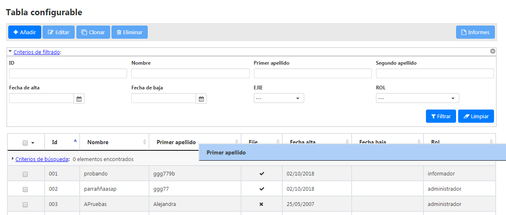

# RUP Table - Reordena columnas

Permite reordenar las columnas arrastrando desde la cabecera.




# 1. Declaración y configuración

El uso del plugin en el componente se realiza incluyendo en el array de la propiedad usePlugins el valor colReorder. La configuración del plugin se especifica en la propiedad colReorder.

```js
$("#idComponente").rup_table({
  colReorder:{
  // Propiedades de configuración del plugin colReorder
  }
});
```
