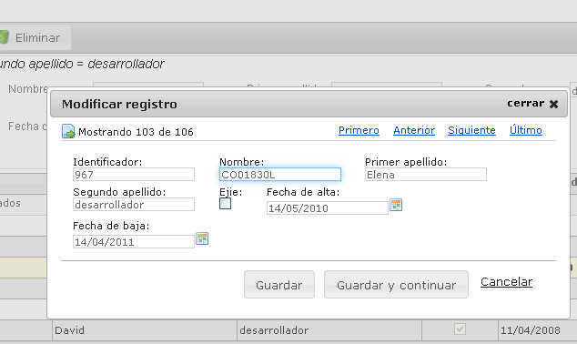

# RUP Table - Edición en formulario

Permite la edición de los registros de la tabla utilizando un formulario de detalle. El formulario se muestra
dentro de un diálogo y ofrece las siguientes funcionalidades:

* Añadir un nuevo registro o modificar uno ya existente.
* Cancelar la inserción o edición de un registro.
* Navegar entre los registros mostrados en la tabla para permitir operar de manera mas ágil sobre los diferentes elementos.



# 1. Declaración y configuración

El uso del plugin en el componente se realiza incluyendo en el array de la propiedad usePlugins el valor formEdit. La configuración del plugin se especifica en la propiedad formEdit.

```js
$("#idComponente").rup_table({
    formEdit: {
        // Propiedades de configuración del plugin formEdit
        detailForm: '#example_detail_div',
        validate: {
            rules: {
                'nombre': {
                    required: true
                },
                'apellido1': {
                    required: true
                },
                'fechaAlta': {
                    required: true
                },
                'fechaBaja': {
                    date: true
                }
            }
        },
        cancelDeleteFunction: function () {
            console.log('Ha cancelado la acción de eliminar.');
        },
        confirmDialogs: {
            saveDialog: false,
            cancelDialog: true,
            deleteDialog: true
        }
    }
});
```
### Propiedades de configuración

Identificador del formulario de edición:
```js
formEdit: {
    detailForm: '#example_detail_div'
}
```

Añadir validaciones sobre los campos:
```js
formEdit: {
    validate: {
        rules: {
            'nombre': {
                required: true
            },
            'apellido1': {
                required: true
            },
            'fechaAlta': {
                required: true
            },
            'fechaBaja': {
                date: true
            }
        }
    }
}
```

Habilitar la personalización de una función a la hora de cancelar, cuando se va a borrar los registros de la tabla:
```js
formEdit: {
    cancelDeleteFunction: function () {
        console.log('Ha cancelado la acción de eliminar.');
    }
}
```

Permitir habilitar o deshabilitar los diálogos de confirmación:
```js
formEdit: {
    confirmDialogs: {
        saveDialog: false,
        cancelDialog: true,
        deleteDialog: true
    }
}
```

Se ha creado también la posibilidad de tener listas de checkbox, dinámicas y deben tener la siguiente estructura:

```xml
<c:forEach items="${usuario.lugares}" var="lugarapli" varStatus="status" >
    <div class="form-row">      
        <div class="checkbox-material col-sm">
            <form:checkbox path="lugares[${status.index}].checkeado" id="checkeado${status.index}_lugares" value="1" data-lista="lugares" data-clave="buzones" data-valor="${lugarapli.id}" />
            <label for="checkeado${status.index}_lugares">${lugarapli.email}</label>
         </div>
    </div>
</c:forEach>
```		

Donde destacan 3 elementos:

PATH ->	Es donde se colocará el array y seguido un punto, después del punto será el atributo name, en el caso del ejemplo checkeado.

DATA-LISTA-> Es el nombre de la entidad para mapearlo en el controller, en nuestro caso la entidad se llama 'lugares'.

DATA-CLAVE-> Es la clave de la entidad, en caso de ser una lista de objetos, en nuestro ejemplo la clave primaria es 'buzones', no se 
admitirán claves con múltiples pks y en caso de ser una lista de String, este parámetro no hay que ponerlo.

DATA-VALOR-> Es donde se recoge el valor del identificador, la clave primaria.