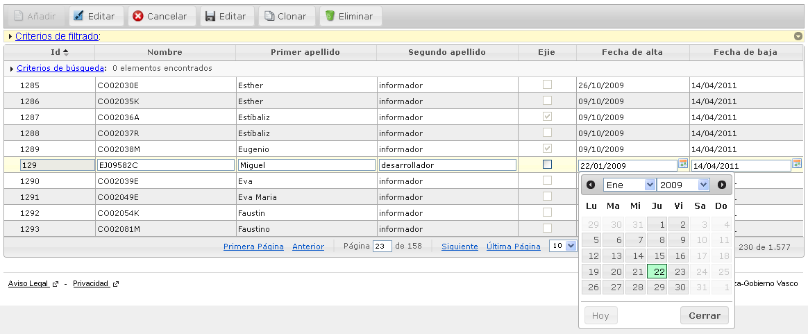

# RUP Table - Edición en línea

Permite la edición de los registros de la tabla mostrando los campos de edición sobre la propia línea del registro.



# 1. Declaración y configuración

El uso del plugin en el componente se realiza incluyendo en el array de la propiedad usePlugins el valor “inlineEdit”. La configuración del plugin se especifica en la propiedad inlineEdit.

 ```js
$("#idComponente").rup_table({
  url: "../jqGridUsuario",
  usePlugins:["inlineEdit"],
  inlineEdit:{
  // Propiedades de configuración del plugin inlineEdit
  }
});
```
