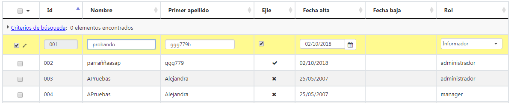

# RUP Table - Edición en línea

Permite la edición de los registros de la tabla utilizando un formulario dentro de la tabla. El formulario se muestra
dentro de una fila y ofrece las siguientes funcionalidades:

* Añadir un nuevo registro o modificar uno ya existente.
* Cancelar la inserción o edición de un registro.
* Navegar entre los registros mostrados en la tabla para permitir operar de manera mas ágil sobre los diferentes elementos.



# 1. Declaración y configuración

El uso del plugin en el componente se realiza incluyendo en el array de la propiedad usePlugins el valor inlineEdit. La configuración del plugin se especifica en la propiedad inlineEdit.

```js
$("#idComponente").rup_table({
    inlineEdit: {
        // Propiedades de configuración del plugin inlineEdit
        validate: {
            rules: {
                'nombre': {
                    required: true
                },
                'apellido1': {
                    required: true
                },
                'fechaAlta': {
                    required: true
                },
                'fechaBaja': {
                    date: true
                }
            },
            messages: {
                required: 'Campo requerido'
            }
        },
        cancelDeleteFunction: function () {
            console.log('Ha cancelado la acción de eliminar.');
        },
        confirmDialogs: {
            saveDialog: false,
            cancelDialog: true,
            deleteDialog: true
        }
    }
});
```
### Propiedades de configuración

Añadir validaciones sobre los campos:
```js
inlineEdit: {
    validate: {
        rules: {
            'nombre': {
                required: true
            },
            'apellido1': {
                required: true
            },
            'fechaAlta': {
                required: true
            },
            'fechaBaja': {
                date: true
            }
        },
        messages: {
            required: 'Campo requerido'
        }
    }
}
```
&nbsp;

Habilitar la personalización de una función a la hora de cancelar, cuando se va a borrar los registros de la tabla:
```js
inlineEdit: {
    cancelDeleteFunction: function () {
        console.log('Ha cancelado la acción de eliminar.');
    }
}
```
&nbsp;

Permitir habilitar o deshabilitar los diálogos de confirmación:
```js
inlineEdit: {
    confirmDialogs: {
        saveDialog: false,
        cancelDialog: true,
        deleteDialog: true
    }
}
```
&nbsp;

Endpoint que devolverá el formulario necesario para poder llevar a cabo la edición en aquellos casos en los que se haya activado su dinamismo (más información sobre su activación [aquí](./rup.table.md#95-propiedades-adicionales)):
```js
inlineEdit: {
    // El valor por defecto es './inlineEdit' aunque puede variar dependiendo del campo urlBase
    url: './inlineEditDouble',
    // Por defecto, el componente siempre enviará el method e identificador de la tabla (puede sobrescribirse) pero pueden añadirse más parámetros mediante el objeto data.
    data: {
        'nombreUsuario': 'Este es el nombre del usuario'
    }
}
```
Para que esto funcione correctamente, hay que crear una JSP llamada `tableInlineEditAuxForm`. Esta JSP podrá ser usada por todos aquellos mantenimientos que lo requieran, independientemente de que las entidades sean diferentes. A continuación el contenido que debe tener este archivo:
```html
<%--  
 -- Copyright 2021 E.J.I.E., S.A.
 -- Licencia con arreglo a la EUPL, Versión 1.1 exclusivamente (la «Licencia»);
 -- Solo podrá usarse esta obra si se respeta la Licencia.
 -- Puede obtenerse una copia de la Licencia en
 -- 
 -- http://ec.europa.eu/idabc/eupl.html
 -- 
 -- Salvo cuando lo exija la legislación aplicable o se acuerde por escrito,
 -- el programa distribuido con arreglo a la Licencia se distribuye «TAL CUAL»,
 -- SIN GARANTÍAS NI CONDICIONES DE NINGÚN TIPO, ni expresas ni implícitas.
 -- Véase la Licencia en el idioma concreto que rige los permisos y limitaciones
 -- que establece la Licencia. 
 --%>

<%@page pageEncoding="UTF-8" contentType="text/html; charset=UTF-8"%>
<%@taglib prefix="c" uri="http://java.sun.com/jsp/jstl/core"%>
<%@taglib prefix="spring" uri="/WEB-INF/tld/spring.tld"%>
<%@taglib prefix="form" uri="/WEB-INF/tld/spring-form.tld"%>

<!-- Formulario -->
<c:set value="${actionType == 'POST' ? 'add': 'edit'}" var="endpoint" />
<spring:url value="${mapping}/${endpoint}" var="url"/>
<form:form modelAttribute="${entity}" id="${tableID}_detail_inlineEdit_aux_form" class="d-none" action="${url}" method="${actionType}"/>
```
&nbsp;

# 2. Aspectos a tener en cuenta
Es importante saber que para inicializar los componentes de UDA como el autocomplete, combo o date, hay que hacerlo mediante la propiedad `colModel` de tal manera que UDA pueda encargarse de reinicializar los componentes siempre que sea necesario. También es importante remarcar que **todos los campos que estén ocultos mediante la propiedad `columnDefs` no deben de ser declarados en el `colModel`**. Para más información sobre cómo usar esta propiedad, leer el documento [rup.table](./rup.table.md).