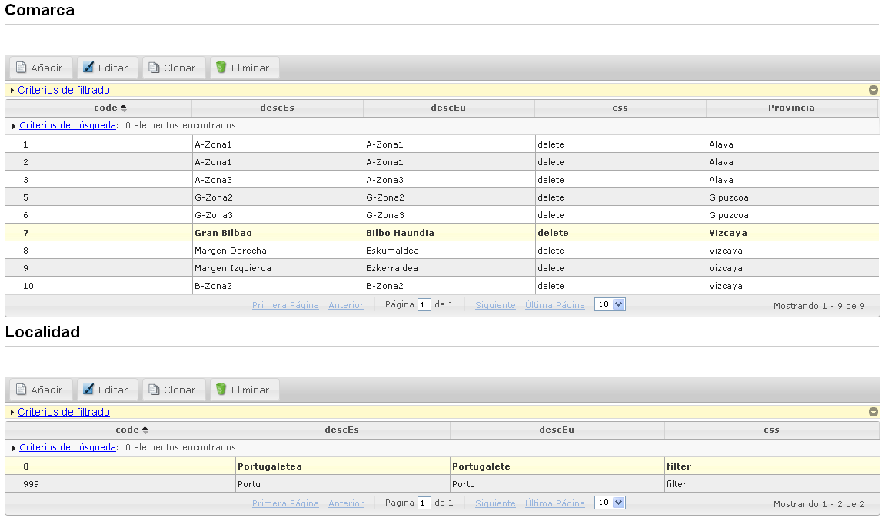

# RUP Table - Maestro Detalle

Permite relacionar dos tablas de modo que tengan una relación maestro-detalle.

De este modo, los resultados de la tabla detalle se muestran a partir del seleccionado en la tabla maestro.



## 1. Declaración y configuración

El uso del plugin en el componente, se realiza incluyendo en el array de la propiedad usePlugins el valor “masterDetail”. La configuración del plugin se especifica en la propiedad masterDetail.

```js
$("#idComponenteMaestro").rup_table({
  //Propiedades
  master: '#example', //-> Identificador con el nombre de la tabla padre. 
  masterPrimaryKey: 'example.id', //-> Campo clave de la tabla padre
  masterPrimaryLabel: 'example_label' //-> Propiedad para renombrar el campo clave del padre en la leyenda de los filros.
});

$("#idComponenteDetalle").rup_table({
  masterDetail:{
    // Propiedades de configuración del plugin masterDetail
    master: "#idComponenteMaestro",
    masterPrimaryKey:"#idComponenteMaestro.code"
  }
});
```
