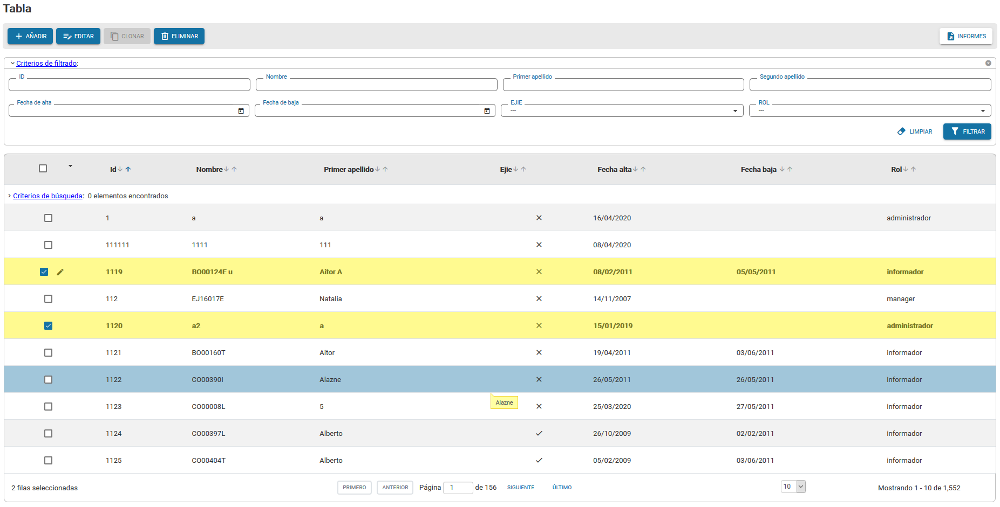

#	Componentes RUP – Table


## 1. Introducción

La descripción del componente table, visto desde el punto de vista de RUP, es la siguiente:

*Se les presenta a los usuarios los datos tabulados para que la información se visualice de manera ágil y rápida, facilitando así su comprensión y manejo. Además, el componente implementa un nuevo patrón definido para facilitar la lógica necesaria en las acciones básicas, denominadas CRUD (create, read,update y delete), sobre una tabla.*


## 2. Ejemplo

Se muestra a continuación una maquetación típica del componente:



## 3. Casos de uso

Se aconseja la utilización de este componente:

* Cuando se tenga que presentar a los usuarios filas de datos y se desee facilitar la b√∫squeda de datos.
* Cuando se realicen mantenimientos de tablas haciendo uso de las especificaciones establecidas en la guía de desarrollo de UDA.


## 4. Infraestructura

A continuación se comenta la infraestructura necesaria para el correcto funcionamiento del componente.

Únicamente se requiere la inclusión de los ficheros que implementan el componente (js y css) comentados en los apartados *Ficheros* y *Dependencias*.

### 4.1. Ficheros

- Ruta Javascript: rup/scripts/
- Fichero de plugin: rup.table-x.y.z.js
- Ruta theme: rup/css/
- Fichero de estilos: +theme.table-x.y.z.css+ (modificable por el desarrollador), jquery.table.css (fichero base del table), buttons.table.css (fichero base del plugin 'buttons'), select.table.css (fichero base del plugin 'select').
- Ruta fichero de recursos: rup/resources/table_idioma.json

### 4.2. Dependencias

Por la naturaleza de desarrollo de los componentes (patrones) como *plugins* basados en la librería *JavaScript* **jQuery**, es necesaria la inclusión de esta como capa base. La versión elegida para el desarrollo ha sido la **3.4.1**.
* **jQuery 3.4.1**: http://jquery.com/

Los ficheros necesarios para el correcto funcionamiento del componente son:

    jquery-3.4.1.js
    rup.base-x.y.z.js
    rup.table-x.y.z.js
    jquery.table.css
    buttons.table.css
    select.table.css
    Ejemplos online: https://datatables.net/examples/index

### 4.3 Versión minimizada

A partir de la versión v2.4.0 se distribuye la versión minimizada de los componentes **RUP**. Estos ficheros contienen la versión compactada y minimizada de los ficheros javascript y de estilos necesarios para el uso de todos los compontente **RUP**.

Los ficheros minimizados de RUP son los siguientes:
* **rup/scripts/min/rup.min-x.y.z.js**
* **rup/css/rup.min-x.y.z.css**

Estos ficheros son los que deben utilizarse por las aplicaciones. Las versiones individuales de cada uno de los componentes solo deberán de emplearse en tareas de desarrollo o depuración.

## 5. Invocación

El componente table necesita de una invocación de una llamada javascript sobre una estructura HTML existente.

Cada módulo del componente asocia funcionalidades y eventos a los diferentes objetos de la estructura HTML. De esto modo los componentes feedback, formulario de filtrado, formulario de detalle o multiselección entre otros, deberán de construirse sobre objetos HTML.

En el componente table se ha optado por minimizar el código HTML que se genera al vuelo mediante javascript. Esto permite una serie de mejoras.

* Mayor velocidad de renderizado de la pantalla. El código HTML generado mediante javascript es significativamente más lento, sobre todo en navegadores antiguos.
* Se facilitan las modificaciones y ajustes sobre las diferentes partes del componente ya que se tiene acceso a la mayoría de las mismas directamente desde la jsp.

Para facilitar aún más y simplificar el código necesario a la hora de invocar y configurar el componente, se ha definido una nomenclatura estándar a la hora de indicar los identificadores de los diferentes objetos HTML. De este modo no será necesario indicarle al componente todos los objetos HTML sobre los que debe definir cada una de las funcionalidades.

### 5.1. Código HTML

Para simplificar la nomenclatura nodos los identificadores de los objetos HTML se derivan a partir del identificador base del componente table.

Para lograr una configuración mínima del componente js se deberá de implementar el siguiente código HTML en la jsp de la pantalla, cuidando los identificadores de cada elemento.

Para el ejemplo supongamos que el componente RUP table se invoca sobre el elemento base con identificador table.

Partiendo de esto, el resto de identificadores se derivar√°n a partir de la norma:

    tableID_<componente>

Este sería un ejemplo del código que se debería de incluir en la jsp:

```xml
<%@include file="/WEB-INF/includeTemplate.inc"%>
<h2>Table</h2> <!-- Titulo pagina -->

<jsp:include page="includes/filterForm.jsp"></jsp:include>

<table id="example" class="tableFit table-striped table-bordered table-material"
	data-url-base="./tableUsuario"
	data-filter-form="#table_filter_form">
        <thead>
            <tr>
                <th data-col-prop="id">Id</th>
                <th data-col-prop="nombre">Nombre</th>
                <th data-col-prop="apellido1">Primer apellido</th>
                <th data-col-prop="ejie" data-col-type="checkbox">Ejie</th>
                <th data-col-prop="fechaAlta" data-col-sidx="fecha_alta" data-col-type="date">Fecha alta</th>
                <th data-col-prop="fechaBaja" data-col-type="date">Fecha baja</th>
                <th data-col-prop="rol" data-col-type="combo">Rol</th>
            </tr>
        </thead>
</table>

<jsp:include page="includes/tableEdit.jsp"></jsp:include>
```

* **table**: Componente HTML sobre el que se inicializa el componente RUP table.
* **data-col-prop**: Identificador de la columna que va asociado a los formularios.
* **data-col-type**: Tipo que hace correspondencia con los RUP.
* **data-col-sidx**: Identificador de base de datos.
* **tfoot**: Se usa para el formulario de filtrado. Los campos incluidos en este formulario se utilizar√°n como valores de filtrado de los registros.

### 5.1. Código Javascript

La invocación del componente propiamente dicha se realizará desde el fichero js correspondiente a la página. Si se ha seguido la nomenclatura del apartado anterior se requerirá únicamente de una
configuración mínima:

```js
jQuery(function($){

	//FILTRO Y DETALLE
	var combo = [
		   {rol: "---", codTipoSubsanacion:""},
		   {rol: "Administrador", codTipoSubsanacion:"administrador"},
		   {rol: "Desarrollador", codTipoSubsanacion:"desarrollador"},
		   {rol: "Espectador", codTipoSubsanacion:"espectador"},
		   {rol: "Informador", codTipoSubsanacion:"informador"},
		   {rol: "Manager", codTipoSubsanacion:"manager"}
		];

	var tableColModels = [
			{ name: "id", index: "id", editable:true, width: 80
				, formoptions:{rowpos:1, colpos:1}
			},
			{ name: "nombre", index: "nombre", editable:true
				, formoptions:{rowpos:2, colpos:1}
			},
			{ name: "apellido1", index: "apellido1", editable:true
				, formoptions:{rowpos:3, colpos:1}
				, classes:'ui-ellipsis'
			},
			{ name: "apellido2", index: "apellido2", editable:true
				, formoptions:{rowpos:4, colpos:1}
			},
			{ name: "ejie", index: "ejie", editable:true, width: 60,
				edittype: "checkbox",
				formatter: "checkbox",
				rwdClasses:"hidden-xs hidden-sm hidden-md",
				align: "center",
				editoptions: {
					value:"1:0"
				},
				searchoptions:{
					rupType: "combo",
					source : [
					   {label: "---", value:""},
					   {label: "Si", value:"1"},
					   {label: "No", value:"0"}
					]
				}
				, formoptions:{rowpos:5, colpos:1}
			},
			{ name: "fechaAlta",  index: "fecha_alta", editable:true, width: 120,
				rupType: "date",
				rwdClasses:"hidden-xs hidden-sm hidden-md",
				editoptions:{
					labelMaskId : "fecha-mask",
					showButtonPanel : true,
					showOtherMonths : true,
					noWeekend : true
				}
				, formoptions:{rowpos:2, colpos:2}
			},
			{ name: "fechaBaja", index: "fecha_baja", editable:true, width: 120,
				rupType: "date",
				rwdClasses:"hidden-xs hidden-sm hidden-md",
				editoptions:{
					labelMaskId : "fecha-mask",
					showButtonPanel : true,
					showOtherMonths : true,
					noWeekend : true
				}
				, formoptions:{rowpos:3, colpos:2}
			},
			{ name: "rol", index: "rol", editable:true, width: 140,
				rupType: "combo",
				rwdClasses:"hidden-xs hidden-sm hidden-md",
				formatter: "rup_combo",
				editoptions: {
					source: $.map(combo, function(elem){
						return {
							label: elem.rol,
							value: elem.codTipoSubsanacion
						};

					})
				}
				, formoptions:{rowpos:3, colpos:2}
			}
     ],
     options_ejie_combo = {
			source : [
			   {label: "---", value:""},
			   {i18nCaption: "0", value:"0"},
			   {i18nCaption: "1", value:"1"}
			],
			i18nId: "GRID_simple##ejie",
			width: 120
		},
		options_role_combo = {
			source : [
			   {label: "---", value:""},
			   {label: $.rup.i18n.app["GRID_simple##rol"]["administrador"], value:"administrador"},
			   {label: $.rup.i18n.app["GRID_simple##rol"]["desarrollador"], value:"desarrollador"},
			   {label: $.rup.i18n.app["GRID_simple##rol"]["espectador"], value:"espectador"},
			   {label: $.rup.i18n.app["GRID_simple##rol"]["informador"], value:"informador"},
			   {label: $.rup.i18n.app["GRID_simple##rol"]["manager"], value:"manager"}
			]
		};


	//Formulario de filtrado
	jQuery("#ejie_filter_table").rup_combo(options_ejie_combo);
	jQuery('#rol_filter_table').rup_combo(options_role_combo);

	jQuery("#fechaAlta_filter_table").rup_date();
	jQuery("#fechaBaja_filter_table").rup_date();

	//Formulario de detalle
	jQuery("#fechaAlta_detail_table").rup_date();
	jQuery("#fechaBaja_detail_table").rup_date();

	jQuery("#rol_detail_table").rup_combo(options_role_combo);

	$('#example').rup_table({

        multiSelect: {
            style:    'multi'
        },
        order: [[ 1, 'asc' ]],
        columnDefs: [ {
            orderable: false,
            className: 'select-checkbox',
            targets:   0
        } ],
        fixedHeader: {
            footer: false,
            header:true
        },
        formEdit:{
        	detailForm: "#table_detail_div",
        	width: 650,
        	validate:{
    			rules:{
    				"nombre":{required:true},
    				"apellido1":{required:true},
    				"fechaAlta":{date:true},
    				"fechaBaja":{date:true}
    			}
    		},
    		colModel: tableColModels
        }
    } );
});
```

El uso y configuración de los diferentes plugins del table se especifica en el siguiente apartado.

## 6. Plugins

El componente table se ha implementado siguiendo una arquitectura modular. De este modo se consigue:
* Integrar las diferentes funcionalidades como plugins independientes logrando una pequeña interdependencia entre ellas.
* Facilitar y simplificar el mantenimiento y la aplicación de correctivos en el componente.
* Simplificar la extensión y sobreescritura de los métodos de determinados plugins.
* Permitir la creación de nuevas funcionalidades e incluirlas en el componente de manera sencilla e inocua para el resto de funcionalidades existentes.

Todas las tablas , tienen estas opciones:

$("#idTable").rup_table("getSelectedIds")        -> Devuelve todos los ids seleccionados.
$("#idTable").rup_table("getSelectedRows")       -> Devuelve todos los datos seleccionados, previamente cargados en el ajax.
$("#idTable").rup_table("getSelectedRowPerPage") -> Devuelve todos los ids seleccionadas, en la línea y pagina en la que están.

Todos los plugins est√°n montados sobre el contexto de la tabla para obtener dicho contexto :

```
var ctx = $("#idTable").rup_table("getContext");
```


Dentro del contexto puedes acceder a todas sus propiedades ya todos sus plugins, ejemplo:

```
ctx.seeker
```

Los detalles de cada uno de los plugins se pueden consultar en los documentos correspondientes:

* Core
* Men√∫ contextual
* Feedback
* Filtrado
* Diseño responsivo (RWD)
* Edición en formulario
* Multiselección
* B√∫squeda (seeker)
* Botonera
* Reporting (Parcial)
* Edición en linea
* ColReorder
* Selección simple
* Maestro detalle
* RowGroup
* Multifilter

Propiedades de la tabla:

* multiplePkToken -> Es el token que se va usar cuando el id sea m√∫ltiple.
* primaryKey      -> El identificador principal de la tabla.
* blockPKeditForm -> Si deseas que el pk se bloquee en modo edición (true o false).
* searchPaginator -> Si deseas tener paginador con n√∫mero o no (true o false).

Para obtener las propiedades del plugin subyacente consultar en https://datatables.net/reference/api/

## 7. Sobreescritura del theme

El componente *table* se presenta con una apariencia visual definida en el fichero de estilos **theme.rup.table-x.y.z.css**.

Si se quiere modificar la apariencia del componente, se recomienda redefinir el/los estilos necesarios en un fichero de estilos propio de la aplicación situado dentro del proyecto de estáticos (*codAppStatics/WebContent/codApp/styles*).

Los estilos del componente se basan en *Bootstrap*, con lo que los cambios que se realicen sobre su fichero de estilos manualmente podrán tener repercusión sobre todos los componentes que compartan esos mismos estilos (pudiendo ser el nivel de repercusión general o ajustado a un subconjunto de componentes).


## 8. Internacionalización (i18n)

La gestión de los literales del table se realiza a través de ficheros json, lo que flexibiliza el desarrollo. Para acceder a los literales se hará uso del objeto base RUP, mediante éste se accederá al objeto json correspondiente según el idioma obteniendo tanto los literales como los propios mensajes.

Los literales definidos para el contenido del table son texto simple. Para este componente los literales utilizados están en la parte global de la internacionalización dentro de los resources de rup.

El objeto de internacionalización del table se encuentra accesible del siguiente modo:

    $.rup.i18n.base


## 9. Integración con UDA

La interacción entre la capa de presentación y el servidor de aplicaciones que requiere el componente, hace uso de una serie de clases y configuraciones para facilitar su gestión.

El componente ha sido implementado de manera que sea fácilmente extensible mediante plugins. Debido a esto es posible dotar al componente de funcionalidades extra que se ajusten a las necesidades de nuestra aplicación.

Dependiendo del tipo de nueva funcionalidad que se necesite es muy posible que la información que se transfiera se incremente.

Para facilitar este proceso y flexibilizar el proceso de extensibilidad del componente se ha implementado una serie de componentes que se presupondr√° que son utilizadas a la hora de explicar su funcionamiento.

### 9.1. Comunicación con la capa servidor

La comunicación entre el componente y la capa servidor se realiza principalmente mediante en envío y recepción de objetos JSON.

Para facilitar los procesos de serialización y deserialización entre los objetos JSON y Java se proporcionan las siguientes clases Java:

* **com.ejie.x38.dto.TableRequestDto**: Clase encargada de almacenar la información del JSON enviado por el componente. Después del proceso de deserialización este será el objeto resultante que se obtendrá a partir del objeto JSON enviado.

* **com.ejie.x38.dto.TableResponseDto**: Clase encargada de almacenar las propiedades que después del proceso de serialización, se convertirán en propiedades del objeto JSON que deberá de ser enviado al componente.

### 9.2. Configuración de Spring

Es necesario incluir la siguiente configuración en los ficheros de configuración de Spring:

En el fichero *mvc-config.xml* se deberá de especificar el uso de un Argument Resolver para gestiónar el uso de las anotaciones ```@RequestBodyJson```.

[mvc-config.xml]

```xml
<bean id="requestMappingHandlerAdapter"
class="org.springframework.web.servlet.mvc.method.annotation.RequestMappingHandlerAdapter">
  <!-- Resto de configuración... -->
  <property name="customArgumentResolvers">
    <list>
      <bean class="com.ejie.x38.control.view.RequestFormEntityMethodArgumentResolver"/>
    </list>
  </property>
</bean>
```

### 9.3. Métodos controller

Estos son los métodos generados en el Controller para gestionar las peticiones de las diferentes operaciones del componente table:

* Filtrado:
```java
@RequestMapping(value = "/filter", method = RequestMethod.POST)
public @ResponseBody TableResponseDto<Usuario> filter(
@RequestJsonBody(param="filter") Usuario filterUsuario,
@RequestJsonBody TableRequestDto tableRequestDto) {
  TableUsuarioController.logger.info("[POST - table] : Obtener Usuarios");
  return tableUsuarioService.filter(filterUsuario, tableRequestDto, false);
}
```

* B√∫squeda:
```java
@RequestMapping(value = "/search", method = RequestMethod.POST)
public @ResponseBody List<TableRowDto<Usuario>> search(
@RequestJsonBody(param="filter") Usuario filterUsuario,
@RequestJsonBody(param="search") Usuario searchUsuario,
@RequestJsonBody TableRequestDto tableRequestDto){
  TableUsuarioController.logger.info("[POST - search] : Buscar Usuarios");
  return tableUsuarioService.search(filterUsuario, searchUsuario, tableRequestDto, false);
}
```

* Borrado m√∫ltiple:
```java
@RequestMapping(value = "/deleteAll", method = RequestMethod.POST)
@ResponseStatus(value=HttpStatus.OK)
public @ResponseBody List<String> removeMultiple(
@RequestJsonBody(param="filter") Usuario filterUsuario,
@RequestJsonBody TableRequestDto tableRequestDto) {
  TableUsuarioController.logger.info("[POST - removeMultiple] : Eliminar multiples usuarios");
  this.tableUsuarioService.removeMultiple(tableRequestDto);
  TableUsuarioController.logger.info("All entities correctly deleted!");
  return tableRequestDto.getMultiselection().getSelectedIds();
}
```

* Copia de registros:
```java
@RequestMapping(value = "/clipboardReport", method = RequestMethod.POST)
protected @ResponseBody List<Usuario> getClipboardReport(
		@RequestJsonBody(param = "filter", required = false) Usuario filterUsuario,
		@RequestJsonBody TableRequestDto tableRequestDto) {
	TableUsuarioController.logger.info("[POST - clipboardReport] : Copiar multiples usuarios");
	return this.tableUsuarioService.getDataForReports(filterUsuario, tableRequestDto);
}
```
### 9.5. Propiedades adicionales

```js
Plugins.noEdit = true 
```

Por defecto viene a false, y si se activa deja solo el boton de informes. Cabe decir que es necesario declararlo con valor true siempre y cuando no se vaya a usar ni el formulario de edición de la tabla (formEdit) ni la edición en línea (inlineEdit).

```js
//Par√°metros: jqXHR jqXHR, String textStatus, String errorThrown
Plugins.customError =  function(qXHR, textStatus, errorThrown ){
                             let ctx = $('#'+idTabla).rup_table("getContext"); 
                             cargarFeedback(ctx, qXHR.responseText, textStatus); 
                        }
```

Se puede cargar una función para que los errores que vienen de ajax.

```js
Plugins.filter = 'noFilter' 
```

Por defecto carga un filtro si el usuario no ha puesto su propio filtro, si se activa el 'noFilter', es para indicar a la tabla que no se quiere filtro y la tabla no hará la validación correspondiente.

```js
Plugins.formEdit.width = 650 
```

Permite cambiar la anchura en pÌxeles que tendr· el formulario de ediciÛn. Si no se define, obtendr· el valor por defecto que equivale a 569 pÌxeles.

```js
//Par√°metros: jqXHR jqXHR, String textStatus, String errorThrown
Plugins.customError =  function miError(qXHR, textStatus, errorThrown ){
                             let ctx = $('#'+idTabla).rup_table("getContext"); 
                             cargarFeedback(ctx, qXHR.responseText, textStatus); 
                        }
```

Se puede cargar una función para que los errores que vienen de ajax.

```js
//Par√°metros: ctx -> el contexto de la tabla
//valido: Para los plugins: formEdit e inlineEdit.
Plugins.validarEliminar =  function miFuncion(ctx){
                             if($('#apellido1_detail_table_'+ctx.sTableId).val() !== 'ruiz'){
                             	return true;//no paso la validación;
                             } 
                             	return false;//paso la validación
                        };
```

Se puede cargar una función y hacer un validación externa al eliminar.

```js
//Par√°metros: ctx -> el contexto de la tabla
//valido: Para los plugins: formEdit e inlineEdit.
Plugins.validarModificar  =  function miFuncion(ctx){
                             if($('#apellido1_detail_table_'+ctx.sTableId).val() !== 'ruiz'){
                             	return true;//no paso la validación;
                             } 
                             	return false;//paso la validación
                        };
```

Se puede cargar una función y hacer un validación externa al guardar en la edición de la tabla.

```js
//Par√°metros: ctx -> el contexto de la tabla
//valido: Para los plugins: formEdit.
Plugins.validarModificarContinuar =  function miFuncion(ctx){
                             if($('#apellido1_detail_table_'+ctx.sTableId).val() !== 'ruiz'){
                             	return true;//no paso la validación;
                             } 
                             	return false;//paso la validación
                        };
```

Se puede cargar una función y hacer un validación externa al guardar y continuar en la edición de la tabla.

```js
//Par√°metros: ctx -> el contexto de la tabla
//valido: Para los plugins: todos siempre que exista el filtrado.
Plugins.validarFiltrar  =  function miFuncion(ctx){
                             if($('#apellido1_detail_table_'+ctx.sTableId).val() !== 'ruiz'){
                             	return true;//no paso la validación;
                             } 
                             	return false;//paso la validación
                        };
```

Se puede cargar una función y hacer un validación externa al filtrar en la tabla.

```js
//Par√°metros: ctx -> el contexto de la tabla
//valido: Para los plugins: seeker.
Plugins.validarBuscar =  function miFuncion(ctx){
                             if($('#apellido1_detail_table_'+ctx.sTableId).val() !== 'ruiz'){
                             	return true;//no paso la validación;
                             } 
                             	return false;//paso la validación
                        };
```

Se puede cargar una función y hacer un validación externa al buscar con el seeker.

```jsa
//Par√°metros: ctx -> el contexto de la tabla
//valido: Para los plugins: formEdit e inlineEdit.
Plugins.validarAlta  =  function miFuncion(ctx){
                             if($('#apellido1_detail_table_'+ctx.sTableId).val() !== 'ruiz'){
                             	return true;//no paso la validación;
                             } 
                             	return false;//paso la validación
                        };
```

Se puede cargar una función y hacer un validación externa al hacer un nuevo registro.

```js
//Par√°metros: ctx -> el contexto de la tabla
//valido: Para los plugins: formEdit.
Plugins.validarAltaContinuar =  function miFuncion(ctx){
                             if($('#apellido1_detail_table_'+ctx.sTableId).val() !== 'ruiz'){
                             	return true;//no paso la validación;
                             } 
                             	return false;//paso la validación
                        };
```

Se puede cargar una función y hacer un validación externa al hacer un nuevo registro y continuar.

```js
plugins.feedback.customGoTo  = function miFuncion(){
									return $('#example_containerToolbar').offset().top ;
								} 
```

Se puede personalizar el feedback para que cuando aparezca, suba la posición hasta donde el desarrollador quiera, hay que devolver un número.

```js
        let miColModel = [{
                name: 'id',
                editable: true,
                formoptions: {
                    rowpos: 1,
                    colpos: 1
                }
            },
            {
                name: 'ejie',
                editable: true,
                edittype: 'checkbox',
                rupType: 'checkbox',
                editoptions: {
                    value: '1:0'
                },
                searchoptions : {
                    rowpos: 5,
                    colpos: 1
                }
            },
            {
                name: 'fechaAlta',
                editable: true,
                rupType: 'date',
                editoptions: {
                    labelMaskId: 'fecha-mask',
                    showButtonPanel: true,
                    showOtherMonths: true,
                    noWeekend: true
                },
                formoptions: {
                    rowpos: 2,
                    colpos: 2
                }
            }
            ];


plugins.colModel  = miColModel; 
```

El colModel se usa para modelar, los campos de la tabla.
Destacados:

name -> Identificador del campo.

editable -> true o false, si se quiere editar o no este campo.

editoptions y formoptions -> Para configurar todas las opciones de los campos rup.

rupType -> Tipo rup para ese campo.