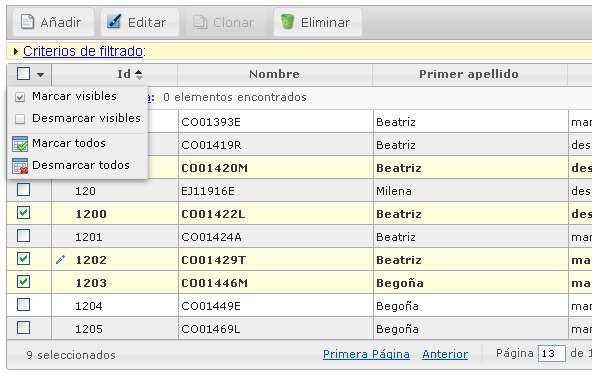

# RUP Table - Multiselection

Permite realizar una selección múltiple de los registros que se muestran en la tabla.



## 1. Declaración y configuración

El uso del plugin en el componente se realiza incluyendo en el array de la propiedad usePlugins el valor “multiselection”. La configuración del plugin se especifica en la propiedad multiselection.

```js
$("#idComponente").rup_table({
  url: "../jqGridUsuario",
  usePlugins:["multiselection"],
  multiselection:{
    // Propiedades de configuración del plugin multiselection
  }
});
```
