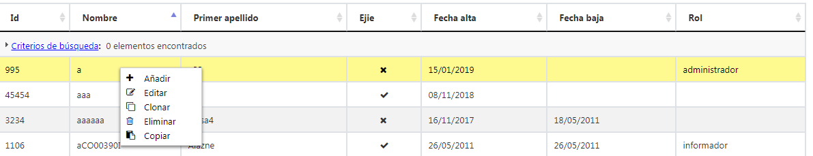

# RUP Table - Select

Permite realizar una selección simple de los registros que se muestran en la tabla.



## 1. Declaración y configuración

El uso del plugin en el componente se realiza incluyendo en el array de la propiedad usePlugins el valor select. La configuración del plugin se especifica en la propiedad select.

```js
$("#idComponente").rup_datatable({
  select:{
    // Propiedades de configuración del plugin select
  }
});
```

## Funcionamiento interno

Para su funcioanmiento el plugin de multiseleccion del componente RUP Table hace uso de una estrcutura de datos almacenada mediante ```multiselection```. Comparte objeto con el plugin de multiselection.

Se puede acceder a esta estructura mediante la siguiente instrucción.

```js
var table = $('#example').DataTable();
var multiselectionObj = table.context[0].multiselection;
```
Se puede acceder a los métodos de la api del Select
``DataTable.Api().select.metodoEjemplo()`

Además de las propiedades de configuración asociadas a la configuración del plugin de select se pueden observar las siguientes propiedades.


```js
{
  deselectedIds: [],
  deselectedRowsPerPage: [],
  numSelected:0,
  selectedAll: false,
  selectedIds: [],
  selectedRowsPerPage: [],
  lastSelectedId :0,
  accion:''
}
```

La función de cada propiedad es la siguiente:

* **numSelected**: Nómero de registros seleccionados en la tabla.
* **selectedAll**: Indica si se han seleccionado todos los elementos de la tabla.
* **selectedIds**: Array que almacena los identificadores de los registros *seleccionados*.
* **selectedRowsPerPage**: Array que almacena la información de los registros *seleccionados* por cada página.
* **deselectedIds**: Array que almacena los identificadores de los registros *deseleccionados*.
* **deselectedRowsPerPage**: Array que almacena la información de los registros *deseleccionados* por cada página.
* **lastSelectedId**: -identificador con el óltimo registro seleccionado*.
* **accion**: Variable para distingir la acción de checkAll, uncheckAll, checkAllPage y uncheckAllPage*.

En este plugin solo hay 1 seleccionado. 

### Selección de registros ordinaria

En este caso, la selección de registros se realiza de manera normal. Cuando se selecciona un registro de la tabla se:

* Incrementa el contador de la propiedad ``numSelected``.
* Se almacena el último id seleccionado ``lastSelectedId``.