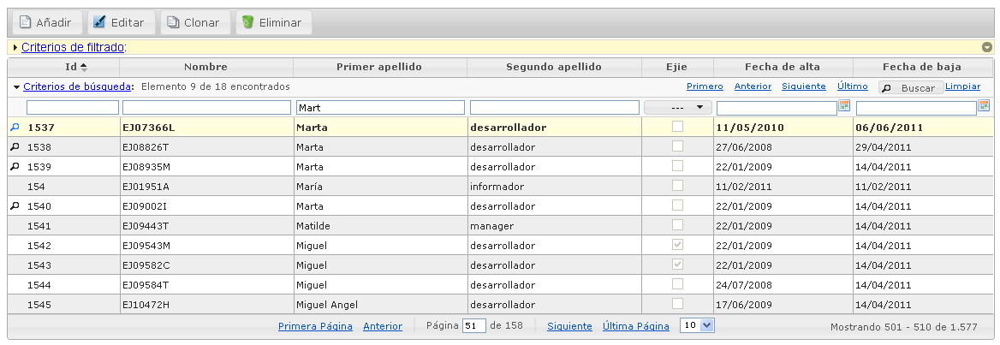

# RUP Table - Búsqueda

Permite al usuario realizar una búsqueda entre el conjunto de resultados que se le muestran. Mediante una serie de criterios de búsqueda permite al usuario posicionarse entre los diferentes registros que se ajustan a dichos criterios.



## 1. Declaración y configuración

El uso del plugin en el componente se realiza incluyendo en el array de la propiedad usePlugins el valor “search”. La configuración del plugin se especifica en la propiedad search.

```js
$("#idComponente").rup_table({
  url: "../jqGridUsuario",
  usePlugins:["search"],
  search:{
    // Propiedades de configuración del plugin search
  }
});
```
