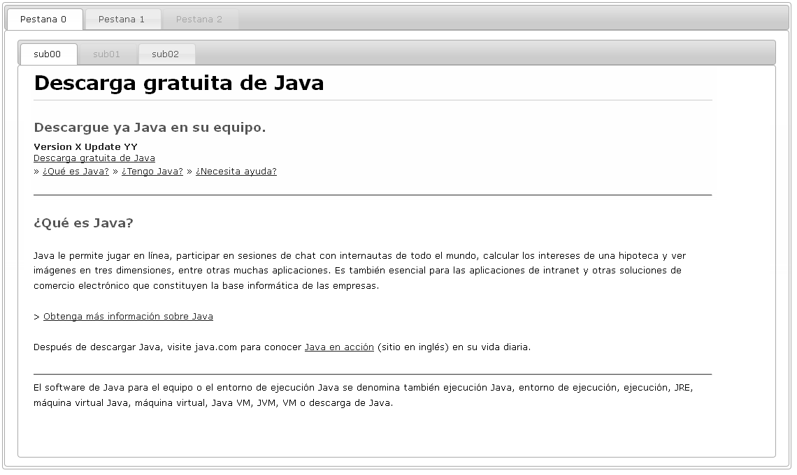
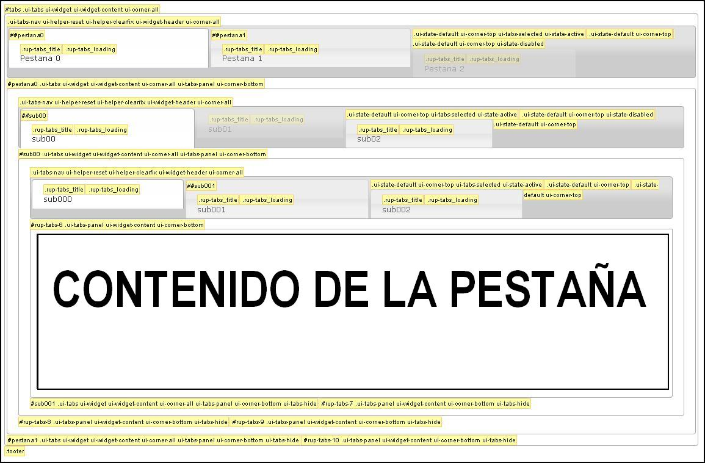

#	Componentes RUP – Pestañas

##	1	Introducción
La descripción del componente Pestañas, visto desde el punto de vista de **RUP**, es la siguiente:
*Permiten dar acceso de forma compacta a grupos de contenidos mutuamente excluyentes pudiendo ser integradas en zonas muy reducidas de la interfaz.*

##	2	Ejemplo
Se presentan a continuación un ejemplo de este patrón:



##	3	Casos de uso
Se recomienda el uso del patrón:
+	Cuando se pretende separar grupos de contenidos mutuamente excluyentes.

##	4	Infraestructura
A continuación se comenta la infraestructura necesaria para el correcto funcionamiento del patrón.
+	Se han de definir, en los controladores apropiados, las distintas funciones que sirvan las páginas presentadas en cada una de las pestañas.
El componente trabaja con distintas llamadas *ajax* que cargan el contenido de la pestaña al acceder a ellas. Dichas llamadas *ajax* requieren de las funciones del controller apropiadas para servir los contenidos.

+	Adicionalmente, para el funcionamiento en cliente del componente, se requiere la inclusión de los ficheros que implementan el patrón (js y css) comentados en los apartados Ficheros y Dependencias.

###	4.1	Ficheros
Ruta Javascript: rup/scripts/
Fichero de plugin: **rup.tabs-x.y.z.js**
Ruta theme: rup/basic-theme/
Fichero CSS del theme: **theme.rup.tabs-x.y.z.css**

###	4.2	Dependencias
Por la naturaleza de desarrollo de los componentes (patrones) como *plugins* basados en la librería JavaScript *jQuery*, es necesaria la inclusión del esta. La versión elegida para el desarrollo ha sido la versión **1.12.4**.
•	**jQuery 1.12.4**: http://jquery.com/

La gestión de la ciertas partes visuales de los componentes, se han realizado mediante el *plugin* ***jQuery UI*** que se basa en *jQuery* y se utiliza para construir aplicaciones web altamente interactivas. Este *plugin*, proporciona abstracciones de bajo nivel de interacción y animación, efectos avanzados de alto nivel, componentes personalizables (estilos) ente otros. La versión utilizada en el desarrollo ha sido la **1.12.0**.
•	**jQuery UI 1.12.0**: http://jqueryui.com/

Los ficheros necesarios para el correcto funcionamiento del componente son:
	
    jquery-1.12.4.js
	jquery-ui-1.12.0.custom.js 
	jquery-ui-1.12.0.custom.css
	rup.base-x.y.z.js
	rup.tabs-x.y.z.js
	theme.rup.tabs-x.y.z.css

###	4.3	Versión minimizada
A partir de la versión v2.4.0 se distribuye la versión minimizada de los componentes RUP. Estos ficheros contienen la versión compactada y minimizada de los ficheros javascript y de estilos necesarios para el uso de todos los compontente RUP.

Los ficheros minimizados de RUP son los siguientes:
+	**rup/scripts/min/rup.min-x.y.z.js**
+	**rup/basic-theme/rup.min-x.y.z.css**

Estos ficheros son los que deben utilizarse por las aplicaciones. Las versiones individuales de cada uno de los componentes solo deberán de emplearse en tareas de desarrollo o depuración.


##	5	Invocación
La primera noción que se ha de tener en cuenta, para el correcto manejo e inclusión del componente Pestañas dentro de una página *jsp*, es la asociación del componente a un elemento estructural ```<div>``` de *html*. La definición de dicho elemento determinara la ubicación que tendrá el componente dentro de las propias páginas donde será utilizado.

Para poder relacionar el componente a su ```<div>``` asociado y para que no se mezclen posibles definiciones de más de un componente Pestañas en la misma pagina, el ```<div>``` debe ir identificado por un “id” (identificador) único. Por ejemplo, un posible ```<div>``` utilizado podría tener el siguiente aspecto:
```xml
<div id=tabsDemo></div>
```
Una vez definido el elemento que incluirá el componente será labor del desarrollador componer el selector de *jQuery* que determine el ```<div>``` sobre el que se aplicará el componente especificado. Una posible definición del selector, sobre el ``` <div> ``` definido anteriormente, sería:
```javascript
$("#tabs").rup_tabs({
			tabs : [ 
				{i18nCaption:"pestana1", tabs: [
					{i18nCaption:"sub10", url:"tab1Fragment"},
					{i18nCaption:"sub11", url:"tab2Fragment"}
				]},
				{i18nCaption:"pestana2", url:"tab2Fragment"}
]

		});
```
Como se puede ver en el ejemplo, también será labor del desarrollador la definición y distribución de las distintas pestañas que formaran parte del componente.

Las distintas pestañas definidas se declaran dentro de un *array json* de nombre *“tabs”*. En dicho *array*, se  determinan las distintas pestañas incluidas en el nivel jerárquico del componente (por ejemplo: la primera definición del *array* determina el primer subnivel de pestañas). Para que el componente pueda mostrar algo es necesario que incluya, al menos, un *array “tabs”*.

A su vez, cada uno de los elementos del array se compondrá de objetos json que contendrán dos objetos json:
+	*i18nCaption*
+	*url / tabs*

El atributo *“i18nCaption”* es obligatorio a la hora de parametrizar una pestaña, ya que determina el literal que aparece definiendo la pestaña. Los literales de definición de las pestañas interaccionan con el sistema de gestión idiomática de la capa de presentación; por lo que el valor asociado al *“i18nCaption”* debe estar inscrito en el objeto *“tab”* dentro del los ficheros de literales (uno por cada idioma versionado) de la aplicación. Siguiendo con el ejemplo de definición del componente anterior, los ficheros de literales tendrían el siguiente aspecto: 

Considerando que la aplicación tiene por código x21a y el War en el 	que se ubica la página, que alberga el componente, tiene por nombre Demo.

En el fichero “x21aDemo.i18n_es.json” ubicado en “/x21aStatics/WebContent/x21a/resources/”, se incluirá lo siguiente:
```javascript
	"tabs" : {
		"pestana1"	: "Tab 1",
		"pestana2"	: "Tab 2",
		"sub01" 	: "sub01",
		"sub02" 	: "sub02"
	}
```
Si la aplicación trabajara con más de una versión idiomática, se debería incluir la correspondiente traducción idiomática del literal en su correspondiente fichero *(x21aDemo.i18n_eu.json, x21aDemo.i18n_en.json, x21aDemo.i18n_fr.json,…)*.

Es posible añadir otro *array json* para crear un nuevo subnivel de pestañas mediante el atributo tabs que recibirá una estructura *json* con el contenido de la sub-pestaña. También es posible mediante el parámetro *url* indicar la ruta de acceso a los contenidos de la pestaña parametrizada. Dicha ruta tendrá que coincidir con la utilizada para invocar los contenidos definidos en el *controller* (consideración estructural definida en el apartado “4. Infraestructura”). Además del envió de parámetros mediante *“query string”*, el componente acepta las urls en tres formatos:

**Absoluto**: Se le pasa la url completa.

url:"http://www.euskadi.ejiedes.net/x21aPilotoPatronesWar/patrones/tab2Fragment"

**Relativa al dominio**: Se le especifica la url con una barra “/” como primer carácter. De esta manera, el componente concatenara la ruta especificada al dominio en el que se encuentre la aplicación.
	url:"/x21aPilotoPatronesWar/patrones/tab2Fragment"
    
**Relativa a la dirección actual**: Se determina la ruta sin una barra “/” como primer carácter. Con este modelo, el componente monta la url quitando la ultima parte de la llamada, hasta la primera barra “/”, y añade la ruta especificada.
	url:"tab2Fragment"
    
A nivel de interacción con el servidor, cabe destacar que el componente, por defecto, cachea el contenido servido mediante llamadas *ajax* para cada una de las pestañas. Este modelo de presentación agiliza la carga inicial del componente sin penalizar la interacción con el usuario (ya que no se invoca continuamente mediante *ajax* el contenido de cada pestaña). Este modo, por defecto, puede ser problemático frente a páginas dinámicas que pueden variar en el tiempo, por lo que se han incluido en el componente métodos y parametrizaciones que permiten modificar este comportamiento (es posible desconectar el cacheo en general o forzar la carga de una pestaña mediante un método).

El componente pestañas no limita el número de subniveles de pestañas que se pueden utilizar, pero por cuestiones de legibilidad y jerarquía estructural se recomienda el uso de no más de **2 subniveles** de pestañas.


##	6	API

##	7	Sobreescritura del theme
El componente pestañas se presenta con una apariencia visual definida en el fichero de estilos theme.rup.tabs-x.y.z.css.

Si se quiere modificar la apariencia del componente, se recomienda redefinir el/los estilos necesarios en un fichero de estilos propio de la aplicación situado dentro del proyecto de estáticos (codAppStatics/WebContent/codApp/styles).

Los estilos del componente se basan en los estilos básicos de los widgets de *jQuery UI*, con lo que los cambios que se realicen sobre su fichero de estilos manualmente o mediante el uso de la herramienta [Theme Roller](http://jqueryui.com/themeroller/) podrán tener repercusión sobre todos los componentes que compartan esos mismos estilos (pudiendo ser el nivel de repercusión general o ajustado a un subconjunto de componentes).

A continuación se muestran unas capturas del componente con los estilos asociados dependiendo del uso de imágenes. Los estilos que contengan la palabra *“ui-“* son los propios de *jQuery UI* que en caso de ser necesario serán sobrescritos y no se comentarán en este documento por no ser su ámbito.

