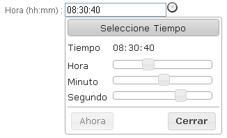

#	Componentes RUP – Hora

<!-- MDTOC maxdepth:6 firsth1:1 numbering:0 flatten:0 bullets:1 updateOnSave:1 -->

   - [1   Introducción](#1-introducción)   
   - [2   Ejemplo](#2-ejemplo)   
   - [3   Casos de uso](#3-casos-de-uso)   
   - [4   Infraestructura](#4-infraestructura)   
      - [4.1 Ficheros](#4.1-ficheros)   
      - [4.2 Dependencias](#4.2-dependencias)   
      - [4.3 Versión minimizada](#4.3-versión-minimizada)   
   - [5   Invocación](#5-invocación)   
   - [6   API](#6-api)   
   - [7   Interacción con teclado](#7-interacción-con-teclado)   
   - [8   Sobreescritura del theme](#8-sobreescritura-del-theme)   
   - [9   Integración con UDA](#9-integración-con-uda)   

<!-- /MDTOC -->


##	1	Introducción
La descripción del Componente Hora, visto desde el punto de vista de **RUP**, es la siguiente:
*El usuario puede introducir y seleccionar una hora tanto de forma manual como visual, moviéndose fácilmente por las horas y los minutos, recibiendo ayudas y sugerencias para minimizar las posibilidades de introducir una hora incorrecta.*

##	2	Ejemplo
Se muestra a continuación una captura de un ejemplo típico del componente:


##	3	Casos de uso
Se recomienda el uso del componente:
+	Cuando el usuario tenga que introducir una hora y se quiera ofrecer flexibilidad para escribirla manualmente o seleccionándola de un calendario.

##	4	Infraestructura
A continuación se comenta la infraestructura necesaria para el correcto funcionamiento del componente.
+	Únicamente se requiere la inclusión de los ficheros que implementan el componente *(js y css)* comentados en los apartados *Ficheros y Dependencias*.

###	4.1	Ficheros
Ruta Javascript: rup/scripts/
Fichero de plugin: **rup.time-x.y.z.js**
Ruta theme: rup/css/
Fichero CSS del theme: **theme.rup.time-x.y.z.css**

###	4.2	Dependencias
Por la naturaleza de desarrollo de los componentes (patrones) como plugins basados en la librería JavaScript ***jQuery***, es necesaria la inclusión del esta. La versión elegida para el desarrollo ha sido la versión **1.12.4**.
+	**jQuery 1.12.4**: http://jquery.com/

La gestión de la ciertas partes visuales de los componentes, se han realizado medieante el plugin ***jQuery UI*** que se basa en *jQuery* y se utiliza para construir aplicaciones web altamente interactivas. Este plugin, proporciona abstracciones de bajo nivel de interacción y animación, efectos avanzados de alto nivel, componentes personalizables (estilos) ente otros. La versión utilizada en el desarrollo ha sido la **1.12.0**.
+	**jQuery UI 1.12.0**: http://jqueryui.com/

Los ficheros necesarios para el correcto funcionamiento del componente son:

	jquery-1.12.4.js
	jquery-ui-1.12.0.custom.js
	jquery-ui-1.12.0.custom.css
	jquery-ui.timepicker.js
	rup.base-x.y.z.js
	rup.time-x.y.z.js
	theme.rup.time-x.y.z.css

###	4.3	Versión minimizada
A partir de la versión v2.4.0 se distribuye la versión minimizada de los componentes RUP. Estos ficheros contienen la versión compactada y minimizada de los ficheros javascript y de estilos necesarios para el uso de todos los compontente RUP.
Los ficheros minimizados de RUP son los siguientes:
+	**rup/scripts/min/rup.min-x.y.z.js**
+	**rup/css/rup.min-x.y.z.css**

Estos ficheros son los que deben utilizarse por las aplicaciones. Las versiones individuales de cada uno de los componentes solo deberán de emplearse en tareas de desarrollo o depuración.

##	5	Invocación
Este componente se invocará mediante un selector que indicará todos los elementos sobre los que se va a aplicar el patrón Fecha. Por ejemplo:
```javascript
$("#id_input").rup_time (properties);
```
Donde el parámetro *“properties”* es un objeto *(var properties = {};)* o bien directamente la declaración de lo valores directamente. Sus posibles valores se detallan en el siguiente apartado.

##	6	API

Para ver en detalle la API del componente vaya al siguiente [documento](../api/rup.time.md).

##	7	Interacción con teclado
La interacción natural con el componente es mediante el ratón, pero se han añadido la posibilidad de manipular los valores mediante el teclado para agilizar su uso lo que ahorra mucho tiempo a los usuarios avanzados.

Cuando el campo asociado al componente recibe el foco se muestra el desplegable. En este momento si se introduce una hora (siguiendo el formato especificado) utilizando los números del teclado, el componente actualiza sus barras de scroll con el valor introducido manualmente. Mediante flechas de dirección (←, ↑, →, ↓) se puede desplazar el cursor a través del campo de hora para modificarla, además de borrar ciertos valores mediante las teclas suprimir y tecla de retroceso (backspace). Con la tecla escape se cerrará el desplegable.

Existen unos atajos de teclado para poder manipular las barras de scroll sin tener que utilizar los números del teclado que son los siguientes:
+	CTRL + ← : Disminuye la hora
+	CTRL + → : Aumente la hora
+	CTRL + SHIFT + ← : Disminuye los minutos
+	CTRL + SHIFT + → : Aumenta los minutos
+	CTRL + SHIFT + ALT + ← : Disminuye los segundos
+	CTRL + SHIFT + ALT + → : Aumenta los segundos

##	8	Sobreescritura del theme
El componente hora se presenta con una apariencia visual definida en el fichero de estilos **theme.rup.time-x.y.z.css**.

Si se quiere modificar la apariencia del componente, se recomienda redefinir el/los estilos necesarios en un fichero de estilos propio de la aplicación situado dentro del proyecto de estáticos *(codAppStatics/WebContent/codApp/styles)*.

Los estilos del componente se basan en los estilos básicos de los widgets de jQuery UI, con lo que los cambios que se realicen sobre su fichero de estilos manualmente o mediante el uso de la herramienta [Theme Roller](http://jqueryui.com/themeroller/) podrán tener repercusión sobre todos los componentes que compartan esos mismos estilos (pudiendo ser el nivel de repercusión general o ajustado a un subconjunto de componentes).

Ejemplo base de la estructura generada por el componente (estructura interna que forma el desplegable, no se incluye el input sobre el que se aplica el componente):

```xml
<div class="ui-timepicker-div" id="ui-timepicker-div-hora">
<div class="ui-widget-header ui-helper-clearfix ui-corner-all">
	<div class="ui-datepicker-title">Seleccione Tiempo</div>
	</div>
	<dl>
dt class="ui_tpicker_time_label" id="ui_tpicker_time_label_hora">
Tiempo
</dt>
		<dd class="ui_tpicker_time" id="ui_tpicker_time_hora">
08:00:00
</dd>
		<dt class="ui_tpicker_hour_label" id="ui_tpicker_hour_label_hora">
Hora
</dt>
		<dd class="ui_tpicker_hour ui-slider ui-slider-horizontal ui-widget
ui-widget-content ui-corner-all" id="ui_tpicker_hour_hora">
			<a style="left: 34.7826%;" class="ui-slider-handle ui-state-
default ui-corner-all" href="#"></a>
		</dd>

		<dt class="ui_tpicker_minute_label"
id="ui_tpicker_minute_label_hora">
Minuto
</dt>
		<dd class="ui_tpicker_minute ui-slider ui-slider-horizontal ui-
widget ui-widget-content ui-corner-all" id="ui_tpicker_minute_hora">
			<a style="left: 0%;" class="ui-slider-handle ui-state-default
ui-corner-all" href="#"></a>
		</dd>			
<dt class="ui_tpicker_second_label"
id="ui_tpicker_second_label_hora">
Segundo
</dt>

		<dd class="ui_tpicker_second ui-slider ui-slider-horizontal ui-
widget ui-widget-content ui-corner-all" id="ui_tpicker_second_hora">
			<a style="left: 0%;" class="ui-slider-handle ui-state-default
ui-corner-all" href="#"></a>
		</dd>
	</dl>
</div>
<div class="ui-datepicker-buttonpane ui-widget-content">
<button type="button" class="ui-datepicker-current ui-state-default ui-priority-secondary ui-corner-all" onclick="DP_jQuery_1301919639240.datepicker._gotoToday('#hora');">
Ahora
</button>
	<button type="button" class="ui-datepicker-close ui-state-default ui-
priority-primary ui-corner-all" onclick="DP_jQuery_1301919639240.datepicker._hideDatepicker();">
Cerrar
</button>
</div>


```

NOTA: El componente genera adicionalmente una estructura para la manipulación de fechas combinada con la manipulación de horas que no se utiliza y por ello se ha omitido. Además la estructura presentada podría variar algo en función de los atributos indicados en la configuración.


##	9	Integración con UDA
Para facilitar la serialización/deserialización de los datos entre los objetos java y los componentes hora, desde UDA se proporcionan las siguientes clases. Estas clases definen tanto serializadores como deserializadores para el componente Jackson utilizado en UDA.

Estas clases son utilizadas por las anotaciones @JsonSerialize y @JsonDeserialize de Jackson. Al incluir estas anotaciones en los métodos setter y setter de los model se determina el modo en que Jackson va a realizar la serialización y deserialización de estos tipos de datos.

•	com.ejie.x38.control.JsonTimeSerializer: Realiza la serialización de un tipo de dato Date en su representación json correspondiente. El valor json resultante contiene la información de la hora. (HH:mm:ss).
En el proceso de serialización se tiene en cuenta el idioma utilizado por el usuario en la aplicación para utilizar el formato correcto de la hora. Un ejemplo de uso sería el siguiente:

```java
@JsonSerialize(using = JsonTimeSerializer.class)
	public Date getHora() {
		return this.hora;
	}
```
•	com.ejie.x38.control.JsonDateDeserializer: Realiza la deserialización de un objeto json que contiene la representación de una fecha válida en un tipo de dato Date.
El objeto json debe contener una hora válida de acuerdo al formato definido por la locale correspondiente al idioma utilizado en la aplicación por el usuario. Este formado solo comprenderá la parte de la hora ignorando la fecha. (HH:mm:ss).
Un ejemplo de uso sería el siguiente:

```java
@JsonDeserialize(using = JsonTimeDeserializer.class)
	public void setFechaBaja(Date hora) {
		this.hora = hora;
}
```
