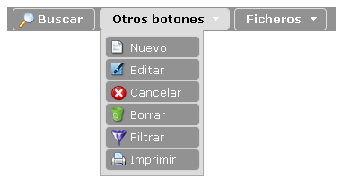
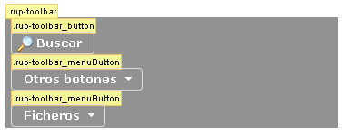
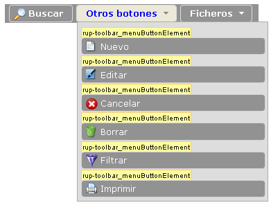
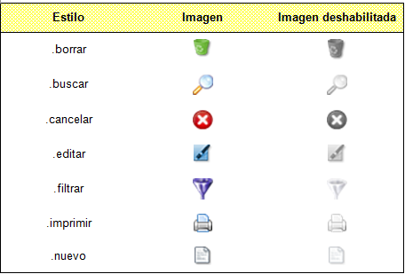
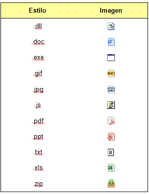

# Componentes RUP – Botonera

<!-- MDTOC maxdepth:6 firsth1:1 numbering:0 flatten:0 bullets:1 updateOnSave:1 -->

   - [1 Introducción](#1-introducción)   
   - [2 Ejemplo](#2-ejemplo)   
   - [3 Casos de uso](#3-casos-de-uso)   
   - [4 Infraestructura](#4-infraestructura)   
      - [4.1 Ficheros](#4.1-ficheros)   
      - [4.2 Dependencias](#4.2-dependencias)   
      - [4.3 Versión minimizada](#4.3-versión-minimizada)   
   - [5 Invocación](#5-invocación)   
   - [6 API](#6-api)   
   - [7 Sobreescritura del theme](#7-sobreescritura-del-theme)   

<!-- /MDTOC -->

##  1 Introducción
 La descripción del **Componente Botonera**, visto desde el punto de vista de RUP, es la siguiente:

*Se les presenta a los usuarios una barra de botones con diversas funcionalidades relacionadas a elementos de la página. Gracias a este componente se presentan, ordenan y agrupan las distintas funcionalidades gestionadas por las aplicaciones.*

##  2 Ejemplo
Se presentan a continuación un ejemplo del componente:


##  3 Casos de uso
Se aconseja la utilización de este componente:
+ En los casos en los que sea preciso presentar, ordenar y agrupar múltiples funciones sobre una misma página o componente.

+ Cuando se requiera agrupar las funciones (botones) por categorías mediante un desplegable.

##  4 Infraestructura
A continuación se comenta la infraestructura necesaria para el correcto funcionamiento del componente.
 + Se requiere la inclusión de los ficheros que implementan el componente *(js y css)* comentados en los apartados *Ficheros y Dependencias*.

### 4.1 Ficheros
Ruta Javascript: rup/scripts/
Fichero de plugin: **rup.toolbar-x.y.z.js**
Ruta theme: rup/css/
Fichero CSS del theme: **theme.rup.toolbar-z.y.z.css**

### 4.2 Dependencias
Por la naturaleza de desarrollo de los componentes (patrones) como plugins basados en la librería JavaScript jQuery, es necesaria la inclusión del esta. La versión elegida para el desarrollo ha sido la versión 1.12.4.
+ **jQuery 1.12.4**: http://jquery.com/

La gestión de la ciertas partes visuales de los componentes, se han realizado mediante el plugin jQuery UI que se basa en jQuery y se utiliza para construir aplicaciones web altamente interactivas. Este plugin, proporciona abstracciones de bajo nivel de interacción y animación, efectos avanzados de alto nivel, componentes personalizables (estilos) ente otros. La versión utilizada en el desarrollo ha sido la 1.12.0.

+ **jQuery UI 1.12.0**: http://jqueryui.com/

Los ficheros necesarios para el correcto funcionamiento del componente son:

		jquery-1.12.4.js
        jquery-ui-1.12.0.custom.js
        jquery-ui-1.12.0.custom.css
        rup.base-x.y.z.js
        rup.toolbar-x.y.z.js
        theme.rup.toolbar-x.y.z.css

###     4.3 Versión minimizada
A partir de la versión v2.4.0 se distribuye la versión minimizada de los componentes RUP. Estos ficheros contienen la versión compactada y minimizada de los ficheros javascript y de estilos necesarios para el uso de todos los compontente RUP.
Los ficheros minimizados de RUP son los siguientes:
+ **rup/scripts/min/rup.min-x.y.z.js**
+ **rup/css/rup.min-x.y.z.css**

Estos ficheros son los que deben utilizarse por las aplicaciones. Las versiones individuales de cada uno de los componentes solo deberán de emplearse en tareas de desarrollo o depuración.

##  5 Invocación
Este componente se aplica sobre una capa definida que tendrá como objeto el mostrar una serie de botones al usuario con diferentes funcionalidades. Será labor del desarrollador definir dicha capa en su página y definir un identificador que se utilizará en la invocación del componente.
```javascript
$("#id_capa").rup_toolbar(properties);
```
Donde el parámetro *“properties”* es un objeto *(var properties = {};)* o bien directamente la declaración de lo valores directamente. Sus posibles valores se detallan en el siguiente apartado.

##  6 API
Para ver en detalle la API del componente vaya al siguiente [documento](../api/rup.toolbar.md).

##  7 Sobreescritura del theme
El componente toolbar se presenta con una apariencia visual definida en el fichero de estilos theme.rup.toolbar-x.y.z.css.
Si se quiere modificar la apariencia del componente, se recomienda redefinir el/los estilos necesarios en un fichero de estilos propio de la aplicación situado dentro del proyecto de estáticos (codAppStatics/WebContent/codApp/styles).
Los estilos del componente se basan en los estilos básicos de los widgets de jQuery UI, con lo que los cambios que se realicen sobre su fichero de estilos manualmente o mediante el uso de la herramienta Theme Roller podrán tener repercusión sobre todos los componentes que compartan esos mismos estilos (pudiendo ser el nivel de repercusión general o ajustado a un subconjunto de componentes).
A continuación se muestran unas capturas del componente con los estilos asociados dependiendo del uso de imágenes. Los estilos que contengan la palabra “ui-“ son los propios de jQuery UI que en caso de ser necesario serán sobrescritos y no se comentarán en este documento por no ser su ámbito.

La primera captura dispone los botones en vertical para mejorar la compresión de los estilos aplicados a cada elemento.


La segunda captura muestra los estilos asociados al menú desplegable.


+ **.rup-toolbar**: estilo asociado a la capa que contiene la botonera.
+	**.rup-toolbar_button**: estilo asociado a los botones.
+	**.rup-toolbar_button:hover**: estilo asociado a los botones cuando el cursor está encima.
+	**.rup-toolbar_menuButton**: estilo asociado al botón que despliega un menú.
+	**.rup-toolbar_menuButton:hover**: estilo asociado al botón que despliega un menú cuando el cursor está encima.
+	**.rup- toolbar_menuButtonSlided**: estilo asociado al botón que despliega un menú de botones cuando está desplegado el menú pero sin el cursor encima del botón.
+	**.rup- toolbar_menuButtonContainer**: estilo asociado a la capa que contiene el menú desplegable del “mbutton” (botón que despliega menú con botones).
+	**.rup- toolbar_menuButtonContainer**: estilo asociado a cada botón del menú desplegable.
+	**.rup- toolbar_menuButtonIcon**: estilo de la imagen asociada al botón que despliega un menú. Por defecto tomará la imagen seleccionada en el theme de jQuery UI.
+	**.rup- toolbar_menuButtonSlided .rup- toolbar_menuButtonIcon**: estilo de la imagen asociada al botón que despliega un menú cuando este se encuentra desplegado. Por defecto tomará la imagen seleccionada en el theme de jQuery UI.
+	**.rup-toolbar_menuButtonElement .ui-button-text**: estilo asociado al texto de cada botón del menú desplegable.

Se ha establecido que los tamaños de los iconos que se muestran en la botonera sean de 18x18 píxeles. En caso de querer modificar dicho tamaño se deberá sobrescribir los estilos:
+	**.rup-toolbar_button .ui-button-icon-primary**
+	**.rup-toolbar_menuButton .ui-button-icon-primary**

Se incluye una serie de iconos básicos que se muestran a continuación. Los nombres son significativos para indicar claramente la imagen a mostrar. Si se desea que la imagen salga deshabilitada (tonalidades grises), bastará con añadir el estilo “disabled” al elemento que contenga el estilo de la imagen. A continuación se muestran los iconos incluidos:


Adicionalmente también se incluye una iconografía básica para representar los diferentes tipos de extensiones que suelen tener los ficheros.

