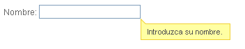

#	Componentes RUP – Tooltip

<!-- MDTOC maxdepth:6 firsth1:1 numbering:0 flatten:0 bullets:1 updateOnSave:1 -->

   - [1   Introducción](#1-introducción)   
   - [2   Ejemplo](#2-ejemplo)   
   - [3   Casos de uso](#3-casos-de-uso)   
   - [4 Infraestructura](#4-infraestructura)   
      - [4.1 Ficheros](#4.1-ficheros)   
      - [4.2 Dependencias](#4.2-dependencias)   
      - [4.3.    Versión minimizada](#4.3-versión-minimizada)   
   - [5   Invocación](#5-invocación)   
   - [6 API](#6-api)   
   - [7   Sobreescritura del theme](#7-sobreescritura-del-theme)   

<!-- /MDTOC -->


##	1	Introducción
La descripción del componente *tooltip*, visto desde el punto de vista de **RUP**, es la siguiente:

*Todas las aplicaciones deben tener un sistema de ayuda aunque algunas necesiten uno más completo y preciso que otras. El objetivo del sistema de ayuda debe ser, por un lado ayudar al impaciente y/o al usuario ocasional tan extensamente como sea posible y, por otro, ayudar a los usuarios expertos.*

##	2	Ejemplo
Se presenta a continuación un ejemplo de este componente:


##	3	Casos de uso
Se recomienda el uso del componente:
+	Cuando se desea añadir una ayuda/descripción extra sobre algún componente de tal manera que se muestre al interaccionar con dicho componente.

##	4 Infraestructura
A continuación se comenta la infraestructura necesaria para el correcto funcionamiento del componente.

+	Únicamente se requiere la inclusión de los ficheros que implementan el componente *(js y css)* comentados en los apartados *Ficheros y Dependencias*.


###	4.1	Ficheros
Ruta Javascript: rup/scripts/
Fichero de plugin: **rup.tootlip-x.y.z.js**
Ruta theme: rup/basic-theme/
Fichero CSS del theme: **theme.rup.tooltip-x.y.z.css**

###	4.2	Dependencias
Por la naturaleza de desarrollo de los componentes (patrones) como *plugins* basados en la librería *JavaScript* **jQuery**, es necesaria la inclusión del esta. La versión elegida para el desarrollo ha sido la versión **1.12.4**.
+	**jQuery 1.12.4**: http://jquery.com/

La gestión de la ciertas partes visuales de los componentes, se han realizado medieante el *plugin* **jQuery UI** que se basa en *jQuery* y se utiliza para construir aplicaciones web altamente interactivas. Este *plugin*, proporciona abstracciones de bajo nivel de interacción y animación, efectos avanzados de alto nivel, componentes personalizables (estilos) ente otros. La versión utilizada en el desarrollo ha sido la **1.12.0**.
+	**jQuery UI 1.12.0**: http://jqueryui.com/

Las distintas funcionalidades que aporta el componente y las prestaciones generales del mismo, se apoyan en el *plugin* **Qtip2**. Para el correcto funcionamiento del componente *Tooltip*, se precisa de la inclusión de dicho *plugin*.
+	**Qtip2**: http://craigsworks.com/projects/qtip2/

Los ficheros necesarios para el correcto funcionamiento del componente son:

    jquery-1.12.4.js
	jquery-ui-1.12.0.custom.js
	jquery-ui-1.12.0.custom.css
	jquery.qtip.js
	rup.base-x.y.z.js
	rup.tooltip-x.y.z.js
	theme.rup.tooltip-x.y.z.css

###	4.3	Versión minimizada
A partir de la versión v2.4.0 se distribuye la versión minimizada de los componentes **RUP**. Estos ficheros contienen la versión compactada y minimizada de los ficheros *javascript* y de estilos necesarios para el uso de todos los compontente **RUP**.

Los ficheros minimizados de **RUP** son los siguientes:
+	**rup/scripts/min/rup.min-x.y.z.js**
+	**rup/basic-theme/rup.min-x.y.z.css**

Estos ficheros son los que deben utilizarse por las aplicaciones. Las versiones individuales de cada uno de los componentes solo deberán de emplearse en tareas de desarrollo o depuración.


##	5	Invocación
Este componente se invocará mediante un selector que indicará todos los elementos sobre los que se va a aplicar el componente tooltip. Lo más fácil sería utilizar el selector siguiente:
```javascript
$(selector).rup_tootlip(properties);
```

Donde el parámetro *“properties”* es un objeto *(var properties = {};)* o bien directamente la declaración de los valores, detallados en el siguiente apartado.

##	6 API
Para ver en detalle la API del componente vaya al siguiente [documento](../api/rup.tooltip.md).

##	7	Sobreescritura del theme
El componente *tooltip* se presenta con una apariencia visual definida en el fichero de estilos **theme.rup.tooltip-x.y.z.css**.

Si se quiere modificar la apariencia del componente, se recomienda redefinir el/los estilos necesarios en un fichero de estilos propio de la aplicación situado dentro del proyecto de estáticos *(codAppStatics/WebContent/codApp/styles)*.

Los estilos del componente se basan en los estilos básicos de los widgets de *jQuery UI*, con lo que los cambios que se realicen sobre su fichero de estilos manualmente o mediante el uso de la herramienta Theme Roller podrán tener repercusión sobre todos los componentes que compartan esos mismos estilos (pudiendo ser el nivel de repercusión general o ajustado a un subconjunto de componentes).

Los estilos que contengan la palabra *“ui-“* son los propios de *jQuery UI* que en caso de ser necesario serán sobrescritos y no se comentarán en este documento por no ser su ámbito. Es importante tener en cuenta que, si se cambia el aspecto del componente tooltip mediante el [Theme Roller](http://jqueryui.com/themeroller/), es posible que, también se cambie el aspecto de algunos otros componentes indirectamente (por ejemplo: el componente menú). Este efecto colateral, se debe a que algunos objetos de *JQuery-UI* comparten estilos, para mantener el modelo general de las páginas

Al aplicar de manera directa (online) los estilos del Theme Roller (ej. invocando *$.rup.themeRoller())*, puede ser que los estilos del *tooltip* no se vean afectados por los cambios. Para ello se deberá invocar la siguiente sentencia que modifica la gestión de estilos de los *tooltips* creados:
```javascript
$(".qtip").rup_tooltip('option', 'style.widget', true);
```
 NOTA: Para el correcto funcionamiento, los *tooltips* deben haberse mostrado al menos una vez para que el componente *tooltip* cree los elementos en el árbol *DOM*.
