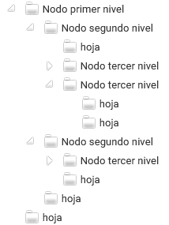
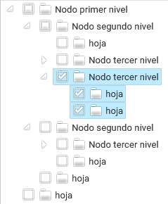
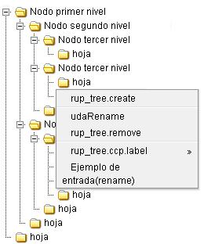
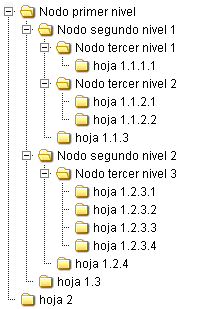
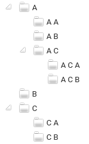
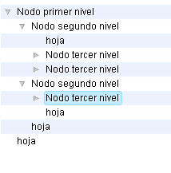
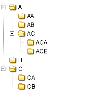

# Componentes RUP – Árbol

<!-- MDTOC maxdepth:6 firsth1:1 numbering:0 flatten:0 bullets:1 updateOnSave:1 -->

   - [1 Introducción](#1-introducción)   
   - [2 Ejemplo](#2-ejemplo)   
   - [3 Casos de uso](#3-casos-de-uso)   
   - [4 Infraestructura](#4-infraestructura)   
      - [4.1 Ficheros](#4.1-ficheros)   
      - [4.2 Dependencias](#4.2-dependencias)   
      - [4.3 Versión minimizada](#4.3-versión-minimizada)   
   - [5 Invocación](#5-invocación)   
   - [6 Obtención de los datos](#6-obtención-de-los-datos)   
      - [6.1 Html](#6.1-html)   
      - [6.2 JSON](#6.2-json)   
      - [6.3 XML](#6.3-xml)   
      - [6.4 Carga mediante Ajax](#6.4-carga-mediante-ajax)   
   - [7 Plugins](#7-plugins)   
      - [7.1 Core](#7.1-core)   
         - [7.1.1 Propiedades](#7.1.1-propiedades)   
         - [7.1.2 Funciones](#7.1.2-funciones)   
      - [7.2 Checkbox](#7.2-checkbox)   
      - [7.3 Menú contextual](#7.3-menú-contextual)   
      - [7.4 Ordenación](#7.4-ordenación)   
      - [7.5 Selección (UI)](#7.5-selección-ui)   
      - [7.6 Theme](#7.6-theme)   
      - [7.7 Nodos únicos](#7.7-nodos-únicos)   
   - [8 Sobreescritura del theme](#8-sobreescritura-del-theme)   

<!-- /MDTOC -->

## 1 Introducción
La descripción del **Componente Árbol**, visto desde el punto de vista de RUP, es la siguiente:

*Permite al usuario mostrar y ocultar de manera selectiva, información mostrada en una estructura jerárquica.*

## 2 Ejemplo
Se presenta a continuación un ejemplo de este componente:


## 3 Casos de uso
Se aconseja la utilización de este componente:

- Cuando sea necesario mostrar información jerarquizada.


## 4 Infraestructura
A continuación se comenta la infraestructura necesaria para el correcto funcionamiento del componente.

- Únicamente se requiere la inclusión de los ficheros que implementan el componente (js y css) comentados en los apartados Ficheros y Dependencias.

### 4.1 Ficheros
Ruta Javascript: rup/scripts/
Fichero de plugin: **rup.tree-x.y.z.js**
Ruta theme: rup/css/
Fichero CSS del theme: **theme.rup.tree-x.y.z.css**

### 4.2	Dependencias
Por la naturaleza de desarrollo de los componentes (patrones) como plugins basados en la librería JavaScript jQuery, es necesaria la inclusión del esta. La versión elegida para el desarrollo ha sido la versión 1.8.0.

•	**jQuery 3.4.1**: http://jquery.com/
	La gestión de la ciertas partes visuales de los componentes, se han realizado mediante el plugin jQuery UI que se basa en jQuery y se utiliza para construir aplicaciones web altamente interactivas. Este plugin, proporciona abstracciones de bajo nivel de interacción y animación, efectos avanzados de alto nivel, componentes personalizables (estilos) ente otros. La versión utilizada en el desarrollo ha sido la 1.8.23.

•	**jQuery UI 1.12.0**: http://jqueryui.com/
	Las distintas funcionalidades que aporta el componente y las prestaciones generales del mismo, se apoyan en el plugin jsTree. Para el correcto funcionamiento del componente Arbol, se precisa de la inclusión de dicho plugin.

•	**jsTree 3.x**: https://www.jstree.com/

Los ficheros necesarios para el correcto funcionamiento del componente son:
	- jquery-3.4.1.js
	- jquery.jstree.js
	- rup.tree-x.y.z.js

###	4.3 Versión minimizada
A partir de la versión v2.4.0 se distribuye la versión minimizada de los componentes RUP. Estos ficheros contienen la versión compactada y minimizada de los ficheros javascript y de estilos necesarios para el uso de todos los compontente RUP.

Los ficheros minimizados de RUP son los siguientes:
	- rup/scripts/min/rup.min-x.y.z.js
	- rup/css/rup.min-x.y.z.css

Estos ficheros son los que deben utilizarse por las aplicaciones. Las versiones individuales de cada uno de los componentes solo deberán de emplearse en tareas de desarrollo o depuración.

##	5 Invocación
El componente árbol se invoca sobre un elemento html existente en la jsp. Dicho elemento servirá de contenedor del arbol.
Un contenedor válido puede ser un simple tag div:

```xml
<div id="ejemploArbolDiv"><div>

```

La invocación del componente sobre el contenedor se realiza del siguiente modo:
```javascript
var properties={
	// Propiedades de configuración		
};
$("#ejemploArbolDiv").rup_tree(properties);
```


Como ya se profundizará mas adelante, mediante las propiedades indicadas en la invocación del componente, se realiza la configuración del mismo.

## 6 Obtención de los datos
El componente permite inicializar los nodos que componen el árbol a partir de diferentes tipos de datos. Es posible utilizar información en formato html, xml o json.

###	6.1 Html
El componente permite inicializar los datos del árbol a partir de una lista html compuesta por los elementos ul y li.
Un ejemplo de una estructura html sería la siguiente:

```xml
<div id="tree_example" class="tree_example_code">
	<ul>
		<li id="node1">
			<a href="#">Padre 1</a>
			<ul>
				<li id="node11">
					<a href="#">Padre 1.1</a>
					<ul>
						<li id="node111">
							<a href="#">Hoja 1.1.1</a>
						</li>
						<li id="node112">
							<a href="#">Padre 1.1.2</a>
							<ul>
								<li id="node1121">
									<a href="#">Hoja 1.1.2.1</a>
								</li>
								<li id="node1122">
									<a href="#">Hoja 1.1.2.2</a>
								</li>
							</ul>
						</li>
					</ul>
				</li>
				<li id="node12">
					<a href="#">Hoja 1.2></a>
				</li>
			</ul>
		</li>
	</ul>
</div>
```

La invocación necesaria al componente para la creación del árbol a partir del html anterior sería:
```javascript
$("#tree_example").rup_tree({
});
```

El componente toma como opción por defecto la inicialización del árbol a partir del html del objeto sobre el que se inicializa, de modo que no sería necesario indicar ningún parámetro adicional.

Las propiedades con las que se puede parametrizar la inicialización del componente árbol mediante html se detallan en la [API](https://www.jstree.com/docs/html) del plugin subyacente jsTree.

###	6.2 JSON
El componente permite inicializar los datos que se muestran en el árbol a partir de la información existente en un objeto JSON.
Al no obtener los datos a partir de un html el objeto sobre el que se inicializa se simplifica:

```xml
<div id="tree_example" class="tree_example_code"></div>
```

El objeto JSON se indicaría en la inicialización del componente árbol (las claves "**data**" y "**children**" han de llamarse obligatoriamente así):

```javascript
$("#tree_example").rup_tree({
	"core" : {
		"initially_open" : ["Padre 1" ]
	},
	"json_data" : {
		"data" : [ {
			"data" : "Padre 1",
			"children" : [
			  {
            	  "data":"Padre 1.1",
            	  "children" : [{
            		  "data":"Hoja 1.1.1"
            	  },
            	  {
            		  "data":"Padre 1.1.2",
            		  "children" : ["Hoja 1.1.2.1","Hoja 1.1.2.2"]
            	  }]
			},
			{
				"data":"Hoja 1.2"
			}]
		}]
	}
});
```

Las propiedades con las que se puede parametrizar la inicialización del componente árbol mediante json se detallan en la [API](https://www.jstree.com/docs/html) del plugin subyacente jsTree.

###	6.3 XML
El componente permite inicializar los datos que se muestran en el árbol a partir de la información existente en un XML.
Al no obtener los datos a partir de un html el objeto sobre el que se inicializa se simplifica:
```xml
<div id="tree_example" class="tree_example_code"></div>
```

El contenido del XML se indicaría en la inicialización del componente árbol:


```javascript
$("#xmlTreeDemo").rup_tree({
	"core" : {
		"initially_open" : ["padre_1" ]
	},
	"xml_data" : {
		"data" : ""+
			"<root>"+
				"<item id='padre_1'>"+
					"<content><name><![CDATA[Padre 1]]></name></content>"+
					"<item id='padre_1_1' parent_id='padre_1'>"+
						"<content><name><![CDATA[Padre 1.1]]></name></content>"+
						"<item id='hoja_1_1_1' parent_id='padre_1_1'>"+
							"<content><name><![CDATA[Hoja 1.1.1]]></name></content>"+
						"</item>"+
						"<item id='padre_1_1_2' parent_id='padre_1_1'>"+
							"<content><name><![CDATA[Padre 1.1.2]]></name></content>"+
							"<item id='hoja_1_1_2_1' parent_id='padre_1_1_2'>"+
								"<content><name><![CDATA[Hoja 1.1.2.1]]></name></content>"+
							"</item>"+
							"<item id='hoja_1_1_2_2' parent_id='padre_1_1_2'>"+
								"<content><name><![CDATA[Hoja 1.1.2.2]]></name></content>"+
							"</item>"+
						"</item>"+
					"</item>"+
					"<item id='hoja_1_2' parent_id='padre_1'>"+
						"<content><name><![CDATA[Hoja 1.2]]></name></content>"+
					"</item>"+
				"</item>"+
			"</root>"
	}
});
```

Las propiedades con las que se puede parametrizar la inicialización del componente árbol mediante xml se detallan en la [API](https://www.jstree.com/docs/html) del plugin subyacente jsTree.

###	6.4 Carga mediante Ajax
El componente permite inicializar los datos del árbol a partir de la respuesta de una petición AJAX. En la API del plugin jsTree se detalla la configuración necesaria para inicializar el árbol mediante una petición AJAX que devuelva datos en formato html, json o xml.

Como ejemplo, vamos a detallar la implementación necesaria para inicializar un árbol mediante un objeto json que es devuelto por una petición AJAX.

El contenedor del árbol definido en la jsp sería:
```xml
<div id="tree_example" class="tree_example_code" name=”nombre_de_la_propiedad” ></div>
```

El objeto JSON se indicaría en la inicialización del componente árbol:
```javascript
$("#tree_example").rup_tree({
	"json_data" : {
		"ajax" : {
			"url" : "url_peticion_ajax"			
		}
	}
});
```
Desde el controller que escucha la petición se devolverá el json correspondiente a la representación de elementos que se quiere visualizar en el árbol.

```java
@RequestMapping(value = "url_peticion_ajax", method = RequestMethod.GET)
public Object getTreeAjax(Model model, HttpServletResponse response) {
	// Se crea y retorna el objeto json
}
```
El formato del objeto json es idéntico que en el caso de proporcionarse en la inicialización del componente.

##	7 Plugins
El diseño del componente árbol sigue el mismo modelo modular que el plugin subyacente en el que se basa. De este modo las diferentes funcionalidades se implementan en forma de módulos o plugins.
Los plugins existentes son los siguientes:
###	7.1 Core
Proporciona las propiedades de configuración para las funcionalidades comunes.
La configuración del plugin se realiza mediante la propiedad core  de las opciones de invocación del componente:
```javascript
$("#ejemploArbolDiv").rup_tree({
	"core":{
	}
});
```
####	7.1.1 Propiedades
A continuación se muestran los posibles parámetros de configuración que recibe el componente.
- **getValue**: Permite especificar una función de callback para implementar el dato a emplear a la hora de ejecutar los métodos getRupValue y setRupValue.
```javascript
$("#tree").rup_tree({
		"core":{
			"getValue":function($item, itemData){
				return itemData.id;				
			}
		}
	});
```
- **readAsString**: Permite asignar elementos seleccionados indicados mediante un string de identificadores separados por comas.

- **submitAsJSON**: Determina que los elementos seleccionados se enviarán representados mediante un objeto JSON. Por defecto false.

- **submitAsString**: Determina que los elementos seleccionados se enviarán representados mediante un string de identificadores separados por comas. Por defecto false.

####	7.1.2 Funciones
- **getRupValue**: método utilizado para obtener el valor del componente. Este método es el utilizado por el resto de componentes RUP para estandarizar la  obtención del valor del Autocomplete.
```javascript
$(selector).rup_autocomplete("getRupValue");
```
- **setRupValue**: método utilizado para asignar el valor al componente. Este método es el utilizado por el resto de componentes RUP para estandarizar la  asignación del valor al Autocomplete.
```javascript
$(selector).rup_autocomplete("setRupValue",value);:
```
El resto de propiedades y funciones de configuración del plugin core pueden consultarse en la [API](https://www.jstree.com/docs/html)  del plugin jsTree.

###	7.2 Checkbox

Añade un campo checkbox a cada nodo que se visualiza en el árbol.



La configuración del plugin se realiza mediante la propiedad checkbox de las opciones de invocación del componente:
```javascript
$("#ejemploArbolDiv").rup_tree({
	"checkbox":{
	}
});
```
Las propiedades de configuración del plugin checkbox pueden consultarse en la [API](https://www.jstree.com/docs/html)  del plugin jsTree.

###	7.3	Menú contextual
Añade un menú contextual a cada nodo que se visualiza en el árbol.



La configuración del plugin se realiza mediante la propiedad contextmenu de las opciones de invocación del componente:
 ```javascript
$("#ejemploArbolDiv").rup_tree({
	"contextmenu":{
	}
});
```
Las propiedades de configuración del plugin contextmenu pueden consultarse en la  [API](https://www.jstree.com/docs/html)  del plugin jsTree.

###	7.4 Ordenación
Ordena automáticamente los nodos que se muestran en la tabla.



La configuración del plugin se realiza mediante la propiedad sort de las opciones de invocación del componente:
 ```javascript
$("#ejemploArbolDiv").rup_tree({
	"sort":{
	}
});
```
Las propiedades de configuración del plugin sort pueden consultarse en la [API](https://www.jstree.com/docs/html) del plugin jsTree.

###	7.5 Selección UI
El plugin UI gestiona la selección, deselección y resaltado de nodos.


La configuración del plugin se realiza mediante la propiedad ui de las opciones de invocación del componente:
 ```javascript
$("#ejemploArbolDiv").rup_tree({
	"ui":{
	}
});
```
Las propiedades de configuración del plugin ui pueden consultarse en la [API](https://www.jstree.com/docs/html) del plugin jsTree.

###	7.6 Theme
El plugin Theme controla la apariencia del componente árbol.



La configuración del plugin se realiza mediante la propiedad themes de las opciones de invocación del componente:
 ```javascript
$("#ejemploArbolDiv").rup_tree({
	"themes":{
	}
});
```
Las propiedades de configuración del plugin ui pueden consultarse en la [API](https://www.jstree.com/docs/html)  del plugin jsTree.

###	7.7 Nodos únicos
El plugin unique se encarga de evitar que existan dos nodos del mismo padre que tengan el mismo nombre.


La configuración del plugin se realiza mediante la propiedad unique de las opciones de invocación del componente:
 ```javascript
$("#ejemploArbolDiv").rup_tree({
	"unique":{
	}
});
```
Las propiedades de configuración del plugin unique pueden consultarse en la [API](https://www.jstree.com/docs/html) del plugin jsTree.

##	8 Sobreescritura del theme
El componente árbol se presenta con una apariencia visual definida en el fichero de estilos **theme.rup.tree-x.y.z.css**.

Si se quiere modificar la apariencia del componente, se recomienda redefinir el/los estilos necesarios en un fichero de estilos propio de la aplicación situado dentro del proyecto de estáticos *(codAppStatics/WebContent/codApp/styles)*.

Los estilos del componente se basan en los estilos básicos de los widgets de *jQuery UI*, con lo que los cambios que se realicen sobre su fichero de estilos manualmente o mediante el uso de la herramienta [Theme Roller](http://jqueryui.com/themeroller/) podrán tener repercusión sobre todos los componentes que compartan esos mismos estilos (pudiendo ser el nivel de repercusión general o ajustado a un subconjunto de componentes.
