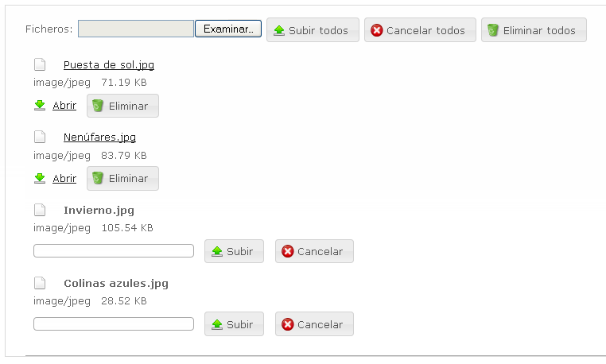

#	Componentes RUP – Upload


<!-- MDTOC maxdepth:6 firsth1:1 numbering:0 flatten:0 bullets:1 updateOnSave:1 -->

   - [1   Introducción](#intro)   
   - [2   Ejemplo](#ejemplo)   
   - [3   Casos de uso](#casos-de-uso)   
   - [4   Infraestructura](#infraestructura)   
      - [4.1 Ficheros](#ficheros)   
      - [4.2 Dependencias](#dependencias)   
      - [4.3 Versión minimizada](#v-minimizada)   
   - [5   Invocación](#invocac)   
      - [5.1 Componente upload independiente](#independiente)   
      - [5.2 Componente upload integrado en formulario](#componente)   
      - [5.3 Varios componentes upload integrados en formuario](#varios-componentes)   
   - [6 API](#api)   
   - [7   Sobreescritura del theme](#theme)   
   - [8   Interacción con el servidor de aplicaciones](#servidor-de-aplicaciones)   
   - [9   Internet Explorer 8](#internet)   
   - [10  Integración con UDA](#uda)   
   - [11  Integración con PIF](#pif)   
      - [11.1    Configuración](#config)   
      - [11.2    Invocación](#invocac2)   

<!-- /MDTOC -->

<a id="intro"></a>
##	1	Introducción
La descripción del ***Componente Upload***, visto desde el punto de vista de *RUP*, es la siguiente:

*Permite al usuario seleccionar uno o varios archivos de su equipo y subirlos a la aplicación.*

<a id="ejemplo"></a>
##	2	Ejemplo
Se presentan a continuación un ejemplo de este componente:



<a id="casos-de-uso"></a>
##	3	Casos de uso
Se aconseja la utilización de este componente:
+	Cuando sea necesario realizar una subida de archivos al servidor.

<a id="infraestructura"></a>
##	4	Infraestructura
A continuación se comenta la infraestructura necesaria para el correcto funcionamiento del componente.
+	Únicamente se requiere la inclusión de los ficheros que implementan el componente *(js y css)* comentados en los apartados *Ficheros y Dependencias*.

<a id="ficheros"></a>
###	4.1	Ficheros
Ruta Javascript: rup/scripts/
Fichero de plugin: **rup.upload-x.y.z.js**
Ruta theme: rup/basic-theme/
Fichero CSS del theme: **theme.rup.upload-x.y.z.css**

<a id="dependencias"></a>
###	4.2	Dependencias
Por la naturaleza de desarrollo de los componentes (patrones) como *plugins* basados en la librería *JavaScript* **jQuery**, es necesaria la inclusión del esta. La versión elegida para el desarrollo ha sido la versión **1.12.4**.
+	**jQuery 1.12.4: http://jquery.com/**

La gestión de la ciertas partes visuales de los componentes, se han realizado mediante el *plugin* **jQuery UI** que se basa en *jQuery* y se utiliza para construir aplicaciones web altamente interactivas. Este plugin, proporciona abstracciones de bajo nivel de interacción y animación, efectos avanzados de alto nivel, componentes personalizables (estilos) ente otros. La versión utilizada en el desarrollo ha sido la **1.12.0**.
+	**jQuery UI 1.12.0**: http://jqueryui.com/

Las distintas funcionalidades que aporta el componente y las prestaciones generales del mismo, se apoyan en el *plugin* *j*Query File Upload**. Para el correcto funcionamiento del componente *Upload*, se precisa de la inclusión de dicho *plugin*.
+	**jQuery-File-Upload**: http://blueimp.github.com/jQuery-File-Upload/

Los ficheros necesarios para el correcto funcionamiento del componente son:

    jquery-1.12.4.js
	jquery-ui-1.12.0.custom.js
	jquery-ui-1.12.0.custom.css
	jquery.fileupload.js
	jquery.fileupload-ui.js
	jquery.fileupload-ui.css
	jquery.xdr-transport.js
	jquery.iframe-transport.js
    rup.base-x.y.z.js
	rup.upload-x.y.z.js
	theme.rup.upload-x.y.z.css

<a id="v-minimizada"></a>
###	4.3	Versión minimizada
A partir de la versión v2.4.0 se distribuye la versión minimizada de los componentes **RUP**. Estos ficheros contienen la versión compactada y minimizada de los ficheros *javascript* y de estilos necesarios para el uso de todos los compontente **RUP**.

Los ficheros minimizados de RUP son los siguientes:
+	**rup/scripts/min/rup.min-x.y.z.js**
+	**rup/basic-theme/rup.min-x.y.z.css**

Estos ficheros son los que deben utilizarse por las aplicaciones. Las versiones individuales de cada uno de los componentes solo deberán de emplearse en tareas de desarrollo o depuración.

<a id="invocac"></a>
##	5	Invocación
<a id="independiente"></a>
###	5.1	Componente upload independiente
Un escenario de uso del componente es en el que se necesita de un sistema de subida de archivos sin necesidad de gestionar otros datos no relacionados con los mismos.

Un ejemplo de la creación de un componente de *upload* independiente sería el siguiente:

Partiremos de la siguiente estructura implementada en la *jsp*:
```xml
<div id="fileupload_only">
	<form action="../upload" id="usuarioForm" enctype="multipart/form-data"
	method="POST">
		<div class="fileupload-buttonbar">
			<label for="file_only">Ficheros: </label>
			<input id="file_only" type="file" name="files[]" multiple="multiple">
			<button type="submit" class="start">Subir todos</button>
			<button type="reset" class="cancel">Cancelar todos</button>
			<button type="button" class="delete">Eliminar todos</button>
		</div>
		<div class="fileupload-content">
			<table class="files"></table>
			<div id="fileupload-progressbar" class="fileupload-progressbar">
            </div>
		</div>
	</form>
</div>
```

Esta estructura conforma la interfaz de usuario que se muestra al usuario para interactuar con el componente. Los elementos que la forman son los siguientes:

+	**Capa contenedora**: Determina el elemento contenedor del resto que conforman el componente.

```xml
<div id="fileupload_only">

	<!—- Resto de contenido -->

</div>
```


+	**Formulario**: Contiene los input file y botones utilizados para seleccionar los archivos a subir y realizar las acciones que permite el componente.

```xml
<form action="../upload" id="usuarioForm" enctype="multipart/form-data"
method="POST">

	<!—- Contenido del formulario -->

</form>
```
Por defecto el componente toma los valores de las propiedades indicadas en el formulario como valores para realizar su configuración. Estos parámetros pueden ser modificados a la hora de crear el componente mediante sus propiedades de configuración.

+	Las propiedades del formulario que afectan al componente son:
	+	**action**: Determina la *url* que va a ser utilizada para realizar la subida de ficheros.

	+	**method**: Método *http* que va a ser utilizado en las peticiones al servidor de aplicaciones para realizar la subida de archivos.

	+	**enctype**: En caso de especificar esta propiedad con el valor *multipart/form-data* el valor de la propiedad de configuración *multipart* se inicializará a *true*.


+	Botonera: Incluye el campo file utilizado para seleccionar los ficheros así como los botones utilizados para gestionar la subida de ficheros.

Esta botonera es identificada por el componente upload debido a que debe llevar en la propiedad class el valor fileupload-buttonbar entre los indicados.
```xml
<div class="fileupload-buttonbar">
	<label for="file_only">Ficheros: </label>
	<!—- Control file -->
	<input id="file_only" type="file" name="files[]"
multiple="multiple">
	<!—- Subida de todos los ficheros encolados -->
	<button type="submit" class="start">Subir todos</button>
	<!—- Cancelar los ficheros encolados que no han sido enviados -->
	<button type="reset" class="cancel">Cancelar todos</button>
	<!—- Eliminar todos los ficheros que han sido enviados -->
	<button type="button" class="delete">Eliminar todos</button>
</div>
```
+	Los elementos que forman la botonera son:

	+	Campo file: Permite la selección de los ficheros por parte del usuario. El campo name determina el nombre del parámetro de la petición en el cual se enviarán los ficheros. En caso de indicar la propiedad *multiple="multiple"*, el componente permitirá la selección de varios ficheros a la vez desde el diálogo de selección de archivos (Esta opción no está soportada en IE8).
```xml
<input id="file_only" type="file" name="files[]"
multiple="multiple">
```

	+	Botón de subida de ficheros: Inicia la subida de todos los ficheros presentes en la lista de ficheros seleccionados. El botón es identificado por el componente mediante el valor start indicado en la propiedad *class*.
```xml
<button type="submit" class="start">Subir todos</button>
```
	+	Botón de cancelar subida: Cancela la subida de todos los ficheros presentes en la lista de ficheros seleccionados que no hayan sido enviados. El botón es identificado por el componente mediante el valor cancel indicado en la propiedad *class*.
```xml
<button type="reset" class="cancel">Cancelar todos</button>
```
	+	Botón de eliminar todos los ficheros: Eliminar los ficheros presentes en la lista de ficheros seleccionados que han sido subidos al servidor. El botón es identificado por el componente mediante el valor *delete* indicado en la propiedad *class*.
```xml
<button type="button" class="delete">Eliminar todos</button>
```

La presencia de estos botones es opcional, por lo que su uso queda sujeto a las necesidades funcionales de la aplicación que deban ser cubiertas.

+	**Lista de ficheros**: Contiene la lista de ficheros que han sido seleccionados por el usuario. La lista es identificada por el componente mediante el valor *fileupload-content* presente en la propiedad *class*. Desde cada una de las entradas que muestra se permite al usuario interactual con cada uno de los ficheros. De este modo permite:

	+	Realizar una subida independiente de un fichero.
	+	Cancelar un fichero concreto.
	+	Eliminar un fichero concreto que haya sido subido.
	+	Mostrar información relacionada del fichero.
	+	Mostrar una barra de progreso de la subida para cada uno de los ficheros.
```xml
<div class="fileupload-content">
	<table class="files"></table>
	<div id="fileupload-progressbar"
class="fileupload-progressbar"></div>
</div>
```
+	A su vez, la lista de ficheros contiene los siguientes elementos.

	+	**Tabla de contenido**: Contiene una línea por cada uno de los ficheros que han sido seleccionados por el usuario. Se identifica mediante el valor files en la propiedad *class*.
```xml
<table class="files"></table>
```
	+	**Barra de progreso global**: Se permite especificar una barra de progreso global para el envío de todos los ficheros agregados a la lista. Se identifica mediante el valor *fileupload-progressbar* en la propiedad *class*.
```xml
<div id="fileupload-progressbar"
class="fileupload-progressbar"></div>
```

**NOTA**:*El componente upload es capaz de enviar junto con la petición de subida de un archivo, los campos que hayan sido incluidos dentro del formulario. Estos cambos se enviarán como parámetros en cada una de las peticiones al servidor de aplicaciones.*

La invocación del componente se realizará mediante un selector que indicará el div en el cual se encuentran todos los elementos que forman la interfaz del componente *upload*.
```javascript
$('#fileupload_only').rup_upload({
		 		fileInput: $("#file_only"),
		 		maxFileSize: 5000000
	 		});
```
Donde el parámetro *“properties”* es un objeto *( var properties = {}; )* o bien directamente la declaración de lo valores directamente. Sus posibles valores se detallan en el apartado 6.

<a id="componente"></a>
###	5.2	Componente upload integrado en formulario
Como se ha comentado anteriormente el componente es capaz de enviar en cada petición de subida de archivos, la información existente en otros campos existentes en el formulario.

Sin embargo, es posible que se requiera el envío de los ficheros junto con los campos del formulario mediante un submit http del formulario. Esto plantea el problema de que únicamente se enviará un fichero por cada compo de tipo *file* existente en el formulario. De este modo no se puede utilizar la lista de ficheros para su envío.

Sin embargo el componente puede ser utilizado para funcionar en este escenario, a pesar de que no se puedan utilizar la mayoría de sus funcionalidades. Su uso queda limitado a mostrar información del fichero así como de presentar controles para cancelar el archivo seleccionado.

Este sería un ejemplo de la estructura que se debería de generar en la *jsp*:
```xml
<div id="fileupload_form">
	<form action="../upload" id="usuarioForm" enctype="multipart/form-data"
method="POST">
		<div class="formulario_linea_izda_float">
			<label id="label_nombre"  for="nombre" >Nombre :</label>
			<input id="nombre" name="nombre" />
		</div>
		<div class="formulario_linea_izda_float">
			<label id="label_apellido1"  
for="apellido1" >Apellido 1:</label>
			<input id="apellido1" name="apellido1" />
		</div>
		<div class="formulario_linea_izda_float">
			<label id="label_apellido2"  
for="apellido2" >Apellido 2:</label>
			<input id="apellido2" name="apellido2" />
		</div>

		<div class="fileupload-buttonbar">
			<label for="file_only">Fichero: </label>
			<input id="file_form" type="file" name="files[]"/>
		</div>
		<div class="fileupload-content">
			<table class="files"></table>
		</div>
		<div class="formulario_columna_cnt">
			<button id="sendButton" type="submit" class="start">
            	Enviar formulario
           </button>
		</div>
	</form>
</div>
```

Y la invocación del componente sería:
```javascript
$('#fileupload_form').rup_upload({
		 fileInput: $("#file_form"),
		 maxFileSize: 5000000,
		 submitInForm:true
	 });
```
Como se puede comprobar, se ha indicado la opción *submitInForm* con el valor true. Esto indica al componente que debe de configurarse para funcionar del modo que hemos comentado en este apartado.

<a id="varios-componentes"></a>
###	5.3	Varios componentes upload integrados en formuario
Este escenario es básicamente una extensión el definido en el apartado anterior. En este caso se definirán dos componentes upload independientes incluidos en el mismo formulario. Como es los casos anteriores, a continuación se muestra la estructura incluida en la *jsp*:
``` xml
<div id="fileupload_form">
	<form action="../upload" id="usuarioForm" enctype="multipart/form-data"
method="POST">

		<div class="formulario_linea_izda_float">
			<label id="label_nombre"  for="nombre" >Nombre :</label>
			<input id="nombre" name="nombre" />
		</div>
		<div class="formulario_linea_izda_float">
			<label id="label_apellido1"  
for="apellido1" >Apellido 1:</label>
			<input id="apellido1" name="apellido1" />
		</div>
		<div class="formulario_linea_izda_float">
			<label id="label_apellido2"  
for="apellido2" >Apellido 2:</label>
			<input id="apellido2" name="apellido2" />
		</div>

<div class="formulario_linea_izda_float">

	<!-- Primer componente upload -->

			<div id="fileupload_file_form_padre" >
				<div class="fileupload-buttonbar">
					<label for="file">Foto padre: </label>
				      <input id="file_form_padre" type="file"
name="fotoPadre">
				</div>
				<div class="fileupload-content">
				<table class="files"></table>
			</div>

			<!-- Segundo componente upload -->

			<div id="fileupload_file_form_madre">
		      	<div class="fileupload-buttonbar">
			      	<label for="file">Foto madre: </label>
			            <input id="file_form_madre" type="file"
name="fotoMadre">
				</div>
				<div class="fileupload-content">
					<table class="files"></table>
				</div>
			</div>

</div>

<div class="formulario_columna_cnt">
			<button id="sendButton" type="submit" class="start">
Enviar formulario</button>
</div>
	</form>
</div>
```

Por su parte la invocación de los componentes serían:

```javascript
$('#fileupload_file_form_padre').rup_upload({
		 form:"usuarioForm",
		 fileInput: $("#file_form_padre"),
		 submitInForm:true
	 });

	 $('#fileupload_file_form_madre').rup_upload({
		 form:"usuarioForm",
		 fileInput: $("#file_form_madre"),,
		 submitInForm:true
	 });
```

En este caso además de indicar la propiedad *submitInForm*, se deberá de indicar en la propiedad form el identificador del formulario que contiene los campos *file*.

<a id="api"></a>
##	6 API
Para ver en detalle la API del componente vaya al siguiente [documento](../api/rup.upload.md).

<a id="theme"></a>
##	7	Sobreescritura del theme
El componente upload se presenta con una apariencia visual definida en el fichero de estilos **theme.rup.upload-x.y.z.css**.

Si se quiere modificar la apariencia del componente, se recomienda redefinir el/los estilos necesarios en un fichero de estilos propio de la aplicación situado dentro del proyecto de estáticos *(codAppStatics/WebContent/codApp/styles)*.

Los estilos del componente se basan en los estilos básicos de los *widgets* de *jQuery UI*, con lo que los cambios que se realicen sobre su fichero de estilos manualmente o mediante el uso de la herramienta [Theme Roller](http://jqueryui.com/themeroller/) podrán tener repercusión sobre todos los componentes que compartan esos mismos estilos (pudiendo ser el nivel de repercusión general o ajustado a un subconjunto de componentes).

<a id="servidor-de-aplicaciones"></a>
##	8	Interacción con el servidor de aplicaciones
En este apartado se va a detallar como realizar la comunicación entre el componente **RUP** y el servidor de aplicaciones.
Por defecto *Spring* no tiene habilitada la gestión de subidas de ficheros *(multipart)*.

Para habilitarlo se debe de añadir un MultipartResolver al contexto de aplicación de *Spring*. Esto se realiza editando la configuración del fichero *mvc.config.xml* e incluyendo la siguiente definición:

```xml
<bean id="multipartResolver"  
class="com.ejie.x38.util.UdaMultipartResolver">

	<!-- Tamano maximo del archivo -->
	<property name="maxUploadSize" value="10000000"/>

</bean>
```

**Desde UDA se proporciona un MultipartResolver que permite el envío de peticiones multipart mediante PUT**.

La configuración del *MultipartResolver* se realiza mediante las siguientes propiedades:
+	**maxUploadSize**: Tamaño máximo del archivo que se permite subir al servidor.
+	**maxInMemorySize**: Tamaño máximo permitido en memoria antes de que el fichero sea escrito a disco.
+	**defaultEncoding**: Encoding utilizado por defecto.

Es necesario indicar que para el correcto funcionamiento del componente, una vez se ha realizado correctamente la subida del fichero, el componente debe de recibir del servidor un objeto *json* con información referente al fichero.

En concreto, los parámetros que deben indicarse en el fichero json son los siguientes:

+	**url**: *Url* utilizada para descargar el fichero enviado.
+	**name**: Nombre del fichero.
+	**type**: Tipo del fichero.
+	**size**: Tamaño del fichero, en bytes.
+	**delete_url**: Url utilizada para realizar el borrado del fichero enviado.
+	**delete_type**: Método http utilizado en la petición de borrado.

Un ejemplo del objeto *json* seria el siguiente:
```javascript
[{
		"delete_url":"../upload?fileName=Puesta de sol.jpg",
		"delete_type":"DELETE",
		"name":"Puesta de sol.jpg",
		"type":"image/jpeg",
		"url":"../upload?fileName=Puesta de sol.jpg",
		"size":71189
	}]
```

Para simplificar esta generación del objeto *json* se puede implementar un método similar al siguiente (este método se utilizará en los siguientes ejemplos:
```javascript
private Map<String,Object> getFileReturnMap(MultipartFile file){

Map<String,Object> mapaRetorno = new HashMap<String, Object>();

	mapaRetorno.put("url", "../upload?fileName="+file.getOriginalFilename());
	mapaRetorno.put("name", file.getOriginalFilename());
	mapaRetorno.put("type", file.getContentType());
	mapaRetorno.put("size", file.getSize());
	mapaRetorno.put("delete_url", "../upload?fileName="+file.getOriginalFilename());
	mapaRetorno.put("delete_type", "DELETE");

	return mapaRetorno;
}
```

A continuación se va a describir, para cada una de las acciones que el componente *upload* realiza sobre los ficheros, ejemplos de la configuración e implementación que ha de llevarse a cabo:


+	**Subida de un archivo**: El componente realiza la subida de un archivo al servidor. Para el ejemplo, vamos a suponer la siguiente configuración.
	+	**Método http**: POST
	+	**Url**: ./upload
	+	**Name del campo file**: fichero

Esta sería la estructura indicada en la *jsp* para definir el componente:
```xml
<div id="fileupload_only">
	<form action="./upload" id="usuarioForm" enctype="multipart/form-
data" method="POST">
		<div class="fileupload-buttonbar">
			<label for="file_only">Ficheros: </label>
			<input id="file_only" type="file" name="fichero" multiple="multiple">
			<button type="submit" class="start">Subir todos</button>
			<button type="reset" class="cancel">Cancelar todos</button>
			<button type="button" class="delete">Eliminar todos</button>
		</div>
		<div class="fileupload-content">
			<table class="files"></table>
			<div id="fileupload-progressbar" class="fileupload-progressbar"></div>
		</div>
	</form>
</div>
```

Un ejemplo del método del controler que escucha la petición de subida de fichero sería el siguiente:
```java
@RequestMapping(method = RequestMethod.POST)
public @ResponseBody List<Map<String, Object>> add(
@RequestParam(value="files[]", required=false) MultipartFile
file, HttpServletResponse response, HttpServletRequest request) {

		uploadService.saveToDisk(file, URL_UPLOAD_BASE_DIR);

		List<Map<String,Object>> filesMetaInfo = new
ArrayList<Map<String,Object>>();
		filesMetaInfo.add(this.getFileReturnMap(file));

		return filesMetaInfo;
}
```

+	**Descarga de un archivo**: El componente realiza una petición para que el usuario pueda descargarse el fichero que ha subido.

```java
@RequestMapping(method = RequestMethod.GET)
	@ResponseStatus(HttpStatus.OK)
	public ModelAndView download(@RequestParam(value="fileName") String
fileName,
HttpServletResponse response) throws Exception {
File file = uploadService.getFromDisk(URL_UPLOAD_BASE_DIR, fileName);

	       byte[] fileByteArray = FileUtils.readFileToByteArray(file);
	       response.setContentLength(fileByteArray.length);
	       FileCopyUtils.copy(fileByteArray, response.getOutputStream());

	       return null;
	 }
```


+ **Borrado de un archivo**: El componente realiza una petición para eliminar el fichero que ha sido subido.

```java
@RequestMapping(value="{fileName}",method = RequestMethod.DELETE)
	@ResponseStatus( HttpStatus.OK )
	public void remove(@RequestParam(value="fileName") String fileName,
					HttpServletResponse  response) {

		uploadService.deleteFromDisk(URL_UPLOAD_BASE_DIR, fileName);
	}

```

<a id="internet"></a>
##	9	Internet Explorer 8

El componente *upload* presenta varias particularidades al ser utilizado desde *Internet Explorer 8*. Estas son debidas a ciertas carencias del navegador. Estos son los aspectos a tener en cuenta sobre el uso del navegador:


+	**No se permite selección múltiple**: IE8 no permite la selección de múltiples ficheros desde el díalogo que abre el campo file.

+	**No se permite la subida de ficheros por XHR**: IE8 no permite la subida de ficheros a través de una petición XHR. Debido a esto el componente automáticamente realiza la subida del fichero mediante iframe.
Esta limitación ocasiona el problema de que el iframe no acepta como respuesta una de tipo *application/json*, sino que debe ser text/plain o text/html.

Para poder utilizar *jackson* en la respuesta al subir un archivo al servidor es necesario realizar una modificación en la configuración del mismo en el fichero *jackson-config.xml*.

```xml
<bean id="udaMappingJacksonHttpMessageConverter" class="com.ejie.x38.serialization.UdaMappingJacksonHttpMessageConverter">
	<property name="supportedMediaTypes" ref="jacksonSupportedMediaTypes" />
	<property name="udaModule" ref="udaModule" />
</bean>


<util:list id="jacksonSupportedMediaTypes">
	<bean class="org.springframework.http.MediaType">
		<constructor-arg value="text" />
		<constructor-arg value="plain" />
		<constructor-arg
			value="#{T(org.springframework.http.converter.json.MappingJacksonHttpMessageConverter).DEFAULT_CHARSET}" />
	</bean>
	<bean class="org.springframework.http.MediaType">
		<constructor-arg value="application" />
		<constructor-arg value="json" />
		<constructor-arg
			value="#{T(org.springframework.http.converter.json.MappingJacksonHttpMessageConverter).DEFAULT_CHARSET}" />
	</bean>
</util:list>
```
Mediante esta configuración, *jackson* enviará las respuestas en formato *text/plain* en los casos en los que no se acepte las de tipo *application/json*.

+	**No se muestra la información completa del fichero**: Al añadir un fichero a la lista de archivos seleccionados, no se muestra el tipo de archivo ni el tamaño del mismo. Esto es debido a que IE8 no es capaz de acceder a estos metadatos del archivo seleccionado.

<a id="uda"></a>
##	10	Integración con UDA

>**IMPORTANTE: En el caso de utilizar el navegador Internet Explorer 8, la subida de ficheros mediante un formulario se realiza mediante el uso de iframe. Esto es debido a que la subida de ficheros mediante peticiones AJAX no está soportada en este navegador.
La configuración que se ha de realizar para permitir la interacción correcta entre los iframes y el resto de la infraestructura (request mappings, http error code, validaciones…) se detalla en el anexo Anexo-Emulacion_xhr_iframes.doc**

<a id="pif"></a>
##	11	Integración con PIF
A partir de la versión v2.4.2 del componente se ha mejorado la integración con el PIF permitiendo una subida directa.

El objetivo es facilitar al desarrollador el realizar subidas de ficheros al PIF mediante el componente **RUP Upload** sin necesidad de implementar código propio.

Por este motivo, se proporcionan desde la x38 una serie de clases que implementan la integración con el PIF de modo que la gestión sea transparente para el usuario final. El uso de estas clases implica una configuración mínima en la aplicación pero proporcionan las siguientes características.

+	La subida al PIF se realiza mediante *streaming*, por lo que el fichero no se almacena en memoria del servidor de la aplicación.
+	Al realizarse las peticiones del componente **RUP upload** sobre la propia aplicación, se eliminan los problemas derivados de peticiones cross *domain*.

A continuación se explica los pasos a seguir para configurar los diferentes componentes en la aplicación.

<a id="config"></a>
###	11.1	Configuración
Para hacer uso de la subida directa al PIF desde la aplicación se debe de realizar la siguiente configuración en la aplicación:

+	Añadir la dependencia en el pom.xml
Se debe de incluir en el fichero pom.xml la siguiente dependencia:
[pom.xml]

```xml
<properties>
	<!-- ... -->
	<com.ejie.x38.version>2.4.2-RELEASE</com.ejie.x38.version>
</properties>

<dependency>
	<groupId>com.ejie.x38</groupId>
	<artifactId>x38ShLibClasses-pif</artifactId>
	<version>${com.ejie.x38.version}</version>
</dependency>
```

+	Añadir la definición del servlet encargado de procesar las peticiones que la aplicación realiza para subir ficheros al PIF:
[web.xml]

```xml
<!-- Procesa las peticiones PIF desde la aplicacion -->
<servlet>
	<description></description>
	<display-name>pifServlet</display-name>
	<servlet-name>pifServlet</servlet-name>
	<servlet-class>org.springframework.web.context.support.HttpRequestHandlerServlet</servlet-class>
</servlet>
<servlet-mapping>
	<servlet-name>pifServlet</servlet-name>
	<url-pattern>/pifServlet/*</url-pattern>
</servlet-mapping>
```

+	Crear el fichero pif-config.xml:
La definición de los beans de *Spring* encargados de gestionar las peticiones se realizan en un nuevo fichero *pif-config*. El contenido del fichero será el siguiente:
[pif-config.xml]

```xml

<?xml version="1.0" encoding="UTF-8"?>
<beans xmlns="http://www.springframework.org/schema/beans" xmlns:xsi="http://www.w3.org/2001/XMLSchema-instance" xmlns:util="http://www.springframework.org/schema/util"
xmlns:jee="http://www.springframework.org/schema/jee" xmlns:context="http://www.springframework.org/schema/context"
xsi:schemaLocation="http://www.springframework.org/schema/beans http://www.springframework.org/schema/beans/spring-beans-3.2.xsd http://www.springframework.org/schema/util http://www.springframework.org/schema/util/spring-util-3.2.xsd http://www.springframework.org/schema/jee http://www.springframework.org/schema/jee/spring-jee-3.2.xsd http://www.springframework.org/schema/context http://www.springframework.org/schema/context/spring-context-3.2.xsd">
<!-- Servlet que gestiona las al PIF -->
<bean id="pifServlet" class="com.ejie.x38.pif.PifSpringServlet">
</bean>

</beans>

```

+	Modificar el fichero app-config.xml

Se deberá de incluir en dicho fichero la referencia al nuevo fichero de configuración *pif-config.xml*.
[app-config.xml]

```xml
<?xml version="1.0" encoding="UTF-8"?>
<beans xmlns="http://www.springframework.org/schema/beans"
    xmlns:xsi="http://www.w3.org/2001/XMLSchema-instance" xmlns:p="http://www.springframework.org/schema/p"
    xmlns:aop="http://www.springframework.org/schema/aop" xmlns:context="http://www.springframework.org/schema/context"
    xmlns:jee="http://www.springframework.org/schema/jee" xmlns:tx="http://www.springframework.org/schema/tx"
    xmlns:task="http://www.springframework.org/schema/task"
    xsi:schemaLocation="
            http://www.springframework.org/schema/aop http://www.springframework.org/schema/aop/spring-aop-3.1.xsd
            http://www.springframework.org/schema/beans http://www.springframework.org/schema/beans/spring-beans-3.1.xsd
            http://www.springframework.org/schema/context http://www.springframework.org/schema/context/spring-context-3.1.xsd
            http://www.springframework.org/schema/jee http://www.springframework.org/schema/jee/spring-jee-3.1.xsd
            http://www.springframework.org/schema/tx http://www.springframework.org/schema/tx/spring-tx-3.1.xsd
            http://www.springframework.org/schema/task http://www.springframework.org/schema/task/spring-task-3.1.xsd">

	<import resource="jackson-config.xml" />
	<import resource="validation-config.xml"/>
	<import resource="mvc-config.xml" />
	<import resource="log-config.xml"/>
	<import resource="security-core-config.xml"/>
	<import resource="security-config.xml"/>
	<import resource="pif-config.xml"/>
</beans>
```

<a id="invocac2"></a>
###	11.2	Invocación

La invocación del componente se realiza del mismo modo que se indica en el apartado [5.1-Invocación](#invocac).

La única diferencia radica en las propiedades de configuración con las que se inicializa el componente. Para hacer uso de la subida directa al PIF, se deberá de:

+	Incluir la configuración necesaria dentro de la propiedad pif.
+	Especificar en la propiedad *url* la correspondiente al configurado para el *servlet*.

Un ejemplo de invocación sería el siguiente:

```javascript
	$('#fileupload_pif_form').rup_upload({
		fileInput: $("#file_pif_form"),
		url: "../pifServlet",
		pif:{
			folderPath: "/x21a",
			fileTtl: 60,
			preserveName:true
		}
	});
```


Las propiedades posibles de configuración son las siguientes:

+	**url**: Se deberá de indicar la *url* en la que escucha el *servlet* pifServlet.
+	**folderPath**: Zona de aplicación donde se quiere subir el fichero.
+	**fileTtl**: Número de segundos que se desea mantener el fichero en el repositorio. Como máximo se podrá fijar el número de segundos de 15 días naturales
+	**preserveName**: Indica si se desea preservar el nombre del fichero en la ruta seleccionada sobrescribiendo el fichero si existiera. Si se decide no preservar los nombres lo que se hace es concatenarle una serie de dígitos que lo hace único en el repositorio. Indicar true en caso de requerirlo.
+	**securityToken**: Determina si se va a utilizar un *token* de aplicación o de la sesión de XLNets iniciada por el usuario. Los valores posibles son “*app*” o “*user*”. (Por defecto “app”)
