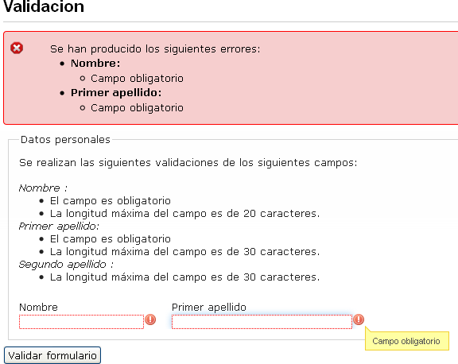

#	Componentes RUP – Validación

<!-- MDTOC maxdepth:6 firsth1:1 numbering:0 flatten:0 bullets:1 updateOnSave:1 -->

   - [1   Introducción](#intro)   
   - [2   Ejemplo](#ejemplo)   
   - [3   Casos de uso](#casos-de-uso)   
   - [4   Infraestructura](#infraestructura)   
      - [4.1 Ficheros](#ficheros)   
      - [4.2 Dependencias](#dependencias)   
      - [4.3 Versión minimizada](#v-minimizada)   
   - [5   Invocación](#invocac)   
   - [6 API](#api)
   - [7   Sobreescritura del theme](#theme)   
   - [8   Personalización](#personal)   
      - [8.1 Visualización errores](#errores)   
      - [8.2 Validaciones propias](#propias)   
      - [8.3.Sobreescritura validaciones](#sobreescritura)
      - [8.4 Personalización de los mensajes](#mensajes)   
   - [9 Integración con UDA](#uda)   
   - [10  Interacción con otros componentes RUP](#rup)   

<!-- /MDTOC -->

<a id="intro"></a>
##	1	Introducción
La descripción del ***Componente Validación***, visto desde el punto de vista de **RUP**, es la siguiente:
*Permite al usuario validar los datos introducidos en los campos que se presentan en la aplicación.*

<a id="ejemplo"></a>
##	2	Ejemplo
Se presenta a continuación un ejemplo de este componente:


<a id="casos-de-uso"></a>
##	3	Casos de uso
Se aconseja la utilización de este componente:
+	Cuando sea necesario realizar validaciones en cliente de los campos de formulario.

<a id="infraestructura"></a>
##	4	Infraestructura
A continuación se comenta la infraestructura necesaria para el correcto funcionamiento del componente.
+	Únicamente se requiere la inclusión de los ficheros que implementan el componente *(js y css)* comentados en los apartados *Ficheros y Dependencias*.

<a id="ficheros"></a>
###	4.1	Ficheros
Ruta Javascript: rup/scripts/
Fichero de plugin: **rup.validate-x.y.z.js**
Ruta theme: rup/basic-theme/
Fichero CSS del theme: **theme.rup.validate-x.y.z.css**

<a id="dependencias"></a>
###	4.2	Dependencias
Por la naturaleza de desarrollo de los componentes (patrones) como *plugins* basados en la librería *JavaScript* **jQuery**, es necesaria la inclusión del esta. La versión elegida para el desarrollo ha sido la versión **1.12.4**.
+	**jQuery 1.12.4**: http://jquery.com/

La gestión de la ciertas partes visuales de los componentes, se han realizado mediante el *plugin* **jQuery UI** que se basa en *jQuery* y se utiliza para construir aplicaciones web altamente interactivas. Este *plugin*, proporciona abstracciones de bajo nivel de interacción y animación, efectos avanzados de alto nivel, componentes personalizables (estilos) ente otros. La versión utilizada en el desarrollo ha sido la **1.12.0**.
+	**jQuery UI 1.12.0**: http://jqueryui.com/

Las distintas funcionalidades que aporta el componente y las prestaciones generales del mismo, se apoyan en el *plugin* **jQuery File Upload**. Para el correcto funcionamiento del componente *Upload*, se precisa de la inclusión de dicho *plugin*.
+	**jQuery-File-Upload**: http://blueimp.github.com/jQuery-File-Upload/

Los ficheros necesarios para el correcto funcionamiento del componente son:

    jquery-1.12.0.js
	jquery-ui-1.12.4.custom.js
	jquery-ui-1.12.4.custom.css
	jquery.validate.js
	rup.validate-2.0.0.js
	theme.rup.validate-2.0.0.css


<a id="v-minimizada"></a>
###	4.3	Versión minimizada
A partir de la versión v2.4.0 se distribuye la versión minimizada de los componentes **RUP**. Estos ficheros contienen la versión compactada y minimizada de los ficheros *javascript* y de estilos necesarios para el uso de todos los compontente **RUP**.

Los ficheros minimizados de RUP son los siguientes:
+	**rup/scripts/min/rup.min-x.y.z.js**
+	**rup/basic-theme/rup.min-x.y.z.css**

Estos ficheros son los que deben utilizarse por las aplicaciones. Las versiones individuales de cada uno de los componentes solo deberán de emplearse en tareas de desarrollo o depuración.

<a id="invocac"></a>
##	5	Invocación
El componente validación se invoca sobre un formulario existente en la *jsp*. El formulario contendrá los campos que se desean validar.

Un ejemplo de un formulario que se desee validar es el siguiente:
```xml
<form id="formValidaciones" action="/form">
	<label for="campoObligatorio">Campo Obligatorio</label>
	<input type="text" name="campoObligatorio" id="campoObligatorio" />
	<label for="dni" >Dni</label>
	<input type="text" name="dni" id="dni" />
</form>
```

Este formulario dispone dos campos que deben ser validados. El primero de ellos deberá ser un campo obligatorio y el segundo además de ser también obligatorio, deberá cumplir el formato de un dni válido. La invocación correspondiente que deberemos realizar al componente validación será la siguiente:

```javascript
var properties={
	rules:{
		"campoObligatorio":{required:true},
		"dni":{required:true,dni:true
	}		
};
$("#formValidaciones").rup_validate(properties);
```

Como ya se profundizará mas adelante, mediante la propiedad rules se indicará para cada campo (identificado mediante su el valor de su propiedad *name*) que validaciones se deben de realizar.

<a id="api"></a>
## 6 API

Para ver en detalle la API del componente vaya al siguiente [documento](../api/rup.validate.md).

<a id="theme"></a>
##	7	Sobreescritura del theme
El componente validación se presenta con una apariencia visual definida en el fichero de estilos **theme.rup.validate-x.y.z.css**.

Si se quiere modificar la apariencia del componente, se recomienda redefinir el/los estilos necesarios en un fichero de estilos propio de la aplicación situado dentro del proyecto de estáticos *(codAppStatics/WebContent/codApp/styles)*.

Los estilos del componente se basan en los estilos básicos de los *widgets* de *jQuery UI*, con lo que los cambios que se realicen sobre su fichero de estilos manualmente o mediante el uso de la herramienta [Theme Roller](http://jqueryui.com/themeroller/) podrán tener repercusión sobre todos los componentes que compartan esos mismos estilos (pudiendo ser el nivel de repercusión general o ajustado a un subconjunto de componentes).

<a id="personal"></a>
##	8	Personalización
El componente validación permite realizar una serie de personalizaciones sobre las validaciones, estilos, y mensajes de error mostrados.

<a id="errores"></a>
###	8.1	Visualización errores
Mediante las propiedades de configuración que ofrece el componente es posible personalizar el modo en el que se muestran los errores de validación.

```javascript
$("#formValidaciones").rup_validate({
    feedback:$("#feedbackErroresValidaciones"),
    liveCheckingErrors: false,
    showFieldErrorAsDefault: true,
    showErrorsInFeedback: true,
    showFieldErrorsInFeedback: true,
    rules:{
"campoObligatorio":{required:true},
	"dni":{required:true,dni:true
    }
});
```

El significado de cada una de las propiedades se especifica en el apartado de [API](6-api) .

En caso de que la aplicación necesite de un grado de personalización mayor de los errores de validación deberá de extender las funciones de gestión de errores que proporciona el componente.

<a id="propias"></a>
###	8.2	Validaciones propias
El componente permite la creación de validaciones propias que puedan ser utilizadas junto con las definidas por defecto.

La creación de la nueva regla de validación se realiza mediante la función *addMethod* del plugin subyacente *jquery.validator*.

```javascript
jQuery.validator.addMethod(name, method, message);
```

El método recibe los siguientes parámetros:
+	*name*: Nombre identificativo de la validación.
+	*method*: Función *javascript* que contiene la implementación necesaria para llevar a cabo la validación.
+	*message*: Parámetro opcional. Permite especificar un mensaje de error de validación al margen de los definidos en los ficheros de recursos de i18n.

A continuación se muestra un ejemplo de creación de una regla de validación personalizada. En este caso se desea validar que el valor introducido en un campo sea un número par:
```javascript
jQuery.validator.addMethod("par", function(value, element, params) {
	return this.optional(element) || (value%2===0);
});
```

Para hacer uso de la validación de deberá de invocar al componente indicando para el campo que queremos validar el uso de la nueva validación:

```javascript
$("#formValidaciones").rup_validate({
rules:{
    "nameCampo":{par:true}
}
});
```

<a id="sobreescritura"></a>
###	8.3	Sobreescritura validaciones
Del mismo modo que se realiza la creación de una nueva regla de validación, es posible sobrescribir la implementación de las reglas de validación ya existentes.

El procedimiento es el mismo que el que se realiza para añadir una nueva regla. Este sería un ejemplo de sobreescritura de la regla de validación dni:

```javascript
jQuery.validator.addMethod("dni", function(value, element) {
		// Nueva implementación
});
```

<a id="mensajes"></a>
###	8.4	Personalización de los mensajes
Los mensajes de error de las validaciones se encuentran definidos en los ficheros de recursos de rup. Para cada menaje de error existe su versión idiomática correspondiente.

```javascript
"rup_validate":{
"messages":{
		"required": "Campo obligatorio.",
		"remote": "Por favor, rellena este campo.",
		"email": "Por favor, escribe una dirección de correo válida",
		"url": "Por favor, escribe una URL válida.",
		"date": "Por favor, escribe una fecha válida.",
		"dateISO": "Por favor, escribe una fecha (ISO) válida.",
		"number": "Por favor, escribe un número entero válido.",
		"digits": "Por favor, escribe sólo dígitos.",
		"creditcard": "Por favor, escribe un número de tarjeta válido.",
		"equalTo": "Por favor, escribe el mismo valor de nuevo.",
		"accept": "Por favor, escribe un valor con una extensión aceptada.",
		"maxlength": "Por favor, no escribas más de {0} caracteres.",
		"minlength": "Por favor, no escribas menos de {0} caracteres.",
		"rangelength": "Por favor, escribe un valor entre {0} y {1} caracteres.",
		"range": "Por favor, escribe un valor entre {0} y {1}.",
		"max": "Por favor, escribe un valor menor o igual a {0}.",
		"min": "Por favor, escribe un valor mayor o igual a {0}.",
		"dni": "Por favor, introduzca un dni válido.",
		"maxWords": "Por favor, no escribas mas de {0} palabras.",
		"minWords": "Por favor, no escribas menos de {0} palabras.",
		"rangeWords": "Por favor, escribe un valor entre {0} y {1} palabras.",
		"letterswithbasicpunc": "Por favor, introduzca únicamente letras y signos de puntuación.",
		"alphanumeric": "Por favor, introduzca letras, números, espacios o guiones bajos.",
		"lettersonly": "Por favor, introduzca únicamente letras.",
		"nowhitespace": "Por favor, no introduzca espacios en blanco.",
		"integer": "Por favor, introduzca un número entero positivo o negativo.",
		"pattern": "El formato no es válido"
	}
}
```

Estos mensajes pueden ser modificados definiendo en los ficheros de internacionalización de la aplicación un objeto *json* con la misma estructura para sustituir a continuación los mensajes:
```javascript
"rup_validate":{
	"messages":{
		...
		...

	}
}
```
Para sustituir los mensajes iniciales se deberá de ejecutar el siguiente código

```javascript
$.extend($.validator.messages, $.rup.i18n.app.rup_validate.messages);
```

Para una personalización de los errores de validación más específica, que no sea definida a nivel global para todas las existentes en la aplicación, se puede indicar un mensaje de error personalizado para un campo concreto:

```javascript
$("#formValidaciones").rup_validate({
    messages:{
    "password_confirm":$.rup.i18n.app.validaciones.password_confirm,
	"email_confirm":$.rup.i18n.app.validaciones.email_confirm
    },
    rules:{
    	"password":{required:true,minlength:4},
		"password_confirm": {
	     equalTo: "#password"
	},
	"email":{email: true},
	"email_confirm": {
	      equalTo: "#email"
	},
    }
});
```

Se deberá de indicar en los ficheros de i18n de la aplicación los mensajes que se deberán de mostrar. Para este ejemplo se deberá de incluir las siguientes entradas en los ficheros */xxxStatics/WebContent/xxx/resources/xxxYyy.i18n_zz.json*:
```javascript
"validaciones":{
"password_confirm":"Las contraseñas no coinciden",
	"email_confirm":"Los correos introducidos no coinciden"
},
```

<a id="uda"></a>
##	9 Integración con UDA
El componente que nos ocupa, está ligado al subsistema de validaciones de **UDA**.
La interacción entre ambos se detalla en el Anexo-Gestión_de_validaciones


>**IMPORTANTE: En el caso de utilizar el navegador Internet Explorer 8, la subida de ficheros mediante un formulario se realiza mediante el uso de iframe. Esto es debido a que la subida de ficheros mediante peticiones AJAX no está soportada en este navegador. En estos casos la gestión de errores de validaciones realizadas en el servidor de aplicaciones, no puede hacer un uso correcto de los códigos de error http para la gestión de los mismos.
La configuración que se ha de realizar para permitir la interacción correcta entre los iframes y el resto de la infraestructura (request mappings**

<a id="rup"></a>
##	10	Interacción con otros componentes RUP
En este apartado se va a detallar la interacción del componente validación con el resto de componentes **RUP**.

+	**Componente RUP formulario**:
El componente de validación está estrechamente relacionado con el componente formulario. Esto es debido a que la mayor parte de las validaciones que se realizan en las aplicaciones, están relacionadas con la validación de datos introducidos mediante un formulario.
Para facilitar la configuración de ambos componentes se permite especificar los parámetros del componente de validaciones junto con los del formulario.
```javascript
$("#validacionFormulario").rup_form({
    feedback:$("#feedbackErroresValidaciones"),
    url:$.rup.CTX_PATH+"/patrones/validacion/servidor",
    validate: {
messages:{							
    "password_confirm":$.rup.i18n.app.validaciones.password_confirm,
	    "email_confirm":$.rup.i18n.app.validaciones.email_confirm
    	},
    	rules:{
   	    "password":{required:true,minlength:4},
	    "password_confirm": {
	         equalTo: "#password"
     },
	    "email":{email: true},
	    "email_confirm": {
	        equalTo: "#email"
	    }
}
    }
});
```
Como se puede observar, la configuración del componente validación se especifica mediante la propiedad *validate* del componente formulario. La configuración es exactamente la misma que la especificada en el caso de utilizar el componente de manera independiente.
El componente formulario invocará al componente validación durante el proceso de inicialización. Una vez configurado, se podrá hacer uso de las funciones y eventos que proporciona el componente validación.


+	**Resto componentes RUP:**
El componente validación está preparado para realizar validaciones sobre cualquier componente **RUP**. Para validar campos que han sido inicializados como componentes RUP se deberá de proceder del mismo modo que con controles *HTML* comunes.
En el siguiente ejemplo se muestra el uso del patrón validación sobre unos componentes **RUP**:

[validaciones.jsp]
```xml
<form:form id="formValidaciones">
	...
	...
	<input id="autocomplete" name="autocomplete" />
	...
	...
	<select id="comboAbueloRemoto" name="provincia" class="rup-combo"></select>
	...
	...
	<select id="comboPadreRemoto" name="comarca" class="rup-combo"></select>
	...
	...
	<select id="comboHijoRemoto" name="localidad" class="rup-combo"></select>
	...
	...
	<input id="fecha" name="fecha" />
	...
	...
	<input id="fechaHora" name="fechaHora" />
	...
	...
	<input type="submit" value="Validar formulario"  />
</form:form>
```

[validaciones.js]
```javascript
$("#autocomplete").rup_autocomplete({
// Inicialización del componente rup_autocomplete
});


$("#comboAbueloRemoto").rup_combo({
// Inicialización del componente rup_combo
});

$("#comboPadreRemoto").rup_combo({
// Inicialización del componente rup_combo
});

$("#comboHijoRemoto").rup_combo({
// Inicialización del componente rup_combo
});

$("#fecha").rup_date({
// Inicialización del componente rup_fecha
});

$("#fechaHora").rup_date({
// Inicialización del componente rup_fecha
});

$("#formValidaciones").rup_form({
    feedback:$("#feedbackErroresValidaciones"),
    url:$.rup.CTX_PATH+"/patrones/validacion/servidor",
    validate: {
    	rules:{
   	    "autocomplete":{required:true},
	    "provincia":{required:true},
	    "comarca":{required:true},
	    "localidad":{required:true},
	    "fecha":{required:true},
	    "fechaHora":{required:true}
}
    }
});
```
