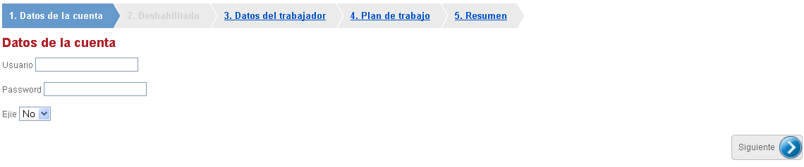
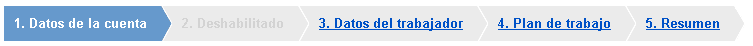
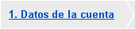
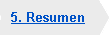

#	Componentes RUP – Wizard

<!-- MDTOC maxdepth:6 firsth1:1 numbering:0 flatten:0 bullets:1 updateOnSave:1 -->

   - [1   Introducción](#1-introducción)   
   - [2   Ejemplo](#2-ejemplo)   
   - [3   Casos de uso](#3-casos-de-uso)   
   - [4    Infraestructura](#4-infraestructura)   
      - [4.1 Ficheros](#4.1-ficheros)   
      - [4.2 Dependencias](#4.2-dependencias)   
      - [4.3 Versión minimizada](#4.3-versión-minimizada)   
   - [5   Invocación](#5-invocación)   
   - [6 API](#6-api)   
   - [7   Estructura](#7-estructura)   
   - [8   Resumen (conversiones)](#8-resumen-[conversiones])   
      - [8.1 INPUT](#8.1-input)   
      - [8.2 TEXTAREA](#8.2-textarea)   
      - [8.3 SELECT (combo)](#8.3-select-[combo])   
      - [8.4 LABEL](#8.4-label)   
      - [8.5 Componentes RUP](#8.5-componentes-rup)   
         - [8.5.1    Accordion](#8.5.1-accordion)   
         - [8.5.2 Combo](#8.5.2-combo)   
         - [8.5.3    Date](#8.5.3-date)   
         - [8.5.4    Time](#8.5.4-time)   
         - [8.5.5    Tabs](#8.5.5-tabs)   
   - [9   Sobreescritura del theme](#9-sobreescritura-del-theme)   
       - [9.1.1   Tabs](#9.1.1-tabs)   

<!-- /MDTOC -->


##	1	Introducción
La descripción del componente ***wizard***, visto desde el punto de vista de **RUP**, es la siguiente:

*Permitir guiar al usuario paso a paso a través de un proceso realizando las tareas dentro de un orden señalado.*


##	2	Ejemplo
Se presenta a continuación un ejemplo de este componente:


##	3	Casos de uso
Se recomienda el uso del componente:

+	Cuando la tarea sea larga o complicada.

+	Cuando la tarea sea nueva para el usuario o no la realice a menudo.

+	Cuando la tarea sea delicada y requiera un control alto.

## 4	Infraestructura
A continuación se comenta la infraestructura necesaria para el correcto funcionamiento del componente.
•	Únicamente se requiere la inclusión de los ficheros que implementan el componente *(js y css)* comentados en los apartados *Ficheros y Dependencias*.

###	4.1	Ficheros
Ruta Javascript: rup/scripts/
Fichero de plugin: **rup.wizard-x.y.z.js**
Ruta theme: rup/basic-theme/
Fichero css del theme: **theme.rup.wizard-x.y.z.css**

###	4.2	Dependencias
Por la naturaleza de desarrollo de los componentes (patrones) como plugins basados en la librería *JavaScript* ***jQuery***, es necesaria la inclusión del esta. La versión elegida para el desarrollo ha sido la versión **1.12.4**.
+	**jQuery 1.12.4**: http://jquery.com/

Los ficheros necesarios para el correcto funcionamiento del componente son:

    jquery-1.12.4.js
	jquery.qtip.js
	rup.base-x.y.z.js
	rup.wizard-x.y.z.js
	theme.rup.wizard-x.y.z.css

###	4.3	Versión minimizada
A partir de la versión v2.4.0 se distribuye la versión minimizada de los componentes **RUP**. Estos ficheros contienen la versión compactada y minimizada de los ficheros *javascript* y de estilos necesarios para el uso de todos los compontente **RUP**.

Los ficheros minimizados de **RUP** son los siguientes:
+	**rup/scripts/min/rup.min-x.y.z.js**
+	**rup/basic-theme/rup.min-x.y.z.css**

Estos ficheros son los que deben utilizarse por las aplicaciones. Las versiones individuales de cada uno de los componentes solo deberán de emplearse en tareas de desarrollo o depuración.

##	5	Invocación
Este componente se invocará mediante un selector que indicará el objeto contenedor de la estructura a convertir en asistente paso a paso. Por ejemplo
```javascript
$("#id_form").rup_wizard(properties);
```
donde el parámetro *“properties”* es un objeto *(var properties = {};)* o bien directamente la declaración de los valores, detallados en el siguiente apartado.

##	6 API

Para ver en detalle la API del componente vaya al siguiente [documento](../api/rup.wizard.md).

##	7	Estructura
A continuación se detalla la estructura que debe seguir el formulario a convertir en *wizard*.
Cada paso del *wizard* estará formado por un *fieldset* y la descripción del paso se definirá dentro del *fieldset* mediante la etiqueta *legend*. Un ejemplo de la estructura:

```xml
<form id="wizardForm">
<fieldset>
		<legend>Paso primero </legend>
		...
</fieldset>
<fieldset>
		<legend>Paso segundo </legend>
		...
</fieldset>
	...
<fieldset>
		<legend>Paso n </legend>
		...
</fieldset>
</form>
```
Una vez definida la estructura bastará con lanzar el componente para obtener el *wizard* con la siguiente estructura (se han obviado los estilos, detallados en otro apartado más adelante, para facilitar la comprensión):
```xml
<ul id="steps">
	<li id="stepDesc0">
		<span>1. Paso primero</span>
</li>
	<li id="stepDesc1">
		<span>2. Paso segundo</span>
</li>
...
	<li id="stepDescn">
		<span>n. Paso enésimo</span>
</li>
</ul>
<form id="wizardForm">
<div id="step0">
	<fieldset>
			<legend>Paso primero</legend>
			...
</fieldset>
</div>
<div id="step1">
	<fieldset>
			<legend>Paso segundo</legend>
			...
</fieldset>
</div>
...
<div id="stepn">
	<fieldset>
			<legend>Paso enésimo</legend>
			...
</fieldset>
</div>
</form>
```

Por lo expuesto anteriormente se deduce que la conversión de la estructura inicial en asistente paso a paso es la siguiente:

+	Se genera una lista no numerada ***UL*** que contiene los enlaces a los diferentes pasos. Estará al mismo nivel que el formulario y su identificador será *steps*.
+	La lista no numerada contendrá un elemento de lista ***LI*** por cada paso definido en el asistente. Los identificadores de los elementos de la lista serán correlativos y con la nomenclatura siguiente: *stepDescX* (siendo x un número comenzando en 0).

+	Cada elemento de la lista alojará en su interior un ***SPAN*** donde se define el texto del paso. Este texto se obtendrá del ***legend*** del paso correspondiente.

+	Los ***fieldsets*** que definen los diferentes pasos serán recubiertos con una capa ***DIV***. El identificador de este elemento serán correlativos y con la nomenclatura siguiente: *stepX* (siendo x un número comenzando en 0).

##	8	Resumen [conversiones]
El patrón *wizard* genera por defecto un paso *Resumen* donde se muestran en texto plano los diferentes datos introducidos en los pasos anteriores. A continuación se detalla la conversión realizada con los diferentes elementos posibles. Se han omitido los estilos que se detallan en el siguiente apartado.

###	8.1	INPUT
En este apartado se detallan las conversiones de los diferentes tipos de los elementos de introducción de datos, que se transformarán en elementos *span*.

+	**text**

```xml
<input type="text" id="nombre" name="nombre" />
<span>Juan<span/>
```


+	**password**: Caracteres cambiados por  ```*```

```xml
<input type="password" id="password" name="password" />
<span>*****<span/>
```

+	**radio**: Solo se mostrará el elemento seleccionado

```xml
<input type="radio" name="group1" value="hombre" id="radio_hombre" checked="checked"/>
<input type="radio" name="group1" value="mujer" id="radio_mujer"/>

<span>Hombre<span/>
```

+	**checkbox**: Cada elemento irá precedido de un par de corchetes [ ] y los elementos seleccionados contendrán una equis en su interior [X]

```xml
<input type="checkbox" name="mes_enero" value="0"/>
<input type="checkbox" name="mes_febrero" value="1"/>
<input type="checkbox" name="mes_marzo" value="2"/>
<span>[X]<span/>
<span>[ ]<span/>
<span>[ ]<span/>
```

###	8.2	TEXTAREA
Los elementos de tipo *textarea* se convierten en elementos *paragraph* ```(<p>)```. Opcionalmente se puede configurar el elemento en el que se convierte mediante el parámetro ***textareaElement***.
```xml
<textarea id="aficiones" name="aficiones" cols="150" rows="10"></textarea>
<p>Esto es un ejemplo de texto</p>
```

###	8.3	SELECT [combo]
Los combos se convierten en elementos span, que mostrará el *label* (literal) del elemento seleccionado.
```xml
<select id="ejie">
		<option value="0" selected="selected">No</option>
		<option value="1">Sí</option>
</select>
<span>No</span>
```

###	8.4	LABEL
Los elementos de tipo *label* se convierten en elementos *span*. Opcionalmente se puede configurar el elemento en el que se convierte mediante el parámetro ***labelElement***.
```xml
<label for="username">Usuario</label>
<span>Usuario</span>
```

###	8.5	Componentes RUP
Además de los elementos básicos de *HTML* se pueden incluir componentes **RUP** en el asistente paso a paso y a continuación se detalla su correspondiente conversión.

####	8.5.1	Accordion
Cuando se duplica un *accordion* en el paso de resumen simplemente se modifica el identificador que contiene el *accordion* pasando a llamarse como su original con el literal *“_summary”* concatenado al final. Para configurar el funcionamiento del *accordion* se utilizará el parámetro ***rupAccordion***.
```xml
<div id="meses">
		<h1><a>Jornada reducida</a></h1>
		...
</div>

<div id="meses_summary">
		<h1><a>Jornada reducida</a></h1>
		...
</div>
```
####	8.5.2 Combo
En el procesamiento de este elemento se debe eliminar los elementos sobrantes para mostrar el literal del elemento seleccionado bajo un *span*.
####	8.5.3	 Date
En el procesamiento de este elemento se debe eliminar los elementos sobrantes, en este caso la imagen para seleccionar fecha.
####	8.5.4	 Time
En el procesamiento de este elemento se debe eliminar los elementos sobrantes, en este caso la imagen para seleccionar hora.
####	8.5.5	 Tabs
El procesamiento de las pestañas se realiza mediante un algoritmo recursivo que comprueba los diferentes niveles de las pestañas y los procesa. Se realizan las siguientes transformaciones:
+	El nombre de la pestaña (originalmente contenido en una lista no numerada) se traduce en un elemento ```<h4/>``` que opcionalmente se puede configurar mediante el parámetro **rupTabsElement**.
+	El contenido de la pestaña (capa) se extrae de la capa adicional que la contiene (generalmente con un identificador del tipo *“rupRandomLayerId-?”*). En caso de que la pestaña sea una sub-pestaña, su identificador se verá modificado añadiéndole *“subtab_”* por delante.

A continuación se detalla un ejemplo para mejorar la comprensión:
```xml
<div id="tabs">
		<ul>
<li><a><div>Pestaña 1</div></a></li>
<li><a><div>Pestaña 2</div></a></li>
</ul>

<div id="rupRandomLayerId-0">
<div id="pest2">
<ul>
<li><a><div>Subpestaña 2.1</div></a></li>
<li><a><div>Subpestaña 2.2</div></a></li>
</ul>
			</div>
<div id="rupRandomLayerId-1">
<div id="pest22">
<!-- Contenido 2.2-->				
</div>
</div>
<div id="rupRandomLayerId-2">
<div id="pest21">
<!-- Contenido 2.1-->				
			</div>
</div>
</div>

<div id="rupRandomLayerId-3">
<div id="pest1">
<!-- Contenido 1-->				
			</div>
</div>

</div>
```
La conversión del rup-tab sería la siguiente:
```xml
<h4>Pestaña 1</h4>
<div id="pest1"><!-- Contenido 1--></div>
<h4>Pestaña 2</h4>
<div id="subtab_pest2">
	<h4> Subpestaña 2.1</h4>
	<div id="pest21"><!-- Contenido 2.1--></div>
	<h4>Subpestaña 2.2</h4>
	<div id="pest22"><!-- Contenido 2.1--></div>
</div>
```

##	9	Sobreescritura del theme
El componente *wizard* se presenta con una apariencia visual definida en el fichero de estilos ***theme.rup.wizard-x.y.z.css***.

A continuación se detallan los estilos:
+	**.rup-wizard_stepsDescContainer** → UL que contiene los diferentes pasos.
+	**.rup-wizard_stepDesc** → Cada uno de los pasos (LI).
+	**.rup-wizard_stepDesc:hover** → Cada uno de los pasos (LI) con el ratón encima.
+	**.rup-wizard_stepDesc.current** → Paso activo (LI).
+	**.rup-wizard_stepDesc.disabled** → Paso deshabilitado (LI).
+	**.rup-wizard_firstStepDesc** → Primer paso.
+	**.rup-wizard_lastStepDesc** → Último paso (sin tener en cuenta el paso resumen).
+	**.rup-wizard_summary** → Paso resumen.
+	**.rup-wizard_stepDesc span** → Descripción de cada paso (texto).

Se detalla un ejemplo con su estructura:

```xml
<ul id="steps" class="rup-wizard_stepsDescContainer">
<li id="stepDesc0" class="rup-wizard_stepDesc
  rup-wizard_firstStepDesc
  current">
<a href="#">1. Datos de la cuenta</a>
	</li>
	<li id="stepDesc1" class="rup-wizard_stepDesc
  disabled">
<a href="#">2. Deshabilitado</a>
	</li>
	<li id="stepDesc2" class="rup-wizard_stepDesc">
<a href="#">3. Datos del trabajador</a>
		</li>
	<li id="stepDesc3" class="rup-wizard_stepDesc">
<a href="#">4. Plan de trabajo</a>
	</li>
	<li id="stepDesc4" class="rup-wizard_stepDesc
  rup-wizard_summary
  rup-wizard_lastStepDesc">
<a href="#">5. Resumen</a>
	</li>
</ul>
```

Existen estilos asociados a los botones “Anterior” y “Siguiente” que se utilizan para navegar entre los pasos:

+	**.rup-wizard_prev** → Botón “Anterior”.
+	**.rup-wizard_next** → Botón “Siguiente”.
+	**.rup-wizard_submitButton** → Botón “Enviar”.


Estilos asociados a las imágenes para decorar el wizard:

+	Paso no activo: **.rup-wizard_stepDesc a **
	

+	Paso anterior al activo: **.rup-wizard_stepDesc.visited a**
	

+	Paso activo: **.rup-wizard_stepDesc.current a**


+	Último paso (no activo): **.rup-wizard_lastStepDesc a**


+	Último paso (activo): **.rup-wizard_lastStepDesc.current a**


####	9.1.1	Tabs
Cuando se genera el paso resumen y este va a contener algún elemento rup-tabs se realiza una trasformación para modificar la estructura final de la página como se explica el en apartado anterior.
A la hora de realizar dicha transformación existen dos opciones:
+	Convertir las pestañas en un *rup-accordion* con lo que la configuración de los estilos se realiza a través de las clases del componente.
+	No realizar la conversión las pestañas traduciéndose a texto plano (combinación de *h4* y *div*).

Para personalizar la visualización de las pestañas en el resumen se han definido los siguientes estilos:
+	**.rup-wizard_tabLevel-? ** → Elemento **pestaña**
+	**.rup-wizard_tabContainerLevel-? ** → Elemento **contenedor de pestañas**

Como el componente pestañas permite definir tantos niveles de pestañas como se desee, también los estilos deben poder seguir esa jerarquía de niveles. Es por ello que los estilos aplicados a las diferentes pestañas y subpestañas van aumentando el valor definido con la “?” según se profundiza en los diferentes niveles.

Ejemplo:
```css
	.rup-wizard_tabLevel-0
	.rup-wizard_tabLevel-1
	...

	.rup-wizard_tabLevel-n
```

**RUP** por defecto trae los estilos de los primeros niveles (0, 1 y 2) aunque se pueden definir tantos como se necesiten.

A la hora de definir las pestañas de un componente rup-tabs existen elementos que contienen datos directamente, es lo que hemos denominado **pestañas**. Aunque también existen elementos que contienen subpestañas en los que no se contienen datos. Estos últimos elementos los hemos denominado **contenedores de pestañas**. En función del tipo de elemento que se procesa a la hora de procesar las pestañas se asignará un estilo u otro.
