#	Guía de estilos material

## 1. Introducción
En este documento se tratará de explicar lo mejor posible como aplicar los estilos material a los componentes y elementos en general. También es posible visitar la [guía de estilos](https://www.ejie.eus/x21aAppWar/styleGuide) que está dentro de la aplicación de ejemplo de UDA.

Para facilitar la búsqueda de ejemplos, se dividirá en secciones, formando cada sección con un componente, elemento o grupo.

## 2. Tipografía
El tema por defecto de UDA define una serie de estilos predeterminados para las aplicaciones.

Así pues, se consideran los siguientes valores:
+ **font-family**: El tipo de letra utilizado por defecto es "Roboto".

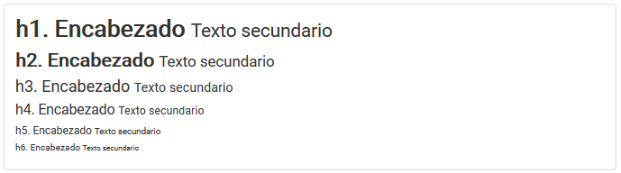

## 3. Botones
Los botones de bootstrap materializados **.btn-material** pueden ser presentados con diferentes énfasis y estados.

Además, añadiendo la clase **.material-rounded** las esquinas serán redondeadas.

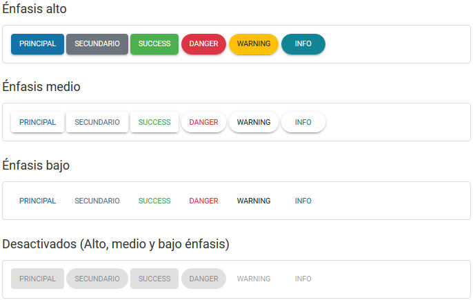
```html
<h3>Énfasis alto</h3>
<div class="example">
  <div class="row">
    <div class="col-md-12">
      <button type="button" class="btn-material btn-material-primary-high-emphasis"><span>Principal</span></button>

      <button type="button" class="btn-material btn-material-secondary-high-emphasis"><span>Secundario</span></button>

      <button type="button" class="btn-material btn-material-success-high-emphasis"><span>Success</span></button>

      <button type="button" class="btn-material material-rounded btn-material-danger-high-emphasis"><span>Danger</span></button>

      <button type="button" class="btn-material material-rounded btn-material-warning-dark-high-emphasis"><span>Warning</span></button>

      <button type="button" class="btn-material material-rounded btn-material-info-high-emphasis"><span>Info</span></button>
    </div>
  </div>
</div>


<h3>Énfasis medio</h3>
<div class="example">
  <div class="row">
    <div class="col-md-12">
      <button type="button" class="btn-material btn-material-primary-medium-emphasis"><span>Principal</span></button>

      <button type="button" class="btn-material btn-material-secondary-medium-emphasis"><span>Secundario</span></button>

      <button type="button" class="btn-material btn-material-success-medium-emphasis"><span>Success</span></button>

      <button type="button" class="btn-material material-rounded btn-material-danger-medium-emphasis"><span>Danger</span></button>

      <button type="button" class="btn-material material-rounded btn-material-warning-dark-medium-emphasis"><span>Warning</span></button>

      <button type="button" class="btn-material material-rounded btn-material-info-medium-emphasis"><span>Info</span></button>
    </div>
  </div>
</div>

<h3>Énfasis bajo</h3>
<div class="example">
  <div class="row">
    <div class="col-md-12">
      <button type="button" class="btn-material btn-material-primary-low-emphasis"><span>Principal</span></button>

      <button type="button" class="btn-material btn-material-secondary-low-emphasis"><span>Secundario</span></button>

      <button type="button" class="btn-material btn-material-success-low-emphasis"><span>Success</span></button>

      <button type="button" class="btn-material material-rounded btn-material-danger-low-emphasis"><span>Danger</span></button>

      <button type="button" class="btn-material material-rounded btn-material-warning-dark-low-emphasis"><span>Warning</span></button>

      <button type="button" class="btn-material material-rounded btn-material-info-low-emphasis"><span>Info</span></button>
    </div>
  </div>
</div>

<h3>Desactivados (Alto, medio y bajo énfasis)</h3>
<div class="example">
  <div class="row">
    <div class="col-md-12">
      <button type="button" class="btn-material btn-material-primary-high-emphasis" disabled><span>Principal</span></button>

      <button type="button" class="btn-material material-rounded btn-material-secondary-high-emphasis" disabled><span>Secundario</span></button>

      <button type="button" class="btn-material btn-material-success-medium-emphasis" disabled><span>Success</span></button>

      <button type="button" class="btn-material material-rounded btn-material-danger-medium-emphasis" disabled><span>Danger</span></button>

      <button type="button" class="btn-material btn-material-warning-dark-low-emphasis" disabled><span>Warning</span></button>

      <button type="button" class="btn-material material-rounded btn-material-info-low-emphasis" disabled><span>Info</span></button>
    </div>
  </div>
</div>
```

En caso de querer añadir iconos a los botones, sería tan sencillo como insertarle un elemento **i** con su clase correspondiente.

UDA usa los iconos material del proyecto [Material Design Icons](https://materialdesignicons.com) donde además, pueden obtenerse ejemplos.

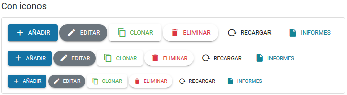
```html
<h3>Con iconos</h3>

<div class="example">
  <div class="row">
    <div class="col-md-12">
      <button type="button" class="btn-material btn-material-lg btn-material-primary-high-emphasis">
        <i class="mdi mdi-plus"></i>
        <span>Añadir</span>
      </button>

      <button type="button" class="btn-material btn-material-lg material-rounded btn-material-secondary-high-emphasis">
        <i class="mdi mdi-pencil"></i>
        <span>Editar</span>
      </button>

      <button type="button" class="btn-material btn-material-lg btn-material-success-medium-emphasis">
        <i class="mdi mdi-content-copy"></i>
        <span>Clonar</span>
      </button>

      <button type="button" class="btn-material btn-material-lg material-rounded btn-material-danger-medium-emphasis">
        <i class="mdi mdi-delete"></i>
        <span>Eliminar</span>
      </button>

      <button type="button" class="btn-material btn-material-lg btn-material-warning-dark-low-emphasis">
        <i class="mdi mdi-reload"></i>
        <span>Recargar</span>
      </button>

      <button type="button" class="btn-material btn-material-lg material-rounded btn-material-info-low-emphasis">
        <i class="mdi mdi-file"></i>
        <span>Informes</span>
      </button>
    </div>
  </div>
  <div class="row mt-4">
    <div class="col-md-12">
      <button type="button" class="btn-material btn-material-primary-high-emphasis">
        <i class="mdi mdi-plus"></i>
        <span>Añadir</span>
      </button>

      <button type="button" class="btn-material material-rounded btn-material-secondary-high-emphasis">
        <i class="mdi mdi-pencil"></i>
        <span>Editar</span>
      </button>

      <button type="button" class="btn-material btn-material-success-medium-emphasis">
        <i class="mdi mdi-content-copy"></i>
        <span>Clonar</span>
      </button>

      <button type="button" class="btn-material material-rounded btn-material-danger-medium-emphasis">
        <i class="mdi mdi-delete"></i>
        <span>Eliminar</span>
      </button>

      <button type="button" class="btn-material btn-material-warning-dark-low-emphasis">
        <i class="mdi mdi-reload"></i>
        <span>Recargar</span>
      </button>

      <button type="button" class="btn-material material-rounded btn-material-info-low-emphasis">
        <i class="mdi mdi-file"></i>
        <span>Informes</span>
      </button>
    </div>
  </div>
  <div class="row mt-4">
    <div class="col-md-12">
      <button type="button" class="btn-material btn-material-sm btn-material-primary-high-emphasis">
        <i class="mdi mdi-plus"></i>
        <span>Añadir</span>
      </button>

      <button type="button" class="btn-material btn-material-sm material-rounded btn-material-secondary-high-emphasis">
        <i class="mdi mdi-pencil"></i>
        <span>Editar</span>
      </button>

      <button type="button" class="btn-material btn-material-sm btn-material-success-medium-emphasis">
        <i class="mdi mdi-content-copy"></i>
        <span>Clonar</span>
      </button>

      <button type="button" class="btn-material btn-material-sm material-rounded btn-material-danger-medium-emphasis">
        <i class="mdi mdi-delete"></i>
        <span>Eliminar</span>
      </button>

      <button type="button" class="btn-material btn-material-sm btn-material-warning-dark-low-emphasis">
        <i class="mdi mdi-reload"></i>
        <span>Recargar</span>
      </button>

      <button type="button" class="btn-material btn-material-sm material-rounded btn-material-info-low-emphasis">
        <i class="mdi mdi-file"></i>
        <span>Informes</span>
      </button>
    </div>
  </div>
</div>
```

Mediante la clase **.btn-material-sm** el botón será mas pequeño, en cambio si se usa la clase **.btn-material-lg**, será mas grande.

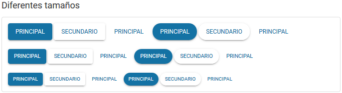
```html
<h3>Diferentes tamaños</h3>
<div class="example">
  <div class="row">
    <div class="col-md-12">
      <button type="button" class="btn-material btn-material-lg btn-material-primary-high-emphasis"><span>Principal</span></button>

      <button type="button" class="btn-material btn-material-lg btn-material-primary-medium-emphasis"><span>Secundario</span></button>
      
      <button type="button" class="btn-material btn-material-lg btn-material-primary-low-emphasis"><span>Principal</span></button>
      
      <button type="button" class="btn-material btn-material-lg material-rounded btn-material-primary-high-emphasis"><span>Principal</span></button>

      <button type="button" class="btn-material btn-material-lg material-rounded btn-material-primary-medium-emphasis"><span>Secundario</span></button>
      
      <button type="button" class="btn-material btn-material-lg material-rounded btn-material-primary-low-emphasis"><span>Principal</span></button>
    </div>
  </div>
<div class="row mt-4">
    <div class="col-md-12">
      <button type="button" class="btn-material btn-material-primary-high-emphasis"><span>Principal</span></button>

      <button type="button" class="btn-material btn-material-primary-medium-emphasis"><span>Secundario</span></button>
      
      <button type="button" class="btn-material btn-material-primary-low-emphasis"><span>Principal</span></button>
      
      <button type="button" class="btn-material material-rounded btn-material-primary-high-emphasis"><span>Principal</span></button>

      <button type="button" class="btn-material material-rounded btn-material-primary-medium-emphasis"><span>Secundario</span></button>
      
      <button type="button" class="btn-material material-rounded btn-material-primary-low-emphasis"><span>Principal</span></button>
    </div>
  </div>
  <div class="row mt-4">
    <div class="col-md-12">
      <button type="button" class="btn-material btn-material-sm btn-material-primary-high-emphasis"><span>Principal</span></button>

      <button type="button" class="btn-material btn-material-sm btn-material-primary-medium-emphasis"><span>Secundario</span></button>
      
      <button type="button" class="btn-material btn-material-sm btn-material-primary-low-emphasis"><span>Principal</span></button>
      
      <button type="button" class="btn-material btn-material-sm material-rounded btn-material-primary-high-emphasis"><span>Principal</span></button>

      <button type="button" class="btn-material btn-material-sm material-rounded btn-material-primary-medium-emphasis"><span>Secundario</span></button>
      
      <button type="button" class="btn-material btn-material-sm material-rounded btn-material-primary-low-emphasis"><span>Principal</span></button>
    </div>
  </div>
</div>
```

## 4. Formulario
El tema de UDA proporciona una apariencia unificada de los diferentes elementos que pueden estar presentes en un formulario.

### Campos de texto

Se busca normalizar la apariencia de los campos de texto por defecto así como de los que hacen uso de los estilos de bootstrap.
Un campo de texto por defecto hace uso de las siguientes propiedades de css:

+ **font-family**: El tipo de letra utilizado por defecto es "Roboto".
+ **font-size**: Se establece un valor de **1rem** para el tamaño de letra. Como es relativo al tamaño base definido para **html** el valor por defecto será de **12px**.
+ **height**: Se establece un valor de **2rem** para la altura del campo de texto. Como es relativo al tamaño base definido para **html** el valor por defecto será de **24px**.

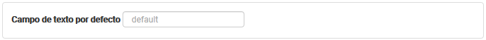
```html
<div class="example">
  <label for="textFieldDefault">Campo de texto por defecto</label>
  <input type="text" id="textFieldDefault" placeholder="default"/>
</div>
```

En caso de utilizar los estilos de bootstrap a la hora de diseñar los campos de los formularios el estilo será similar.

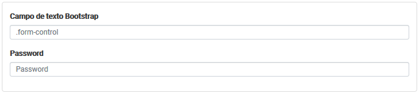
```html
<div class="example">
  <div class="form-group">
    <label for="textFieldBootstrap">Campo de texto Bootstrap</label>
    <input type="text" class="form-control" id="textFieldBootstrap" placeholder=".form-control">
  </div>
  <div class="form-group">
    <label for="passwordFieldBootstrap">Password</label>
    <input type="password" class="form-control" id="passwordFieldBootstrap" placeholder="Password">
  </div>
</div>
```

En cambio, si usamos los estilos de bootstrap materializados a la hora de diseñar los campos de los formularios, el estilo será el siguiente:

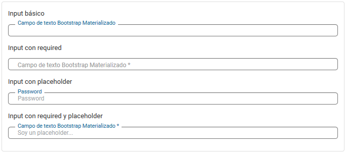
```html
<div class="example">
  <p>Input básico</p>
  <div class="form-groupMaterial">      
    <input type="text" id="textFieldBasicoBootstrapMaterialized">
    <label for="textFieldBasicoBootstrapMaterialized">Campo de texto Bootstrap Materializado</label>
  </div>
    
    <p>Input con required</p>
  <div class="form-groupMaterial">      
    <input type="text" id="textFieldRequiredBootstrapMaterialized" required>
    <label for="textFieldRequiredBootstrapMaterialized">Campo de texto Bootstrap Materializado</label>
  </div>

  <p>Input con placeholder</p>
  <div class="form-groupMaterial">
    <input type="password" id="passwordPlaceholderBootstrapMaterialized" placeholder="Password" >
    <label for="passwordPlaceholderBootstrapMaterialized">Password</label>
  </div>

  <p>Input con required y placeholder</p>
  <div class="form-groupMaterial">      
    <input type="text" id="textFieldRequiredPlaceholderBootstrapMaterialized" placeholder="Soy un placeholder..." required>
    <label for="textFieldRequiredPlaceholderBootstrapMaterialized">Campo de texto Bootstrap Materializado</label>
  </div>
</div>
```

### Autocomplete
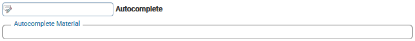
```html
<div class="form-group">
  <input id="autocompleteDefault" name="autocompleteDefault" /> 
  <label for="autocompleteDefault">Autocomplete</label>
</div>

<div class="form-groupMaterial">
  <input id="autocompleteMaterialized" name="autocompleteMaterialized" /> 
  <label for="autocompleteMaterialized">Autocomplete Material</label>
</div>
```

### Select
Del mismo modo se trata de obtener una apariencia similar en el uso de los controles **select**.

Las propiedades aplicadas a los estilos son:

+ **font-family**: El tipo de letra utilizado por defecto es "Roboto".
+ **font-size**: Se establece un valor de **1rem** para el tamaño de letra. Como es relativo al tamaño base definido para **html** el valor por defecto será de **12px**.
+ **height**: Se establece un valor de **2rem** para la altura del combo. Como es relativo al tamaño base definido para **html** el valor por defecto será de **24px**.

Así pués la apariencia de los diferentes combos que pueden ser incluidos en el formulario es la siguiente:

Combo por defecto:
  
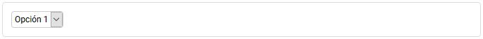

Combo Bootstrap:

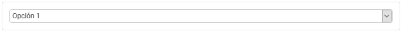

Combo UDA:

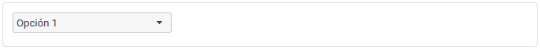

Combo UDA Materializado:

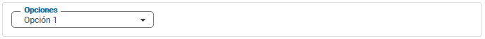

### Radio y Checkbox
Los elementos input que sean tanto de tipo checkbox como radio pueden ser estilizados de manera 'block' o 'inline'.

+ Ejemplos block:

  Aplicando los estilos de bootstrap materializado a este elemento obtenemos el siguiente resultado:

  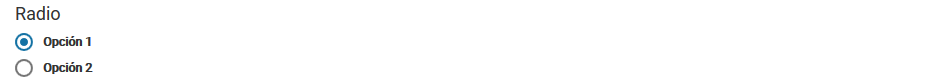
  ```html
  <div class="col-md-6">
    <h3>Radio</h3>
    <div class="radio-material">
      <input id="opcionRadioMaterial-1" type="radio" name="materialRadio" checked>
      <label for="opcionRadioMaterial-1">Opción 1</label>
    </div>
    <div class="radio-material">
      <input id="opcionRadioMaterial-2" type="radio" name="materialRadio">
      <label for="opcionRadioMaterial-2">Opción 2</label>
    </div>
  </div>
  ```
  Los estilos de bootstrap materializado estilizan el elemento de la siguiente manera:

  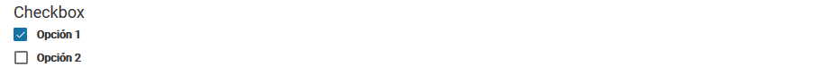
  ```html
  <div class="col-md-6">    
    <h3>Checkbox</h3>
    <div class="checkbox-material">
      <input id="opcionCheckboxMaterial-1" type="checkbox" checked>
      <label for="opcionCheckboxMaterial-1">Opción 1</label>
    </div>
    <div class="checkbox-material">
      <input id="opcionCheckboxMaterial-2" type="checkbox">
      <label for="opcionCheckboxMaterial-2">Opción 2</label>
    </div>
  </div>
  ```
+ Ejemplos inline:

  Aplicando los estilos de bootstrap materializado a este elemento en su versión "inline" obtenemos el siguiente resultado:

  
  ```html
  <div class="col-md-6">
    <h3>Radio Inline</h3>
    <div class="radio-material radio-material-inline">
      <input id="opcionRadioMaterialInline-1" type="radio" name="materialRadioInline">
      <label for="opcionRadioMaterialInline-1">Opción 1</label>
    </div>
    <div class="radio-material radio-material-inline">
      <input id="opcionRadioMaterialInline-2" type="radio" name="materialRadioInline">
      <label for="opcionRadioMaterialInline-2">Opción 2</label>
    </div>
    <div class="radio-material radio-material-inline">
      <input id="opcionRadioMaterialInline-3" type="radio" name="materialRadioInline">
      <label for="opcionRadioMaterialInline-3">Opción 3</label>
    </div>
    <div class="radio-material radio-material-inline">
      <input id="opcionRadioMaterialInline-4" type="radio" name="materialRadioInline">
      <label for="opcionRadioMaterialInline-4">Opción 4</label>
    </div>
    <div class="radio-material radio-material-inline">
      <input id="opcionRadioMaterialInline-5" type="radio" name="materialRadioInline" checked>
      <label for="opcionRadioMaterialInline-5">Opción 5</label>
    </div>
    <div class="radio-material radio-material-inline">
      <input id="opcionRadioMaterialInline-6" type="radio" name="materialRadioInline">
      <label for="opcionRadioMaterialInline-6">Opción 6</label>
    </div>
  </div>
  ```
  Los estilos de bootstrap materializado estilizan el elemento en su versión "inline" de la siguiente manera:
  
  
  ```html  
  <div class="col-md-6">    
    <h3>Checkbox Inline</h3>
    <div class="checkbox-material checkbox-material-inline">
      <input id="opcionCheckboxMaterialInline-1" type="checkbox">
      <label for="opcionCheckboxMaterialInline-1">Opción 1</label>
    </div>
    <div class="checkbox-material checkbox-material-inline">
      <input id="opcionCheckboxMaterialInline-2" type="checkbox" checked>
      <label for="opcionCheckboxMaterialInline-2">Opción 2</label>
    </div>
    <div class="checkbox-material checkbox-material-inline">
      <input id="opcionCheckboxMaterialInline-3" type="checkbox">
      <label for="opcionCheckboxMaterialInline-3">Opción 3</label>
    </div>
    <div class="checkbox-material checkbox-material-inline">
      <input id="opcionCheckboxMaterialInline-4" type="checkbox" checked>
      <label for="opcionCheckboxMaterialInline-4">Opción 4</label>
    </div>
    <div class="checkbox-material checkbox-material-inline">
      <input id="opcionCheckboxMaterialInline-5" type="checkbox">
      <label for="opcionCheckboxMaterialInline-5">Opción 5</label>
    </div>
    <div class="checkbox-material checkbox-material-inline">
      <input id="opcionCheckboxMaterialInline-6" type="checkbox" checked>
      <label for="opcionCheckboxMaterialInline-6">Opción 6</label>
    </div>
  </div>
  ```

### Fecha
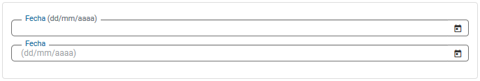
```html
<div class="example">
  <div class="form-groupMaterial"> 
    <input id="fechaMaterial" type="text" />
    <label for="fechaMaterial">Fecha 
      <span class="text-muted" id="fecha-mask"></span>
    </label>
  </div>
  <div class="form-groupMaterial"> 
    <input id="fechaMaterialPlaceholder" type="text" />
    <label for="fechaMaterialPlaceholder">Fecha</label>
  </div>
</div>
```

### Textarea
Textarea básico:

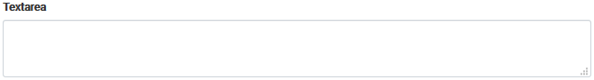
```html
<div class="form-group">
  <label for="textarea">Textarea</label>
  <textarea id="textarea" class="form-control"></textarea>
</div>
```

Textarea básico materializado:


```html
<div class="form-groupMaterial"> 
  <textarea id="textareaBasicoMaterial"></textarea>
  <label for="textareaBasicoMaterial">Textarea</label>
</div>
```

Textarea con required materializado:

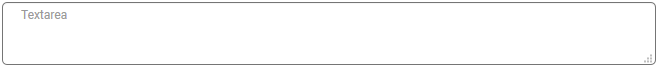
```html
<div class="form-groupMaterial"> 
  <textarea id="textareaRequiredMaterial" required></textarea>
  <label for="textareaRequiredMaterial">Textarea</label>
</div>
```

Textarea con placeholder materializado // Textarea con required y placeholder materializado:

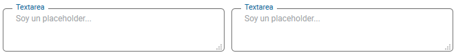
```html
<div class="form-row">
  <div class="form-groupMaterial col-sm-6">
    <textarea id="textareaPlaceholderMaterial" placeholder="Soy un placeholder..."></textarea>
    <label for="textareaPlaceholderMaterial">Textarea</label>
  </div>
  
  <div class="form-groupMaterial col-sm-6">
    <textarea id="textareaPlaceholderRequiredMaterial" placeholder="Soy un placeholder..." required></textarea>
    <label for="textareaPlaceholderRequiredMaterial">Textarea</label>
  </div>
</div>
```