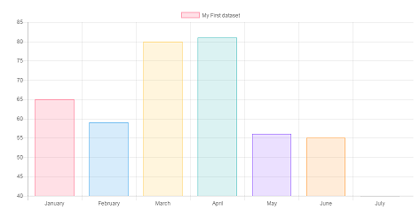
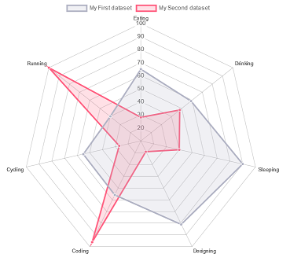
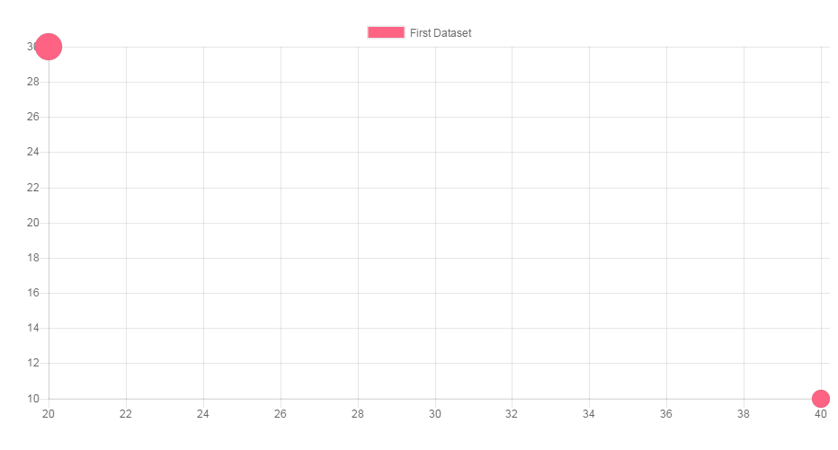

---
#    UDA Chart

---


##  Índice

[TOC]


## Dependencias
Para importar rup.chart necesitamos cargar las siguientes librerías:

```html
<script src="Chart.js"></script>
<script src="rup.chart.js"></script>
```

## Creación de un gráfico
Para crear un gráfico necesitamos instanciar la clase rup.chart. Para hacer esto, necesitamos pasar el selector CSS de un elemento canvas donde queramos dibujar el gráfico. Por ejemplo

```html
<canvas id="miGrafico" width="400" height="400"></canvas>
```

El siguiente ejemplo instancia un gráfico de barras mostrando el número de votos para cada diferente color.


```javascript
 $("miGrafico").rup_chart({
    type: 'bar',
    data: {
        labels: ["Rojo", "Azul", "Amarillo", "Verde", "Morando", "Naranja"],
        datasets: [{
            label: '# de Votos',
            data: [12, 19, 3, 5, 2, 3],
            backgroundColor: [
                'rgba(255, 99, 132, 0.2)',
                'rgba(54, 162, 235, 0.2)',
                'rgba(255, 206, 86, 0.2)',
                'rgba(75, 192, 192, 0.2)',
                'rgba(153, 102, 255, 0.2)',
                'rgba(255, 159, 64, 0.2)'
            ],
            borderColor: [
                'rgba(255,99,132,1)',
                'rgba(54, 162, 235, 1)',
                'rgba(255, 206, 86, 1)',
                'rgba(75, 192, 192, 1)',
                'rgba(153, 102, 255, 1)',
                'rgba(255, 159, 64, 1)'
            ],
            borderWidth: 1
        }]
    },
    options: {
        scales: {
            yAxes: [{
                ticks: {
                    beginAtZero:true
                }
            }]
        }
    }
});

```

## Tipos de gráficos
Rup.Chart está basado en Chart.js, una librería responsive js para mostrar gráficos. Esta herramienta ofrece los siguientes tipos de gráficos:

* [Barras](#barras)
* [Líneas](#líneas)
* [Radar](#radar)
* [Polar](#polar)
* [Tarta y Donuts](#tarta-y-donuts)
* [Burbuja](#burbuja)


### Barras

Un gráfico de barras muestra los datos como barras. Es usado para comprar mulitiples datos



####Datos

```javascript
var data = {
            labels: ["Enero", "ebrero", "Marzp", "Abril", "Mayu", "Junio", "Julio"],
            datasets: [{
                label: "My First ",
                data: [65, 59, 80, 81, 56, 55, 40]
            }, {
                label: "My Second",
                data: [28, 48, 40, 19, 86, 27, 90]
            }]
        };
 ```
####Instanciación
```javascript
        $('#miGrafico').rup_chart({
            type: "bar",
            data: data,
			options:options
        });
```


- **  Volver a [Tipo de Gráficos](#tipos-de-gráficos)**
### Líneas

Un gráfico de líneas es una manera de trazar los puntos de datos en una línea . A menudo , se utiliza para mostrar los datos de tendencias , y la comparación de dos conjuntos de datos.


#### Datos

```javascript
var data = {
    labels: ["January", "February", "March", "April", "May", "June", "July"],
    datasets: [
        {
            label: "My First dataset",
            fill: false,
            lineTension: 0.1,
            backgroundColor: "rgba(75,192,192,0.4)",
            borderColor: "rgba(75,192,192,1)",
            borderCapStyle: 'butt',
            borderDash: [],
            borderDashOffset: 0.0,
            borderJoinStyle: 'miter',
            pointBorderColor: "rgba(75,192,192,1)",
            pointBackgroundColor: "#fff",
            pointBorderWidth: 1,
            pointHoverRadius: 5,
            pointHoverBackgroundColor: "rgba(75,192,192,1)",
            pointHoverBorderColor: "rgba(220,220,220,1)",
            pointHoverBorderWidth: 2,
            pointRadius: 1,
            pointHitRadius: 10,
            data: [65, 59, 80, 81, 56, 55, 40],
            spanGaps: false,
        }
    ]
};
 ```
#### Instanciación
```javascript
        $('#miGrafico').rup_chart({
            type: "line",
            data: data,
			options:options
        });
```


- **  Volver a [Tipo de Gráficos](#tipos-de-gráficos)**
### Radar

Un gráfico de radar es una forma de mostrar múltiples puntos de datos y la variación entre ellos. A menudo son útiles para comparar los puntos de dos o más conjuntos de datos diferentes .neas es una manera de trazar los puntos de datos en una línea . A menudo , se utiliza para mostrar los datos de tendencias , y la comparación de dos conjuntos de datos.


#### Datos

```javascript
var data = {
    labels: ["Eating", "Drinking", "Sleeping", "Designing", "Coding", "Cycling", "Running"],
    datasets: [
        {
            label: "My First dataset",
            backgroundColor: "rgba(179,181,198,0.2)",
            borderColor: "rgba(179,181,198,1)",
            pointBackgroundColor: "rgba(179,181,198,1)",
            pointBorderColor: "#fff",
            pointHoverBackgroundColor: "#fff",
            pointHoverBorderColor: "rgba(179,181,198,1)",
            data: [65, 59, 90, 81, 56, 55, 40]
        },
        {
            label: "My Second dataset",
            backgroundColor: "rgba(255,99,132,0.2)",
            borderColor: "rgba(255,99,132,1)",
            pointBackgroundColor: "rgba(255,99,132,1)",
            pointBorderColor: "#fff",
            pointHoverBackgroundColor: "#fff",
            pointHoverBorderColor: "rgba(255,99,132,1)",
            data: [28, 48, 40, 19, 96, 27, 100]
        }
    ]
};
 ```
#### Instanciación
```javascript
        $('#miGrafico').rup_chart({
            type: "radar",
            data: data,
			options:options
        });
```
- **  Volver a [Tipo de Gráficos](#tipos-de-gráficos)**
### Área Polar

Los gráficos de áreas polares son similares a gráficos de tartas , pero cada segmento tiene el mismo ángulo - el radio del segmento varía en función del valor .

Este tipo de gráfico suele ser útil cuando queremos mostrar una comparación de datos similares a un gráfico de tarta , pero también muestran una escala de valores de contexto.


#### Datos

```javascript
var data = {
    datasets: [{
        data: [ 11,16,7,3,14],
        backgroundColor: ["#FF6384","#4BC0C0","#FFCE56","#E7E9ED","#36A2EB"
        ],
        label: 'My dataset' // for legend
    }],
    labels: ["Red","Green","Yellow","Grey","Blue"]
};
 ```
#### Instanciación
```javascript
        $('#miGrafico').rup_chart({
            type: "polarArea",
            data: data,
			options:options
        });
```

Los gráficos de áreas polares son similares a gráficos de tartas , pero cada segmento tiene el mismo ángulo - el radio del segmento varía en función del valor.

- **  Volver a [Tipo de Gráficos](#tipos-de-gráficos)**
### Tarta y Donuts

Los gráficos de tarta y donuts son probablemente los gráficos más utilizados que existen . Se dividen en segmentos , el arco de cada segmento se muestra el valor proporcional de cada fracción de datos .


#### Datos

```javascript
var data = {
    labels: ["Red","Blue","Yellow"],
    datasets: [
        {
            data: [300, 50, 100],
            backgroundColor: [
                "#FF6384",
                "#36A2EB",
                "#FFCE56"
            ],
            hoverBackgroundColor: [
                "#FF6384",
                "#36A2EB",
                "#FFCE56"
            ]
        }]
};
 ```
#### Instanciación
```javascript
	$('#miGrafico').rup_chart({
            type: "pie",
            data: data,
			options:options
        });
    $('#miGrafico').rup_chart({
            type: "doughnut",
            data: data,
			options:options
        });
```


- **  Volver a [Tipo de Gráficos](#tipos-de-gráficos)**
### Burbuja

Un gráfico de burbujas se utiliza para mostrar tres dimensiones de datos al mismo tiempo. La ubicación de la burbuja se determina por las dos primeras dimensiones y los ejes horizontales y verticales correspondientes . La tercera dimensión está representada por el tamaño de las burbujas individuales.



#### Datos

```javascript
var data = {
    datasets: [
        {
            label: 'First Dataset',
            data: [
                {
                    x: 20,
                    y: 30,
                    r: 15
                },
                {
                    x: 40,
                    y: 10,
                    r: 10
                }
            ],
            backgroundColor:"#FF6384",
            hoverBackgroundColor: "#FF6384",
        }]
};
 ```
#### Instanciación
```javascript
	$('#miGrafico').rup_chart({
            type: "bubble",
            data: data,
			options:options
        });
```


- **  Volver a [Tipo de Gráficos](#tipos-de-gráficos)**